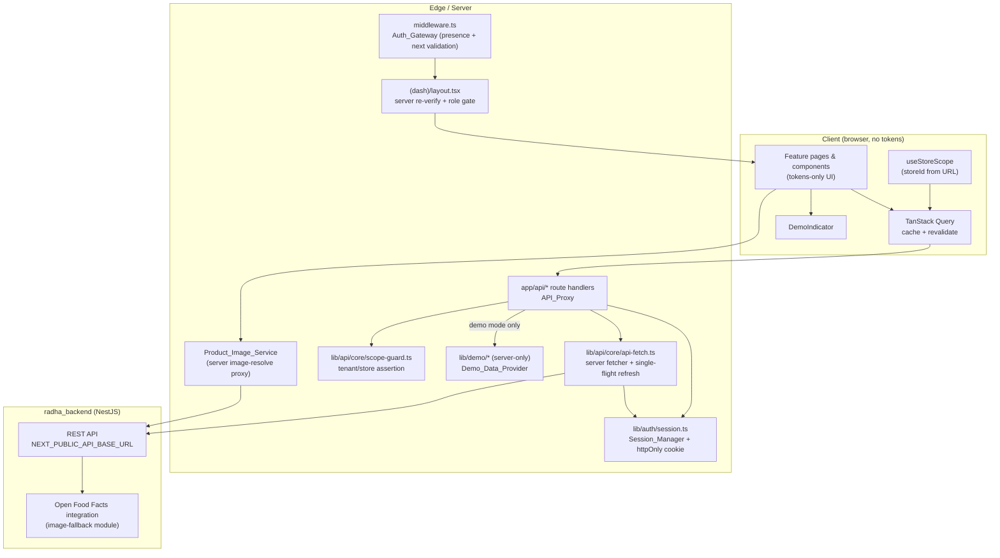

# Design Document

## Overview

This design makes the RADHA web dashboard (`radha_dashboard/`, Next.js 15 App Router) production-ready
for a Gujarat retail client demo. It is an **improvement effort**: it hardens and reorganizes existing
code rather than adding product capabilities. The work resolves nine concerns expressed across the ten
requirements — demo-data completeness, real data on scan, product images, navigation speed,
auth/session reliability, routing/redirect security, multi-tenant scoping integrity, visual quality,
and degraded-backend error handling.

The design is grounded in the dashboard's actual structure (verified by reading the code):

- **Routing & guard:** `middleware.ts` (presence-only UX gate) + `app/(dash)/layout.tsx`
  (server-side re-check). Today both have gaps: `middleware.ts` uses the `next` query parameter
  verbatim in a redirect (open-redirect risk) and reads `role` from a JSON cookie; the `(dash)`
  layout redirects to `/login` without preserving `next` and without a role check.
- **Session:** `lib/auth/session.ts` (server-only httpOnly cookie helpers, already `SameSite=Lax`,
  `Secure` in production) and the `app/api/auth/{login,me,refresh,logout}` route handlers. The
  central server fetcher `lib/api/core/api-fetch.ts` refreshes once on 401 but has **no single-flight
  refresh lock** and **no transient-error retry/backoff**.
- **API proxies:** route handlers under `app/api/*`. Today demo datasets are defined **inline** in
  handlers (e.g. `DEMO_KPIS` in `app/api/overview/kpis/route.ts`, `DEMO_EXPIRY` in
  `app/api/expiry/route.ts`) and — critically — several handlers **fall back to demo data on backend
  error even when demo mode is off** (an honest-data violation this design eliminates).
- **Client data layer:** TanStack Query (`@tanstack/react-query` 5.28) with sensible retry/backoff
  defaults already in `lib/api/core/query-client.tsx`; store scope from the URL via
  `lib/hooks/use-store-scope.ts`.
- **Design system:** complete token set in `lib/design/tokens.css` mapped into Tailwind
  (`tailwind.config.ts`). Brand foundations already present: cream `#FFFBF5`, ink `#1C1917`, accent
  `#EA580C`, Plus Jakarta Sans + JetBrains Mono.
- **Image hosts:** `next.config.mjs` `images.remotePatterns` and the CSP `img-src` allow only
  `*.amazonaws.com` / `*.cloudfront.net` — **Open Food Facts is not yet permitted**.

The guiding constraints from steering are non-negotiable: **honest-data discipline** (render only what
the backend returns; demo data is an explicitly-toggled, clearly-labelled, server-only mode) and
**multi-tenancy** (every access scoped by `tenant_id`, and `store_id` where applicable).

### Design goals

1. Centralize all demo data into a single server-only `Demo_Data_Provider` under `lib/demo/`, one
   dataset module per Feature_Area, scoped by tenant/store, never bundled to the client.
2. Make demo data unmistakable (persistent `Demo_Indicator`) and impossible to leak into live
   responses (proxy never emits demo-origin values when demo mode is off).
3. Render real backend data on scan through a store-scoped proxy, with honest placeholders for tokens.
4. Resolve product images (backend URL → Open Food Facts by EAN → branded placeholder) with zero
   layout shift.
5. Hit navigation performance targets via App Router `loading.tsx` skeletons and TanStack Query
   cache-then-revalidate.
6. Harden the session: transient-error retry with backoff, proactive token refresh, single-flight
   refresh, and no spurious logout.
7. Close the routing/redirect holes: same-origin `next` validation, server-side `(dash)` re-verify,
   role gate to `/403`, httpOnly cookies, no token exposure.
8. Enforce scope integrity: forward tenant+store on every request, reject cross-scope responses.
9. Keep the UI tokens-only and on-brand, with designed empty/loading/error states and reduced-motion
   support.
10. Degrade gracefully: per-region error/retry states, request timeouts, schema validation, and never
    a spurious redirect to login.

### Non-goals

- No new product features (no cart, checkout, scan-to-earn, or rewards).
- No backend (`radha_backend/`) changes; the Open Food Facts integration already exists backend-side
  and is reached through the existing API proxy pattern.
- No change to the mobile app (`radha_app/`).

## Architecture

The dashboard keeps its three-layer request path. This design tightens each layer rather than
replacing it.



### Request lifecycle (authenticated Feature_Area page)

1. **`middleware.ts`** runs first: it checks only for session-cookie *presence*. If absent, it
   redirects to `/login?next=<validated same-origin path>`. If the cookie is present but unparseable,
   it treats the request as unauthenticated and redirects with a validated `next`. For `/admin/*` it
   does a cosmetic role check and redirects non-admins to `/403`.
2. **`(dash)/layout.tsx`** (Server Component) re-verifies the session server-side via `getSession()`
   before any Feature_Area data renders. On failure it redirects to `/login` with a validated `next`.
   For admin routes it enforces the role and redirects to `/403` when the role is insufficient.
3. The page renders its shell immediately; data regions render `loading.tsx` skeletons.
4. Client components fetch through `/api/*` proxies (via TanStack Query). The proxy attaches the
   server-side Bearer token, forwards `storeId` + tenant scope, applies the scope guard to the
   response, and returns validated data — or, only when demo mode is on, data from the
   `Demo_Data_Provider`.

### Honest-data enforcement boundary

The single most important architectural rule: **a value originating from `Demo_Data_Provider` may
appear in a proxy response only when `DEMO_MODE` is active (or the session is a `_demo` session).**
This is enforced by a shared proxy helper (`resolveFeatureData`) that is the *only* sanctioned way a
handler returns data. The current pattern of "try backend, `catch { return DEMO_* }`" is removed
everywhere — on backend failure with demo mode off, the proxy returns an error envelope so the UI
renders its designed error/empty state, never fabricated data.

### Demo data isolation boundary

`lib/demo/` modules import `'server-only'` at the top, guaranteeing a build-time error if any client
component imports them. Demo datasets are plain data + pure selector functions (scope filtering),
making them trivially unit/property-testable without a backend.

## Components and Interfaces

### 1. Demo_Data_Provider (`lib/demo/`)

Replaces all inline demo constants in route handlers. One module per Feature_Area plus an index and a
scope selector.

```
lib/demo/
  demo-session.ts        # existing — demo users/login (kept)
  index.ts               # registry: FeatureArea -> dataset module
  scope.ts               # pure scope filter + types
  data/
    overview.ts          # KPIs, OHS, trends, alerts, activity, multi-store
    analytics.ts
    audit.ts             # EAN lists, items, scan sessions, match-rate KPI
    expiry.ts            # list, kpis, calendar, thresholds
    grn.ts
    inventory.ts         # list, kpis, low-stock, movements
    tasks.ts
    billing.ts           # plans, subscription, usage, invoices
    suppliers.ts
    reports.ts
    notifications.ts
    settings.ts
    admin.ts             # tenants, flags, webhooks, audit logs, impersonation
```

```typescript
// lib/demo/scope.ts
import 'server-only';

export interface Scoped {
  tenantId: string;
  storeId: string | null; // null = tenant-level record (rollup-visible)
}

export interface StoreScope {
  tenantId: string;
  storeId: string | null; // null = "all stores" rollup
}

/** Pure: keep only records matching the active scope. */
export function filterByScope<T extends Scoped>(records: T[], scope: StoreScope): T[] {
  return records.filter((r) => {
    if (r.tenantId !== scope.tenantId) return false;
    if (scope.storeId === null) return true;      // rollup sees all stores in tenant
    return r.storeId === null || r.storeId === scope.storeId;
  });
}
```

```typescript
// lib/demo/index.ts
import 'server-only';
export type FeatureArea =
  | 'overview' | 'analytics' | 'audit' | 'expiry' | 'grn' | 'inventory'
  | 'tasks' | 'billing' | 'suppliers' | 'reports' | 'notifications'
  | 'settings' | 'admin';

export interface DemoDataset {
  /** Named primary regions the page renders (KPIs, lists, tables, charts). */
  regions: Record<string, unknown>;
}

/** Returns the dataset for a Feature_Area, or null if none is defined (R1.7). */
export function getDemoDataset(area: FeatureArea, scope: StoreScope): DemoDataset | null;
```

Each dataset module exports scoped records (≥1 per primary region, ≥5 per list/table region — R1.1)
tagged with `tenantId`/`storeId` so the scope selector can include/exclude them (R1.4).

### 2. API_Proxy hardening (`app/api/*` + `lib/api/core/resolve.ts`)

A shared resolver centralizes the honest-data + scope rules so each handler is a thin wrapper.

```typescript
// lib/api/core/resolve.ts
import 'server-only';

export type ResolveResult<T> =
  | { kind: 'ok'; data: T }
  | { kind: 'empty' }                         // backend returned no data, demo off (R2.6)
  | { kind: 'error'; status: number; code: string };

export interface ResolveArgs<T> {
  area: FeatureArea;
  region: string;
  scope: StoreScope;
  isDemo: boolean;                            // DEMO_MODE || session._demo
  /** Fetch + validate real backend data; throws ApiRequestError on failure. */
  fetchReal: () => Promise<T>;
  /** Pick the demo region from the scoped dataset. */
  selectDemo: (ds: DemoDataset) => T | undefined;
  /** Assert every record matches scope; throws CrossScopeError otherwise. */
  assertScope: (data: T, scope: StoreScope) => void;
}

export async function resolveFeatureData<T>(args: ResolveArgs<T>): Promise<ResolveResult<T>>;
```

Rules encoded in `resolveFeatureData`:

- **Demo on** → return `selectDemo(dataset)`; if dataset/region missing, return `{ kind: 'empty' }`
  and log the missing area (R1.7). Never call the backend.
- **Demo off** → call `fetchReal()`, run `assertScope`, return `{ kind: 'ok' }`. It **never** returns
  any demo-origin value (R2.4, R2.5). On backend non-success (≠401) or timeout, return
  `{ kind: 'error' }` (R10.1–R10.3). On empty backend result, return `{ kind: 'empty' }` (R2.6). On
  scope mismatch, return `{ kind: 'error', code: 'CROSS_SCOPE' }` and discard the whole response
  (R8.6).

The proxy also forwards both the active `storeId` and the session `tenantId` to the backend on every
Feature_Area request (R8.1), and the tenant-rollup scope when no store is selected for owner/admin
(R8.3). A 30-second `AbortController` bounds every backend call (R10.2).

### 3. Scan_Result_View + scan proxy (`features/audit`, `app/api/audit/scan/route.ts`)

```typescript
// features/audit/scan.types.ts
export type VerificationStatus = 'matched' | 'not in list' | 'invalid';

export interface ScanResult {
  barcode: string;                 // exact scanned value, always retained (R3.4, R3.5, R3.7)
  scannedAt: string;               // ISO instant
  product: ScanProduct | null;     // null => not in list
  status: VerificationStatus;
}

export interface ScanProduct {
  name: string | null;             // null => render placeholder, never fabricate (R3.8)
  ean: string;
  imageUrl: string | null;
}
```

- On submit, the client initiates the store-scoped proxy request within 500 ms (R3.1) and shows a
  loading state, clearing any prior result (R3.6).
- The proxy bounds the backend lookup to a 5-second window. On a returned product it maps to
  `matched` / `not in list` / `invalid` (exactly one — R3.3) and includes `name`, `ean`, the scan
  timestamp in the store-scope local time zone, and the exact barcode (R3.2, R3.4).
- On no match within 5 s, it returns a `not in list` result preserving barcode + timestamp (R3.5).
- On timeout/transport error it surfaces an error with a retry action that re-submits, keeping the
  barcode visible (R3.7).
- Demo mode returns a demo product + timestamp within 1 s (R3.9).
- The timestamp formatter and status mapper are pure functions (testable).

### 4. Product_Image_Service (`features/_shared/product-image/`)

A client component `<ProductImage>` plus a server image-resolve proxy.

```typescript
// features/_shared/product-image/resolve-image.ts  (pure state machine)
export type ImageState =
  | { kind: 'loading' }
  | { kind: 'image'; url: string }
  | { kind: 'placeholder'; reason: 'no-source' | 'off-timeout' | 'load-error' | 'exhausted' };

export interface ImageInputs {
  backendImageUrl: string | null;
  ean: string | null;
}

/** Pure decision of the *initial* resolution path (R4.1, R4.2, R4.4). */
export function chooseImageSource(inputs: ImageInputs):
  | { kind: 'backend'; url: string }
  | { kind: 'off'; ean: string }
  | { kind: 'placeholder' };
```

- Backend image URL present → render it (R4.1).
- No backend URL but non-empty EAN → request Open Food Facts via the backend integration with a
  5-second timeout; on miss/timeout → `Placeholder_Image` (R4.2, R4.3).
- No URL and no EAN → placeholder immediately, no OFF request (R4.4).
- `` → placeholder + non-text "broken image" indicator (R4.6).
- A fixed-dimension wrapper (`width`/`height` tokens) holds the cell so load causes **zero layout
  shift** (R4.7, R4.9); the skeleton/placeholder occupies the same box.
- `next.config.mjs` `images.remotePatterns` **and** the CSP `img-src` are extended to allow the Open
  Food Facts image host (R4.8).

### 5. Navigation_System (App Router segments)

- Add `loading.tsx` to each `(dash)` route segment so the shell + skeletons appear within 1 s while
  data streams (R5.2). The persistent shell (`DashShell`) is rendered by the layout and stays mounted
  and interactive during data loads (R5.4).
- TanStack Query supplies cache-then-revalidate: revisited pages show cached data within 500 ms while
  revalidating in the background (R5.5), and update the view when revalidation returns different data
  (R5.7). `staleTime`/`gcTime` defaults already exist; query keys include `storeId`.
- A per-region 10-second guard swaps skeletons to an error state with retry (R5.6).

### 6. Session_Manager hardening (`lib/auth/session.ts`, `api-fetch.ts`, `app/api/auth/*`)

- **Transient-error retry/backoff** (`lib/auth/retry.ts`, pure schedule): classify HTTP 502/503/504,
  request timeout, or no-response as transient. Retry up to 3 times with exponential backoff starting
  at 1 s, capped at 8 s (1s, 2s, 4s — clamped to 8s) (R6.3). On a transient `/api/auth/me` failure
  while the cookie is still valid, **do not** clear the cookie or redirect (R6.2); after exhausting
  retries, surface a non-fatal error and keep the cookie (R6.3).
- **Proactive refresh:** when the access token is within 60 s of expiry, refresh before the next
  authenticated backend request, completing within 5 s (R6.4). `isTokenExpiringSoon` already exists.
- **Single-flight refresh:** a module-level in-flight promise so 2+ concurrent expired-token requests
  trigger **at most one** refresh and all awaiters receive the refreshed token (R6.6).
- **Hard refresh failure** (invalid/expired refresh token): clear the cookie, drop all client session
  state, show a session-ended indication, and redirect to `/login` within 1 s preserving the original
  path in a validated `next` (R6.5).
- **Unparseable cookie:** `getSession()` already returns `null` on JSON parse failure; `middleware.ts`
  then treats the request as unauthenticated and redirects with a validated `next` (R6.7, R7.7).

```typescript
// lib/auth/retry.ts  (pure)
export function isTransient(status: number | 'timeout' | 'no-response'): boolean;
/** Backoff delays in ms for attempts 1..n (start 1000, factor 2, cap 8000). */
export function backoffSchedule(maxRetries: number): number[]; // [1000, 2000, 4000]
```

```typescript
// lib/auth/refresh-lock.ts  (single-flight)
let inFlight: Promise<RefreshResult> | null = null;
export function refreshOnce(run: () => Promise<RefreshResult>): Promise<RefreshResult> {
  if (!inFlight) inFlight = run().finally(() => { inFlight = null; });
  return inFlight;
}
```

### 7. Auth_Gateway redirect security (`lib/auth/next-param.ts`, `middleware.ts`, `(dash)/layout.tsx`)

A pure validator is the single source of truth for safe redirect targets.

```typescript
// lib/auth/next-param.ts  (pure)
const MAX = 2048;
/** True iff value is a same-origin relative path (R7.1). */
export function isSafeNextPath(value: string | null | undefined): boolean {
  if (!value) return false;
  if (value.length > MAX) return false;
  if (!value.startsWith('/')) return false;        // must be relative, leading single slash
  if (value.startsWith('//') || value.startsWith('/\\')) return false; // no protocol-relative
  if (/^[a-z][a-z0-9+.-]*:/i.test(value)) return false; // no scheme
  // reject control chars / backslashes that browsers may normalize to authority
  if (/[\u0000-\u001F\\]/.test(value)) return false;
  return true;
}
/** Returns value if safe, else the default home route (R7.3). */
export function safeNextOrHome(value: string | null | undefined, home = '/'): string {
  return isSafeNextPath(value) ? (value as string) : home;
}
```

- `middleware.ts`: when redirecting an authenticated user away from `/login`, and when an
  unauthenticated user is sent to `/login`, the `next` it reads/sets is run through `safeNextOrHome` /
  `isSafeNextPath` (R7.1–R7.3). The role read from the cookie is treated as cosmetic; the layout is
  authoritative.
- `(dash)/layout.tsx`: re-verifies the session server-side (R7.5); on failure redirects to `/login`
  with a validated `next` (R7.6). For admin segments, checks the role and redirects to `/403`,
  rendering no admin data first (R7.4).
- Login completion navigates only to a validated `next`, else home (R7.2, R7.3).
- Cookie attributes (`httpOnly`, `SameSite=Lax`, `Secure` in prod) are already correct in
  `setSession`; tokens are never sent to client JS, `localStorage`, the URL, or logs (R7.8, R6  note).

### 8. Store scope integrity (`lib/hooks/use-store-scope.ts`, `lib/api/core/scope-guard.ts`)

- `useStoreScope` already restricts a selectable store to `session.storeIds`; this design also clamps
  non-owner/non-admin roles to assigned stores and the "all stores" rollup to owner/admin (R8.2, R8.5).
- `scope-guard.ts` exposes `assertRecordsInScope(records, scope)` used by `resolveFeatureData`: if any
  record's `tenantId`/`storeId` is outside the active scope, throw `CrossScopeError` so the whole
  response is discarded and an error is shown (R8.6, R8.4).
- On scope change, query keys change → TanStack Query refetches within 2 s and abandons stale in-flight
  responses keyed to the previous scope; the UI shows a loading state and does not display previous
  scope data (R8.7, R8.8).

### 9. UI_System / visual quality (`components/ui/*`, `features/*`)

- Tokens-only: components read CSS variables via Tailwind classes (`bg-surface`, `text-ink`,
  `text-accent`, `rounded-lg`, etc.). An ESLint guard (or token-lint script) flags hard-coded color,
  spacing, radius, and duration literals in `features/**` and `components/**` (R9.1).
- Brand foundations enforced by `app/layout.tsx` + `globals.css`: cream `#FFFBF5` canvas, ink
  `#1C1917`, Plus Jakarta Sans for text, JetBrains Mono (`.mono`/`.tabular`) for KPIs, prices, dates,
  EANs, IDs, timers (R9.2).
- One orange CTA per region — enforced via the shared `PageHeader`/region primitives and review
  (R9.3).
- First-class designed states (`components/system/`): `EmptyState` (tonal icon, title, one support
  line, one orange CTA — R9.4), `RegionSkeleton` (block layout matching final content — R9.5),
  `RegionError` (error indication + retry, preserves other regions — R9.6).
- Reduced motion: `use-reduced-motion` + `prefers-reduced-motion` suppress fade/parallax/count-up/
  shimmer/celebration and apply state changes instantly (R9.7).
- Accessibility: every interactive control has an accessible name and an orange focus ring visible
  against its background (R9.8).

### 10. Demo_Indicator (`components/system/demo-indicator.tsx`)

A persistent banner/badge rendered in `DashShell` whenever the session is a demo session. It stays
visible while scrolling and across client navigations (the shell persists), and carries text marking
the content as sample/demo data (R2.1). It is absent entirely when demo mode is off (R2.2), and toggles
within 1 s without a manual reload because it is driven by the session/`useSession` state (R2.3).

### 11. Error handling primitives (cross-cutting)

`resolveFeatureData` + `RegionError` + TanStack Query combine so that: a non-401 backend failure
renders the affected region's error+retry while other regions keep their last data (R10.1, R10.4);
timeouts surface as region errors (R10.2, R10.3); schema-validation failures (via the existing Zod
`apiFetch`) render the region error and show no unvalidated field (R10.4); retry re-issues only that
region's request and shows its loading state (R10.5); and no error (other than the Requirement-6 auth
failure) ever redirects to login (R10.6).

## Data Models

### Session (existing shape, unchanged)

```typescript
interface SessionPayload {
  accessToken: string;
  refreshToken: string;
  expiresAt: number;                 // ms epoch
  user: {
    id: string; name: string; role: string;
    tenantId: string; storeIds: string[]; permissions: string[];
  };
  _demo?: boolean;                   // present on demo sessions
}
```

### StoreScope

```typescript
interface StoreScope {
  tenantId: string;                  // always the session tenant (R8.4)
  storeId: string | null;            // null = owner/admin "all stores" rollup
  role: Role;                        // gates rollup vs assigned-only (R8.2, R8.5)
}
```

### Scoped demo record (base for all datasets)

```typescript
interface Scoped {
  tenantId: string;
  storeId: string | null;            // null = tenant-level (rollup-visible) record
}
```

### ScanResult / ScanProduct

See §3. `status ∈ {'matched','not in list','invalid'}`; `barcode` and `scannedAt` always present;
`product` is `null` for "not in list"; `product.name` may be `null` (render placeholder).

### ImageState

See §4. `loading | image{url} | placeholder{reason}`.

### ResolveResult

See §2. `ok{data} | empty | error{status,code}` — the only shapes a hardened proxy returns.

### Verification status mapping (pure)

```typescript
function mapVerification(backend: { found: boolean; valid: boolean }): VerificationStatus {
  if (!backend.valid) return 'invalid';
  return backend.found ? 'matched' : 'not in list';
}
```

## Correctness Properties

*A property is a characteristic or behavior that should hold true across all valid executions of a
system — essentially, a formal statement about what the system should do. Properties serve as the
bridge between human-readable specifications and machine-verifiable correctness guarantees.*

Much of this feature is pure, input-varying logic — scope filtering, redirect-target validation,
session/retry decisions, image-source selection, and proxy data resolution — which is ideal for
property-based testing. UI presence, timing percentiles, visual layout, configuration, and a11y
checks are covered by example/component, integration, smoke, and lint strategies in the Testing
Strategy section instead. The properties below are the deduplicated set from the prework reflection.

### Property 1: Demo datasets meet coverage minimums

*For any* Feature_Area, the demo dataset returned by `getDemoDataset(area, scope)` provides at least
one record for every primary region and at least five records for every list or table region.

**Validates: Requirements 1.1**

### Property 2: A defined demo region always resolves non-empty in demo mode

*For any* Feature_Area whose dataset defines a given region, `resolveFeatureData` in demo mode returns
`kind: 'ok'` with a non-empty region — never an `empty` result for a region that has demo data.

**Validates: Requirements 1.2**

### Property 3: Scope filtering keeps only in-scope records

*For any* set of scoped records and any active `StoreScope`, `filterByScope` returns exactly the
records whose `tenantId` matches the scope and whose `storeId` matches the scope (or is a tenant-level
record under a rollup), and excludes every record whose `tenantId` or `storeId` differs.

**Validates: Requirements 1.4, 8.4**

### Property 4: Demo-origin data never appears when demo mode is off

*For any* backend result and any scope, when demo mode is inactive the value returned by
`resolveFeatureData` is sourced only from the backend (or is `empty`/`error`) and contains no value
originating from the `Demo_Data_Provider`.

**Validates: Requirements 2.4, 2.5**

### Property 5: Empty backend result maps to an empty state, not demo data

*For any* empty backend result with demo mode inactive, `resolveFeatureData` returns `kind: 'empty'`
(driving a designed empty state) and never returns demo data.

**Validates: Requirements 2.6**

### Property 6: Missing demo dataset yields an empty state and a log, never a crash

*For any* Feature_Area/region with no defined demo dataset, `resolveFeatureData` in demo mode returns
`kind: 'empty'`, logs the missing dataset exactly once, and does not throw.

**Validates: Requirements 1.7**

### Property 7: Verification status is total and single-valued

*For any* backend product outcome `{ found, valid }`, `mapVerification` returns exactly one value from
the set `{ 'matched', 'not in list', 'invalid' }`.

**Validates: Requirements 3.3**

### Property 8: Scan result preserves the exact scanned barcode

*For any* scanned barcode value and any backend outcome (match, no match, or error), the constructed
`ScanResult.barcode` equals the input barcode exactly, and a no-match outcome yields
`status === 'not in list'` while still retaining the barcode and a scan timestamp.

**Validates: Requirements 3.4, 3.5**

### Property 9: Product names are never fabricated

*For any* product payload whose name is null or a non-human-readable token, the scan/product view
model yields a designed placeholder marker and never synthesizes a substitute name string.

**Validates: Requirements 3.8**

### Property 10: Image source selection follows the resolution order

*For any* image inputs, `chooseImageSource` returns `backend(url)` when the backend image URL is
non-empty; otherwise `off(ean)` when the backend URL is empty and the EAN is non-empty; otherwise
`placeholder` (and issues no Open Food Facts request) when both are empty.

**Validates: Requirements 4.1, 4.2, 4.4**

### Property 11: Image resolution always terminates in image or placeholder

*For any* input and any outcome sequence (success, Open Food Facts miss/timeout, or load error), the
terminal `ImageState` is either `image` or `placeholder` — never stuck in `loading` — and a miss,
timeout, or load error always resolves to a `placeholder`.

**Validates: Requirements 4.3, 4.5, 4.6**

### Property 12: Transient `/me` failures preserve the session

*For any* transient error (HTTP 502/503/504, request timeout, or no network response) while the
session cookie is valid, the Session_Manager decision is to keep the session — it does not clear the
cookie and does not redirect to login.

**Validates: Requirements 6.2**

### Property 13: Retry backoff schedule is bounded and monotonic

*For any* retry count up to the maximum of 3, `backoffSchedule` produces delays starting at 1000 ms,
growing by a factor of two, each capped at 8000 ms and non-decreasing (i.e. `[1000, 2000, 4000]`), and
after the schedule is exhausted the resulting decision retains the session cookie.

**Validates: Requirements 6.3**

### Property 14: Token-expiry predicate is exact

*For any* `expiresAt` timestamp, `isTokenExpiringSoon` returns true if and only if
`expiresAt - now < 60000` ms.

**Validates: Requirements 6.4**

### Property 15: Hard refresh failure clears the session and redirects safely

*For any* hard refresh failure (invalid or expired refresh token), the Session_Manager decision is to
clear the cookie and redirect to login, and the redirect target's `next` value is a validated
same-origin relative path.

**Validates: Requirements 6.5**

### Property 16: Token refresh is single-flight under concurrency

*For any* number N ≥ 2 of concurrent refresh requests triggered by an expired access token,
`refreshOnce` invokes the underlying refresh runner exactly once and resolves every concurrent caller
with the same refreshed result.

**Validates: Requirements 6.6**

### Property 17: Unparseable or invalid cookies are treated as unauthenticated

*For any* cookie value that is not valid session JSON (or is absent), `getSession` returns null and the
Auth_Gateway decision is to treat the request as unauthenticated and redirect to login with a validated
same-origin `next` parameter.

**Validates: Requirements 6.1, 6.7, 7.7**

### Property 18: `next` redirect targets are same-origin relative paths only

*For any* string, `isSafeNextPath` returns true only when the value begins with a single `/`, does not
begin with `//` or `/\`, contains no scheme or authority component or control characters, and is at
most 2048 characters; and `safeNextOrHome` returns the value when it is safe and the default home route
otherwise (including when absent).

**Validates: Requirements 7.1, 7.2, 7.3**

### Property 19: Admin routes admit only owner and admin roles

*For any* session role, the admin-route gate decision is `allow` if and only if the role is `owner` or
`admin`; every other role is redirected to `/403` with no admin data rendered first.

**Validates: Requirements 7.4**

### Property 20: Forwarded scope always carries the session tenant and the active store

*For any* session and active `StoreScope`, the parameters the proxy forwards to the backend always
include the session's `tenantId` (never a client-supplied tenant) and either the active `storeId` or,
for an owner/admin with no store selected, the tenant-rollup marker.

**Validates: Requirements 8.1, 8.3, 8.4**

### Property 21: Selectable store is clamped to assigned stores

*For any* requested `storeId` and a session whose role is neither owner nor admin, the effective scope
`storeId` is either null (no access) or a member of the session's `storeIds` — never an arbitrary
store outside the session's assignments.

**Validates: Requirements 8.5**

### Property 22: Rollup view is shown only to owner/admin with no store selected

*For any* role and store selection, the multi-store rollup is displayed if and only if the role is
`owner` or `admin` and no specific store is selected.

**Validates: Requirements 8.2**

### Property 23: Out-of-scope responses are rejected wholesale

*For any* backend response containing one or more records whose `tenantId` or `storeId` is outside the
active scope, `assertRecordsInScope` throws and `resolveFeatureData` returns an `error` result so that
none of the response's records are rendered.

**Validates: Requirements 8.6**

### Property 24: Backend failures map to a region error, not data

*For any* backend outcome that is a non-2xx status other than 401, a timeout/abort, or a
schema-validation failure, `resolveFeatureData` returns `kind: 'error'` and emits no field sourced from
the failed/unvalidated response body.

**Validates: Requirements 10.1, 10.2, 10.4**

### Property 25: Only authentication failures redirect to login

*For any* error kind surfaced to the dashboard, the decision to redirect to login is true if and only
if the error is an authentication failure as defined in Requirement 6; all other errors keep the user
on the current route.

**Validates: Requirements 10.6**

## Error Handling

Error handling is centralized so every Feature_Area behaves consistently and degrades without losing
the shell or the session.

### Proxy layer (`resolveFeatureData` + `apiFetch`)

- **30-second abort:** every backend call is wrapped in an `AbortController` with a 30 s deadline; an
  abort maps to `{ kind: 'error', code: 'TIMEOUT' }` (R10.2).
- **Non-success (≠401):** mapped to `{ kind: 'error' }` carrying the upstream status/code (R10.1).
- **401:** handled by `apiFetch`'s refresh-once-then-retry; a persisted 401 throws
  `UnauthorizedError`, which is the *only* error that leads to a login redirect (R10.6, R6.5).
- **Schema validation:** the existing Zod `safeParse` throws `ResponseValidationError`; the resolver
  converts it to an `error` result and emits no field from the unvalidated body (R10.4).
- **Cross-scope:** `assertRecordsInScope` throws `CrossScopeError` → `error` result; the entire
  response is discarded (R8.6).
- **Honest-data:** with demo mode off, no code path returns demo data; the previous
  `catch { return DEMO_* }` fallbacks are removed (R2.4, R2.5).

### Session layer

- **Transient errors** (502/503/504, timeout, no-response) on `/api/auth/me`: classified by
  `isTransient`, retried up to 3 times with `backoffSchedule` (1s/2s/4s); the cookie is retained
  throughout and on exhaustion, surfacing a non-fatal indication only (R6.2, R6.3).
- **Hard refresh failure:** clear the cookie, drop client session state, show a session-ended notice,
  and redirect to `/login` with a validated `next` (R6.5).
- **Concurrency:** `refreshOnce` guarantees a single refresh under concurrent expiry (R6.6).

### Client/region layer (TanStack Query + `RegionError`)

- Each data region is its own query; a failed region renders `RegionError` (error indication + retry)
  while sibling regions keep their last successfully loaded data (R10.1, R9.6).
- Retry re-issues only that region's query and swaps it to its loading state (R10.5).
- A 10 s per-region guard converts a stuck load into a `RegionError` (R5.6).
- `UnauthorizedError` is excluded from query retry (already configured) and triggers the session-ended
  flow; all other errors never navigate away from the route (R10.6).

### Routing layer

- `middleware.ts` and `(dash)/layout.tsx` only ever redirect to `/login` or `/403`, always with a
  validated `next` via `safeNextOrHome` (R7.1–R7.6). An unparseable cookie is treated as
  unauthenticated rather than crashing (R6.7, R7.7).

## Testing Strategy

A dual approach: **property-based tests** for the pure, input-varying logic (the 25 properties above),
and **example/component, integration, smoke, and lint** strategies for UI, timing, configuration, and
accessibility concerns.

### Property-based testing

- **Library:** `fast-check` with the existing test runner for the Next.js/TypeScript dashboard. Add
  `fast-check` (and a runner such as Vitest, which integrates cleanly with the Next.js + TS toolchain)
  as dev dependencies. Do **not** hand-roll property testing.
- **Iterations:** each property test runs a minimum of 100 generated cases
  (`fc.assert(..., { numRuns: 100 })`).
- **Traceability:** each property test is tagged with a comment referencing its design property, in the
  form: `// Feature: dashboard-production-ready, Property {number}: {property text}`.
- **Coverage:** implement each of the 25 correctness properties with a single property-based test.
- **Generators:** scoped-record generators (random `tenantId`/`storeId`), scope generators, malicious
  and benign path strings for `isSafeNextPath` (including `//evil`, `/\evil`, `https://x`, `javascript:`,
  control chars, > 2048-char paths, valid `/a/b?x=1`), barcode strings (including empty, non-ASCII, and
  very long), image-input combinations, HTTP status codes, `expiresAt` offsets around the 60 s
  boundary, and concurrency fan-out counts for the single-flight test.

Key targets (pure modules, no backend needed): `lib/demo/scope.ts`, `lib/demo/index.ts`,
`lib/api/core/resolve.ts`, `lib/api/core/scope-guard.ts`, `lib/auth/next-param.ts`,
`lib/auth/retry.ts`, `lib/auth/refresh-lock.ts`, `lib/auth/session.ts` (`isTokenExpiringSoon`),
`features/audit/scan.*` (verification mapping + result construction), and
`features/_shared/product-image/resolve-image.ts`.

### Example / component tests (React Testing Library)

For UI behavior and reactivity that is not universally quantified:
- Demo_Indicator presence/absence/toggle (R2.1–R2.3); scope-change re-render (R1.5, R8.7, R8.8).
- Scan loading/clearing, field rendering, demo scan, retry wiring (R3.1, R3.2, R3.6, R3.7, R3.9).
- Image fixed-dimension wrapper / zero layout shift (R4.7, R4.9).
- Navigation skeletons, cache-then-revalidate, 10 s error, background update (R5.2, R5.5, R5.6, R5.7).
- Brand foundations applied, one-CTA-per-region, designed empty/skeleton/error, reduced-motion,
  focus/accessible-name (R9.2–R9.8); `(dash)` layout null-session redirect with safe `next` (R7.6).
- Per-region retry isolation and timeout-to-error (R10.3, R10.5).

### Integration / performance tests

Timing percentiles that cannot be unit-tested are measured with an e2e/perf harness (e.g. Playwright,
already present in the workspace) against a warm session:
- Header/shell within 1 s for ≥95% of navigations (R5.1); primary data within 2.5 s for ≥95% (R5.3);
  shell responsiveness during load (R5.4). 1–3 representative runs feed the percentile assertions.

### Smoke / lint checks (single execution)

- Exactly one demo dataset module per Feature_Area and no inline `DEMO_*` constants remain in
  `app/api/*` (R1.3, R1.6).
- Every `lib/demo/*` module begins with `import 'server-only'` (R2.7).
- `next.config.mjs` `images.remotePatterns` and CSP `img-src` include the Open Food Facts host (R4.8).
- token-lint/ESLint rule: no hard-coded color/spacing/radius/duration literals in
  `features/**`/`components/**` (R9.1).
- `(dash)/layout.tsx` calls `getSession` and redirects before rendering children (R7.5).
- Responses (`/api/auth/me`, proxies) contain no token fields; the session cookie is `httpOnly`; no
  token appears in log output (R7.8).
