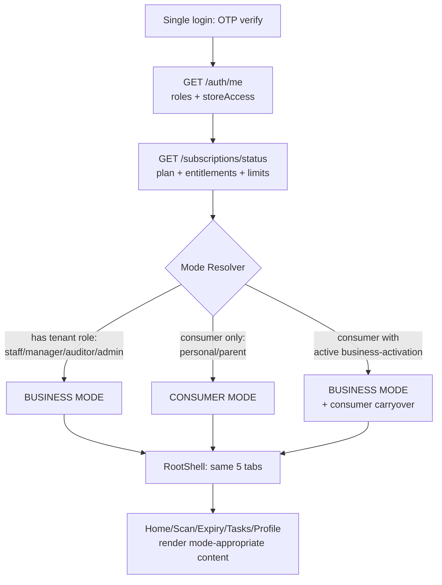
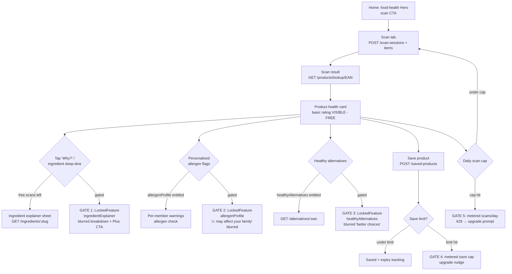
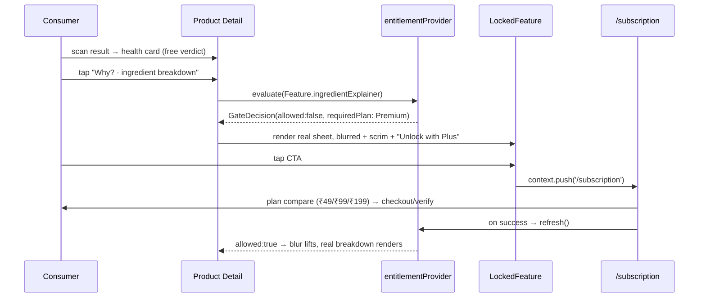
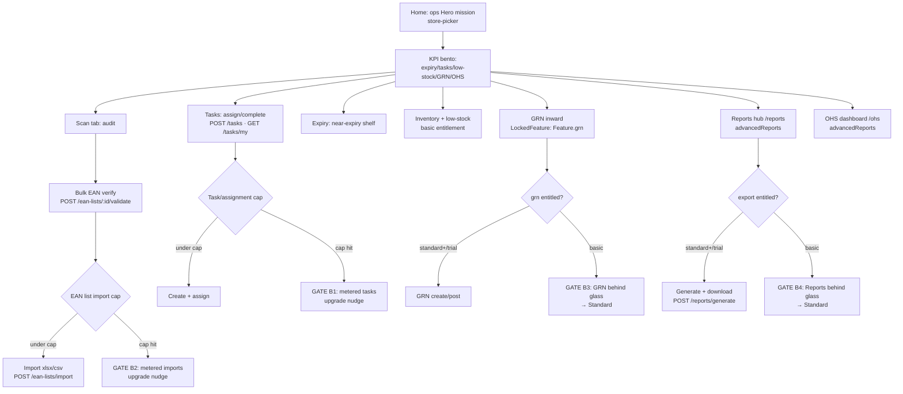

# Design Document: RADHA Ecosystem Flow

> **Spec type:** Feature · **Workflow:** Design-first · **Layer:** UX flow + information architecture + monetization gating
>
> **This is NOT a backend spec.** No new endpoints, tables, modules, or features are introduced.
> Every mechanic below maps onto an *existing* RADHA backend module/endpoint and the *existing*
> Flutter wiring (Riverpod providers, DTOs, GoRouter routes, `LockedFeature`/`Feature` entitlement
> gate). The deliverable is a reorganized consumer + business journey with strategic freemium
> gating, rendered in the locked Visual System Bible (`.kiro/steering/visual-assets.md`).

---

## Overview

RADHA already ships two products inside one Flutter binary: an **engaging consumer food-health
app** (scan → product health card → ingredient/allergen deep-dive → healthy alternatives) and a
**retail-ops command center** (audits, EAN verification, task assignment, expiry, inventory, GRN,
Excel/PDF reports). What it lacks is a *deliberate journey* that (a) decides which face a user
sees from a single login, (b) lets both audiences grow up to their value moment within free
limits, and (c) pushes the subscribe decision at the exact peak of curiosity/need — using the
entitlement machinery that is *already wired* (`entitlementProvider`, `Feature` enum,
`LockedFeature`, `GET /subscriptions/status`).

This spec reorganizes the flow around three pillars:

1. **One shell, two modes.** Role + entitlement resolve the home experience. Consumer mode and
   business mode coexist in the same `RootShell` / bottom nav, and a consumer can "grow into"
   business through the existing business-activation touchpoints.
2. **Two value loops, two paywalls.** The consumer loop is modeled on the competitor's
   scan→learn loop but RADHA-branded and honest-data only. The business loop is the audit→report
   operational loop. Each has clearly-placed gate points mapped to real entitlements.
3. **Strategic freemium gating.** Both audiences use the app within free allowances, then meet a
   *value-visible* paywall (real layout rendered behind a tasteful blur + plan CTA — never a blank
   wall), driven by the existing `EntitlementGuard` (server) and `LockedFeature`/usage-limits
   (client).

### Research summary — the competitor (TruthIn) loop, decomposed

The competitor's consumer loop is a tight curiosity engine:

```
open → scan barcode → instant health verdict → "why?" deep-dive (nutrients/ingredients)
     → personalized warnings → "what should I buy instead?" → save / track → re-engage
```

Its monetization wraps that loop: the *verdict* is free (the hook), but the *explanation*,
*personalization*, and *alternatives* (the payoff) are nudged toward a paid tier. It also runs a
**Scan & Earn / My Rewards** mechanic to drive scan frequency.

**RADHA mapping decision:** keep the curiosity loop, keep the "free verdict / paid payoff" gating
shape, **skip Scan & Earn / rewards entirely** (the backend has no such module, and the Visual
Bible §3.5★/§12 explicitly bans it). RADHA replaces the rewards dopamine hook with its own
**Hero Story Banner mission frame** + recall-safety hook + expiry-tracking utility — all
backend-real.

#### Competitor mechanic → RADHA module/endpoint → keep / skip

| # | Competitor mechanic | RADHA backend module | Real endpoint(s) | Decision |
|---|---|---|---|---|
| 1 | Barcode scan → product identity | `products`, `scans` | `GET /products/lookup/{ean}`, `POST /scan-sessions`, `POST /scan-sessions/{id}/items` | **Keep** |
| 2 | Instant health verdict / rating | `health`, `health-scoring` | health fields on `GET /products/lookup/{ean}` (`product_health_assessments`) | **Keep** (free hook) |
| 3 | Nutrient / ingredient deep-dive | `ai` (ingredient-explainer) | `GET /ingredients/:slug` → `AiController` (`ai_extractions`) | **Keep** (gated payoff) |
| 4 | Personalized allergy/diet warnings | consumer `allergen` profile + `ai` allergen check | allergen-profile screen + on-demand allergen check on product detail | **Keep** (gated payoff) |
| 5 | "Buy this instead" alternatives | `alternatives` (healthy-alternatives) | `GET /alternatives/:ean` | **Keep** (gated payoff) |
| 6 | Save product / track | `saved-products`, `expiry` | `GET/POST/DELETE /saved-products`, `POST /expiry-records`, `GET /expiry-records/near-expiry` | **Keep** |
| 7 | Recall / safety alerts | `recall`, `notifications` | recall-alerts screen + FCM push (`recall_alerts`) | **Keep** (differentiator) |
| 8 | Shopping list | `shopping-list` | shopping-list CRUD | **Keep** |
| 9 | Weekly digest / re-engagement | `digest`, `notifications` | weekly-digest screen + Sunday push | **Keep** (gated) |
| 10 | Multi-language | i18n (en/hi/ta/te/bn/mr) | localized DTO fields | **Keep** |
| 11 | **Scan & Earn / My Rewards** | *none — does not exist* | *none* | **SKIP (hard constraint)** |
| 12 | Community barcode contribution | `barcode-learning` | community-contribute screen | **Keep** |
| 13 | Grow consumer → business | `business-activation`, `tenants`, `subscriptions` | business-activation touchpoints → `/subscription` | **Keep** (bridge) |
| 14 | Upsell to paid tier | `subscriptions` (entitlements + usage) | `GET /subscriptions/status`, `POST /payments/checkout`, `POST /payments/verify` | **Keep** (monetization spine) |

> **Honest-data rule (Visual Bible §0.5):** every cell above renders only what the cited endpoint
> returns. Where a lookup returns IDs/tokens or `found:false`, the UI shows a designed
> empty/locked/loading state — never a fabricated product name, score, or alternative.

---

## Goals and non-goals

**Goals**
- A single login that resolves to the right home by role + entitlement.
- A consumer loop (scan→learn→paywall) with exact, value-visible gate points.
- A business loop (audit→ops→report) with metered free limits and well-placed upgrade nudges.
- A freemium gating matrix mapped 1:1 to the existing `Feature` enum + usage limits.
- A consumer→business growth path via existing business-activation.
- Visual + flow layer only, inside the locked token system; all wiring preserved.

**Non-goals (explicitly out of scope)**
- ❌ No Scan & Earn, rewards, points, streaks, cashback, or any earn-to-scan mechanic.
- ❌ No new backend modules, endpoints, tables, or DTOs.
- ❌ No new product capabilities (no cart/checkout beyond subscription, no POS/GST/billing).
- ❌ No changes to entitlement *logic* — we consume the existing `Feature` enum + plan map as-is.
- ❌ No fabricated data to fill UI; empty/locked/loading are designed states.

---

## Architecture

### The unified app shell

Both modes live in the existing `RootShell` (`StatefulNavigationShell`, 5-branch bottom nav:
**Home · Scan · Expiry · Tasks · Profile**, per Visual Bible §3.12). We do **not** add a second
shell or a mode-switch tab. Instead, a single **Mode Resolver** decides, at bootstrap and on every
entitlement/session change, which *content set* each tab renders. The bottom-nav structure stays
identical (no route churn); the screens inside adapt.



### Mode resolution — by role + entitlement

`GET /auth/me` returns `{user, roles, storeAccess}`; `GET /subscriptions/status` returns
`{trial, plan, entitlements, limits}`. The resolver combines them. **Role decides the primary
mode; entitlement decides what is unlocked within that mode.**

| Signal (from real endpoints) | Resolved mode | Home anchor |
|---|---|---|
| `roles` includes a tenant role (staff/manager/auditor/admin-lite/tenant_admin) **and** `storeAccess` non-empty | **Business** | Hero Story Banner = today's ops mission |
| `roles` is consumer-only (personal/parent), no `storeAccess` | **Consumer** | Hero Story Banner = today's food-health beat (expiry/recall/scan) |
| Consumer who completed **business-activation** (tenant now exists) | **Business** (consumer screens remain reachable) | Ops mission; consumer scan/saved/expiry still in Scan/Expiry tabs |

> **Why one shell:** the Visual Bible's screen index (§11) is a single 48-screen app. Consumer
> screens (`26_product_detail`…`33_public_product`) and business screens (`11_bulk_ean_audit`,
> `19_inventory`…`24_grn_items`, `47_reports_hub`, `48_ohs_dashboard`) are siblings, reached from
> the same tabs. Mode only changes *which* zones a tab shows and *which* Hero mission rotates in.

### Per-tab content by mode

| Tab | Consumer mode | Business mode |
|---|---|---|
| **Home** (`/home`, `08_home`) | Greeting + Hero (food-health mission) + scan CTA + saved/expiry KPIs + recall strip | Greeting + store-picker + Hero (ops mission) + ops KPI bento (expiry/tasks/low-stock/GRN/OHS) |
| **Scan** (`/scan`) | Single-product scan → `scan_result` → product detail | Audit scan + bulk EAN verify (`/scan/audit`) + scan sessions |
| **Expiry** (`/expiry`) | Personal at-home expiry + calendar (saved-products) | Shelf/store expiry (`near-expiry`) + calendar |
| **Tasks** (`/tasks`) | Re-purposed as a light "my food-health to-dos"? **No** — hidden/empty-state for consumers (see note) | Manager→staff task assignment + transitions |
| **Profile** (`/profile`) | Account, allergens, language, subscription, business-activation entry | Account, store, subscription, reports/OHS entry, business-activation status |

> **Honest-tab note:** `tasks` is a business-only operational module. In consumer mode the Tasks
> tab renders a *designed* empty/redirect state ("Tasks are part of RADHA for Business") rather
> than fabricating consumer tasks. This preserves the 5-tab structure without inventing a feature.
> The same applies in reverse for purely-consumer surfaces reached from Scan/Expiry.

### Consumer → business growth path

The existing **business-activation** module already exposes natural upgrade touchpoints. We place
them honestly (no rewards framing) and route them to the existing `/subscription` + tenant setup.

```mermaid
sequenceDiagram
    participant U as Consumer
    participant H as Home / Profile
    participant BA as business-activation
    participant T as tenants
    participant S as subscriptions

    U->>H: uses app (scans, saves, tracks expiry)
    H-->>U: contextual nudge<br/>(post-5th-scan banner / profile card / heavy-use trigger)
    U->>BA: tap "Run a shop? Activate RADHA for Business"
    BA->>T: create tenant + store (existing setup wizard)
    T->>S: start free_trial entitlement
    S-->>U: business mode unlocked (Mode Resolver re-runs on entitlement refresh)
    Note over U,S: Consumer scan/saved/expiry history remains; Hero now shows ops missions.
```

Touchpoints (all existing, none rewards-based): post-Nth-scan banner, Home card, heavy-use
trigger, Profile button, day-7 push, free-tier save-limit prompt, onboarding segment. Each routes
to business-activation → tenant/store setup → `free_trial` entitlement → resolver flips to
business mode on the next `entitlementProvider` refresh.

---

## Components and Interfaces

These describe the **flow/logic contracts** consumed by the UX. They wrap *existing* providers and
endpoints — no new logic. Pseudocode/Dart-flavored signatures, all wiring preserved.

### Component 1: Mode Resolver

**Purpose:** Decide consumer vs business mode from already-fetched session + entitlement state.
Pure function of existing data; no new endpoint.

```dart
enum AppMode { consumer, business }

/// Derived from existing authControllerProvider (auth/me) + entitlementProvider
/// (subscriptions/status). NO new network call.
AppMode resolveMode({
  required List<String> roles,        // from GET /auth/me
  required List<StoreAccess> stores,  // from GET /auth/me
  required EntitlementState ent,      // from GET /subscriptions/status
}) {
  final hasTenantRole = roles.any(_isBusinessRole); // staff/manager/auditor/admin/tenant_admin
  if (hasTenantRole && stores.isNotEmpty) return AppMode.business;
  return AppMode.consumer;
}
```

**Responsibilities:** read-only resolution; re-run on `authControllerProvider` /
`entitlementProvider` change (the `GoRouterRefreshNotifier` already listens to auth changes —
extend it to also listen to `entitlementProvider` so a freshly-activated business flips mode).

### Component 2: Gate Evaluator (consumer + business)

**Purpose:** Single read-path for "is this surface allowed, and if metered, how much is left?"
Wraps the existing `entitlementProvider` (`Feature` enum, `_planFeatures`, `UsageInfo`).

```dart
class GateDecision {
  final bool allowed;
  final UsageInfo? usage;     // present for metered features
  final String requiredPlan;  // requiredPlanFor(feature)
}

GateDecision evaluate(Feature feature, EntitlementState ent) {
  final allowed = ent.features.contains(feature);
  final usage = ent.usage[feature];          // metered features only
  return GateDecision(
    allowed: allowed && !(usage?.exceeded ?? false),
    usage: usage,
    requiredPlan: requiredPlanFor(feature),
  );
}
```

**Responsibilities:** never block silently. A denied/exhausted decision drives the
`LockedFeature` overlay (real layout + blur + plan CTA). Metering values come from the
`limits`/`usage` payload of `GET /subscriptions/status` (server is source of truth; client
mirrors). Server-side `EntitlementGuard` remains the hard enforcement; the client gate is the UX
surface.

### Component 3: Locked-feature overlay (existing `LockedFeature`)

**Purpose:** the value-visible paywall. Already implemented (`design/widgets/locked_feature.dart`):
renders the child dimmed + an upgrade card routing to `/subscription`.

**Responsibilities (refined for this spec):**
- Render the **real** target layout behind a tasteful blur/scrim (Visual Bible §3.19), not a blank
  wall. *Refinement:* upgrade today's `Opacity(0.3)` to a blur + scrim so "value behind glass" is
  literal.
- Show the exact plan via `requiredPlanFor(feature)` and a verb-first CTA ("See ingredient
  breakdown — unlock with Plus").
- For *metered* gates (usage exceeded), show remaining/used (mono) + reset hint, not just a lock.

### Component 4: Hero Story Banner mission source (existing)

**Purpose:** the home showpiece (Visual Bible §3.5★). Rotates real, backend-driven missions.
**Carries no rewards.** Consumer missions and business missions come from real signals:

| Mode | Mission source (existing) | Example mission (honest) | Route |
|---|---|---|---|
| Consumer | `expiry-records/near-expiry` (personal) | "3 saved items expire this week" | `/expiry-calendar` |
| Consumer | `recall` alerts | "1 product you saved was recalled" | `/recall-alerts` |
| Consumer | scan activity | "Scan your next product" | `/scan` |
| Business | `expiry-records/near-expiry` | "12 of 18 shelf items still to clear" | `/expiry` |
| Business | `tasks/my` | "2 audits assigned to your team today" | `/tasks` |
| Business | `grn` pending | "GRN waiting to be received" | `/grn` |
| Business | OHS / verified badge | "Lift your store health to earn Verified" | `/ohs` |

---

## Data Models

These flow-level view models are read-only views over existing DTOs. No new persisted models. The UX composes them from existing DTOs.

### Model 1: HomeContext (composed at bootstrap)

```dart
class HomeContext {
  final AppMode mode;                 // Mode Resolver
  final UserDto user;                 // GET /auth/me
  final StoreAccess? activeStore;     // business mode
  final EntitlementState entitlement; // GET /subscriptions/status
  final List<HeroMission> missions;   // composed from real signals above
}
```

**Validation rules:** `mode == business ⟹ activeStore != null`; `missions` only populated from
endpoints that returned data (no synthetic mission).

### Model 2: GatePoint (static gating config, maps to `Feature`)

```dart
class GatePoint {
  final String id;             // e.g. "consumer.ingredient_deep_dive"
  final Feature feature;       // existing enum value
  final bool metered;          // true if usage-limited rather than plan-locked
  final String surfaceRoute;   // AppRoute the gate guards
  final String upgradeCopy;    // verb-first, value-visible
}
```

**Validation rules:** every `GatePoint.feature` MUST be a member of the existing `Feature` enum;
`requiredPlanFor(feature)` MUST resolve to one of Basic/Standard/Premium (or `free_trial` grants).

---

## Consumer journey flow (scan → learn → paywall)

The consumer loop mirrors the competitor's curiosity engine but is RADHA-branded, rewards-free,
and honest-data. The **verdict is free** (the hook); the **explanation, personalization, and
alternatives are the gated payoff** — gated at *peak curiosity*, never before value is shown.



### Consumer gate points (exact, mapped to entitlements)

| Gate | Where it fires | Free behavior | Gated-at | `Feature` key | Server signal |
|---|---|---|---|---|---|
| **G1 · Ingredient deep-dive** | Product detail → tap ingredient / "Why?" | Basic health rating visible | Deep explanation behind glass | `ingredientExplainer` | `ingredients/:slug` allowed only if entitled |
| **G2 · Personalized allergen flags** | Product detail allergen strip | Generic "contains: wheat" visible if data present | "⚠ affects *your* family member" blurred | `allergenProfile` | allergen profile + check gated |
| **G3 · Healthy alternatives** | Product detail "Better choices" rail | Rail header + 1 blurred peek | Full alternatives list behind glass | `healthyAlternatives` | `GET /alternatives/:ean` gated |
| **G4 · Save limit (metered)** | `POST /saved-products` | Limited saves (lifetime/free allowance) | Save-cap reached → nudge | `saved-products` usage limit | usage in `subscriptions/status` limits |
| **G5 · Daily scan cap (metered)** | `POST /scan-sessions/{id}/items` | Limited scans/day | Structured `429` from server | scans usage limit | rate-limit / usage counter |
| **G6 · Recall alerts** | Recall surface / push | Free safety hook (kept free as trust driver) | — (free) | `recallAlerts` (trial/premium) | recall sweep |
| **G7 · Weekly digest** | Sunday push + `/digest` | — | Personalized digest behind glass | `weeklyDigest` | digest job + entitlement |

> **Peak-curiosity placement:** G1–G3 fire *after* the free verdict renders, on the tap that
> expresses intent ("why is this bad?" / "what should I buy?"). The `LockedFeature` overlay shows
> the real explanation/alternatives blurred (value visible) with a single orange "Unlock with
> Plus" CTA → `/subscription`. Honest-data: if `GET /products/lookup/{ean}` returns `found:false`
> or no health assessment, the gate is **not** shown — an empty/contribute state is shown instead
> (`barcode-learning`).

### Consumer paywall sequence



---

## Business journey flow (audit → ops → report) with metered free limits

Business mode is the retail-ops command center. The trial (`free_trial`) grants everything for
~90 days; after trial the plan (`basic ₹49` / `standard ₹99` / `premium ₹199`) decides what stays
unlocked, and certain operations are **metered** within the plan.



### Business metered operations + gate placement

| Gate | Operation | Free/trial behavior | Gated-at | `Feature` / limit | Upgrade surface |
|---|---|---|---|---|---|
| **B1 · Tasks/assignments (metered)** | `POST /tasks` | Trial: unlimited; plan: capped count | Cap reached → nudge | task usage limit (`subscriptions/status`) | inline banner on Tasks list + `/subscription` |
| **B2 · EAN-list imports (metered)** | `POST /ean-lists/import` | Trial: full; plan: capped imports (e.g. existing 10/day cap) | Cap reached → nudge | EAN import usage limit | banner on bulk-audit + `/subscription` |
| **B3 · GRN** | `/grn` routes | Trial/Standard+: full | Basic plan locked | `Feature.grn` (Standard+) | `LockedFeature` on GRN list |
| **B4 · Advanced reports / exports** | `POST /reports/generate`, `/download` | Trial/Standard+: full | Basic plan locked | `Feature.advancedReports` | `LockedFeature` on `/reports` |
| **B5 · OHS dashboard** | `/ohs` | Trial/Standard+: full | Basic plan locked | `Feature.advancedReports` | `LockedFeature` on `/ohs` |
| **B6 · Multi-store** | store-picker add | Trial/Premium: full | Basic/Standard single-store | `Feature.multiStore` | store sheet nudge |
| **B7 · Audit sessions (metered)** | `POST /scan-sessions` (audit type) | Trial: full; plan: capped sessions | Cap reached → nudge | scan-session usage limit | banner on Scan/audit |
| **Inventory** | `/inventory` | All paid plans (incl. Basic) | — | `Feature.inventory` | n/a (entry-level value) |

> **Trial-first strategy:** `free_trial` includes every `Feature` (per `_planFeatures`), so a new
> business sees full value for ~90 days. Upgrade nudges during trial focus on the **trial
> countdown** (`trialDaysRemaining`) rather than locks. After trial, the plan map decides locks,
> and `LockedFeature` shows the real ops surface behind glass.

### Business upgrade-nudge placement

- **Trial banner** (Home hero ribbon): "Trial · {trialDaysRemaining} days left" — sourced from
  `trialDaysRemaining` on `EntitlementState`.
- **Metered nudge** (B1/B2/B7): a `UsageInfo`-driven inline strip ("Tasks: 9 of 10 used this
  cycle · Upgrade for more") using mono numbers; appears at ≥80% usage (`UsageInfo.ratio`).
- **Plan-lock nudge** (B3/B4/B5/B6): `LockedFeature` overlay on the actual surface, CTA →
  `/subscription`.

---

## Freemium gating matrix (master)

Single source of truth for the UX gates. **Every `Feature` key below already exists** in
`apps/mobile/lib/core/entitlements/entitlement_provider.dart`. Plans: `free_trial` (90-day, all),
`basic` ₹49, `standard` ₹99, `premium` ₹199. Plan→feature mapping reflects the live `_planFeatures`.

| Audience | Feature → surface | Free / unentitled allowance | Gated-at | Entitlement key | Required plan | Upgrade surface |
|---|---|---|---|---|---|---|
| Consumer | Health verdict / rating | Always visible | — (free hook) | n/a (`products`+`health`) | free | — |
| Consumer | Ingredient deep-dive (`/ingredients/:slug`) | Hidden behind glass | On tap "Why?" | `ingredientExplainer` | Premium (consumer Plus) | `LockedFeature` sheet |
| Consumer | Personalized allergen flags (`/allergens`) | Generic contains-list only | On personalized warning | `allergenProfile` | Premium | `LockedFeature` strip |
| Consumer | Healthy alternatives (`/alternatives/:ean`) | 1 blurred peek | On "Better choices" | `healthyAlternatives` | Premium | `LockedFeature` rail |
| Consumer | Recall alerts (`/recall-alerts`) | Visible (trust hook) | — (kept free) | `recallAlerts` | trial/Premium | — |
| Consumer | Weekly digest (`/digest`) | Behind glass | Sunday push / open | `weeklyDigest` | Premium | `LockedFeature` |
| Consumer | Saved products (`/saved-products`) | Limited saves | Save-cap hit | usage limit | metered → Premium | inline nudge sheet |
| Consumer | Scans/day | Limited/day | Cap hit (`429`) | usage limit | metered → Premium | scan-result nudge |
| Business | Inventory (`/inventory`) | — | Any paid incl. Basic | `inventory` | Basic+ | `LockedFeature` |
| Business | Bulk EAN audit (`/scan/audit`) | Trial full; metered after | Import/session cap | `bulkScan` + usage | Standard+ | banner + `LockedFeature` |
| Business | GRN (`/grn`) | Trial/Standard+ | Basic locked | `grn` | Standard+ | `LockedFeature` (already wired) |
| Business | Reports & exports (`/reports`) | Trial/Standard+ | Basic locked | `advancedReports` | Standard+ | `LockedFeature` |
| Business | OHS dashboard (`/ohs`) | Trial/Standard+ | Basic locked | `advancedReports` | Standard+ | `LockedFeature` |
| Business | Multi-store | Trial/Premium | Basic/Standard single | `multiStore` | Premium | store-picker nudge |
| Both | Tasks (`/tasks`) | Trial full; metered after | Cap hit | usage limit | metered | inline strip |

> **Consistency check (must hold):** `requiredPlanFor(feature)` in code returns Basic if in
> `_planFeatures['basic']`, else Standard if in `_planFeatures['standard']`, else Premium. The
> matrix's "Required plan" column is derived from that function — keep them reconciled if
> `_planFeatures` ever changes. Consumer "Plus" maps to the `premium` plan id at the entitlement
> layer (consumer-facing copy says "Plus"; entitlement key resolves to Premium feature set).

---

## Navigation / IA map (across Visual Bible §11 screen index)

Bottom nav stays the canonical 5 (Home · Scan · Expiry · Tasks · Profile). The map below ties each
journey step to the **existing route** and the **existing screen file** in `VISUAL_SCREENS/`.

```mermaid
graph LR
    subgraph Tabs[Bottom nav - 5 tabs]
        HOME[Home /home · 08_home]
        SCAN[Scan /scan · 09_scan]
        EXP[Expiry /expiry · 13_expiry_list]
        TSK[Tasks /tasks · 16_tasks_list]
        PRO[Profile /profile · 34_profile]
    end

    SCAN --> SR[/scan/result/:ean · 10_scan_result/]
    SR --> PDET[product detail · 26_product_detail]
    PDET --> ING[/ingredients/:slug · 27_ingredient_explainer · GATE]
    PDET --> ALT[/alternatives/:ean · 28_healthy_alternatives · GATE]
    PDET --> SAV[/saved-products · 29_saved_products]
    PDET --> ALG[/allergens · 30_allergen_profile · GATE]
    SCAN --> AUD[/scan/audit · 11_bulk_ean_audit · business]

    EXP --> CAL[/expiry-calendar · 15_expiry_calendar]
    EXP --> ENEW[/expiry/new · 14_expiry_create]

    HOME --> REC[/recall-alerts · 31_recall_alerts]
    HOME --> DIG[/digest · 41_weekly_digest · GATE]

    TSK --> TNEW[/tasks/create · 17_task_create]
    TSK --> TDET[/tasks/:id · 18_task_detail]

    PRO --> SUB[/subscription · 38_subscription]
    PRO --> SET[/settings · 35_settings]
    PRO --> BA[business-activation · 44_business_activation]
    PRO --> INV[/inventory · 19_inventory_list · business]
    PRO --> GRN[/grn · 22_grn_list · GATE]
    PRO --> RPT[/reports · 47_reports_hub · GATE]
    PRO --> OHS[/ohs · 48_ohs_dashboard · GATE]
    PRO --> SHOP[/shopping-list · 32_shopping_list]
```

**IA principles:**
- Consumer-primary surfaces hang off **Scan** and **Home**; business-primary ops surfaces hang off
  **Home KPI bento** and **Profile** (ops entry). This keeps the loud, daily-use food-health loop
  front and center for consumers while giving business users a dense command center.
- Gated surfaces are reachable in both modes (deep-linkable), but render the `LockedFeature`
  overlay when the entitlement is absent — so the *value is always discoverable*, the *unlock* is
  the paywall.

---

## Sequenced, screen-by-screen build plan (sequential — NOT parallel)

Per Visual Bible §11 build order, **`08_home` is the anchor and quality reference** (already
deep-spec'd). Each screen is authored complete (§7 template), mockup generated (§6/§8), Flutter
restyled to match with **all wiring preserved**, then **tests run before moving on**. Build one,
test, then the next.

| Step | Screen (file) | Route | Mode | Gate work in this step | Tests to run after |
|---|---|---|---|---|---|
| 1 | `08_home` | `/home` | both | Mode Resolver wiring; Hero mission source (consumer vs business); trial ribbon | `flutter analyze` + home widget tests (mode resolution, hero states) |
| 2 | `09_scan` | `/scan` | both | scan entry; daily-scan-cap pre-check (G5) | analyze + scan widget tests |
| 3 | `10_scan_result` | `/scan/result/:ean` | consumer | free verdict render; honest empty (`found:false`) | analyze + scan-result tests |
| 4 | `26_product_detail` | product detail | consumer | G1/G2/G3 gate anchors; free rating visible | analyze + product-detail gate tests |
| 5 | `27_ingredient_explainer` | `/ingredients/:slug` | consumer | **G1** `LockedFeature(ingredientExplainer)` value-behind-glass | analyze + locked-overlay tests |
| 6 | `28_healthy_alternatives` | `/alternatives/:ean` | consumer | **G3** `LockedFeature(healthyAlternatives)` | analyze + alternatives gate tests |
| 7 | `30_allergen_profile` | `/allergens` | consumer | **G2** `LockedFeature(allergenProfile)` personalized flags | analyze + allergen gate tests |
| 8 | `29_saved_products` | `/saved-products` | consumer | **G4** metered save cap nudge | analyze + saved-products tests |
| 9 | `13_expiry_list` + `15_expiry_calendar` | `/expiry`, `/expiry-calendar` | both | consumer vs shelf expiry split | analyze + expiry tests |
| 10 | `31_recall_alerts` | `/recall-alerts` | consumer | free trust hook (no gate) | analyze + recall tests |
| 11 | `16_tasks_list` + `17/18` | `/tasks`, `/tasks/create`, `/tasks/:id` | business | consumer empty-state; **B1** metered tasks nudge | analyze + tasks tests |
| 12 | `11_bulk_ean_audit` + `12_scan_sessions` | `/scan/audit` | business | **B2/B7** metered imports/sessions nudge | analyze + audit tests |
| 13 | `19_inventory_list` + `20/21` | `/inventory`, … | business | `Feature.inventory` gate | analyze + inventory tests |
| 14 | `22_grn_list` + `23/24` | `/grn`, … | business | **B3** `LockedFeature(grn)` (already wired) | analyze + GRN tests |
| 15 | `47_reports_hub` | `/reports` | business | **B4** `LockedFeature(advancedReports)` | analyze + reports gate tests |
| 16 | `48_ohs_dashboard` | `/ohs` | business | **B5** `LockedFeature(advancedReports)` | analyze + OHS gate tests |
| 17 | `38_subscription` | `/subscription` | both | plan compare; consumer "Plus" vs business plans; checkout/verify; `entitlementProvider.refresh()` | analyze + subscription tests |
| 18 | `44_business_activation` | activation | consumer→business | growth path → tenant setup → trial; resolver flip | analyze + activation tests |
| 19 | `34_profile` | `/profile` | both | mode-aware entries (consumer vs ops) | analyze + profile tests |

**Per-step done gate (Visual Bible §9/§12):** mockup beaten ✓ · tokens-only ✓ · motion +
reduced-motion ✓ · empty/error/skeleton/**locked** present ✓ · anti-slop gate ✓ · all Riverpod
providers/DTOs/routes/entitlement gates intact ✓ · `flutter analyze --no-pub lib` clean +
`flutter test` green ✓. **Do not start step N+1 until step N's tests are green.**

> **Watcher caution (Visual Bible §12):** do not launch `flutter run`/watchers from agent tooling
> on this Windows host. Run `flutter analyze` and `flutter test` as single-shot commands; ask the
> user to run any dev server manually.

---

## Correctness Properties

These are universal invariants the flow + gating layer must hold. They are stated as
testable assertions over the existing `Feature` enum, `_planFeatures` map, and resolver inputs.

### Property 1: Mode resolution determinism
For all `(roles, stores, ent)`: `resolveMode(...) == business` ⟺ (`roles` contains a business
role ∧ `stores` is non-empty). Otherwise it is `consumer`. The function is pure (same inputs →
same output, no I/O).

### Property 2: Gate implies valid entitlement
For every `GatePoint g`, `g.feature ∈ Feature` (enum membership). No gate references a
non-existent entitlement key.

### Property 3: Allow iff entitled and not exhausted
For all `(feature, ent)`: `evaluate(feature, ent).allowed` ⟺ (`feature ∈ ent.features` ∧
¬(`ent.usage[feature]?.exceeded`)).

### Property 4: Plan resolution consistency
For every `feature`, `requiredPlanFor(feature)` ∈ {Basic, Standard, Premium}, and equals the
lowest plan whose `_planFeatures` set contains it. The gating matrix's "Required plan" column
equals this function for every row.

### Property 5: Value-visible paywall
For any denied gate, the rendered surface is the real target layout under blur/scrim + exactly one
orange CTA → `/subscription`. Never a blank wall, never two competing CTAs.

### Property 6: Honest data
No rendered product name/score/alternative/mission exists unless the corresponding endpoint
returned it. `found:false`/empty ⟹ designed empty/contribute/locked state.

### Property 7: No-rewards invariant
No surface, mission, or copy references earning/points/rewards/streaks.

### Property 8: Free hook preserved
The basic health verdict on a found product is always visible regardless of plan (it is never
behind a gate).

## Error Handling

| Scenario | Condition | Response | Recovery |
|---|---|---|---|
| Product not found | `GET /products/lookup/{ean}` → `found:false` | Designed empty state + "Add this product" (`barcode-learning`) — **no gate, no fabricated card** | user contributes or rescans |
| Entitlement fetch fails | `GET /subscriptions/status` errors | `LockedFeature` `error`/`loading` branches render the child (fail-open to avoid blocking) | retry on next provider refresh |
| Daily scan cap | server `429` on scan item | scan-result nudge ("You've hit today's free scans") + reset hint (mono) | upgrade or wait for IST midnight reset |
| Save cap | save-limit reached | inline nudge sheet, value visible | upgrade or remove a saved item |
| Mode mismatch | business role but `storeAccess` empty | route to store-selection / activation, not a broken business home | select/create store |
| Offline | connectivity lost | existing sync banner + queued mutations; gates read last-known entitlement | re-sync on reconnect |

---

## Testing Strategy

**Unit / logic**
- `resolveMode()` truth table: consumer-only, business-with-store, business-without-store,
  consumer-post-activation.
- `evaluate(feature, ent)` for each `Feature` across `free_trial/basic/standard/premium`, plus
  metered-exceeded cases (`UsageInfo.exceeded`).
- `requiredPlanFor` ↔ matrix reconciliation test (guards drift between code and this doc).

**Widget**
- Each gated screen renders: allowed → real content; denied → `LockedFeature` overlay with correct
  `requiredPlanFor` plan name and CTA → `/subscription`.
- Honest-data: `found:false` renders empty/contribute, never a gate or fake card.
- Mode-aware Home renders correct Hero mission set per mode.

**Integration**
- Consumer paywall flow: scan → verdict → tap deep-dive → gate → subscribe → refresh → blur lifts.
- Business trial→plan flow: trial full access → (simulate plan downgrade) → GRN/Reports/OHS show
  `LockedFeature`.
- Growth path: consumer → business-activation → resolver flips to business mode on entitlement
  refresh.

**Property-based testing** (recommended lib: Dart `glados` or table-driven generative tests):
- *Property:* for any `(roles, stores)` combo, `resolveMode` returns `business` **iff** a business
  role is present **and** `stores` is non-empty.
- *Property:* for any plan + feature, `evaluate(...).allowed` is true **iff** the feature ∈
  `_planFeatures[plan]` **and** not metered-exceeded.
- *Property:* every `GatePoint.feature` is a valid `Feature` enum member (no orphan gates).

> Floor (Visual Bible §12): `flutter analyze --no-pub lib` clean + `flutter test` green before any
> screen is "done".

---

## Honest-data & anti-slop notes

- **Render only backend truth.** Health rating, ingredients, alternatives, missions, KPIs, usage
  counters come from real endpoints. `found:false`/empty payload → designed empty/contribute/locked
  state, never a fabricated product, score, or alternative.
- **Locked ≠ blank.** Every paywall renders the real target layout behind a tasteful blur + scrim
  (Visual Bible §3.19), with one orange CTA. The user always *sees the value* they'd unlock.
- **Tokens only.** No hard-coded color/spacing/radius/duration — read `RadhaColors`/`RadhaSpacing`/
  `RadhaRadii`/`RadhaMotion`. Warm cream `#FFFBF5`, burnt-orange `#EA580C` accent, mono numerals.
- **Anti-slop gate** runs before every screen is "done" (could someone say "an AI made that"? →
  rework structure, not paint).
- **Gujarati warmth without kitsch** — carried by color/light/product/storefront, not stickers.

## Out of scope (restated — hard constraints)

- ❌ **No Scan & Earn / rewards / points / streaks** — no backend module exists; Visual Bible bans
  it. The retention hook is the Hero Story Banner mission frame + recall safety + expiry utility.
- ❌ **No new backend** — no new endpoints, tables, modules, DTOs, or jobs.
- ❌ **No new product features** — no cart/checkout beyond subscription, no POS/GST/accounting.
- ❌ **No entitlement-logic changes** — consume the existing `Feature` enum + `_planFeatures` map +
  usage limits as-is. This spec is the **visual + flow + gating-placement layer only**.
