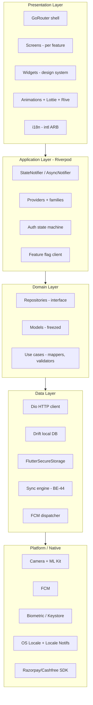
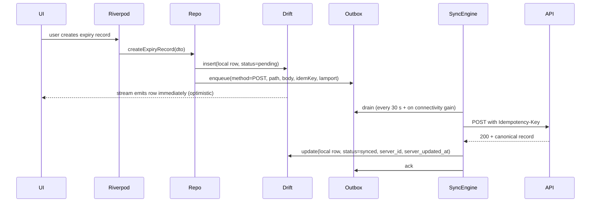
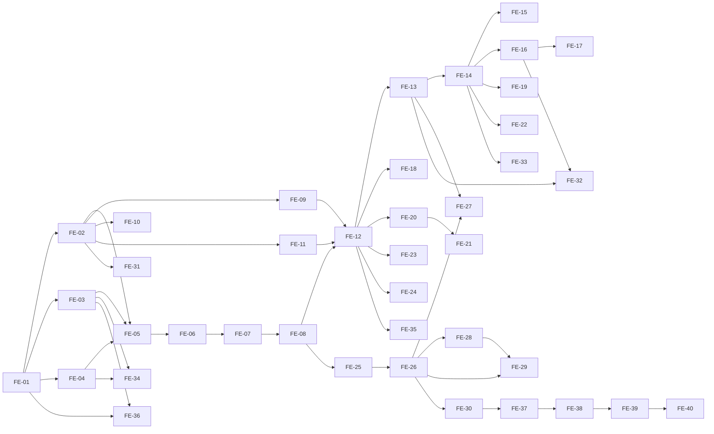

# Design Document: RADHA Flutter Mobile App

> **Status**: Draft 1 — design-first spec, no code yet. Backend is locked at BE-57 (57 phases, 95 tables, 410+ endpoints). This document is the executive frontend architect + UI/UX plan that the implementation tasks will ride on.
>
> **Spec ID**: `radha-flutter-mobile-001`
> **Workflow**: design-first
> **Total phases planned**: **40** (FE-01 → FE-40), grouped into 9 layers
> **Single-developer estimate**: 70–95 working days · **3-dev wave estimate**: 35–50 days
> **Stack (locked by `.kiro/steering/tech.md`)**: Flutter 3.16+ · Dart 3.3+ · Riverpod 2.5 · GoRouter 14 · Drift 2.18 · Dio 5.4 · freezed 2.5 · intl 0.19 · build_runner

---

## Table of Contents

1. [Overview](#overview)
2. [Architecture](#architecture)
3. [Design System](#design-system)
4. [Components and Interfaces](#components-and-interfaces)
5. [Data Models](#data-models)
6. [Phase Plan — 40 Phases](#phase-plan--40-phases)
7. [Critical Animation Specs](#critical-animation-specs)
8. [Correctness Properties](#correctness-properties)
9. [Error Handling](#error-handling)
10. [Testing Strategy](#testing-strategy)
11. [Build / Test / Release Plan](#build--test--release-plan)
12. [Risks & Mitigations](#risks--mitigations)

---

## Overview

### 1.1 Vision

RADHA's mobile app is the **single touchpoint** that lets one phone serve two intents at once: a household shopper who wants to know *"is this packet of biscuits safe for my daughter who has wheat allergy?"* and a kirana store manager who wants to know *"did Ravi actually scan aisle 4 today?"* Same scanner, same data plane, two orchestrations of the UI. The mobile app is the place where every other layer of the platform — backend AI, recall feed, OHS scoring, GRN flow — becomes visible, tactile, and habit-forming.

### 1.2 Target users

| Mode | Persona | Plan | Top jobs |
|---|---|---|---|
| **Consumer** | Personal shopper | Free | Scan, see health badge, save to shopping list |
| **Consumer** | Parent | Free → Premium ₹49/mo | Allergen profiles for the family, recall alerts, expiry calendar |
| **Consumer** | Health-conscious adult | Premium ₹49/mo | Unlimited scans, AI ingredient explainer, healthy alternatives, weekly digest |
| **Business** | Store owner / kirana manager | Trial → ₹49 / ₹99 / ₹199 | KPI dashboard, OHS, exports, RADHA Verified badge |
| **Business** | Audit / staff | Inherits tenant plan | Bulk EAN scan, expiry OCR, GRN inward, task completion |
| **Business** | Auditor (invited) | Token-based | Pass/fail audit sessions, evidence capture |

### 1.3 Retention & engagement thesis

Five forces that re-open the app, ranked by frequency:

1. **Daily** — shopping list as a habit hook (already in pocket while shopping).
2. **3–4× per week** — barcode scans (in store, at home, while ordering online).
3. **Weekly** — Sunday 8 AM personalized digest push.
4. **Monthly** — expiry calendar (we tell them food is about to spoil before they notice).
5. **Episodic, urgent** — recall alerts (public-safety hook → trust → word-of-mouth).

For business users the hooks are: daily KPI tile push, end-of-shift report, near-expiry alerts, and weekly OHS movement.

### 1.4 Two app modes, one Flutter codebase

We ship **one** Flutter binary. The app's mode is a derived state from the authenticated user's roles + onboarding segment + active tenant subscription:

```dart
enum AppMode { consumer, business, dual }

AppMode resolveMode(AuthSession s) {
  final hasBusinessRole = s.roles.any((r) => r.isBusinessRole);
  final hasConsumerSegment = s.onboardingSegment == OnboardingSegment.personal
      || s.onboardingSegment == OnboardingSegment.parent;
  if (hasBusinessRole && hasConsumerSegment) return AppMode.dual; // mode switcher in app bar
  if (hasBusinessRole) return AppMode.business;
  return AppMode.consumer;
}
```

A single GoRouter shell routes mode-specific tab structures; widgets that exist in both modes (scanner, product detail) read from a shared feature module. Mode-gated screens live behind `RoleGuard` + `EntitlementGuard` redirects.

### 1.5 Design philosophy

**Indian-rooted modernism.** Warm saffron / turmeric / sage palette over a near-black canvas, deliberate negative space, oversized type at the top of each screen, and motion that feels like cloth folding rather than software sliding. Avoid every cliché of the SaaS-blue, Material-default, Inter-only mobile app stack:

- No off-the-shelf `CircularProgressIndicator`. Every wait state is shimmer, skeleton, or a custom Lottie.
- No `Theme.of(context).colorScheme.primary` blue. Every color comes from our own token table.
- No default `Curves.fastOutSlowIn`. We use `Curves.easeOutQuint` for entry, `Curves.easeInOutCubicEmphasized` for layouts, and a tuned spring physics for confirmations.
- Haptics on every confirm, every error, every delight moment. Audio reserved for success-only and only when the system volume is up.
- Micro-illustrations (custom SVG / Rive) for empty and error states — never a magnifying-glass-and-text combo.

---

## Architecture

### 2.1 Layered architecture



**Strict dependency rule**: lower layers never import upper layers. Presentation imports only Application. Application imports only Domain. Domain imports only Data via interfaces. Concrete Data implementations are wired in `app_bootstrap.dart` via Riverpod overrides — keeps Domain testable with fakes.

### 2.2 Folder structure under `apps/mobile/lib/`

The current scaffold has only `lib/main.dart`. The full target tree:

```text
apps/mobile/lib/
├── main.dart                              # Entry: bootstrap + ProviderScope + RadhaApp
├── bootstrap/
│   ├── app_bootstrap.dart                 # async init: drift, dio, sentry, fcm, locale
│   ├── env.dart                           # Compile-time env via --dart-define
│   └── flavor.dart                        # dev / staging / prod
├── core/
│   ├── design/
│   │   ├── tokens/
│   │   │   ├── color_tokens.dart          # RadhaColors — semantic + raw
│   │   │   ├── type_tokens.dart           # RadhaType
│   │   │   ├── space_tokens.dart          # RadhaSpace (4-pt grid)
│   │   │   ├── radius_tokens.dart
│   │   │   ├── elevation_tokens.dart
│   │   │   ├── motion_tokens.dart         # curves, durations, stagger intervals
│   │   │   └── haptic_tokens.dart         # mapping → HapticFeedback
│   │   ├── theme/
│   │   │   ├── radha_theme.dart           # ThemeData light/dark
│   │   │   └── radha_text_styles.dart
│   │   └── components/                    # primitives — see §3.7
│   ├── network/
│   │   ├── dio_client.dart                # configured Dio instance
│   │   ├── interceptors/
│   │   │   ├── auth_interceptor.dart
│   │   │   ├── retry_interceptor.dart
│   │   │   ├── idempotency_interceptor.dart
│   │   │   ├── correlation_id_interceptor.dart
│   │   │   ├── rate_limit_interceptor.dart      # honors 429 + Retry-After
│   │   │   ├── offline_queue_interceptor.dart
│   │   │   └── sentry_interceptor.dart
│   │   ├── api_response.dart              # generic envelope
│   │   ├── api_error.dart                 # mapped ErrorCode enum
│   │   └── endpoints.dart                 # all paths as constants
│   ├── persistence/
│   │   ├── drift/
│   │   │   ├── radha_database.dart
│   │   │   ├── tables/                    # one file per table
│   │   │   ├── daos/                      # one DAO per domain
│   │   │   └── migrations.dart
│   │   ├── secure/
│   │   │   └── secure_kv.dart             # FlutterSecureStorage wrapper
│   │   └── prefs/
│   │       └── prefs_service.dart         # SharedPreferences for non-secret prefs
│   ├── routing/
│   │   ├── app_router.dart                # GoRouter root
│   │   ├── route_paths.dart
│   │   ├── guards/
│   │   │   ├── auth_guard.dart
│   │   │   ├── role_guard.dart
│   │   │   ├── entitlement_guard.dart
│   │   │   └── onboarding_guard.dart
│   │   └── deep_links/
│   │       └── deep_link_handler.dart
│   ├── i18n/
│   │   ├── l10n.dart
│   │   └── arb/                           # app_en.arb, app_hi.arb, app_ta.arb …
│   ├── animations/
│   │   ├── radha_curves.dart
│   │   ├── stagger.dart
│   │   ├── hero_tags.dart
│   │   ├── lottie_assets.dart
│   │   └── rive_assets.dart
│   ├── observability/
│   │   ├── sentry_init.dart
│   │   ├── correlation_id.dart
│   │   ├── analytics_client.dart          # POSTs /api/v1/analytics/app-event
│   │   └── logger.dart
│   ├── feature_flags/
│   │   ├── feature_flags_client.dart      # 5-min poll → BE-47
│   │   └── flags.dart
│   ├── notifications/
│   │   ├── fcm_service.dart
│   │   ├── local_notifications.dart
│   │   └── notification_router.dart       # deep-link mapping
│   ├── sync/
│   │   ├── sync_engine.dart               # consumes BE-44 sync API
│   │   ├── outbox.dart
│   │   └── conflict_resolver.dart
│   ├── auth/
│   │   ├── auth_state.dart                # freezed sealed
│   │   ├── auth_repository.dart
│   │   ├── token_manager.dart             # access + refresh + biometric reauth
│   │   └── session_storage.dart
│   ├── error/
│   │   ├── failure.dart
│   │   └── error_to_user.dart             # ErrorCode → friendly localized msg
│   └── utils/
│       ├── ean.dart
│       ├── dates.dart
│       └── debounce.dart
├── features/
│   ├── splash/
│   ├── onboarding/
│   ├── auth/                              # OTP login, biometric reauth
│   ├── home_consumer/
│   ├── home_business/
│   ├── scanner/
│   ├── scan_result/
│   ├── product_detail/
│   ├── allergen_profile/
│   ├── shopping_list/
│   ├── saved_products/
│   ├── expiry_calendar/
│   ├── recalls/
│   ├── ingredient_explainer/
│   ├── alternatives/
│   ├── premium/
│   ├── family/
│   ├── referrals/
│   ├── digest/
│   ├── public_product/
│   ├── voice_placeholder/
│   ├── language/
│   ├── business_activation/
│   ├── tasks/
│   ├── ean_audit/
│   ├── grn/
│   ├── inventory/
│   ├── reports/
│   ├── ohs_dashboard/
│   ├── verified_badge/
│   ├── webhooks/
│   ├── settings/
│   └── support/
└── widgets/                               # cross-feature reusable pieces
    ├── empty_states/
    ├── error_states/
    ├── loading/                           # shimmer + skeletons
    ├── lists/
    └── charts/
```

**Per-feature folder convention** (every entry under `lib/features/<feature>/`):

```text
lib/features/<feature>/
├── data/
│   ├── <feature>_api.dart                 # Dio calls (typed)
│   ├── <feature>_local.dart               # Drift DAO usage
│   └── <feature>_repository_impl.dart
├── domain/
│   ├── models/                            # freezed
│   ├── <feature>_repository.dart          # interface
│   └── usecases/                          # optional, for non-trivial flows
├── application/
│   ├── <feature>_providers.dart           # Riverpod
│   └── <feature>_state.dart               # freezed sealed
└── presentation/
    ├── <feature>_screen.dart
    ├── widgets/
    └── animations/
```

### 2.3 State management — Riverpod

We standardize on **Riverpod 2.5+ with code-gen (`riverpod_generator`)**. Reasons: compile-time safe, no `BuildContext` lookups, auto-disposed by default, excellent test ergonomics.

| Pattern | When to use | Example |
|---|---|---|
| `Provider` | Pure DI of an object that never changes | `dioClientProvider`, `radhaDatabaseProvider` |
| `FutureProvider` | One-shot async fetch, never re-fetched in lifetime | `appConfigProvider` |
| `StreamProvider` | Continuous streams (auth state, FCM messages) | `authStateProvider`, `fcmMessagesProvider` |
| `AsyncNotifier` (preferred) | Async state with explicit mutations | `scanResultControllerProvider` |
| `Notifier` | Sync state (form state, filters) | `expiryFiltersProvider` |
| `family` modifier | Parameterized providers | `productDetailProvider.family(eanCode)` |
| `keepAlive: true` | Cache across nav (use sparingly) | `tenantKpisProvider` |

**Rule**: presentation widgets never call APIs, never call DAOs. They `ref.watch` an `AsyncValue<T>` and render `data / loading / error` branches via the centralized `AsyncValueRenderer` widget (which itself uses our shimmer + error-state widgets — never `CircularProgressIndicator`).

### 2.4 Navigation — GoRouter

Single `GoRouter` instance with a `StatefulShellRoute.indexedStack` for the bottom-tab UX. Two shells:

- **Consumer shell** (4 tabs): `Home`, `Scan`, `Saved`, `Profile`.
- **Business shell** (4 tabs): `Today`, `Scan`, `Tasks`, `Operations`.

`Mode` is determined at app boot by the auth controller and persisted; the user sees only the shell for their resolved `AppMode`. `AppMode.dual` users get a slot in the AppBar to flip — flip animates a 180° material rotation of the entire tab bar (custom `AnimatedSwitcher` with our `motionEmphasized` curve).

#### 2.4.1 Route table (selected highlights)

| Path | Screen | Mode | Guard | Phase |
|---|---|---|---|---|
| `/splash` | Splash | both | none | FE-05 |
| `/onboarding/segment` | 2×3 onboarding card grid | both | unauth | FE-06 |
| `/auth/otp` | OTP entry | both | unauth | FE-07 |
| `/auth/biometric` | Biometric reauth | both | auth | FE-08 |
| `/c/home` | Consumer home | consumer | auth | FE-12 |
| `/c/scanner` | Scanner | consumer | auth | FE-13 |
| `/c/scan/:scanId` | Scan result | consumer | auth | FE-14 |
| `/c/allergens` | Allergen profiles | consumer | auth | FE-15 |
| `/c/saved` | Saved + shopping list | consumer | auth | FE-16 |
| `/c/expiry` | Expiry calendar | consumer | auth | FE-17 |
| `/c/recalls` | Recall center | consumer | auth | FE-18 |
| `/c/explain/:ingredient` | AI explainer modal route | consumer | auth+entitled | FE-19 |
| `/c/premium` | Subscribe / paywall | consumer | auth | FE-20 |
| `/c/family` | Family sharing | consumer | premium | FE-21 |
| `/c/alternatives/:productId` | Healthy alternatives | consumer | auth | FE-22 |
| `/c/referrals` | Referral program | consumer | auth | FE-23 |
| `/c/digest/:weekIso` | Weekly digest landing | consumer | auth | FE-24 |
| `/b/today` | Business KPI home | business | auth | FE-26 |
| `/b/activate` | Business activation wizard | both | auth | FE-25 |
| `/b/tasks` | Task list & detail | business | auth | FE-27 |
| `/b/grn/new` | GRN inward | business | auth+manager | FE-28 |
| `/b/inventory` | Inventory + low-stock | business | auth | FE-29 |
| `/b/reports` | Reports & exports | business | auth+manager | FE-30 |
| `/settings/language` | Language switcher | both | auth | FE-31 |
| `/voice` | Voice placeholder | both | auth | FE-32 |
| `/p/:slug` | Public product deep link | both | none | FE-33 |

#### 2.4.2 Deep links

- **Push notification deep links**: `fcm.data.deeplink = "/c/recalls?eanCode=8901058849745"` → `notification_router.dart` parses and `context.go(...)`.
- **Universal links / App Links**: `radha.app/p/:slug` → if app installed, opens `/p/:slug`; otherwise install referrer carries the slug for post-install routing.
- **Referral links**: `radha.app/r/:code` → opens onboarding pre-tagged with referrer code.

### 2.5 Networking layer — Dio + interceptors

Single `Dio` instance, configured in `dio_client.dart`. **Interceptor order matters** (Dio runs them in order added on request, reverse on response):

1. `correlation_id_interceptor` — generates one UUIDv4 per request, sets header `X-Correlation-Id`, propagates to logs and Sentry.
2. `auth_interceptor` — attaches `Authorization: Bearer <accessToken>`. On 401, triggers `tokenManager.refresh()` exactly once; if refresh fails, emits `AuthEvent.signedOut`.
3. `idempotency_interceptor` — for any `POST` to a write endpoint listed in `IDEMPOTENT_ENDPOINTS`, generates UUIDv7 and sets `Idempotency-Key` header. Persists `(endpoint+key)→responseHash` to Drift `idempotency_cache` so retries replay the cached response.
4. `rate_limit_interceptor` — on 429, parses `Retry-After`, surfaces a typed `RateLimitedFailure` with `retryAfter`, `quotaUpgradeHint`. Mobile shows the upgrade prompt sheet.
5. `retry_interceptor` — exponential backoff (250 ms · 2 + jitter, max 3 retries) only for: network errors, 502/503/504, and 408. Never retries 4xx other than 408.
6. `offline_queue_interceptor` — when `connectivity == none`, drops mutating requests into the **outbox** (Drift table), returns a synthetic `202 Accepted` envelope so the UI optimistically updates.
7. `sentry_interceptor` — adds breadcrumbs, attaches correlation ID, captures non-2xx as breadcrumbs, captures 5xx as exceptions.

Helper:
```dart
final dioProvider = Provider<Dio>((ref) {
  final dio = Dio(BaseOptions(
    baseUrl: ref.watch(envProvider).apiBaseUrl,
    connectTimeout: const Duration(seconds: 10),
    receiveTimeout: const Duration(seconds: 30),
  ));
  dio.interceptors.addAll([
    CorrelationIdInterceptor(),
    AuthInterceptor(ref),
    IdempotencyInterceptor(ref),
    RateLimitInterceptor(ref),
    RetryInterceptor(),
    OfflineQueueInterceptor(ref),
    SentryInterceptor(),
  ]);
  return dio;
});
```

### 2.6 Local DB — Drift

Drift is chosen over Isar (per steering) because it pairs well with code-gen and SQL migrations are explicit. We mirror **only** what the app must work offline with — never the full server schema.

Tables shipped (final shape; built incrementally across FE-04, FE-12, FE-15, FE-17, FE-29):

| Drift table | Purpose | Mirrors backend |
|---|---|---|
| `users_local` | Cached `me` payload | `users` |
| `tenants_local` | Active tenant + plan | `tenants`, `tenant_subscriptions` |
| `products_local` | Last-N scanned products (LRU 500) | `products` |
| `health_assessments_local` | Score + flags per product | `product_health_assessments` |
| `scans_local` | Local scan history (paged) | `scan_items` |
| `saved_products_local` | Consumer saved list | (server-side `saved_products`) |
| `shopping_list_local` | Free-form shopping items | server `shopping_list_items` (BE-55) |
| `expiry_records_local` | Saved-product expiry entries | `expiry_records` |
| `recalls_local` | Recent recall feed | `recalls` |
| `allergen_profiles_local` | Per-family-member, encrypted name col | `allergen_profiles` |
| `tasks_local` | Assigned tasks (business) | `tasks`, `task_assignments` |
| `ean_lists_local` | Approved EAN cache | `ean_list_items` |
| `inventory_local` | Item-level inventory snapshot | `inventory_items` |
| `outbox` | Pending mutations | n/a (client-only) |
| `idempotency_cache` | Replay store | n/a (client-only) |
| `sync_state` | Last sync vector clock | n/a (client-only) |

All DAO methods are `Stream<T>` so widgets can `ref.watch` reactive data and update in real time when the sync engine writes.

### 2.7 Offline-first sync (consumes BE-44)



**Conflict resolution** (consumes BE-44 sync semantics):
- Each mutation carries a Lamport counter from `sync_state`.
- On conflict, server wins on **security-sensitive** fields (subscription tier, role, email_verified). For domain fields, **last-write-wins by Lamport**, with a per-record dedupe by idempotency key.
- The UI has a `ConflictBanner` widget that surfaces unresolved conflicts (rare) with an explicit "Use server" / "Use my version" action — see FE-34.

### 2.8 Push notifications — FCM

- `firebase_messaging` for transport. We do not use OneSignal.
- Token rotation: on every `auth_state.signedIn`, we register the device token via `POST /api/v1/notifications/register-device` (BE-24).
- Foreground messages: render an in-app toast styled with our design system, never the OS notification.
- Background messages: tapped → `notification_router.dart` parses `data.deeplink` and routes via GoRouter.
- Correlation: every push carries `data.correlation_id`; we log it on receipt and on tap so end-to-end traces work in Sentry.
- Payload classes: `recall_alert`, `weekly_digest`, `task_assigned`, `low_stock`, `near_expiry`, `subscription_event`, `referral_reward`.

### 2.9 Crash reporting — Sentry

- `sentry_flutter` with environment + release tagging from `--dart-define`.
- `beforeSend` scrubs PII (mobile, email, OTP, full body of `/auth/*` endpoints, allergen profile names).
- Each request's correlation ID is attached as a Sentry tag (`correlation_id`).
- Custom breadcrumbs for navigation, feature-flag changes, sync events.
- Sentry feedback widget on the support screen (FE-37).

### 2.10 Multi-language — intl + ARB

Languages shipped in v1: **en, hi, ta, te, bn, mr** (six per backend BE-42).
- ARB files under `lib/core/i18n/arb/app_<locale>.arb`.
- Plurals + gender selectors via ICU MessageFormat.
- `Locale` is resolved in this order: explicit user setting → device locale (if supported) → `en`.
- Switching language causes a `MaterialApp` rebuild with a 240 ms cross-fade (`AnimatedSwitcher`) — never a hard flicker.
- Server-translated content (product names, recall messages) is fetched per locale via `Accept-Language`.

---

## Design System

The design system is the source of truth for every pixel. Every widget reads tokens, never hard-coded values. Tokens live in `lib/core/design/tokens/`.

### 3.1 Color palette

A near-black canvas (`ink.900`) with warm Indian accents. We use **semantic** tokens in code (`RadhaColors.scoreHigh`) and reserve raw hex for the token table itself.

#### Brand & accent (the warm Indian palette)

| Token | Light hex | Dark hex | Where it appears |
|---|---|---|---|
| `saffron.50` | `#FFF6E5` | `#2A1F08` | Subtle CTA backgrounds |
| `saffron.300` | `#FFC661` | `#FFC265` | Highlights, focused states |
| `saffron.500` | `#F08C2C` | `#F08C2C` | Primary CTA fill (the RADHA orange) |
| `saffron.700` | `#B5611A` | `#FFAD52` | Pressed primary CTA |
| `turmeric.500` | `#E5A93B` | `#E5A93B` | Secondary highlights, premium ribbons |
| `sage.50` | `#EFF6EE` | `#0F1A12` | Success surface |
| `sage.500` | `#5C8A60` | `#7BAF80` | Success / good-health score |
| `terracotta.500` | `#C0593A` | `#E37454` | Errors, recall, severe allergen |
| `indigo.500` | `#3D4F8C` | `#7E92D3` | Info, business mode accents |

#### Health score scale (5 buckets, semantic gradient)

| Token | Hex (dark canvas) | Score range |
|---|---|---|
| `score.excellent` | `#7BAF80` (sage) | 80–100 |
| `score.good` | `#B6C97B` (lime-sage) | 60–79 |
| `score.average` | `#E5A93B` (turmeric) | 40–59 |
| `score.poor` | `#E37454` (terracotta-light) | 20–39 |
| `score.harmful` | `#C0593A` (terracotta) | 0–19 |

#### Neutrals

| Token | Hex |
|---|---|
| `ink.900` | `#0E0F12` (canvas) |
| `ink.800` | `#16181D` (cards) |
| `ink.700` | `#1F2229` (raised) |
| `ink.500` | `#3B414D` (dividers) |
| `ink.300` | `#7C8597` (secondary text) |
| `ink.100` | `#CDD3DD` (primary text on dark) |
| `paper.50` | `#FAF8F4` (light theme canvas) |
| `paper.300` | `#E9E2D3` (light theme cards) |

**Light theme** swaps `ink.*` for `paper.*` and shifts saffron 1 stop down. WCAG-AA contrast: every body text token pairs with a tested background; ratios documented in the token Dart-doc comments and verified by a `golden_test_contrast.dart`.

### 3.2 Typography

Two font families, both bundled (avoid Google Fonts runtime fetch):
- **Inter** (variable) for Latin → 100 .. 900 weights.
- **Noto Sans Devanagari** + **Noto Sans Tamil** + **Noto Sans Telugu** + **Noto Sans Bengali** for Indic scripts. We auto-select the right family per locale via a `RadhaFontResolver(localeOf(context))`.

#### Type scale (`RadhaType`)

| Style | Size / line-height / letter-spacing | Weight | Use |
|---|---|---|---|
| `display.xl` | 56 / 60 / -1.5 | 700 | Onboarding hero, paywall hero |
| `display.l` | 40 / 44 / -0.8 | 700 | Screen heroes (e.g., "Your week") |
| `headline.l` | 32 / 36 / -0.4 | 600 | Section heads |
| `headline.m` | 24 / 28 / -0.2 | 600 | Card titles |
| `title.m` | 18 / 24 / 0 | 600 | Sheet titles, list section heads |
| `body.l` | 16 / 24 / 0 | 400 | Default body |
| `body.m` | 14 / 20 / 0.1 | 400 | Secondary body, list items |
| `label.m` | 13 / 16 / 0.4 | 500 | Buttons, chips |
| `caption` | 11 / 14 / 0.5 | 500 | Metadata, timestamps |
| `mono.score` | 64 / 64 / -2 | 700 | Health score numeric display (Inter Tabular) |

Headlines tighten letter-spacing; body text is generous on line-height for Indic readability.

### 3.3 Spacing scale (`RadhaSpace`)

A strict 4-pt grid: `s0=0, s1=4, s2=8, s3=12, s4=16, s5=20, s6=24, s8=32, s10=40, s12=48, s16=64, s20=80, s24=96`. No off-grid values are allowed in widgets — golden-test linter will fail on raw EdgeInsets numbers other than from `RadhaSpace`.

### 3.4 Radius

`r0=0, r1=4 (chips), r2=8 (inputs), r3=12 (cards), r4=20 (sheets), r5=28 (FAB-tier)`. Onboarding cards use `r5` because the size demands it.

### 3.5 Elevation / shadow

We avoid Material's default soft drop shadow. Instead, layered "light" tokens (warm) on dark backgrounds:

| Token | Spec | Use |
|---|---|---|
| `elev.0` | none | Flush surfaces |
| `elev.1` | `0 1 2 rgba(0,0,0,0.20)` + 1px inner highlight | Cards |
| `elev.2` | `0 4 12 rgba(0,0,0,0.28)` + 1px inner highlight | Raised cards |
| `elev.3` | `0 12 28 rgba(0,0,0,0.35)` | Sheets, modals |
| `elev.4` | `0 24 60 rgba(0,0,0,0.45)` | Full-bleed modals |

The 1-px inner highlight (`rgba(255,255,255,0.04)`) is a custom `BoxDecoration` painter — gives surfaces the tactile "soft glow" feel without OLED black-clipping.

### 3.6 Motion tokens (`RadhaMotion`)

#### Curves

| Token | Value | Use |
|---|---|---|
| `motion.entry` | `Curves.easeOutQuint` | New element appears |
| `motion.exit` | `Curves.easeInQuart` | Element leaves |
| `motion.emphasized` | `Curves.easeInOutCubicEmphasized` | Layout transitions |
| `motion.spring` | `SpringDescription(mass: 1.0, stiffness: 220, damping: 22)` | Confirm pops, badges, FAB |
| `motion.springSoft` | `SpringDescription(mass: 1.0, stiffness: 110, damping: 20)` | Sheet reveal |
| `motion.linear` | `Curves.linear` | Progress, scan-line shuttle |

#### Durations

| Token | ms | Use |
|---|---|---|
| `dur.instant` | 80 | Hover/press color shift |
| `dur.fast` | 160 | Micro-interactions |
| `dur.base` | 240 | Most layout changes |
| `dur.slow` | 360 | Hero transitions, sheets |
| `dur.deliberate` | 520 | Onboarding card reveal, premium success |

#### Stagger intervals

| Pattern | Spec |
|---|---|
| `stagger.list` | child-N delay = N × 40 ms, max 240 ms |
| `stagger.grid2x3` | per-card delay 0/60/120/180/240/300 ms (used by onboarding) |
| `stagger.kpi` | 80 ms each |

### 3.7 Haptics map (`RadhaHaptics`)

| Event | API | When |
|---|---|---|
| `tapLight` | `HapticFeedback.selectionClick` | Tab change, card select, scan focus |
| `tapMedium` | `HapticFeedback.lightImpact` | Submit pressed |
| `confirmSuccess` | `HapticFeedback.mediumImpact` then 80 ms then `selectionClick` | Save, scan success |
| `error` | `HapticFeedback.heavyImpact` × 2 (40 ms apart) | Validation failed, recall hit |
| `recallUrgent` | `HapticFeedback.heavyImpact` × 3 (60 ms apart) | Recall alert opens |
| `subscribeSuccess` | mediumImpact then 120 ms then mediumImpact | Premium activated |

We respect the OS-level "Reduce haptics" / accessibility setting via a `HapticPolicy` that downgrades to `selectionClick` only when set.

### 3.8 Component primitives

Every primitive lives in `lib/core/design/components/` and ships with all interaction states (default · hover · pressed · disabled · loading · success · error). Each has a golden test.

| Component | Variants | States | Animation |
|---|---|---|---|
| `RadhaButton` | primary / secondary / ghost / destructive / icon | all | scale 0.97 on press 80 ms; ripple replaced by saffron radial fade |
| `RadhaCard` | flat / raised / interactive | default · pressed · selected · disabled | `dur.fast` press scale; `dur.base` selected ring fade |
| `RadhaChip` | filter / status / removable / score | all | `dur.instant` selected color flip + `tapLight` haptic |
| `RadhaInput` | text / numeric / OTP / search | default · focus · filled · error | label rises `dur.base`, helper text slides on error |
| `RadhaBottomSheet` | regular / modal / scrollable | open · closing | spring reveal `motion.springSoft`, drag-to-dismiss |
| `RadhaDialog` | confirm / destructive / paywall | open · closing | scale-from-90% + fade `dur.slow` |
| `RadhaListItem` | one-line / two-line / with leading / with trailing | default · pressed · disabled | hover-tilt 1° on long-press (drag affordance) |
| `RadhaTabBar` | fill / underline | rest · selected · transitioning | indicator slides on `motion.emphasized` |
| `RadhaScoreGauge` | small / large / hero | animated 0→target | `TweenAnimationBuilder` + spring; arc fills with score color |
| `RadhaAllergenPill` | mild / moderate / severe / critical | rest · pulse | severe + critical pulse via `flutter_animate` (1 cycle) |

### 3.9 Loading states library

**No `CircularProgressIndicator` allowed in production code.** Lint rule (`avoid_circular_progress_indicator`) enforced by analyzer.

| Pattern | When to use |
|---|---|
| `RadhaShimmer` (custom Shimmer) | List pre-load, card skeletons |
| `RadhaSkeletonText` (animated bar) | Single-line text placeholder |
| `RadhaPulse` (Lottie pulse on logo) | Splash, app warm-up |
| `RadhaProgressArc` (animated SVG arc) | Determinate uploads (image OCR, exports) |
| `RadhaScanShuttleLine` | Scanner waiting for barcode read |
| `RadhaCheckmarkLottie` | Success after a wait state (250 ms hold then fade) |

### 3.10 Empty states + error states

Every listy/feed/dashboard screen has both. Each empty/error state has:
1. A custom illustration concept (SVG or Rive).
2. A one-line headline.
3. A two-line supportive body.
4. A primary CTA (always — don't leave the user with no action).
5. A secondary "Why is this empty?" link if the state is policy-driven (e.g., free tier limit).

Selected empties (full table in FE-11):

| Screen | Illustration concept | Headline | CTA |
|---|---|---|---|
| Saved (consumer) | A rangoli pattern fading in | "Your saved shelf is empty" | Scan something |
| Expiry calendar | A neem leaf calendar page | "Nothing's expiring soon" | Scan a saved item |
| Recalls | A green tick haveli | "All clear today" | (none) |
| Tasks (staff) | A clipboard with chai cup | "No tasks for now" | Pull to refresh |
| Low-stock | An empty steel dabba | "All shelves stocked" | View inventory |
| OHS dashboard | OHS dial at zero | "We need 7 days of data" | Open audit task |

### 3.11 Accessibility

- All interactive widgets have `Semantics(label: …, hint: …)`.
- Min tap target 48 × 48 dp.
- Color contrast WCAG-AA verified on every text/background pair (golden + automated CI check).
- `MediaQuery.textScaler` honored; layouts tested at 0.85× and 1.5×.
- Screen reader read-order matches visual reading order; `Semantics(sortKey: …)` where layout is non-linear.
- All Lottie / Rive animations have a `Semantics(label)` describing the animation purpose.
- "Reduce motion" OS flag → fall back to fades only, no scale or spring.

### 3.12 Iconography

We do not use `Icons.*` (Material) directly. Two strategies:
1. **Phosphor Icons** (regular + duotone) — shipped via `phosphor_flutter`. Lighter than Material, more visual personality.
2. **Custom SVG** for RADHA-specific iconography (scan logo, OHS dial, allergen group icons) — bundled via `flutter_svg`.

---

## Components and Interfaces

This section is the interface-level contract for the cross-cutting components consumed by every feature module. It complements the [Design System](#design-system) primitives and the [Phase Plan](#phase-plan--40-phases). Concrete repositories per feature are introduced in their owning phase.

### 4.1 AppBootstrap

**Purpose**: Async-init Drift, Sentry, FCM, locale, env, secure storage. Returns a `BootstrappedApp` that `main.dart` consumes inside `ProviderScope`.

```dart
abstract class AppBootstrap {
  Future<BootstrappedApp> initialize();
}

class BootstrappedApp {
  final RadhaDatabase database;
  final Dio dio;
  final SyncEngine syncEngine;
  final FcmService fcmService;
  final FeatureFlagsClient featureFlags;
  final Sentry sentry;
  final AnalyticsClient analytics;
  final Locale initialLocale;
}
```

**Responsibilities**:
- Decide flavor (`dev | staging | prod`) from `--dart-define`.
- Wire Sentry first so init crashes are captured.
- Open Drift (with WAL + secure delete pragmas).
- Resolve locale from secure prefs or device locale.
- Register FCM listeners (foreground + background isolate).
- Pre-warm fonts (Inter + Indic) so the first frame is not unstyled.

### 4.2 RadhaDatabase (Drift)

**Purpose**: The local persistence layer. Sole owner of file-system-backed state.

```dart
abstract class RadhaDatabase {
  // Domain DAOs
  ProductsDao get products;
  ScansDao get scans;
  SavedProductsDao get savedProducts;
  ShoppingListDao get shoppingList;
  ExpiryRecordsDao get expiryRecords;
  RecallsDao get recalls;
  AllergenProfilesDao get allergenProfiles;
  TasksDao get tasks;
  EanListsDao get eanLists;
  InventoryDao get inventory;

  // Sync infrastructure
  OutboxDao get outbox;
  IdempotencyCacheDao get idempotencyCache;
  SyncStateDao get syncState;

  Future<void> close();
  Future<void> wipeForLogout();
}
```

**Migration policy**: append-only `migrations.dart` with explicit `from→to` SQL; schema-version snapshot tests gate every PR.

### 4.3 ApiClient (Dio facade)

**Purpose**: Typed access to the backend. Every feature has its own `*Api` class that holds a `Dio` and calls `endpoints.*` constants.

```dart
abstract class ApiClient {
  Future<ApiResponse<T>> get<T>(String path,
      {Map<String, dynamic>? query, T Function(dynamic) decode});
  Future<ApiResponse<T>> post<T>(String path,
      {Object? body, IdempotencyKey? idem, T Function(dynamic) decode});
  Future<ApiResponse<T>> put<T>(String path,
      {Object? body, T Function(dynamic) decode});
  Future<ApiResponse<void>> delete(String path);
}
```

`ApiResponse<T>` is a freezed sealed: `Success(T) | Failure(ApiError)`. `ApiError` is a freezed sealed enumerating typed error codes including `RateLimited(retryAfter, hint)`, `Offline()`, `Unauthorized()`, `Conflict()`, `Validation(field, msg)`, `Unknown(originator)`.

### 4.4 TokenManager

**Purpose**: Single source of truth for access + refresh tokens. Single-flight refresh; biometric reauth fallback.

```dart
abstract class TokenManager {
  Stream<TokenSnapshot> get snapshots;
  Future<String?> currentAccessToken();
  Future<String?> refreshIfNeeded();
  Future<void> setSession(AuthSession s);
  Future<void> clear({required ClearReason reason});
}
```

### 4.5 SyncEngine

**Purpose**: Drains outbox, pulls server diff, resolves conflicts. Consumes BE-44 sync API.

```dart
abstract class SyncEngine {
  Stream<SyncStatus> get status;
  Future<void> push();   // drain outbox now
  Future<void> pull();   // pull server delta now
  Future<void> resolve(ConflictId id, ConflictResolution r);
}
```

### 4.6 FeatureFlagsClient

**Purpose**: Polls BE-47 every 5 min; serves flag values to providers.

```dart
abstract class FeatureFlagsClient {
  Stream<FeatureFlagSnapshot> get snapshots;
  bool isOn(FeatureFlag flag);
  String? variant(FeatureFlag flag);
}
```

### 4.7 FcmService

**Purpose**: Owns the FCM token lifecycle and message stream.

```dart
abstract class FcmService {
  Stream<NotificationPayload> messages;
  Future<String?> currentToken();
  Future<void> registerWithServer();
  Future<bool> requestPermission();
}
```

### 4.8 AnalyticsClient

**Purpose**: Buffer + flush analytics events to `/api/v1/analytics/app-event`.

```dart
abstract class AnalyticsClient {
  void track(AnalyticsEvent e);
  Future<void> flush();
}
```

### 4.9 Per-feature repository pattern

Every feature module exposes a Domain `<Feature>Repository` interface and a Data implementation. Presentation never sees the implementation — only the interface, injected via Riverpod.

```dart
abstract class ScanResultRepository {
  Future<ScanResult> fetch(String scanId);
  Stream<ScanResult> watch(String scanId);
  Future<void> save(SaveScanRequest req);
}
```

The Data implementation sequences `local-first → network → write-through-to-local`, returning a single `Stream<ScanResult>` so `ref.watch` always reflects truth.

---

## Data Models

This section captures the **shared, cross-feature** data models. Feature-local models live in their respective `domain/models/` folders and are introduced in their owning phase.

> All models are `freezed` immutable classes with `fromJson`/`toJson` generated by `json_serializable`. Where a model maps to a Drift row, a `fromCompanion`/`toCompanion` mapper is generated.

### 5.1 Auth

```dart
@freezed
class AuthSession with _$AuthSession {
  const factory AuthSession({
    required String userId,
    required String accessToken,
    required String refreshToken,
    required DateTime accessExpiresAt,
    required UserProfile profile,
    required List<UserRole> roles,
    required OnboardingSegment? onboardingSegment,
    required String? activeTenantId,
    required AppMode mode,
  }) = _AuthSession;
}

enum UserRole { staff, manager, auditor, adminLite, tenantAdmin, owner, consumer }
enum OnboardingSegment { personal, businessOwner, parent, pharmacy, institution, auditorInvited }
enum AppMode { consumer, business, dual }
```

**Validation**: tokens are opaque base64url; roles are intersected with the user's active tenant subscription before consumer/business mode is resolved.

### 5.2 Product & ScanResult

```dart
@freezed
class Product with _$Product {
  const factory Product({
    required String id,
    required String ean,
    required String name,
    String? brand,
    String? category,
    String? imageUrl,
    String? slug,           // for public link
    @Default([]) List<String> ingredients,
    NutritionFacts? nutrition,
    DateTime? lastEnrichedAt,
  }) = _Product;
}

@freezed
class NutritionFacts with _$NutritionFacts {
  const factory NutritionFacts({
    double? energyKcal,
    double? sugars,
    double? salt,
    double? fat,
    double? saturatedFat,
    double? protein,
    double? fibre,
    String? servingSize,
  }) = _NutritionFacts;
}

@freezed
class HealthAssessment with _$HealthAssessment {
  const factory HealthAssessment({
    required int score,                // 0..100, validated
    required ScoreBucket bucket,       // excellent..harmful
    @Default([]) List<HealthFlag> flags,
    String? childSuitability,
    DateTime? computedAt,
  }) = _HealthAssessment;
}

enum ScoreBucket { excellent, good, average, poor, harmful }
enum HealthFlag { highSugar, highSalt, highFat, highSatFat, processed, ultraProcessed, additives, palmOil }

@freezed
class ScanResult with _$ScanResult {
  const factory ScanResult({
    required String scanId,
    required Product product,
    required HealthAssessment health,
    @Default([]) List<AllergenMatch> allergenMatches,
    Recall? activeRecall,
    @Default([]) List<AlternativeRef> alternatives,
    required ScanSource source,
    required DateTime scannedAt,
  }) = _ScanResult;
}

enum ScanSource { camera, ocrFallback, manualEntry, deepLink }
```

**Validation rules**:
- `score ∈ [0, 100]` enforced by `assert` and validated at `fromJson`.
- `bucket` is derived from `score`; mismatch logs Sentry warning and the client recomputes.
- `imageUrl`, when present, must be HTTPS.

### 5.3 Allergens

```dart
@freezed
class AllergenProfile with _$AllergenProfile {
  const factory AllergenProfile({
    required String id,
    required String displayName,        // decrypted client-side; encrypted at rest server-side
    required FamilyMemberRef member,
    @Default([]) List<AllergenTag> allergens,
    @Default([]) List<ConditionTag> conditions,
    required Severity defaultSeverity,
    required DateTime updatedAt,
  }) = _AllergenProfile;
}

enum AllergenTag { peanut, treeNut, dairy, gluten, wheat, egg, soy, shellfish, fish, sesame, mustard, other }
enum ConditionTag { diabetes, hypertension, lactoseIntolerant, celiac, pregnancy, kidneyCkd, other }
enum Severity { mild, moderate, severe, critical }

@freezed
class AllergenMatch with _$AllergenMatch {
  const factory AllergenMatch({
    required AllergenTag tag,
    required Severity severity,
    @Default([]) List<String> matchedSynonyms,   // e.g., 'groundnut' for peanut
    required FamilyMemberRef forMember,
  }) = _AllergenMatch;
}
```

### 5.4 Saved + Shopping List

```dart
@freezed
class SavedProduct with _$SavedProduct {
  const factory SavedProduct({
    required String id,
    required Product product,
    required DateTime savedAt,
    DateTime? expiryDate,
    bool? consumed,
  }) = _SavedProduct;
}

@freezed
class ShoppingItem with _$ShoppingItem {
  const factory ShoppingItem({
    required String id,
    required String text,
    int? quantity,
    String? unit,
    @Default(false) bool checked,
    String? linkedProductId,        // optional link to a Product
    required DateTime createdAt,
  }) = _ShoppingItem;
}
```

### 5.5 Expiry & Recalls

```dart
@freezed
class ExpiryRecord with _$ExpiryRecord {
  const factory ExpiryRecord({
    required String id,
    required Product product,
    required DateTime expiresOn,
    required ExpiryStatus status,    // green | yellow | red | expired
    bool? consumed,
    String? batchCode,
  }) = _ExpiryRecord;
}

enum ExpiryStatus { green, yellow, red, expired }

@freezed
class Recall with _$Recall {
  const factory Recall({
    required String id,
    required String headline,
    required String body,
    required String severity,        // info | warning | severe
    required List<String> affectedEans,
    required DateTime issuedAt,
    DateTime? acknowledgedAt,
    String? sourceUrl,               // FSSAI link
  }) = _Recall;
}
```

### 5.6 Family & Subscription

```dart
@freezed
class FamilyMember with _$FamilyMember {
  const factory FamilyMember({
    required String id,
    required String displayName,
    required String mobileMasked,
    required FamilyRole role,
    required FamilyMemberStatus status,
    DateTime? joinedAt,
  }) = _FamilyMember;
}

enum FamilyRole { primary, member }
enum FamilyMemberStatus { invited, joined, removed }

@freezed
class SubscriptionStatus with _$SubscriptionStatus {
  const factory SubscriptionStatus({
    required PlanTier tier,           // free | premiumConsumer | trialPro | starter | growth | pro
    required SubscriptionState state, // active | trial | gracePeriod | cancelled | expired
    DateTime? trialEndsAt,
    DateTime? renewsAt,
    @Default([]) List<EntitlementKey> entitlements,
    QuotaSnapshot? quotaSnapshot,
  }) = _SubscriptionStatus;
}

@freezed
class QuotaSnapshot with _$QuotaSnapshot {
  const factory QuotaSnapshot({
    required int scansToday,
    required int scansLimit,
    required int savedTotal,
    required int savedLimit,
    required int familyMembers,
    required int familyLimit,
  }) = _QuotaSnapshot;
}

enum PlanTier { free, premiumConsumer, trialPro, starter, growth, pro }
enum SubscriptionState { active, trial, gracePeriod, cancelled, expired }
enum EntitlementKey {
  unlimitedScans,
  familySharing,
  alternatives,
  ingredientExplainer,
  weeklyDigest,
  webhooksRead,
  webhooksWrite,
  bulkAudit,
  exportPdf,
  exportExcel,
  ohsDashboard,
  verifiedBadge,
}
```

### 5.7 Tasks, EAN audit, GRN, Inventory

```dart
@freezed
class Task with _$Task {
  const factory Task({
    required String id,
    required String tenantId,
    required String storeId,
    required String title,
    required TaskType type,
    String? description,
    required TaskStatus status,
    required DateTime dueAt,
    String? assignedToUserId,
    String? eanListId,
  }) = _Task;
}
enum TaskType { audit, expirySweep, restock, shelfPhoto, custom }
enum TaskStatus { pending, inProgress, completed, overdue, cancelled }

@freezed
class GrnHeader with _$GrnHeader {
  const factory GrnHeader({
    required String id,
    required String tenantId,
    required String storeId,
    required SupplierRef supplier,
    required String invoiceNumber,
    required DateTime invoiceDate,
    required GrnStatus status,
    DateTime? postedAt,
  }) = _GrnHeader;
}

@freezed
class GrnItem with _$GrnItem {
  const factory GrnItem({
    required String id,
    required String grnId,
    required ProductRef product,
    required int quantity,
    String? batchCode,
    DateTime? expiryDate,
    double? unitPrice,
  }) = _GrnItem;
}
enum GrnStatus { draft, ready, posted, cancelled }

@freezed
class InventoryItem with _$InventoryItem {
  const factory InventoryItem({
    required String productId,
    required String storeId,
    required int onHand,
    required int reorderPoint,
    @Default([]) List<InventoryBatch> batches,
    DateTime? lastMovementAt,
  }) = _InventoryItem;
}
```

### 5.8 Sync infrastructure (client-only)

```dart
@freezed
class OutboxEntry with _$OutboxEntry {
  const factory OutboxEntry({
    required String id,
    required String idempotencyKey,
    required String method,        // POST | PUT | DELETE
    required String path,
    required String bodyJson,
    required int lamport,
    required int attemptCount,
    required DateTime queuedAt,
    DateTime? lastAttemptAt,
    OutboxStatus? status,
  }) = _OutboxEntry;
}
enum OutboxStatus { pending, inFlight, failedRetryable, failedDead, synced }

@freezed
class SyncVector with _$SyncVector {
  const factory SyncVector({
    required Map<String, int> tenantClock,
    required int userClock,
  }) = _SyncVector;
}
```

### 5.9 ApiResponse envelope

```dart
@freezed
sealed class ApiResponse<T> with _$ApiResponse<T> {
  const factory ApiResponse.success(T data, {required Meta meta}) = ApiSuccess<T>;
  const factory ApiResponse.failure(ApiError error, {required Meta meta}) = ApiFailure<T>;
}

@freezed
sealed class ApiError with _$ApiError {
  const factory ApiError.offline() = OfflineError;
  const factory ApiError.unauthorized() = UnauthorizedError;
  const factory ApiError.rateLimited({required Duration retryAfter, String? hint}) = RateLimitedError;
  const factory ApiError.validation({required String field, required String message}) = ValidationError;
  const factory ApiError.conflict({required String reason}) = ConflictError;
  const factory ApiError.server({required int status, String? message}) = ServerError;
  const factory ApiError.unknown({required Object cause}) = UnknownError;
}
```

---

## Error Handling

This section defines the *cross-cutting* error policy. Per-screen handling is documented inside each phase.

### 6.1 Error taxonomy

| Class | Source | UI behavior |
|---|---|---|
| `OfflineError` | No connectivity / timeout | Optimistic update applied; status pill says "Offline — will sync"; user is never blocked from continuing offline-eligible actions. |
| `UnauthorizedError` | 401 | Try `tokenManager.refreshIfNeeded()`. On second 401 inside the same logical action: emit `AuthEvent.signedOut`, route to `/auth/otp`, show non-blocking toast "Session expired — please sign in again". |
| `RateLimitedError` | 429 | Map to typed failure with `retryAfter` + `quotaUpgradeHint`. The UI selects a copy + CTA pair from the quota-hint mapping (`upgradeFor: 'unlimitedScans' → "Upgrade to Premium"`). |
| `ValidationError` | 400 | Bind to the offending form field's error label. Animation: 250 ms shake + terracotta outline. |
| `ConflictError` | 409 | Surface a non-blocking banner; if the conflict is on a pending sync write, route to `ConflictResolutionScreen` (FE-34). |
| `ServerError(5xx)` | 500/502/503/504 | Retry policy in interceptor; if exhausted, show in-place error state with retry CTA. Sentry-capture. |
| `UnknownError` | Anything else | Sentry-capture with breadcrumb + correlation ID; user sees a generic "Something went wrong" with a retry. |

### 6.2 Error-to-user mapping

`error_to_user.dart` is the single mapping from `ApiError` → localized friendly copy. Every error string is in `app_<locale>.arb` files. Free text never bubbles up from the server raw.

```dart
String errorToUser(ApiError e, AppLocalizations l10n) => switch (e) {
  OfflineError() => l10n.errorOffline,
  UnauthorizedError() => l10n.errorSessionExpired,
  RateLimitedError(:final hint) => hint == 'unlimitedScans' ? l10n.errorScanLimit : l10n.errorRateLimited,
  ValidationError(:final field, :final message) => l10n.errorValidation(field, message),
  ConflictError() => l10n.errorConflict,
  ServerError() => l10n.errorServer,
  UnknownError() => l10n.errorUnknown,
};
```

### 6.3 Crash & abnormal exit

- `runZonedGuarded` wraps the app and forwards uncaught errors to Sentry.
- `FlutterError.onError` does the same for framework errors.
- A custom `ErrorBoundary` widget wraps each top-level shell; on a build failure it shows a localized "Something went wrong on this screen" with a "Reload screen" CTA, rather than dying app-wide.

### 6.4 Offline error scenarios

| Scenario | Response | Recovery |
|---|---|---|
| User taps "Save" with no connectivity | Optimistic insert in Drift; outbox queues mutation; UI shows the saved row immediately with a tiny "pending" dot. | On reconnect, sync engine drains and replaces with server-authoritative row. |
| User scans 50 products offline | All scans go to local DB + outbox; results render from cached enrichment if available, else "Pending enrichment" placeholder. | On reconnect, batch sync replaces with full results. |
| User creates a GRN offline | Draft persisted locally; the *post* action is gated until connectivity returns; banner explains why. | On reconnect, post button enables. |

### 6.5 Recovery & retry

- Network failures inside actions: 3 retries with 250 ms × 2^n backoff + jitter (max 2 s).
- Razorpay flow interrupted: recover from `PaymentResult` event; re-establish the order from `/subscriptions/checkout` if needed.
- FCM token rotation: re-register on every `auth_state.signedIn` and on `Firebase.instance.onTokenRefresh`.

---

## Testing Strategy

### 7.1 Unit tests

- **Coverage target**: ≥ 85% on `lib/core/**` and ≥ 75% on each feature's `application/` + `domain/`.
- **Tooling**: `flutter_test`, `mocktail`, `riverpod_test`.
- **Patterns**:
  - Pure functions (validators, mappers): plain `test()` blocks.
  - State notifiers: `riverpod_test`'s `testNotifier()` for state-machine assertions.
  - Repositories: mocked Dio + Drift in-memory.

### 7.2 Widget tests

- Every screen ships at least one widget test per state branch (loading, empty, error, data).
- Every primitive component (FE-02 + FE-09) ships state-matrix widget tests.
- Common helper: `pumpWithRadhaApp(widget, overrides: [...])` provides MaterialApp + ProviderScope + theme.

### 7.3 Golden tests

- **Tooling**: `golden_toolkit`.
- **Coverage**:
  - Every primitive × every state × light + dark theme.
  - One representative "hero" screen per feature × locale (en / hi / ta).
  - Total budget: ~150 golden images; baseline regenerated only on intentional design change.
- **CI gate**: golden diff fails on > 0.5% pixel diff per image.

### 7.4 Property-based tests

See [Correctness Properties](#correctness-properties). Tooling: `glados`. Each property has:
- A property file under `test/properties/<name>_property_test.dart`.
- A `seeds/` companion with regression seeds for shrunken counterexamples.
- A CI run-budget of 200 iterations per property; nightly extended to 5 000.

### 7.5 Integration tests

- **Tooling**: `integration_test` package, runs on real emulator.
- **Critical flows**:
  1. Onboarding → OTP → consumer home → first scan → save.
  2. Offline scan ×10 → reconnect → all sync.
  3. Premium subscribe end-to-end with Razorpay test mode.
  4. Business activation wizard → KPI home renders.
  5. Manager creates task → staff completes task with bulk scan + evidence photo.
  6. GRN inward → posts → inventory snapshot reflects.
  7. Recall push → app open → ack flow.
  8. Locale switch en → hi → ta → screens still readable.

### 7.6 Performance tests

- `integration_test/perf_smoke_test.dart` records `FrameTiming` during a scripted scroll. CI fails if worst frame > 32 ms or p95 frame > 18 ms.
- Cold-start benchmark via `flutter run --profile` + `WidgetsBinding.endOfFrame` → fail if > 2.0 s on baseline device.

### 7.7 Accessibility tests

- `flutter_test` `meetsGuideline(textContrastGuideline)` + `meetsGuideline(tapTargetGuideline)` on each screen golden.
- Text-scaler matrix (0.85, 1.0, 1.5) golden tests for hero screens.
- `Semantics` tree assertion on each navigable element.

### 7.8 Test execution policy

- All unit + widget + golden + property tests run on every PR.
- Integration + perf tests run nightly + on release branches.
- Tests are run with `flutter test --reporter=expanded` and `--coverage`.
- Property tests use `--run` semantics (no watch). All long-running CI commands run `--run` flag equivalents to avoid blocking.

---

## Phase Plan — 40 Phases

The 40 phases are grouped into 9 layers. Each phase below is exhaustively specified. Where a phase introduces a screen, the **Animation spec** section is mandatory — empty/error/loading states are listed inline.

**Legend**:
- 🟢 = Net new functionality
- 🟡 = Refines or hardens prior phase
- ⚙ = Cross-cutting (infra)

---

### Layer 1 — Foundation (FE-01 → FE-04)

#### FE-01 — Project Bootstrap & Tooling 🟢⚙

- **Goal**: Replace the generated `lib/main.dart` skeleton with a production app shell. Wire pubspec, build flavors, lints, code-gen, env loader.
- **User-facing deliverable**: App launches to a dark-themed empty `Scaffold` with the RADHA logomark; debug banner gone; `flutter run` works on Android emulator and iOS simulator.
- **Screens delivered**: App shell only.
- **Files to create**:
  - `apps/mobile/pubspec.yaml` (replaced)
  - `apps/mobile/analysis_options.yaml` (extended)
  - `apps/mobile/build.yaml` (build_runner config)
  - `apps/mobile/.dart_define/dev.json`, `staging.json`, `prod.json`
  - `apps/mobile/lib/main.dart`
  - `apps/mobile/lib/bootstrap/app_bootstrap.dart`
  - `apps/mobile/lib/bootstrap/env.dart`
  - `apps/mobile/lib/bootstrap/flavor.dart`
  - `apps/mobile/lib/app.dart` (top-level `RadhaApp` widget)
  - `apps/mobile/test/_helpers/test_harness.dart`
  - CI: `apps/mobile/.github/workflows/ci.yml`
- **pubspec dependencies** (locked majors):
  - State: `flutter_riverpod ^2.5`, `riverpod_annotation ^2.3`
  - Routing: `go_router ^14`
  - Networking: `dio ^5.4`, `pretty_dio_logger ^1.4`
  - DB: `drift ^2.18`, `drift_flutter ^0.2`, `path_provider ^2.1`, `path ^1.9`
  - Models: `freezed_annotation ^2.4`, `json_annotation ^4.9`
  - Animation: `flutter_animate ^4.5`, `lottie ^3.1`, `rive ^0.13`
  - Camera & ML: `mobile_scanner ^5.1`, `camera ^0.11`, `google_mlkit_text_recognition ^0.13`
  - Storage: `flutter_secure_storage ^9.2`, `shared_preferences ^2.3`
  - Push: `firebase_core ^3.3`, `firebase_messaging ^15.0`
  - Crash: `sentry_flutter ^8.6`
  - Auth helpers: `local_auth ^2.2`
  - Utils: `intl ^0.19`, `phosphor_flutter ^2.1`, `flutter_svg ^2.0`, `connectivity_plus ^6.0`, `package_info_plus ^8.0`, `device_info_plus ^10.1`
  - Payments: `razorpay_flutter ^1.3`
  - Testing: `mocktail ^1.0`, `golden_toolkit ^0.15`, `integration_test`, `riverpod_test`
  - Dev: `build_runner ^2.4`, `riverpod_generator ^2.3`, `freezed ^2.5`, `json_serializable ^6.7`, `drift_dev ^2.18`, `very_good_analysis ^6.0`
- **Riverpod providers**: `envProvider`, `packageInfoProvider`, `connectivityStreamProvider`, `appBootstrapProvider`.
- **Animation spec**: First-frame logo entry — Lottie `radha_pulse.json` plays once on the empty Scaffold. **Curve**: `motion.entry`. **Duration**: `dur.deliberate` (520 ms). **Haptic**: none. **Hero**: pre-warms `kHeroLogo` for the splash transition.
- **Visual tokens used**: `ink.900` canvas, `RadhaType.display.l`, `paper.50` logo on dark.
- **Backend endpoints consumed**: none.
- **Empty / error / loading**: bootstrap screen has only a loading state — uses `RadhaPulse`.
- **Dependencies**: none.
- **Test plan**:
  - Widget: `app_smoke_test.dart` — `RadhaApp` builds without throwing.
  - Unit: `env_test.dart` — flavor parsing.
  - CI: `flutter analyze --fatal-infos --fatal-warnings`, `flutter test`.
- **Estimated duration**: **2 dev-days**.

---

#### FE-02 — Design System Foundation 🟢

- **Goal**: Implement every token table in §3 as Dart code; ship the theme.
- **User-facing deliverable**: A `/_dev/design-system` debug screen (only enabled in dev flavor) showing every primitive, every token, every state — used by designers + QA as living spec.
- **Screens delivered**: Internal Design System Catalog (debug-only).
- **Files to create**:
  - `apps/mobile/lib/core/design/tokens/color_tokens.dart`
  - `apps/mobile/lib/core/design/tokens/type_tokens.dart`
  - `apps/mobile/lib/core/design/tokens/space_tokens.dart`
  - `apps/mobile/lib/core/design/tokens/radius_tokens.dart`
  - `apps/mobile/lib/core/design/tokens/elevation_tokens.dart`
  - `apps/mobile/lib/core/design/tokens/motion_tokens.dart`
  - `apps/mobile/lib/core/design/tokens/haptic_tokens.dart`
  - `apps/mobile/lib/core/design/theme/radha_theme.dart`
  - `apps/mobile/lib/core/design/theme/radha_text_styles.dart`
  - `apps/mobile/lib/core/design/components/radha_button.dart`
  - `apps/mobile/lib/core/design/components/radha_card.dart`
  - `apps/mobile/lib/core/design/components/radha_chip.dart`
  - `apps/mobile/lib/core/design/components/radha_input.dart`
  - `apps/mobile/lib/core/design/components/radha_otp_field.dart`
  - `apps/mobile/lib/core/design/components/radha_bottom_sheet.dart`
  - `apps/mobile/lib/core/design/components/radha_dialog.dart`
  - `apps/mobile/lib/core/design/components/radha_list_item.dart`
  - `apps/mobile/lib/core/design/components/radha_tab_bar.dart`
  - `apps/mobile/lib/core/design/components/radha_score_gauge.dart`
  - `apps/mobile/lib/core/design/components/radha_allergen_pill.dart`
  - `apps/mobile/lib/widgets/empty_states/empty_state_view.dart`
  - `apps/mobile/lib/widgets/error_states/error_state_view.dart`
  - `apps/mobile/lib/widgets/loading/radha_shimmer.dart`
  - `apps/mobile/lib/widgets/loading/radha_skeleton_text.dart`
  - `apps/mobile/lib/widgets/loading/radha_pulse.dart`
  - `apps/mobile/lib/widgets/loading/radha_progress_arc.dart`
  - `apps/mobile/lib/widgets/loading/async_value_renderer.dart`
  - `apps/mobile/lib/dev/design_system_catalog_screen.dart`
- **Riverpod providers**: `themeModeProvider` (light/dark/system), `hapticPolicyProvider`.
- **Animation spec**: Catalog screen — primitives appear via `stagger.list` (40 ms each), curve `motion.entry`, duration `dur.base`. Each component demonstrates its own animation on tap.
- **Visual tokens used**: every token defined.
- **Backend endpoints consumed**: none.
- **Empty / error / loading**: catalog has dummy data only.
- **Dependencies**: FE-01.
- **Test plan**:
  - Widget: state-machine widget tests for every primitive (default → pressed → disabled → loading → success → error).
  - Golden: 1 golden per primitive per state per theme (light + dark) → ~70 golden images.
  - Unit: contrast tests — `expect(contrast(textColor, bgColor)).toBeGreaterThan(4.5);` for every body pair.
- **Estimated duration**: **5 dev-days**.

---

#### FE-03 — Networking Layer ⚙🟢

- **Goal**: Build the Dio client and all interceptors per §2.5.
- **User-facing deliverable**: An internal "Network Inspector" debug screen that lists all requests with correlation IDs, retry attempts, and 429 hits — for QA only.
- **Screens delivered**: `/_dev/network-inspector` (debug-only).
- **Files to create**:
  - `apps/mobile/lib/core/network/dio_client.dart`
  - `apps/mobile/lib/core/network/api_response.dart`
  - `apps/mobile/lib/core/network/api_error.dart`
  - `apps/mobile/lib/core/network/endpoints.dart`
  - `apps/mobile/lib/core/network/interceptors/correlation_id_interceptor.dart`
  - `apps/mobile/lib/core/network/interceptors/auth_interceptor.dart`
  - `apps/mobile/lib/core/network/interceptors/idempotency_interceptor.dart`
  - `apps/mobile/lib/core/network/interceptors/rate_limit_interceptor.dart`
  - `apps/mobile/lib/core/network/interceptors/retry_interceptor.dart`
  - `apps/mobile/lib/core/network/interceptors/offline_queue_interceptor.dart`
  - `apps/mobile/lib/core/network/interceptors/sentry_interceptor.dart`
  - `apps/mobile/lib/core/observability/correlation_id.dart`
  - `apps/mobile/lib/core/error/failure.dart`
  - `apps/mobile/lib/core/error/error_to_user.dart`
  - `apps/mobile/lib/dev/network_inspector_screen.dart`
- **Riverpod providers**: `dioProvider`, `connectivityProvider`, `failureMapperProvider`, `idempotencyCacheProvider`.
- **Animation spec**: Inspector list — `stagger.list`, `motion.entry`, `dur.fast`. 429 hits flash terracotta for 200 ms.
- **Visual tokens used**: list tokens; chips use status colors.
- **Backend endpoints consumed**: `GET /api/v1/health` (BE-01) for the smoke test.
- **Empty / error / loading**: inspector empty state when no requests yet.
- **Dependencies**: FE-01, FE-02 (uses chips), FE-04 (idempotency cache lives in Drift).
- **Test plan**:
  - Unit: each interceptor isolated.
  - Integration: mock Dio adapter chain — verify 401→refresh→retry, 429→typed failure, 503→retry-with-backoff, network-down→outbox.
- **Estimated duration**: **4 dev-days**.

---

#### FE-04 — Local DB (Drift) ⚙🟢

- **Goal**: Implement the Drift schema in §2.6, migrations, DAOs, and the secure-storage wrapper.
- **User-facing deliverable**: An internal "DB Browser" debug screen showing tables and row counts; production-no-op.
- **Screens delivered**: `/_dev/db-browser` (debug-only).
- **Files to create**:
  - `apps/mobile/lib/core/persistence/drift/radha_database.dart`
  - `apps/mobile/lib/core/persistence/drift/migrations.dart`
  - `apps/mobile/lib/core/persistence/drift/tables/users_table.dart`
  - `apps/mobile/lib/core/persistence/drift/tables/tenants_table.dart`
  - `apps/mobile/lib/core/persistence/drift/tables/products_table.dart`
  - `apps/mobile/lib/core/persistence/drift/tables/health_assessments_table.dart`
  - `apps/mobile/lib/core/persistence/drift/tables/scans_table.dart`
  - `apps/mobile/lib/core/persistence/drift/tables/saved_products_table.dart`
  - `apps/mobile/lib/core/persistence/drift/tables/shopping_list_table.dart`
  - `apps/mobile/lib/core/persistence/drift/tables/expiry_records_table.dart`
  - `apps/mobile/lib/core/persistence/drift/tables/recalls_table.dart`
  - `apps/mobile/lib/core/persistence/drift/tables/allergen_profiles_table.dart`
  - `apps/mobile/lib/core/persistence/drift/tables/tasks_table.dart`
  - `apps/mobile/lib/core/persistence/drift/tables/ean_lists_table.dart`
  - `apps/mobile/lib/core/persistence/drift/tables/inventory_table.dart`
  - `apps/mobile/lib/core/persistence/drift/tables/outbox_table.dart`
  - `apps/mobile/lib/core/persistence/drift/tables/idempotency_cache_table.dart`
  - `apps/mobile/lib/core/persistence/drift/tables/sync_state_table.dart`
  - `apps/mobile/lib/core/persistence/drift/daos/*.dart` (one per domain)
  - `apps/mobile/lib/core/persistence/secure/secure_kv.dart`
  - `apps/mobile/lib/core/persistence/prefs/prefs_service.dart`
  - `apps/mobile/lib/dev/db_browser_screen.dart`
- **Riverpod providers**: `radhaDatabaseProvider`, `secureKvProvider`, `prefsServiceProvider`, plus one `*DaoProvider` per DAO.
- **Animation spec**: DB Browser list — none.
- **Backend endpoints consumed**: none.
- **Empty / error / loading**: empty rows show "No records yet".
- **Dependencies**: FE-01.
- **Test plan**:
  - Unit: every DAO CRUD test.
  - Migration: schema-version snapshot test (`generated/db/schema/`).
  - Property: idempotency cache — `forall key,resp: cache.put(key,resp); cache.get(key) == resp`.
- **Estimated duration**: **4 dev-days**.

---

### Layer 2 — Identity & Onboarding (FE-05 → FE-08)

#### FE-05 — Splash & First-Launch 🟢

- **Goal**: Branded splash, decide first-launch vs returning user, route accordingly.
- **User-facing deliverable**: 1.2 s branded splash with a Lottie pulse → routes to onboarding (first launch) or home (returning + auth-valid).
- **Screens delivered**: SplashScreen.
- **Files to create**:
  - `apps/mobile/lib/features/splash/presentation/splash_screen.dart`
  - `apps/mobile/lib/features/splash/application/splash_controller.dart`
  - `apps/mobile/lib/animations/lottie_assets.dart`
  - `apps/mobile/assets/lottie/radha_pulse.json`
  - `apps/mobile/assets/lottie/radha_logomark.json`
  - `apps/mobile/lib/core/routing/app_router.dart` (initial wiring)
  - `apps/mobile/lib/core/routing/route_paths.dart`
  - `apps/mobile/lib/core/routing/guards/onboarding_guard.dart`
- **Riverpod providers**: `splashControllerProvider` (`AsyncNotifier<SplashState>`), `appRouterProvider`.
- **Animation spec**:
  - Logo Lottie: `dur.deliberate` (520 ms) + `motion.entry`. **Hero** tag: `kHeroLogo`. **Haptic**: none.
  - Sub-tagline fade-up at 280 ms with `dur.base` and `motion.entry`.
  - Exit: shared-axis transition (X) to onboarding/home, `motion.emphasized` `dur.slow`.
- **Visual tokens used**: `ink.900`, `RadhaType.display.l`, `saffron.500`.
- **Backend endpoints consumed**: `GET /api/v1/auth/me` (BE-06) — only if a token exists in secure storage.
- **Empty / error / loading**: only loading.
- **Dependencies**: FE-01, FE-02, FE-03, FE-04.
- **Test plan**:
  - Widget: shows logo immediately; routes to `/onboarding/segment` when no token; routes to home when token + role.
  - Golden: dark + light theme.
- **Estimated duration**: **2 dev-days**.

---

#### FE-06 — Onboarding 2×3 Card Grid (BE-34) 🟢⭐

> **The hero animation phase.** Calls out from the rest. The screen is the user's first emotional impression of the brand.

- **Goal**: Build the BE-34 self-selection screen. Six cards (`personal | business_owner | parent | pharmacy | institution | auditor_invited`), tap → POSTs to `/api/v1/onboarding/segment` → routes per response.
- **User-facing deliverable**: Beautifully-animated 2×3 card grid where each card tells a tiny visual story; tapping a card whisks it across the screen via Hero into the next flow.
- **Screens delivered**: OnboardingSegmentScreen + per-card detail micro-tour (preview shown on long-press).
- **Files to create**:
  - `apps/mobile/lib/features/onboarding/presentation/onboarding_segment_screen.dart`
  - `apps/mobile/lib/features/onboarding/presentation/widgets/onboarding_card.dart`
  - `apps/mobile/lib/features/onboarding/presentation/widgets/segment_grid.dart`
  - `apps/mobile/lib/features/onboarding/application/onboarding_providers.dart`
  - `apps/mobile/lib/features/onboarding/application/onboarding_state.dart`
  - `apps/mobile/lib/features/onboarding/data/onboarding_api.dart`
  - `apps/mobile/lib/features/onboarding/data/onboarding_repository_impl.dart`
  - `apps/mobile/lib/features/onboarding/domain/onboarding_repository.dart`
  - `apps/mobile/lib/features/onboarding/domain/models/onboarding_segment.dart` (freezed enum + DTOs)
  - `apps/mobile/lib/features/onboarding/domain/models/onboarding_routing.dart`
  - `apps/mobile/assets/lottie/onboarding_personal.json`
  - `apps/mobile/assets/lottie/onboarding_business_owner.json`
  - `apps/mobile/assets/lottie/onboarding_parent.json`
  - `apps/mobile/assets/lottie/onboarding_pharmacy.json`
  - `apps/mobile/assets/lottie/onboarding_institution.json`
  - `apps/mobile/assets/lottie/onboarding_auditor.json`
- **Riverpod providers**: `onboardingControllerProvider` (AsyncNotifier), `selectedSegmentProvider` (Notifier), `onboardingRepositoryProvider`.
- **Animation spec** (this is the showcase):
  - **Page entry**: header text (`display.l`) translates Y+24→0 with opacity 0→1 over `dur.slow`, curve `motion.entry`.
  - **Grid stagger**: 6 cards reveal with `stagger.grid2x3` (per-card delay 0/60/120/180/240/300 ms). Each card animates: scale 0.92→1.0, opacity 0→1, Y+18→0, rotation -1.5°→0°, all over `dur.deliberate` with `motion.entry`. **Haptic**: none on entry.
  - **Card idle**: each card's Lottie loops at 50% speed; idle gradient hue shifts ±2° on a 4 s sine — gives the grid life without distracting.
  - **Tap (press-down)**: card scales to 0.97 in `dur.instant`, casts a saffron radial glow with 6% opacity. Other 5 cards dim 30% with `dur.fast`. **Haptic**: `tapLight`.
  - **Tap (press-up + select)**: selected card scales to 1.04 with `motion.spring`, Lottie plays its 1-cycle "select" segment, 5 siblings fade out + scale to 0.94 in `dur.base`. **Haptic**: `confirmSuccess`.
  - **Hero exit**: selected card transitions Hero (`tag: 'onboarding-card-${segment.id}'`) into the next screen's hero region; bg color cross-fades from `ink.900` to next-screen bg over `dur.slow`. The grid container shrinks to point + fades out at the same time so we don't see a flash of empty space.
  - **Long-press**: 360 ms hold opens a half-sheet "About this segment" with scrolly text + a bigger Lottie; release closes.
  - **Reduce-motion mode**: replace stagger with simple cross-fade at `dur.base`.
- **Visual tokens used**: `ink.900` bg, card surface `ink.800` with `elev.2`, accent ring `saffron.500/24%`, headline `RadhaType.display.l`, body `RadhaType.body.l`, radius `r5`, padding `s5`/`s6`.
- **Backend endpoints consumed**: `POST /api/v1/onboarding/segment` (BE-34).
- **Empty / error / loading**:
  - Loading (after tap, awaiting POST): selected card pulses (Lottie continues, the card overlay shows a tiny `RadhaProgressArc` in the corner). Other cards stay dim.
  - Error: terracotta toast at the top, card returns to selectable state, haptic `error`.
  - Empty: not applicable.
- **Dependencies**: FE-01..FE-05.
- **Test plan**:
  - Widget: tap each segment → calls API with right enum → routes to expected `nextScreen`.
  - Golden: 1 image per segment selected state, light + dark.
  - Integration: e2e from splash → onboarding → first authed screen.
  - Animation: ensure stagger total ≤ 700 ms (perf budget), 60 fps verified via `WidgetsBinding.addTimingsCallback`.
- **Estimated duration**: **6 dev-days** (the heaviest screen; expect Lottie sourcing + hero tuning).

---

#### FE-07 — OTP Login (BE-06) 🟢

- **Goal**: Mobile-number OTP request + verify flow with auto-fill.
- **User-facing deliverable**: User enters mobile, receives OTP via MSG91, app auto-reads it (Android) and signs in.
- **Screens delivered**: PhoneEntryScreen, OtpEntryScreen.
- **Files to create**:
  - `apps/mobile/lib/features/auth/presentation/phone_entry_screen.dart`
  - `apps/mobile/lib/features/auth/presentation/otp_entry_screen.dart`
  - `apps/mobile/lib/features/auth/presentation/widgets/animated_digit_box.dart`
  - `apps/mobile/lib/features/auth/application/auth_controller.dart`
  - `apps/mobile/lib/features/auth/application/auth_state.dart` (freezed sealed)
  - `apps/mobile/lib/features/auth/data/auth_api.dart`
  - `apps/mobile/lib/features/auth/data/auth_repository_impl.dart`
  - `apps/mobile/lib/features/auth/domain/auth_repository.dart`
  - `apps/mobile/lib/features/auth/domain/models/otp_request.dart`
  - `apps/mobile/lib/features/auth/domain/models/auth_session.dart`
  - `apps/mobile/lib/core/auth/token_manager.dart`
  - `apps/mobile/lib/core/auth/session_storage.dart`
  - Android: `apps/mobile/android/app/src/main/AndroidManifest.xml` updated for SMS auto-fill.
- **Riverpod providers**: `authControllerProvider`, `authStateProvider` (Stream from controller), `tokenManagerProvider`.
- **Animation spec**:
  - Phone screen: keypad-attached layout, country-code chip slides in 80 ms after first frame. Submit button fills (left→right) on validity, `motion.entry`, `dur.fast`.
  - OTP screen: 6 animated digit boxes; each digit fills with a saffron underline animating L→R `dur.fast`; on auto-fill, all 6 cascade-fill at 60 ms each. **Haptic**: `tapLight` per digit, `confirmSuccess` on completion.
  - Verifying state: digits collapse into a `RadhaProgressArc` in the center, `motion.emphasized` `dur.base`.
  - Wrong OTP: digits shake (-10/+10/-10/0 px) over 250 ms, `error` haptic, terracotta line under boxes.
- **Visual tokens used**: `ink.900` bg, digit box `ink.800` border `ink.500` → `saffron.500` on focus.
- **Backend endpoints consumed**:
  - `POST /api/v1/auth/otp/request` (BE-06)
  - `POST /api/v1/auth/otp/verify` (BE-06)
- **Empty / error / loading**: validation error inline; resend cooldown 30 s with countdown ring.
- **Dependencies**: FE-01..FE-06.
- **Test plan**:
  - Unit: phone-validation regex E.164 + Indian +91 short form.
  - Widget: auto-fill simulator → 6 digits typed → verify called.
  - Integration: full sign-in flow with mock MSG91.
- **Estimated duration**: **3 dev-days**.

---

#### FE-08 — Auth State Machine + Biometric Reauth 🟢

- **Goal**: Centralize auth state across the app; keep tokens fresh; allow biometric unlock for fast reopen.
- **User-facing deliverable**: After first login, reopens are instant with biometric prompt; expired refresh cleanly logs out without dropping a session mid-action.
- **Screens delivered**: BiometricReauthScreen, SignedOutScreen.
- **Files to create**:
  - `apps/mobile/lib/features/auth/presentation/biometric_reauth_screen.dart`
  - `apps/mobile/lib/features/auth/presentation/signed_out_screen.dart`
  - `apps/mobile/lib/core/auth/auth_state.dart` (freezed sealed: `unknown | unauth | authed(session) | needsBiometric | refreshing`)
  - `apps/mobile/lib/core/auth/biometric_service.dart`
  - `apps/mobile/lib/core/routing/guards/auth_guard.dart`
- **Riverpod providers**: `authStateProvider`, `biometricServiceProvider`.
- **Animation spec**:
  - Biometric prompt: a saffron lock icon morphs to a checkmark on success (Rive). **Curve**: `motion.spring`. **Duration**: `dur.slow`. **Haptic**: `confirmSuccess`.
  - Signed-out screen: brand mark fades to 70%, copy "You've been signed out" appears with `motion.entry` `dur.base`.
- **Visual tokens used**: `ink.900`, `sage.500` for biometric success, `terracotta.500` for failure.
- **Backend endpoints consumed**: `GET /api/v1/auth/me`, refresh endpoint (BE-06 v2).
- **Empty / error / loading**: refreshing state — full-screen subtle pulse over current screen overlay.
- **Dependencies**: FE-07.
- **Test plan**:
  - Unit: state-machine transitions enumerated.
  - Property: `forall events: applyN(events, initial)` is idempotent for repeated `tokenRefreshed`.
- **Estimated duration**: **3 dev-days**.

---

### Layer 3 — Design Language Pieces (FE-09 → FE-11)

#### FE-09 — Animated Component Library (extension of FE-02) 🟡🟢

- **Goal**: Add the higher-order components that FE-02 didn't ship: complex sheets, FABs, app bar variants, snackbar/toast, segmented control, search bar, drag-handle, swipe-to-action.
- **User-facing deliverable**: Catalog screen now shows 2× the inventory; every later screen pulls from this set.
- **Screens delivered**: extends `/_dev/design-system`.
- **Files to create**:
  - `apps/mobile/lib/core/design/components/radha_app_bar.dart`
  - `apps/mobile/lib/core/design/components/radha_fab.dart`
  - `apps/mobile/lib/core/design/components/radha_segmented_control.dart`
  - `apps/mobile/lib/core/design/components/radha_search_bar.dart`
  - `apps/mobile/lib/core/design/components/radha_swipe_action.dart`
  - `apps/mobile/lib/core/design/components/radha_toast.dart`
  - `apps/mobile/lib/core/design/components/radha_snackbar.dart`
  - `apps/mobile/lib/core/design/components/radha_avatar.dart`
  - `apps/mobile/lib/core/design/components/radha_pageview_indicator.dart`
  - `apps/mobile/lib/core/design/components/radha_step_indicator.dart`
  - `apps/mobile/lib/core/design/components/radha_callout.dart`
- **Animation spec**:
  - Snackbar: slide-up `dur.slow` + `motion.spring`, dwell, dismiss with `motion.exit` `dur.fast`.
  - Swipe-action: rubber-band on overscroll, action chips reveal with `stagger.list` 30 ms.
  - Segmented control: indicator slides on `motion.emphasized` `dur.base`, haptic `tapLight`.
- **Backend endpoints consumed**: none.
- **Dependencies**: FE-02.
- **Test plan**: golden + state-machine widget tests for every new primitive.
- **Estimated duration**: **3 dev-days**.

---

#### FE-10 — Loading States Library (extension) 🟡🟢

- **Goal**: Final library of loading visuals used everywhere; ban `CircularProgressIndicator` via custom lint.
- **User-facing deliverable**: Every loading moment in every later phase uses the right one of these.
- **Screens delivered**: extends `/_dev/design-system`.
- **Files to create**:
  - `apps/mobile/lib/widgets/loading/scan_shuttle.dart`
  - `apps/mobile/lib/widgets/loading/checkmark_lottie.dart`
  - `apps/mobile/lib/widgets/loading/score_gauge_loader.dart` (gauge while computing)
  - `apps/mobile/lib/widgets/loading/list_skeleton.dart`
  - `apps/mobile/lib/widgets/loading/card_skeleton.dart`
  - `apps/mobile/lib/widgets/loading/calendar_skeleton.dart`
  - `apps/mobile/tools/lints/avoid_circular_progress_indicator.dart` (custom lint plugin)
- **Animation spec**: each spec is a Lottie or Rive file with a documented loop + exit segment.
- **Dependencies**: FE-02.
- **Estimated duration**: **2 dev-days**.

---

#### FE-11 — Empty / Error State Library 🟢

- **Goal**: Build the catalog of every empty/error illustration the app needs (full table compiled across phases). Each is a Rive (preferred) or static SVG.
- **User-facing deliverable**: Every later screen has a designed empty/error path.
- **Screens delivered**: extends `/_dev/design-system`.
- **Files to create**:
  - `apps/mobile/assets/illustrations/empty_*.riv` (×24 illustrations)
  - `apps/mobile/lib/widgets/empty_states/empty_states.dart` (named registry)
  - `apps/mobile/lib/widgets/error_states/error_states.dart` (mapped from ErrorCode)
- **Animation spec**:
  - Each illustration plays its 1-cycle entry on first build (`motion.entry`, `dur.deliberate`).
  - On retry tap, the illustration plays a quick "shake → brighten" (Rive state machine), `dur.fast`.
- **Dependencies**: FE-02, FE-09.
- **Test plan**: golden test per illustration in light + dark.
- **Estimated duration**: **3 dev-days**.

---

### Layer 4 — Core Consumer Surface (FE-12 → FE-19)

#### FE-12 — Consumer Home 🟢

- **Goal**: Build the Consumer-mode home screen — greeting hero, primary scan CTA, recent scans, recall banner, contextual upsells.
- **User-facing deliverable**: Returning user sees a personalized greeting, pulse-button to scan, last 3 scans summarized as cards, any active recall banner pinned to top.
- **Screens delivered**: ConsumerHomeScreen (tab `Home`).
- **Files to create**:
  - `apps/mobile/lib/features/home_consumer/presentation/consumer_home_screen.dart`
  - `apps/mobile/lib/features/home_consumer/presentation/widgets/greeting_hero.dart`
  - `apps/mobile/lib/features/home_consumer/presentation/widgets/scan_cta_button.dart` (the big saffron pulse FAB)
  - `apps/mobile/lib/features/home_consumer/presentation/widgets/recent_scan_card.dart`
  - `apps/mobile/lib/features/home_consumer/presentation/widgets/recall_banner.dart`
  - `apps/mobile/lib/features/home_consumer/presentation/widgets/upsell_card.dart`
  - `apps/mobile/lib/features/home_consumer/application/home_providers.dart`
  - `apps/mobile/lib/features/home_consumer/application/home_state.dart`
  - `apps/mobile/lib/features/home_consumer/data/home_api.dart`
  - `apps/mobile/lib/features/home_consumer/domain/models/recent_scan.dart`
  - `apps/mobile/lib/features/home_consumer/domain/home_repository.dart`
- **Riverpod providers**: `consumerHomeControllerProvider`, `recentScansProvider` (`StreamProvider` from Drift), `activeRecallsForUserProvider`, `upsellTriggersProvider`.
- **Animation spec**:
  - Greeting hero: time-of-day gradient (saffron→indigo at evening) animates 4 s on screen entry, then idles.
  - Scan FAB: saffron radial pulse Lottie loop at 0.6 speed, scale breathing 1.00 ↔ 1.04 over 2.4 s sine. **Tap**: scale 0.94 + `motion.spring` snap-back, **haptic** `tapMedium`, hero transition into scanner camera bg using `kHeroScanFAB` tag.
  - Recent scans: `stagger.list` 60 ms entry, swipe-left reveals "save to list" + "share" actions.
  - Recall banner (when present): slides down from app bar with `motion.spring`, pulses terracotta border once, `recallUrgent` haptic on first appearance only.
- **Visual tokens used**: `ink.900`, `RadhaType.headline.l` greeting, `saffron.500` FAB, score-color border on recent scans.
- **Backend endpoints consumed**:
  - `GET /api/v1/scans?limit=3` (BE-10)
  - `GET /api/v1/recalls/active-for-me` (BE-39)
  - `GET /api/v1/feature-flags` (BE-47, indirectly)
- **Empty / error / loading**:
  - Empty (no scans yet): a custom rangoli illustration + "Scan your first product" CTA pointing to FAB.
  - Loading: greeting + 3 card skeletons via `RadhaShimmer`.
  - Error: friendly retry sheet sliding up from bottom.
- **Dependencies**: FE-08 (auth), FE-09 (components), FE-11 (empties).
- **Test plan**: widget + golden (empty/loaded/error) + integration (flow into scanner).
- **Estimated duration**: **4 dev-days**.

---

#### FE-13 — Barcode Scanner 🟢⭐

- **Goal**: Live-camera barcode + QR scanning with on-device ML Kit; scan-line animation; instant result reveal.
- **User-facing deliverable**: Beautiful camera surface with a dynamic scan-line; on-detect, the result reveals dynamic-island-style at the top of the screen with scan score visible in <300 ms.
- **Screens delivered**: ScannerScreen.
- **Files to create**:
  - `apps/mobile/lib/features/scanner/presentation/scanner_screen.dart`
  - `apps/mobile/lib/features/scanner/presentation/widgets/scan_overlay.dart` (the scan-line + viewfinder cutout)
  - `apps/mobile/lib/features/scanner/presentation/widgets/scan_result_island.dart` (the dynamic-island reveal)
  - `apps/mobile/lib/features/scanner/presentation/widgets/torch_button.dart`
  - `apps/mobile/lib/features/scanner/presentation/widgets/manual_ean_sheet.dart`
  - `apps/mobile/lib/features/scanner/application/scanner_controller.dart`
  - `apps/mobile/lib/features/scanner/application/scanner_state.dart`
  - `apps/mobile/lib/features/scanner/data/scanner_repository_impl.dart`
  - `apps/mobile/lib/features/scanner/domain/scanner_repository.dart`
  - `apps/mobile/lib/features/scanner/domain/services/ml_kit_scanner.dart` (mobile_scanner wrapper)
  - `apps/mobile/lib/features/scanner/domain/services/scan_debouncer.dart` (de-dup adjacent reads)
  - `apps/mobile/lib/features/scanner/domain/services/ocr_fallback_trigger.dart` (links FE-22)
- **Riverpod providers**: `scannerControllerProvider`, `cameraPermissionProvider`, `scanRateLimitProvider` (consumes 50/day for free).
- **Animation spec**:
  - Camera reveal: from FAB hero, the camera viewfinder rectangle expands `motion.emphasized` `dur.slow`. Outside viewfinder dims to 60% with a vignette.
  - Scan-line: a horizontal saffron beam with 60% gradient travels top↔bottom in 2.0 s `motion.linear` loop. Beam height 2 dp, glow 12 dp.
  - Detect "lock-on": viewfinder corners pulse from `ink.300` → `saffron.500` over `dur.fast`, beam stops at the barcode position.
  - Result island reveal: an island-shaped pill (rounded `r5`) inflates from beam-stop point with `motion.spring`. Inside: product name + score gauge + chevron. **Haptic**: `confirmSuccess`.
  - Tap island → Hero transition into ScanResultScreen using `kHeroScanIsland`.
  - Failure (after 2 s of no read): bottom sheet with manual EAN + "Take a photo" button (links to FE-22 OCR fallback).
- **Visual tokens used**: `ink.900` overlay, `saffron.500` beam, score color in island.
- **Backend endpoints consumed**:
  - `GET /api/v1/products/lookup/{ean}` (BE-10)
  - `POST /api/v1/scan-sessions` (BE-10) on first scan of session
  - `POST /api/v1/scan-sessions/{id}/items` (BE-10) per scan
- **Empty / error / loading**:
  - Permission denied: full-screen card explaining why we need camera + button to open settings.
  - Camera failed: fallback manual EAN sheet by default.
  - Lookup loading: island shows skeleton while score arrives.
  - Lookup miss: island says "Help us find this" → routes to community submit (FE-25 cross-link).
- **Dependencies**: FE-12.
- **Test plan**:
  - Unit: scan debounce (same EAN within 1.5 s deduped).
  - Integration: emulator with synthetic frames → ML Kit detection → island reveal.
  - Property: `forall n in 1..1000 sequential scans, total network calls ≤ n` (no double-fire on debounce).
- **Estimated duration**: **5 dev-days**.

---

#### FE-14 — Scan Result Screen 🟢⭐

- **Goal**: The "wow" output screen — animated health score gauge, allergen pills, ingredient list with tap-to-explain, recall warning banner, healthy alternatives quick-link.
- **User-facing deliverable**: User sees a clean dashboard of why this product is/isn't safe in <1 s.
- **Screens delivered**: ScanResultScreen.
- **Files to create**:
  - `apps/mobile/lib/features/scan_result/presentation/scan_result_screen.dart`
  - `apps/mobile/lib/features/scan_result/presentation/widgets/score_hero.dart` (the big animated gauge)
  - `apps/mobile/lib/features/scan_result/presentation/widgets/allergen_pills_row.dart`
  - `apps/mobile/lib/features/scan_result/presentation/widgets/ingredient_list.dart`
  - `apps/mobile/lib/features/scan_result/presentation/widgets/ingredient_chip.dart` (tap to explain)
  - `apps/mobile/lib/features/scan_result/presentation/widgets/nutrition_panel.dart`
  - `apps/mobile/lib/features/scan_result/presentation/widgets/recall_inline_warning.dart`
  - `apps/mobile/lib/features/scan_result/presentation/widgets/save_action_bar.dart`
  - `apps/mobile/lib/features/scan_result/application/scan_result_providers.dart`
  - `apps/mobile/lib/features/scan_result/domain/models/scan_result.dart` (freezed)
  - `apps/mobile/lib/features/scan_result/domain/scan_result_repository.dart`
- **Riverpod providers**: `scanResultProvider.family(scanId)`, `allergenMatchesProvider.family(productId, memberId)`.
- **Animation spec**:
  - Hero score gauge: `TweenAnimationBuilder` from 0 → score over `dur.deliberate` with `motion.spring`. As number ticks up, the arc fills with the corresponding score color (transitions through bands). **Haptic** at 50% fill: `tapLight`. **Final**: `confirmSuccess`.
  - Allergen pills: row staggers in `stagger.list` 50 ms after score lands. Severe/critical pills pulse once on appear (`flutter_animate` 1-cycle).
  - Recall warning banner (if any): drops down `motion.spring`, pulses terracotta border, urgent haptic.
  - Ingredient list: lazy-load on scroll; tap a chip → opens AI explainer modal (FE-19) — chip itself rotates 180° via `RotationTransition` with shimmer to indicate "explanation loading".
  - Save action bar: slides up from bottom on first scroll-stop; "Save" button shows a checkmark Lottie on tap.
- **Visual tokens used**: score color suite, `ink.800` ingredient cards, `terracotta.500` recall ribbon.
- **Backend endpoints consumed**:
  - `GET /api/v1/products/lookup/{ean}` (BE-10) — cached from scanner
  - `GET /api/v1/health/products/{id}/score` (BE-12) — comprehensive
  - `POST /api/v1/saved-products` (BE-43-adjacent / BE-30) — save
- **Empty / error / loading**:
  - Loading: score gauge already animating from 0 (hopeful default), data fills in around it.
  - Error: gauge fades to ink.500, "We couldn't score this product" + retry.
  - No nutrition data: panel shows graceful "Nutrition info pending" with placeholder bars.
- **Dependencies**: FE-13.
- **Test plan**:
  - Widget: score gauge tween hits target value within tolerance.
  - Golden: 5 score buckets × 2 themes.
  - Property: `forall scoreData: gaugeFinalValue == scoreData.score` (animation always lands on data).
- **Estimated duration**: **5 dev-days**.

---

#### FE-15 — Allergen Profiles 🟢

- **Goal**: Per-family-member profile setup with allergen + condition tag pickers; encrypted display name on backend (BE-37), shown decrypted only to the owner.
- **User-facing deliverable**: Each family member has a profile with avatars, tags, and toggles; scans cross-reference automatically per active member.
- **Screens delivered**: AllergenProfileListScreen, AllergenProfileEditScreen, AllergenTagPickerSheet.
- **Files to create**:
  - `apps/mobile/lib/features/allergen_profile/presentation/allergen_profile_list_screen.dart`
  - `apps/mobile/lib/features/allergen_profile/presentation/allergen_profile_edit_screen.dart`
  - `apps/mobile/lib/features/allergen_profile/presentation/widgets/allergen_tag_picker.dart`
  - `apps/mobile/lib/features/allergen_profile/presentation/widgets/family_avatar.dart`
  - `apps/mobile/lib/features/allergen_profile/application/profile_controller.dart`
  - `apps/mobile/lib/features/allergen_profile/domain/models/allergen_profile.dart`
  - `apps/mobile/lib/features/allergen_profile/data/allergen_api.dart`
- **Riverpod providers**: `profilesControllerProvider`, `activeMemberProvider` (the one whose lens we currently apply to scans).
- **Animation spec**:
  - Profile list: card-grid `stagger.grid2x3`-style entry.
  - Tag picker sheet: rises with `motion.springSoft`. Tags reflow on tap with `AnimatedFlowDelegate`.
  - Severity color flip: tag chip color animates `dur.instant` to its severity hue.
  - Save: avatar pulses sage once, `confirmSuccess` haptic.
- **Visual tokens used**: severity color suite, avatar gradient.
- **Backend endpoints consumed**:
  - `GET /api/v1/allergen-profiles` (BE-37)
  - `POST /api/v1/allergen-profiles` (BE-37)
  - `PUT /api/v1/allergen-profiles/{id}` (BE-37)
- **Empty / error / loading**: empty has "Set up your first profile" CTA.
- **Dependencies**: FE-14 (uses pill primitive), FE-21 (family) — note: profile per member can exist before family invite.
- **Test plan**: synonym test — `peanut == groundnut == mungphali` matched correctly via the backend matcher; we just verify the UI surfaces all matched synonyms.
- **Estimated duration**: **4 dev-days**.

---

#### FE-16 — Saved Products + Shopping List 🟢

- **Goal**: Two-tab screen — Saved (scanned products marked save) and Shopping List (free-form items + saved) with WhatsApp share + drag-to-reorder.
- **User-facing deliverable**: User maintains a daily-use list, shares to WhatsApp, marks consumed.
- **Screens delivered**: SavedAndListScreen (segmented), ShareSheet.
- **Files to create**:
  - `apps/mobile/lib/features/saved_products/presentation/saved_screen.dart`
  - `apps/mobile/lib/features/shopping_list/presentation/shopping_list_screen.dart`
  - `apps/mobile/lib/features/saved_products/presentation/widgets/saved_card.dart`
  - `apps/mobile/lib/features/shopping_list/presentation/widgets/list_item_row.dart` (with checkbox + qty)
  - `apps/mobile/lib/features/shopping_list/presentation/widgets/whatsapp_share_button.dart`
  - `apps/mobile/lib/features/saved_products/application/saved_providers.dart`
  - `apps/mobile/lib/features/shopping_list/application/list_providers.dart`
  - `apps/mobile/lib/features/shopping_list/domain/models/shopping_item.dart`
- **Riverpod providers**: `savedProductsProvider` (Stream from Drift), `shoppingListProvider` (Stream).
- **Animation spec**:
  - Tab change: segmented control indicator slides; content cross-fades `dur.base`.
  - List item add: slides in from left, scale 0.96→1.0 with `motion.spring`.
  - Tick consumed: row collapses with `motion.exit` `dur.fast`, line strikethrough animates left→right `dur.base`.
  - WhatsApp share: tap → green checkmark Lottie + `tapMedium` haptic, then OS share sheet.
  - Drag-to-reorder: long-press lifts item with `elev.3` shadow, neighbors part with `motion.emphasized`.
- **Visual tokens used**: standard list tokens.
- **Backend endpoints consumed**:
  - `GET/POST/PUT/DELETE /api/v1/saved-products` (BE consumer-saved)
  - `GET/POST/PUT/DELETE /api/v1/shopping-list` (BE-55)
- **Empty / error / loading**: distinct empty illustrations per tab.
- **Dependencies**: FE-14.
- **Test plan**: drag reorder unit test, share intent dispatch test (mocked).
- **Estimated duration**: **4 dev-days**.

---

#### FE-17 — Expiry Calendar 🟢

- **Goal**: Color-coded month view of saved-product expiries, day drilldown, mark-consumed swipe.
- **User-facing deliverable**: Calendar grid with green/yellow/red dots; tap day → list; swipe right on item → "Consumed".
- **Screens delivered**: ExpiryCalendarScreen, ExpiryDayDetailSheet.
- **Files to create**:
  - `apps/mobile/lib/features/expiry_calendar/presentation/expiry_calendar_screen.dart`
  - `apps/mobile/lib/features/expiry_calendar/presentation/widgets/calendar_grid.dart`
  - `apps/mobile/lib/features/expiry_calendar/presentation/widgets/day_cell.dart`
  - `apps/mobile/lib/features/expiry_calendar/presentation/widgets/day_detail_sheet.dart`
  - `apps/mobile/lib/features/expiry_calendar/application/calendar_providers.dart`
  - `apps/mobile/lib/features/expiry_calendar/domain/models/expiry_event.dart`
- **Riverpod providers**: `expiryCalendarProvider.family(yearMonth)`, `expiryDayProvider.family(date)`.
- **Animation spec**:
  - Month swipe: page-view with `motion.emphasized` `dur.base`. Days `stagger.list` 12 ms each on month change.
  - Day cell with events: dot pulses 4 s sine on the most-urgent severity color.
  - Day sheet: rises with `motion.springSoft`, items list staggers in.
  - Mark consumed: row collapses (height tween + opacity) `dur.fast`, sage flash + `confirmSuccess` haptic.
- **Visual tokens used**: severity color suite (sage, turmeric, terracotta).
- **Backend endpoints consumed**:
  - `GET /api/v1/expiry/calendar?month=YYYY-MM` (BE-38)
  - `POST /api/v1/expiry/{id}/consume` (BE-38)
- **Empty / error / loading**: empty month — soft "Nothing's expiring this month" with neem leaf rive.
- **Dependencies**: FE-16, FE-15 (premium union with family expiries).
- **Test plan**: cell render + dot color matrix test, golden of full month with mixed dots.
- **Estimated duration**: **4 dev-days**.

---

#### FE-18 — Recall Alert Center 🟢

- **Goal**: List of recalls relevant to the user (matched by saved EANs); urgency animation; ack flow.
- **User-facing deliverable**: A red-tinted, urgent-feeling list. Tap a recall → details → ack → moves to history.
- **Screens delivered**: RecallListScreen, RecallDetailScreen.
- **Files to create**:
  - `apps/mobile/lib/features/recalls/presentation/recall_list_screen.dart`
  - `apps/mobile/lib/features/recalls/presentation/recall_detail_screen.dart`
  - `apps/mobile/lib/features/recalls/presentation/widgets/urgency_ring.dart` (pulsing terracotta ring around the icon)
  - `apps/mobile/lib/features/recalls/presentation/widgets/recall_card.dart`
  - `apps/mobile/lib/features/recalls/application/recall_providers.dart`
- **Riverpod providers**: `recallsProvider` (Stream from Drift+sync), `recallDetailProvider.family(id)`.
- **Animation spec**:
  - List: each card fades in at `dur.base`. Active (unacked) cards have `urgency_ring` animating: 1.0→1.15 scale + opacity 0.4→0 over 1.6 s, `motion.linear`, infinite loop.
  - Open detail: hero from icon to header. **Haptic**: `recallUrgent` on first detail open.
  - Ack: button scales then a sage check Lottie plays in place; card animates out of list with `motion.exit`.
- **Visual tokens used**: `terracotta.500`, `sage.500` for ack confirmation.
- **Backend endpoints consumed**:
  - `GET /api/v1/recalls/active-for-me` (BE-39)
  - `POST /api/v1/recalls/{id}/ack` (BE-39)
- **Empty / error / loading**: empty = "All clear today" + ack-history chevron.
- **Dependencies**: FE-12.
- **Test plan**: golden urgent state, ack flow integration.
- **Estimated duration**: **3 dev-days**.

---

#### FE-19 — AI Ingredient Explainer 🟢

- **Goal**: Tap any ingredient → modal that shows plain-language explanation; LLM-backed with cache; localized.
- **User-facing deliverable**: Clean half-sheet modal. While LLM responds, a typewriter cursor on the title; body streams in.
- **Screens delivered**: IngredientExplainerSheet (route-modal).
- **Files to create**:
  - `apps/mobile/lib/features/ingredient_explainer/presentation/ingredient_explainer_sheet.dart`
  - `apps/mobile/lib/features/ingredient_explainer/presentation/widgets/typewriter_text.dart`
  - `apps/mobile/lib/features/ingredient_explainer/application/explainer_providers.dart`
  - `apps/mobile/lib/features/ingredient_explainer/data/explainer_api.dart`
  - `apps/mobile/lib/features/ingredient_explainer/domain/models/ingredient_explanation.dart`
- **Riverpod providers**: `explanationProvider.family(IngredientKey(name, locale))`.
- **Animation spec**:
  - Sheet rise: `motion.springSoft`, drag handle visible.
  - Title: typewriter effect at 28 chars/sec with a blinking saffron caret.
  - Body: word-by-word reveal as the streamed response arrives. Each word appears with opacity fade `dur.instant`.
  - "Helpful?" thumbs at bottom: tap → 1-cycle Rive bounce.
- **Visual tokens used**: `ink.800` sheet bg, `saffron.300` caret.
- **Backend endpoints consumed**:
  - `GET /api/v1/ai/explain?ingredient={n}&locale={l}` (BE-40)
- **Empty / error / loading**: streaming UX is the loading state; on error shows "We can't explain this right now" + retry.
- **Dependencies**: FE-14.
- **Test plan**: typewriter component test, response cache hit/miss.
- **Estimated duration**: **3 dev-days**.

---

### Layer 5 — Premium + Family + Engagement (FE-20 → FE-24)

#### FE-20 — Premium Subscription Flow 🟢

- **Goal**: Paywall + Razorpay/Cashfree UPI eMandate + animated success.
- **User-facing deliverable**: Tasteful paywall, choose plan, UPI mandate via Razorpay sheet, end on a confetti success screen with new entitlements live in <2 s.
- **Screens delivered**: PaywallScreen, PlanSelectScreen, PaymentProcessingScreen, PaymentSuccessScreen, PaymentFailedScreen.
- **Files to create**:
  - `apps/mobile/lib/features/premium/presentation/paywall_screen.dart`
  - `apps/mobile/lib/features/premium/presentation/plan_select_screen.dart`
  - `apps/mobile/lib/features/premium/presentation/payment_processing_screen.dart`
  - `apps/mobile/lib/features/premium/presentation/payment_success_screen.dart`
  - `apps/mobile/lib/features/premium/presentation/payment_failed_screen.dart`
  - `apps/mobile/lib/features/premium/presentation/widgets/plan_card.dart`
  - `apps/mobile/lib/features/premium/presentation/widgets/feature_pop_row.dart` (animated check-in for each feature)
  - `apps/mobile/lib/features/premium/application/premium_controller.dart`
  - `apps/mobile/lib/features/premium/data/premium_api.dart`
  - `apps/mobile/lib/features/premium/domain/models/plan.dart`
  - `apps/mobile/lib/features/premium/domain/models/subscription_status.dart`
  - `apps/mobile/lib/core/integrations/razorpay/razorpay_service.dart`
- **Riverpod providers**: `subscriptionStatusProvider`, `premiumControllerProvider`, `entitlementsProvider`.
- **Animation spec**:
  - Paywall: hero saffron gradient + Lottie of family icons cycling through scenarios. Headline animates word-by-word `motion.entry` `dur.slow`.
  - Plan card select: chosen plan grows 1.04, others shrink 0.96, ring fills with `motion.spring`. Haptic `tapMedium`.
  - Processing: spring-loaded indeterminate gauge, copy "Setting up auto-pay…" with subtle text-shimmer.
  - Success: confetti particles fall (Rive) + brand mark scales 0→1.2→1.0 spring + `subscribeSuccess` haptic. Confetti duration 1.6 s; fade 600 ms.
  - Failure: copy slides up from bottom, gentle terracotta tint, retry CTA primary.
- **Visual tokens used**: turmeric ribbon for "Most popular" plan card.
- **Backend endpoints consumed**:
  - `GET /api/v1/subscriptions/status` (BE-28)
  - `POST /api/v1/subscriptions/checkout` (BE-28 / BE-36)
  - `POST /api/v1/subscriptions/confirm` (BE-28 / BE-36)
- **Empty / error / loading**: payment-failed screen handles cancellation, mandate-rejected, network mid-flow.
- **Dependencies**: FE-12.
- **Test plan**: integration with Razorpay test mode, all webhook outcomes simulated.
- **Estimated duration**: **5 dev-days**.

---

#### FE-21 — Family Sharing 🟢

- **Goal**: Primary subscriber invites up to 5 members by mobile; status tracking; animated avatar grid.
- **User-facing deliverable**: A 6-slot grid (1 owner + 5 invites) with status (pending, joined, removed). Tap empty slot → invite by mobile.
- **Screens delivered**: FamilyScreen, InviteSheet.
- **Files to create**:
  - `apps/mobile/lib/features/family/presentation/family_screen.dart`
  - `apps/mobile/lib/features/family/presentation/widgets/family_avatar_grid.dart`
  - `apps/mobile/lib/features/family/presentation/widgets/invite_sheet.dart`
  - `apps/mobile/lib/features/family/application/family_providers.dart`
  - `apps/mobile/lib/features/family/domain/models/family_member.dart`
- **Riverpod providers**: `familyControllerProvider`, `familyMembersProvider`.
- **Animation spec**:
  - Grid entry: `stagger.grid2x3` (6 cells). Empty slots have a soft dashed ring that pulses 4 s sine.
  - Invite send: avatar slot fills with a pending shimmer; on success, role chip fades in.
  - Remove: slot shakes briefly (terracotta) before reverting to empty.
- **Visual tokens used**: avatar gradient, role chip.
- **Backend endpoints consumed**:
  - `GET /api/v1/family/members` (BE-36)
  - `POST /api/v1/family/invite` (BE-36)
  - `DELETE /api/v1/family/members/{id}` (BE-36)
- **Empty / error / loading**: 5 empty slots + 1 owner = empty state by design.
- **Dependencies**: FE-20 (premium gate).
- **Test plan**: 5-slot cap enforcement, duplicate invite rejection.
- **Estimated duration**: **3 dev-days**.

---

#### FE-22 — Healthy Alternatives Carousel 🟢

- **Goal**: Show 3 healthier products in same category as the scanned product; tap → product detail or affiliate click-out.
- **User-facing deliverable**: A swipeable 3-card stack at the bottom of scan result; click → opens product or affiliate URL with anonymous tracking.
- **Screens delivered**: AlternativesCarousel (in scan result + standalone).
- **Files to create**:
  - `apps/mobile/lib/features/alternatives/presentation/alternatives_carousel.dart`
  - `apps/mobile/lib/features/alternatives/presentation/widgets/alt_card.dart`
  - `apps/mobile/lib/features/alternatives/application/alt_providers.dart`
  - `apps/mobile/lib/features/alternatives/data/alt_api.dart`
- **Riverpod providers**: `alternativesProvider.family(productId)`.
- **Animation spec**:
  - Card stack: 3 cards, top fully visible, 2 behind peek 12 dp. Swipe → top card flies out (`motion.springSoft`), next card scales 0.96→1.0.
  - Affiliate click: tiny external-link icon spins on tap, then OS browser opens. Tracking POST happens before navigation.
- **Visual tokens used**: card stack uses `elev.2`, score color border.
- **Backend endpoints consumed**:
  - `GET /api/v1/alternatives?productId={id}` (BE-41)
  - `POST /api/v1/affiliate/click` (BE-41)
- **Empty / error / loading**: empty = "We don't have alternatives for this category yet".
- **Dependencies**: FE-14.
- **Test plan**: anonymous click tracking — no PII in payload.
- **Estimated duration**: **3 dev-days**.

---

#### FE-23 — Referral Program 🟢

- **Goal**: Referral code share with WhatsApp deep link + reward counter animation.
- **User-facing deliverable**: A clean share screen showing the code, a pre-filled WhatsApp message, "earnings" counter that animates when a friend joins.
- **Screens delivered**: ReferralScreen.
- **Files to create**:
  - `apps/mobile/lib/features/referrals/presentation/referral_screen.dart`
  - `apps/mobile/lib/features/referrals/presentation/widgets/code_chip.dart`
  - `apps/mobile/lib/features/referrals/presentation/widgets/reward_counter.dart` (rolling-digit)
  - `apps/mobile/lib/features/referrals/application/referral_providers.dart`
  - `apps/mobile/lib/features/referrals/data/referral_api.dart`
- **Riverpod providers**: `referralProvider`, `rewardCountProvider`.
- **Animation spec**:
  - Code chip: tap → copy → `tapMedium` haptic + saffron flash + a tiny "Copied!" pop above with `motion.spring`.
  - Reward counter: rolling-digit on increment, like a slot machine — each digit slides up `dur.slow`. **Haptic**: `confirmSuccess`.
  - WhatsApp button: WhatsApp green stamp icon + 1-cycle bounce.
- **Visual tokens used**: WhatsApp brand green callout (only place this color appears).
- **Backend endpoints consumed**:
  - `GET /api/v1/referrals/me` (BE-43)
  - `POST /api/v1/referrals/redeem` (BE-43) — only on app receiving deep link
- **Empty / error / loading**: empty rewards = "Share to earn 1 free month".
- **Dependencies**: FE-12.
- **Test plan**: deep-link parse test, dedup self-referral.
- **Estimated duration**: **2 dev-days**.

---

#### FE-24 — Weekly Digest Landing 🟢

- **Goal**: Story-style narrative screen tying user's last 7 days to data viz with animated chart morph.
- **User-facing deliverable**: A 5-page vertical "story" — like Spotify Wrapped, RADHA edition. Push notif → opens this.
- **Screens delivered**: WeeklyDigestScreen (paged).
- **Files to create**:
  - `apps/mobile/lib/features/digest/presentation/weekly_digest_screen.dart`
  - `apps/mobile/lib/features/digest/presentation/pages/page_1_summary.dart`
  - `apps/mobile/lib/features/digest/presentation/pages/page_2_top_categories.dart`
  - `apps/mobile/lib/features/digest/presentation/pages/page_3_recall_dodges.dart`
  - `apps/mobile/lib/features/digest/presentation/pages/page_4_savings.dart`
  - `apps/mobile/lib/features/digest/presentation/pages/page_5_share_card.dart`
  - `apps/mobile/lib/features/digest/presentation/widgets/morphing_bar_chart.dart`
  - `apps/mobile/lib/features/digest/application/digest_providers.dart`
- **Riverpod providers**: `digestProvider.family(weekIso)`.
- **Animation spec**:
  - Page transitions: vertical scroll with snap; each page enters with hero text, body builds via `stagger.list` 80 ms.
  - Chart morph: bar chart morphs between weeks via `TweenAnimationBuilder` on each value, curve `motion.emphasized` `dur.slow`.
  - Share card: a screenshottable card with rangoli border; tap → uses `flutter_share_plus`.
- **Visual tokens used**: the most "premium" treatment in the app — full saffron + indigo gradient on hero pages.
- **Backend endpoints consumed**:
  - `GET /api/v1/digest/weekly?week={iso}` (BE-54)
- **Empty / error / loading**: digest not ready (e.g., user joined this week) = "Come back Sunday" with a lottie.
- **Dependencies**: FE-12.
- **Test plan**: chart morph determinism, share image render golden.
- **Estimated duration**: **4 dev-days**.

---

### Layer 6 — Business Surface (FE-25 → FE-30)

#### FE-25 — Business Activation Wizard (BE-35) 🟢

- **Goal**: Multi-step wizard a consumer (or new user) can enter from any of the 7 BE-35 touchpoints to convert into a Business mode tenant + store.
- **User-facing deliverable**: 5-step wizard: business segment → business name → store address → category → confirmation. Progress ring animates per step.
- **Screens delivered**: BusinessActivationWizardScreen (5 sub-pages), ActivationSuccessScreen.
- **Files to create**:
  - `apps/mobile/lib/features/business_activation/presentation/wizard_screen.dart`
  - `apps/mobile/lib/features/business_activation/presentation/steps/segment_step.dart`
  - `apps/mobile/lib/features/business_activation/presentation/steps/business_name_step.dart`
  - `apps/mobile/lib/features/business_activation/presentation/steps/store_address_step.dart`
  - `apps/mobile/lib/features/business_activation/presentation/steps/category_step.dart`
  - `apps/mobile/lib/features/business_activation/presentation/steps/confirmation_step.dart`
  - `apps/mobile/lib/features/business_activation/presentation/widgets/wizard_progress_ring.dart`
  - `apps/mobile/lib/features/business_activation/application/wizard_controller.dart`
  - `apps/mobile/lib/features/business_activation/data/activation_api.dart`
  - `apps/mobile/lib/features/business_activation/domain/models/activation_draft.dart`
- **Riverpod providers**: `wizardControllerProvider`, `activationDraftProvider`.
- **Animation spec**:
  - Step transition: shared-axis X `motion.emphasized` `dur.base`.
  - Progress ring: animates fill to current step `motion.spring`. **Haptic**: `tapLight` on step advance.
  - Confirmation: success ribbon unfurls (Rive) — saffron tassel; **haptic** `subscribeSuccess`.
- **Visual tokens used**: indigo accent for business mode.
- **Backend endpoints consumed**:
  - `POST /api/v1/business/activate` (BE-35)
- **Empty / error / loading**: each step has inline validation; final step has loading spinner replaced by the activation Lottie.
- **Dependencies**: FE-08.
- **Test plan**: form-state persistence across steps, partial submit recovery.
- **Estimated duration**: **4 dev-days**.

---

#### FE-26 — Business Home & KPI Dashboard 🟢

- **Goal**: The "Today" tab for business mode. KPI tiles, OHS gauge, near-expiry, low-stock, audit pass-rate spark.
- **User-facing deliverable**: Manager opens app, sees the day's pulse in 5 seconds.
- **Screens delivered**: BusinessHomeScreen, KpiDetailSheet.
- **Files to create**:
  - `apps/mobile/lib/features/home_business/presentation/business_home_screen.dart`
  - `apps/mobile/lib/features/home_business/presentation/widgets/ohs_dial.dart`
  - `apps/mobile/lib/features/home_business/presentation/widgets/kpi_tile.dart`
  - `apps/mobile/lib/features/home_business/presentation/widgets/spark_chart.dart`
  - `apps/mobile/lib/features/home_business/presentation/widgets/animated_counter.dart`
  - `apps/mobile/lib/features/home_business/application/home_providers.dart`
  - `apps/mobile/lib/features/home_business/data/home_api.dart`
- **Riverpod providers**: `tenantKpisProvider`, `ohsProvider`, `nearExpiryProvider`, `lowStockProvider`.
- **Animation spec**:
  - OHS dial: a circular gauge with needle that animates 0→current, then idles with a 12 s sine micro-sway. Color transitions through bands. **Haptic** at 50%: `tapLight`. **Final**: `confirmSuccess`.
  - KPI tiles: `stagger.kpi` 80 ms each. Counters animate 0→target via `AnimatedCounter` with a "tick" sound suppressed unless audio enabled.
  - Spark: lines draw L→R `motion.linear` `dur.slow`.
- **Visual tokens used**: indigo accent, score color suite for OHS.
- **Backend endpoints consumed**:
  - `GET /api/v1/dashboard/summary` (BE-30)
  - `GET /api/v1/health-score/tenant` (BE-52)
  - `GET /api/v1/expiry-records/near-expiry` (BE-18)
  - `GET /api/v1/inventory/low-stock` (BE-19)
- **Empty / error / loading**: 7-day onboarding ("we need data") = OHS dial at 0 with copy.
- **Dependencies**: FE-25.
- **Test plan**: counter tween end-state, KPI lookup mocks.
- **Estimated duration**: **5 dev-days**.

---

#### FE-27 — Audit Tasks (Assignment + Completion) 🟢

- **Goal**: Manager creates/assigns; staff sees, completes; both see status.
- **User-facing deliverable**: Manager picks staff + due date; staff sees task list, taps task, scans (handoff to FE-13 in audit mode), evidence capture, mark complete.
- **Screens delivered**: TaskListScreen, TaskDetailScreen, TaskCreateScreen, EvidenceCaptureScreen.
- **Files to create**:
  - `apps/mobile/lib/features/tasks/presentation/task_list_screen.dart`
  - `apps/mobile/lib/features/tasks/presentation/task_detail_screen.dart`
  - `apps/mobile/lib/features/tasks/presentation/task_create_screen.dart`
  - `apps/mobile/lib/features/tasks/presentation/evidence_capture_screen.dart`
  - `apps/mobile/lib/features/tasks/presentation/widgets/assignee_picker.dart`
  - `apps/mobile/lib/features/tasks/presentation/widgets/task_card.dart`
  - `apps/mobile/lib/features/tasks/application/task_providers.dart`
  - `apps/mobile/lib/features/ean_audit/presentation/bulk_scan_session_screen.dart`
  - `apps/mobile/lib/features/ean_audit/presentation/widgets/scan_session_summary.dart`
- **Riverpod providers**: `myTasksProvider`, `taskDetailProvider.family(id)`, `auditSessionControllerProvider`.
- **Animation spec**:
  - Task card status chip flip: chip color/text animates with `motion.spring` on status change.
  - Bulk scan session: each scanned EAN slides up into a list, green for pass, red for fail; counter at top tickers.
  - Mark complete: button morphs into checkmark Lottie, page exits with `motion.exit`.
- **Visual tokens used**: status colors, indigo bg.
- **Backend endpoints consumed**:
  - `POST /api/v1/tasks` (BE-12)
  - `GET /api/v1/tasks/my` (BE-12)
  - `POST /api/v1/scan-sessions` audit type (BE-10)
  - `POST /api/v1/ean-lists/{id}/validate` (BE-09)
  - `POST /api/v1/media/presign` for evidence photos (BE-14)
- **Empty / error / loading**: empty staff list = "No tasks for now"; empty manager = "Assign your first task".
- **Dependencies**: FE-13, FE-26.
- **Test plan**: full audit flow integration test.
- **Estimated duration**: **5 dev-days**.

---

#### FE-28 — GRN Inward Entry 🟢

- **Goal**: Manager records a goods-receipt-note: supplier + invoice header → line items with batch + expiry + qty → review + post.
- **User-facing deliverable**: A multi-line form that feels easy to enter on phone, with row reveal animations.
- **Screens delivered**: GrnListScreen, GrnEntryScreen, GrnItemEntryScreen, GrnReviewScreen.
- **Files to create**:
  - `apps/mobile/lib/features/grn/presentation/grn_list_screen.dart`
  - `apps/mobile/lib/features/grn/presentation/grn_entry_screen.dart`
  - `apps/mobile/lib/features/grn/presentation/grn_item_entry_screen.dart`
  - `apps/mobile/lib/features/grn/presentation/grn_review_screen.dart`
  - `apps/mobile/lib/features/grn/presentation/widgets/grn_item_row.dart`
  - `apps/mobile/lib/features/grn/presentation/widgets/expiry_ocr_picker.dart` (links FE-22-style OCR)
  - `apps/mobile/lib/features/grn/application/grn_providers.dart`
  - `apps/mobile/lib/features/grn/data/grn_api.dart`
  - `apps/mobile/lib/features/grn/domain/models/grn.dart`
- **Riverpod providers**: `grnDraftProvider`, `grnListProvider`, `supplierPickerProvider`.
- **Animation spec**:
  - Line item add: row slides up from FAB with `motion.spring`; FAB pulses on tap.
  - Validation error per row: row outline turns terracotta with shake (-6/+6/-3/0).
  - Post-confirm: review screen animates check-marks down the rows then a sage success page.
- **Visual tokens used**: indigo bg, sage success.
- **Backend endpoints consumed**:
  - `GET /api/v1/suppliers`, `POST /api/v1/suppliers` (BE-25)
  - `POST /api/v1/grn`, `POST /api/v1/grn/{id}/items`, `POST /api/v1/grn/{id}/post` (BE-26)
  - `POST /api/v1/ai/ocr/expiry` (BE-22)
- **Empty / error / loading**: empty GRN list = "Receive your first delivery".
- **Dependencies**: FE-26.
- **Test plan**: line item validation matrix; post idempotency.
- **Estimated duration**: **5 dev-days**.

---

#### FE-29 — Inventory + Low-Stock 🟢

- **Goal**: Inventory dashboard with stock counts, batch view, low-stock alerts, stock-in/out flows.
- **User-facing deliverable**: A clean table-like list with animated stock bars and a low-stock chip count badge.
- **Screens delivered**: InventoryDashboardScreen, ProductStockDetailScreen, StockInScreen, StockOutScreen, LowStockScreen.
- **Files to create**:
  - `apps/mobile/lib/features/inventory/presentation/inventory_dashboard_screen.dart`
  - `apps/mobile/lib/features/inventory/presentation/product_stock_detail_screen.dart`
  - `apps/mobile/lib/features/inventory/presentation/stock_in_screen.dart`
  - `apps/mobile/lib/features/inventory/presentation/stock_out_screen.dart`
  - `apps/mobile/lib/features/inventory/presentation/low_stock_screen.dart`
  - `apps/mobile/lib/features/inventory/presentation/widgets/stock_bar.dart` (animated)
  - `apps/mobile/lib/features/inventory/presentation/widgets/inventory_item_row.dart`
  - `apps/mobile/lib/features/inventory/application/inventory_providers.dart`
- **Riverpod providers**: `inventoryProvider`, `lowStockProvider`, `productStockProvider.family(productId)`.
- **Animation spec**:
  - Stock bar: width animates `dur.slow` `motion.emphasized` from prior to current value; color shifts (sage → turmeric → terracotta) as ratio drops.
  - Low-stock chip count: badge bounces (`motion.spring`) when increased.
  - Stock-out reason picker: bottom sheet with chips that selectable in a single tap; selected scales and ring glows saffron.
- **Visual tokens used**: stock-bar palette = score color suite mapped to ratio.
- **Backend endpoints consumed**:
  - `GET /api/v1/inventory/counts` (BE-19)
  - `POST /api/v1/inventory/stock-in` (BE-19)
  - `POST /api/v1/inventory/stock-out` (BE-19)
  - `GET /api/v1/inventory/low-stock` (BE-19)
- **Empty / error / loading**: low-stock empty = "All shelves stocked".
- **Dependencies**: FE-26, FE-28.
- **Test plan**: ratio→color matrix golden, sortable list.
- **Estimated duration**: **4 dev-days**.

---

#### FE-30 — Reports & Export 🟢

- **Goal**: Filterable reports with chart preview + Excel/PDF export, share via WhatsApp/email.
- **User-facing deliverable**: Pick range + report type → preview → tap export → animated progress → download → share.
- **Screens delivered**: ReportsScreen, ReportPreviewScreen, ExportProgressSheet.
- **Files to create**:
  - `apps/mobile/lib/features/reports/presentation/reports_screen.dart`
  - `apps/mobile/lib/features/reports/presentation/report_preview_screen.dart`
  - `apps/mobile/lib/features/reports/presentation/export_progress_sheet.dart`
  - `apps/mobile/lib/features/reports/presentation/widgets/report_filter_bar.dart`
  - `apps/mobile/lib/features/reports/presentation/widgets/animated_pie.dart`
  - `apps/mobile/lib/features/reports/application/reports_providers.dart`
- **Riverpod providers**: `reportsProvider.family(filter)`, `exportControllerProvider`.
- **Animation spec**:
  - Filter chip flip: `dur.instant`.
  - Pie + bar charts: paths animate with `dur.deliberate` `motion.emphasized`.
  - Export progress sheet: a `RadhaProgressArc` filling with byte-progress + a "Generating PDF…" copy that updates per stage.
  - Done: arc transforms into a checkmark Lottie, tap-share button bumps in.
- **Visual tokens used**: indigo accent.
- **Backend endpoints consumed**:
  - `POST /api/v1/reports/generate` (BE-13)
  - `GET /api/v1/reports/{id}/download` (BE-13)
- **Empty / error / loading**: free tier hits export quota → upgrade sheet.
- **Dependencies**: FE-26.
- **Test plan**: PDF download + open verification, share intent dispatch.
- **Estimated duration**: **4 dev-days**.

---

### Layer 7 — Multi-language + Voice + Public (FE-31 → FE-33)

#### FE-31 — Language Switcher 🟢⚙

- **Goal**: 6-language switcher (en, hi, ta, te, bn, mr) with instant re-render and persisted preference.
- **User-facing deliverable**: Settings → Language → tap → app cross-fades into the new language in 240 ms.
- **Screens delivered**: LanguageSettingsScreen.
- **Files to create**:
  - `apps/mobile/lib/features/language/presentation/language_settings_screen.dart`
  - `apps/mobile/lib/features/language/presentation/widgets/locale_chip.dart`
  - `apps/mobile/lib/features/language/application/language_controller.dart`
  - `apps/mobile/lib/core/i18n/l10n.dart` (generated)
  - `apps/mobile/lib/core/i18n/arb/app_en.arb`
  - `apps/mobile/lib/core/i18n/arb/app_hi.arb`
  - `apps/mobile/lib/core/i18n/arb/app_ta.arb`
  - `apps/mobile/lib/core/i18n/arb/app_te.arb`
  - `apps/mobile/lib/core/i18n/arb/app_bn.arb`
  - `apps/mobile/lib/core/i18n/arb/app_mr.arb`
- **Riverpod providers**: `localeProvider` (Notifier), `localizationsDelegateProvider`.
- **Animation spec**:
  - Locale chip: ring rotates 360° on selection (`motion.emphasized` `dur.slow`), `tapMedium` haptic.
  - App-wide cross-fade: `MaterialApp` rebuilds inside an `AnimatedSwitcher` `dur.base`.
- **Backend endpoints consumed**: `PUT /api/v1/users/me/locale` (BE-42).
- **Empty / error / loading**: not applicable.
- **Dependencies**: FE-02 (text styles must support all scripts).
- **Test plan**: golden test of 1 representative screen × 6 locales. Verify Indic ascender/descender clipping across line-heights.
- **Estimated duration**: **4 dev-days** (mostly translation review + script-rendering QA).

---

#### FE-32 — Voice Placeholder 🟢

- **Goal**: Per BE-57, ship the voice "namespace" entry point but mark it "coming in v2" with a charming placeholder.
- **User-facing deliverable**: Tap mic icon (in scanner or shopping list) → modal explains voice is coming in v2 with a join-waitlist CTA.
- **Screens delivered**: VoiceComingSoonSheet.
- **Files to create**:
  - `apps/mobile/lib/features/voice_placeholder/presentation/voice_coming_soon_sheet.dart`
  - `apps/mobile/lib/features/voice_placeholder/application/voice_providers.dart`
- **Riverpod providers**: `voiceFeatureFlagProvider` (binds to BE-47 flag `voice_v2`).
- **Animation spec**:
  - Mic icon: idle waveform `1.6 s` Lottie loop at 0.5 speed.
  - Sheet: rises with `motion.springSoft`, body has rangoli border that draws (path-trace) `dur.deliberate`.
  - Waitlist CTA: button breathes saffron 2.4 s sine.
- **Backend endpoints consumed**: `POST /api/v1/voice/waitlist` (BE-57).
- **Dependencies**: FE-13, FE-16 (entry points).
- **Test plan**: feature flag flip from BE-47 should hide the placeholder once `voice_v2=true`.
- **Estimated duration**: **1 dev-day**.

---

#### FE-33 — Public Product Page Deep Link 🟢

- **Goal**: Handle `radha.app/p/:slug` deep links inside the app — open the comprehensive product page even if user is unauth.
- **User-facing deliverable**: Tap a WhatsApp link → app opens directly to that product, with "Sign in to save" CTA.
- **Screens delivered**: PublicProductScreen.
- **Files to create**:
  - `apps/mobile/lib/features/public_product/presentation/public_product_screen.dart`
  - `apps/mobile/lib/features/public_product/application/public_providers.dart`
  - `apps/mobile/lib/features/public_product/data/public_api.dart`
- **Riverpod providers**: `publicProductProvider.family(slug)`.
- **Animation spec**: same as FE-14 (scan result), minus save action; replace it with "Sign in to save" CTA — saffron pulse breath.
- **Backend endpoints consumed**: `GET /api/v1/public/products/{slug}` (BE-51) — no auth.
- **Empty / error / loading**:
  - 410 Gone (recalled) → branded "This product was recalled" page.
  - 404 → friendly redirect to scanner.
- **Dependencies**: FE-14.
- **Test plan**: deep link parser unit test, 410/404 handling.
- **Estimated duration**: **2 dev-days**.

---

### Layer 8 — Hardening (FE-34 → FE-37)

#### FE-34 — Offline-First Sync (BE-44) ⚙🟢

- **Goal**: Implement the sync engine: outbox drain, server pull, conflict resolution UI.
- **User-facing deliverable**: Every action works offline; a small status pill in the app bar shows "Syncing…", "Up to date", "1 conflict to review". Conflict screen lets user pick a winning version.
- **Screens delivered**: SyncStatusPill, ConflictResolutionScreen.
- **Files to create**:
  - `apps/mobile/lib/core/sync/sync_engine.dart`
  - `apps/mobile/lib/core/sync/outbox.dart`
  - `apps/mobile/lib/core/sync/conflict_resolver.dart`
  - `apps/mobile/lib/core/sync/sync_status.dart` (freezed sealed)
  - `apps/mobile/lib/features/settings/presentation/widgets/sync_status_pill.dart`
  - `apps/mobile/lib/features/settings/presentation/conflict_resolution_screen.dart`
  - `apps/mobile/lib/features/settings/presentation/widgets/conflict_diff_view.dart`
- **Riverpod providers**: `syncEngineProvider`, `syncStatusProvider`, `conflictsProvider`.
- **Animation spec**:
  - Pill: status icon morphs (Rive state machine: idle → spinning → check → exclamation), color follows status.
  - Conflict diff: side-by-side text with diff highlights, "Use server" / "Use my version" buttons that pulse on focus.
- **Backend endpoints consumed**:
  - `POST /api/v1/sync/push` (BE-44)
  - `GET /api/v1/sync/pull?since={vector}` (BE-44)
- **Empty / error / loading**: handled by status pill states.
- **Dependencies**: FE-04 (drift), FE-03 (offline interceptor).
- **Test plan**:
  - Property: outbox is exactly-once after reconnect.
  - Property: Lamport clock monotonically advances.
  - Integration: airplane-mode → 50 mutations → reconnect → all replay successfully.
- **Estimated duration**: **5 dev-days**.

---

#### FE-35 — Push Notifications (FCM) ⚙🟢

- **Goal**: Wire FCM end-to-end with deep-link routing, foreground in-app toast, and correlation-ID propagation.
- **User-facing deliverable**: Recall, weekly digest, task assigned, low-stock, near-expiry, subscription, referral notifications all open the right screen on tap. Silent permission ask only after first scan (high-trust moment).
- **Screens delivered**: NotificationPermissionPrimerSheet, NotificationsCenterScreen.
- **Files to create**:
  - `apps/mobile/lib/core/notifications/fcm_service.dart`
  - `apps/mobile/lib/core/notifications/local_notifications.dart`
  - `apps/mobile/lib/core/notifications/notification_router.dart`
  - `apps/mobile/lib/core/notifications/notification_payload.dart` (freezed)
  - `apps/mobile/lib/features/settings/presentation/notifications_center_screen.dart`
  - `apps/mobile/lib/features/settings/presentation/notification_permission_primer_sheet.dart`
- **Riverpod providers**: `fcmTokenProvider`, `notificationCenterProvider`.
- **Animation spec**:
  - Primer sheet: rangoli illustration; CTA pulses; rejection path is graceful.
  - Foreground toast: slides down from app bar with `motion.spring`, dismiss-on-swipe.
- **Backend endpoints consumed**:
  - `POST /api/v1/notifications/register-device` (BE-24)
  - `DELETE /api/v1/notifications/devices/{token}` (BE-24)
  - `GET /api/v1/notifications/preferences` (BE-24)
  - `PUT /api/v1/notifications/preferences` (BE-24)
- **Empty / error / loading**: permission denied state shows opt-in re-prompt copy.
- **Dependencies**: FE-12.
- **Test plan**: integration with FCM emulator; deep-link routing for every payload type.
- **Estimated duration**: **3 dev-days**.

---

#### FE-36 — Crash Reporting (Sentry) ⚙🟢

- **Goal**: Sentry init + breadcrumbs + correlation IDs + PII scrubbing + opt-in user feedback.
- **User-facing deliverable**: Invisible 99% of the time; on crash the user sees the standard Sentry feedback prompt (custom-styled).
- **Screens delivered**: CrashFeedbackSheet (custom Sentry feedback UI).
- **Files to create**:
  - `apps/mobile/lib/core/observability/sentry_init.dart`
  - `apps/mobile/lib/core/observability/pii_scrubber.dart`
  - `apps/mobile/lib/features/settings/presentation/widgets/crash_feedback_sheet.dart`
- **Riverpod providers**: `sentryClientProvider`.
- **Animation spec**: subtle slide-up sheet, soft saffron border, Lottie of a teacup spilling (lighthearted).
- **Backend endpoints consumed**: none (Sentry SaaS).
- **Dependencies**: FE-03 (Sentry interceptor) + FE-01 (env).
- **Test plan**: PII scrubber unit tests for each PII type (mobile, email, OTP, profile names).
- **Estimated duration**: **2 dev-days**.

---

#### FE-37 — Performance Pass 🟡⚙

- **Goal**: Verify 60 fps everywhere; profile jank; optimize images; lazy-load heavy assets; AOT splash optimizations; binary-size review.
- **User-facing deliverable**: Smoother scrolls, faster cold start (target <1.6 s on a Samsung A13), smaller APK.
- **Screens delivered**: none (cross-cutting).
- **Files to create**:
  - `apps/mobile/lib/dev/perf_overlay_screen.dart` (debug-only — shows raster + UI thread timings)
  - `apps/mobile/integration_test/perf_smoke_test.dart`
  - `apps/mobile/tools/asset_optimize.dart` (script)
- **Animation spec**:
  - Audit & tune every animation in app to ≤ 16 ms frame budget.
  - Replace any heavy `Image.network` with `cached_network_image` + `BlurHash` placeholder.
- **Backend endpoints consumed**: none.
- **Dependencies**: all prior phases.
- **Test plan**:
  - Integration: scroll 200 items → assert worst frame ≤ 32 ms.
  - Cold-start: instrumented benchmark → fail CI if >2.0 s on the test device baseline.
- **Estimated duration**: **4 dev-days**.

---

### Layer 9 — Polish + Launch (FE-38 → FE-40)

#### FE-38 — Accessibility Audit 🟢🟡

- **Goal**: WCAG-AA pass on every screen, screen-reader pass, dynamic type pass.
- **User-facing deliverable**: Voice-over reads every screen sensibly; large-type users get readable layouts; contrast holds.
- **Screens delivered**: none (audit). Adds AccessibilityDebugScreen.
- **Files to create**:
  - `apps/mobile/lib/dev/a11y_audit_screen.dart`
  - `apps/mobile/integration_test/a11y_smoke_test.dart`
  - `apps/mobile/lib/core/design/theme/text_scaler_clamp.dart` (clamp scale 0.85–1.5)
- **Animation spec**: Reduce-motion mode reduces all curves to fades; audit verifies.
- **Backend endpoints consumed**: none.
- **Dependencies**: all prior screens.
- **Test plan**: golden tests at 0.85× and 1.5× text scaler; a11y_smoke_test asserts every nav-target has a Semantics label.
- **Estimated duration**: **3 dev-days**.

---

#### FE-39 — Motion Choreography Review 🟡

- **Goal**: Curate every animation against motion-design principles. One reviewer (lead) sweeps every screen; document the catalog.
- **User-facing deliverable**: A single, coherent motion personality across the app. No off-brand transitions remain.
- **Screens delivered**: extends `/_dev/design-system` — adds a "Motion Catalog" subpage.
- **Files to create**:
  - `apps/mobile/lib/dev/motion_catalog_screen.dart`
  - `apps/mobile/MOTION_CATALOG.md` (in-repo human doc)
- **Animation spec**: review notes per screen, fixes applied.
- **Dependencies**: FE-37.
- **Test plan**: animation duration assertions per spec (each animation has a guarded total duration test that fails if a future change exceeds budget).
- **Estimated duration**: **3 dev-days**.

---

#### FE-40 — Pre-launch QA + Store Builds 🟢

- **Goal**: TestFlight + Play Store internal-track builds, signing, store metadata, screenshot pipeline, privacy manifests.
- **User-facing deliverable**: Beta testers receive the app via TestFlight + Play Internal; store listing is ready.
- **Screens delivered**: none (release).
- **Files to create**:
  - `apps/mobile/fastlane/Fastfile`
  - `apps/mobile/fastlane/Appfile`
  - `apps/mobile/store_assets/screenshots/*.png` (generated via golden_toolkit + a `make_screenshots.dart` script)
  - `apps/mobile/store_assets/metadata/{en,hi,ta,te,bn,mr}/description.txt`
  - `apps/mobile/ios/Runner/PrivacyInfo.xcprivacy`
  - `apps/mobile/android/app/proguard-rules.pro`
- **Animation spec**: store screenshots use the polished animations as still keyframes — captured via golden_toolkit at peak frames.
- **Backend endpoints consumed**: none.
- **Dependencies**: all prior phases.
- **Test plan**: store-listing review checklist; full smoke test on real Pixel 6 + iPhone 13 mini; privacy manifest verification.
- **Estimated duration**: **4 dev-days**.

---

## Critical Animation Specs

These six surfaces are the brand's emotional load-bearers. They are documented here as a single canonical reference; phase docs reference back here.

### 5.1 Onboarding 2×3 card grid (FE-06)

```mermaid
sequenceDiagram
    participant U as User
    participant G as Grid
    participant C as SelectedCard
    participant API as BE-34
    participant N as NextScreen

    Note over G: Page entry — header translates Y+24→0 + opacity 0→1, dur.slow, motion.entry
    Note over G: 6 cards stagger.grid2x3 (per-card delay 0/60/120/180/240/300 ms),<br/>scale 0.92→1.0, opacity 0→1, Y+18→0, rotation -1.5°→0°,<br/>dur.deliberate, motion.entry, no haptic
    Note over G: Idle — Lotties loop 0.5×, hue ±2° sine 4 s
    U->>C: press-down
    Note over C: scale → 0.97 dur.instant; saffron radial 6%; siblings dim 30% dur.fast
    Note over U: tapLight haptic
    U->>C: press-up (select)
    Note over C: scale → 1.04 motion.spring; Lottie "select" 1-cycle
    Note over G: 5 siblings fade-out + scale 0.94 dur.base
    Note over U: confirmSuccess haptic
    C->>API: POST /api/v1/onboarding/segment
    Note over C: Hero(tag onboarding-card-{id}) → N hero region
    Note over G: Grid container shrinks-to-point + fades dur.slow
    API-->>N: routing { nextScreen, preset }
```

- **Total entry budget**: ≤ 700 ms.
- **Reduce-motion mode**: cross-fade only at `dur.base`.
- **Lottie sourcing**: 6 unique Lotties; each ≤ 80 KB after compression.

### 5.2 Barcode scanner (FE-13)

- **Camera reveal from FAB hero**: viewfinder rectangle inflates to occupy 70% of screen, `motion.emphasized`, `dur.slow`. Outside vignette dims to 60%.
- **Scan-line shuttle**: `RadhaScanShuttleLine` — 2 dp saffron beam, 12 dp glow, top↔bottom in 2.0 s, `motion.linear`, infinite.
- **Lock-on**: viewfinder corners pulse `ink.300` → `saffron.500` `dur.fast`. Beam stops at the barcode position via `BarcodeOverlay` painter.
- **Result island**: rounded `r5` pill inflates with `motion.spring` (mass 1, stiff 220, damp 22). Inside: product name, score gauge, chevron. **Haptic**: `confirmSuccess`.
- **Tap → ScanResult Hero**: `kHeroScanIsland` shared element animation `dur.slow`.
- **Failure path**: 2 s no-read → bottom sheet rises with manual EAN entry + "Take photo" link to OCR fallback (FE-22 OCR).

### 5.3 Scan result — health score gauge (FE-14)

- **Score gauge widget**: `RadhaScoreGauge`, sized 184×184 in hero variant.
- **Tween**: `Tween<double>(0.0, score)` driven by `TweenAnimationBuilder<double>` with `motion.spring` simulation. Total duration ≤ `dur.deliberate`.
- **Color band crossfade**: as the value climbs, the arc color crossfades through `score.harmful` → `score.poor` → `score.average` → `score.good` → `score.excellent` at the appropriate breakpoints.
- **Haptic**: `tapLight` at 50%, `confirmSuccess` on settle.
- **Allergen pills**: `stagger.list` 50 ms after gauge settles. Severe + critical pills get one extra `flutter_animate` pulse (1.0 → 1.06 → 1.0 over 320 ms).
- **Ingredient tap → AI explainer**: chip rotates 180° with shimmer "loading" overlay; on data arrival, sheet rises (FE-19).

### 5.4 Premium subscribe success (FE-20)

- **Confetti**: Rive file `confetti_premium.riv`. 80 particles fall over 1.6 s with physics-based randomized X drift. Each particle is a tiny saffron / turmeric / sage chip.
- **Brand mark**: scale 0 → 1.2 → 1.0 with `motion.spring`. Glow halo expands 0 → 1.4 then fades.
- **Headline**: word-by-word typewriter `dur.deliberate`.
- **Haptic**: `subscribeSuccess` (medium → 120 ms → medium).
- **Audio**: optional success chime at 60% volume (only if system not muted; respects "Do Not Disturb").
- **Auto-dismiss**: stays for 2.4 s then auto-routes to home with shared-axis Y `dur.slow`.

### 5.5 Recall alert (FE-18 + push)

- **Urgency ring**: `urgency_ring.dart`. Concentric ring around the recall icon. Ring scale 1.0 → 1.15 with opacity 0.4 → 0 over 1.6 s `motion.linear` infinite. Ring color `terracotta.500`.
- **Haptic on first detail open**: `recallUrgent` (heavyImpact × 3, 60 ms apart).
- **Banner from app bar**: when a new recall becomes active in foreground, a banner drops from app bar with `motion.spring`, pulses border once, then settles.
- **Ack flow**: button morphs (heart → check) via Rive state machine on tap; card animates out of list with `motion.exit`.

### 5.6 Weekly digest (FE-24)

- **Story pages**: vertical PageView with snap. Each page enters with hero text first, then body builds via `stagger.list` 80 ms.
- **Chart morph**: `morphing_bar_chart.dart` — `TweenAnimationBuilder` per bar value, `motion.emphasized`, `dur.slow`. Bars fill bottom-up; labels fade in afterwards.
- **Per-page haptic**: `tapLight` on snap; `confirmSuccess` only on the final share-card page.
- **Share card**: capture-able as image via `RepaintBoundary`. Image has rangoli border (SVG) and the user's stats embedded.
- **Idle ambience**: subtle background gradient angle drifts ±5° on a 24 s sine.

---

## Correctness Properties

These are universally-quantified invariants the app must uphold. Each is implemented as a property test (Dart `glados` package recommended; falling back to seeded `mocktail` generators where state is involved). Tooling notes: tests use `glados` generators for inputs and `riverpod_test` for state machines. Every property has a regression seed file checked-in in `apps/mobile/test/properties/seeds/`.

### Property 1: Idempotent writes

For all mutation `m` and any retry count `n ≥ 1`, server state after `m·m^n` equals server state after `m`. Implemented via Idempotency-Key in interceptor + server replay cache. Owner phase: FE-03, FE-34.

**Validates: Requirements 1.3, 8.1**

### Property 2: Outbox exactly-once

For any sequence of `k` offline mutations, after reconnect the server applies exactly `k` writes (modulo idempotency). Implemented via Drift outbox + Lamport vector clock. Owner phase: FE-34.

**Validates: Requirements 8.1, 8.2**

### Property 3: Token refresh continuity

For any user action issued while access token is expired but refresh token is valid, the action eventually succeeds without the user being signed out. Implemented via `auth_interceptor` single-flight refresh. Owner phase: FE-08.

**Validates: Requirements 2.4**

### Property 4: Score in bounds

For any product `p`, the displayed health score is in `[0, 100]` and the gauge animation always lands on the data value (no off-by-one). Implemented via Tween clamps + golden test. Owner phase: FE-14.

**Validates: Requirements 4.3**

### Property 5: Allergen synonym closure

For any allergen `a`, if a user marks profile with `a`, every synonym `s ∈ Synonyms(a)` triggers the warning when scanned (e.g., `peanut == groundnut == mungphali`). Implemented via backend matcher; UI shows union of matched synonyms. Owner phase: FE-15.

**Validates: Requirements 4.4**

### Property 6: Free-tier scan cap surfaces upgrade sheet

For any free user, if `scansToday(u) ≥ 50`, the next scan attempt presents the upgrade sheet, not a raw 429. Implemented via `RateLimitInterceptor` → typed failure → upgrade sheet. Owner phase: FE-13, FE-20.

**Validates: Requirements 4.2, 5.1**

### Property 7: Family cap invariant

For any subscriber `s`, `|family(s)| ≤ 5` at all times across concurrent invites. Implemented via optimistic-add then server-confirms, reject on overflow. Owner phase: FE-21.

**Validates: Requirements 5.2**

### Property 8: Locale switch idempotent

For any locale `L`, `setLocale(L); setLocale(L)` is a no-op (no flicker, no double-fetch of localized resources). Implemented via `localeProvider.update(equality: ==)`. Owner phase: FE-31.

**Validates: Requirements 7.1**

### Property 9: Deep-link safety

For any deep-link path `p` and any auth state `a ∈ {unauth, authed}`, the resulting screen is one of `{p, /auth/otp?next=p, /splash}` — auth gating never traps the user on a third screen. Implemented via `AuthGuard.redirect`. Owner phase: FE-33, FE-08.

**Validates: Requirements 2.4, 7.3**

### Property 10: Conflict resolver convergence

For any pair of concurrent edits `(e1, e2)` to the same record, the resolver picks exactly one winner and produces a single canonical record on both clients after sync. Implemented via last-write-wins by Lamport; tested with `glados` shrinking on edit pairs. Owner phase: FE-34.

**Validates: Requirements 8.1, 8.2**

### Property 11: Subscription state monotonicity

For any subscription `s`, the entitlement set never shrinks unexpectedly during a session: `entitlements(t) ⊇ entitlements(t-1)` until either expiry, cancellation, or downgrade event. Implemented via `entitlementsProvider` recomputed from server status only on event boundaries. Owner phase: FE-20.

**Validates: Requirements 5.1**

### Property 12: Analytics exactly-once delivery

For any user-initiated screen view `v`, an `analytics.app-event` is queued with at most `≤ 1` second latency and is delivered exactly-once after reconnect. Implemented via app-event outbox; tested by simulated network gaps. Owner phase: FE-12, FE-34.

**Validates: Requirements 8.1, 8.4**

---

## Build / Test / Release Plan

### 7.1 Local development

```bash
# from repo root
cd apps/mobile

# 1. Install deps (Flutter)
flutter pub get

# 2. Run code-gen in watch mode (separate terminal — long-running)
dart run build_runner watch --delete-conflicting-outputs

# 3. Run dev flavor on device
flutter run --dart-define-from-file=.dart_define/dev.json --flavor dev

# 4. Static analysis (CI parity)
flutter analyze --fatal-infos --fatal-warnings

# 5. Format
dart format lib test --set-exit-if-changed

# 6. Unit + widget tests
flutter test --coverage --reporter expanded

# 7. Golden tests (regenerate after intentional UI changes)
flutter test --update-goldens

# 8. Integration tests (uses an emulator/device)
flutter test integration_test/

# 9. Property tests
flutter test test/properties/
```

> **Note**: The user environment uses Windows PowerShell. `flutter run` and `build_runner watch` are long-running and should be started in dedicated terminals — not via shell tools that block execution.

### 7.2 Pubspec & lockfile policy

- Versions pinned to **caret-on-major** for ecosystem packages (e.g., `^2.5`) and **exact** for high-risk integrations (e.g., `razorpay_flutter: 1.3.7`).
- `pubspec.lock` checked in. CI fails on lockfile drift.

### 7.3 CI

GitHub Actions matrix:

| Job | Triggers | Command |
|---|---|---|
| `analyze` | every PR | `flutter analyze --fatal-infos` |
| `format` | every PR | `dart format --set-exit-if-changed` |
| `test_unit` | every PR | `flutter test --reporter=expanded` |
| `test_golden` | every PR | `flutter test test/golden/` |
| `test_property` | every PR | `flutter test test/properties/` |
| `test_integration` | nightly + on `release/*` | macOS runner with iOS sim + Linux runner with Android emulator |
| `build_android_dev` | every PR | `flutter build apk --flavor dev --debug` |
| `build_android_prod` | tag `v*` | `flutter build appbundle --flavor prod --release` |
| `build_ios_prod` | tag `v*` | `flutter build ipa --flavor prod --release` |
| `lighthouse_perf` | nightly | `flutter test integration_test/perf_smoke_test.dart` |

### 7.4 Release tracks

| Track | Audience | Cadence |
|---|---|---|
| Internal — Firebase App Distribution | Dev team | every commit to `main` |
| TestFlight Internal | Beta testers (50–100) | weekly |
| Play Store Internal Testing | Beta testers (50–100) | weekly |
| TestFlight External | 500 selected users | per release candidate |
| Play Store Closed Testing | 500 selected users | per release candidate |
| App Store + Play Store Production | All | gated by sign-off |

### 7.5 Release version policy

- `MAJOR.MINOR.PATCH+BUILD` per pubspec.
- `MAJOR` bumps on breaking app-server contract changes.
- `MINOR` bumps per phase-shipped wave (e.g., `1.4.0` after FE-19 ships).
- `PATCH` for hot-fixes.
- `+BUILD` is monotonic CI build number.

### 7.6 Feature-flag-gated risky surfaces

| Flag | Default | Surface |
|---|---|---|
| `voice_v2` | off | FE-32 voice placeholder hides → real voice |
| `ai_explainer_streaming` | on (50%) | FE-19 streaming UX vs single-shot fallback |
| `community_barcode_submit` | off (10%) | community submit UX; off if abuse spike |
| `weekly_digest_v2` | off | FE-24 v2 layout (story-style) |
| `business_activation_touchpoints` | on | the 7 touchpoints from BE-35 |
| `confetti_on_subscribe` | on | FE-20 confetti — kill-switch for low-end devices |

### 7.7 Crash + analytics SLOs

- Crash-free session rate: **≥ 99.5%** on rolling 7-day window (Sentry).
- Cold-start p95: **≤ 2.0 s** on the test device baseline (Samsung A13).
- Frame budget violations: **< 0.5%** of frames > 32 ms during normal navigation.

### 7.8 Privacy & data manifests

- iOS `PrivacyInfo.xcprivacy` declares: Camera, Contacts (no), Photos (selective), Microphone (declared but unused — for v2 voice readiness), DeviceID via FCM token.
- Android `data_safety` form filled to match: location collected? **no**. Biometric? **on-device only**. Analytics? **anonymous + aggregated**.

---

## Risks & Mitigations

| # | Risk | Likelihood | Impact | Mitigation |
|---|---|---|---|---|
| 1 | **Animation jank on low-end Android** (Samsung A13, MediaTek Helio P22 class) | Medium | High | Performance pass FE-37 with frame-budget asserts in CI; `confetti_on_subscribe` flag for kill-switch; fall back to single-Lottie variants on `Platform.isAndroid && devicePerfClass == low`. |
| 2 | **ML Kit barcode accuracy on damaged/glossy labels** | Medium | High | OCR fallback at 2 s of failed read (FE-22 inside scanner) using Cloud Vision; manual EAN entry sheet always 1-tap away. |
| 3 | **Offline conflict edge cases** (concurrent edits → wrong winner) | Low | High | Property tests #2 + #10 with `glados` shrinking; conflict UI is the safety net (FE-34); idempotency cache prevents double-apply. |
| 4 | **Razorpay UPI mandate flow failures** (mandate rejected, OS interrupting flow, bank downtime) | Medium | High | Dedicated `PaymentFailedScreen` with categorized error codes from Razorpay; webhook reconciliation from BE-28; user can see "Try again" without losing draft state. |
| 5 | **OTP delivery delays via MSG91** (carrier-side) | Medium | Medium | 30 s resend cooldown UI; secondary auto-fill via SMS retriever; backend logs + Sentry breadcrumb tag for slow OTPs (>10 s server-to-receipt). |
| 6 | **Multi-language layout breakage** (Indic ascender clipping, unexpected text width in Hindi/Tamil) | High | Medium | Golden tests at 0.85× and 1.5× scaler × 6 locales (FE-31 + FE-38); Indic fonts bundled (no runtime fetch); generous line-heights baked into `RadhaType`. |
| 7 | **Push token rotation losing notifications** | Low | Medium | On every `auth_state.signedIn` we re-register; FCM service has retry with exponential backoff; backend dedupes by user-id+token. |
| 8 | **Sentry / FCM SDK build conflicts** in Android (Gradle resolution issues) | Medium | Medium | Pin `firebase_messaging` and `sentry_flutter` to known-compatible majors; ProGuard rules included from FE-40; gradle wrapper version locked. |
| 9 | **App Store / Play Store rejection** (camera permission copy, payment disclosure, in-app purchase rules) | Medium | High | App-store rationale strings reviewed against Apple guidelines (camera = "to scan barcodes"); Razorpay used outside in-app purchase per Apple's "physical service" exception; FE-40 includes a pre-submission checklist. |
| 10 | **Lottie / Rive asset bloat** ballooning APK size | Medium | Medium | Per-asset budget: ≤ 80 KB Lottie, ≤ 60 KB Rive; CI gate that fails if `assets/` total > 8 MB; SVG fallbacks for low-RAM devices. |
| 11 | **Backend contract drift** (a v2 endpoint reshape post-launch) | Medium | High | App calls a typed `endpoints.dart` constant + Dio response validators (`freezed.fromJson` strict mode). Sentry alert if `JsonSerializableException` rate > 0.1%/day. |
| 12 | **Locale fallback hides untranslated strings** (silently rendering English mid-Hindi screen) | Medium | Medium | `intl` configured with strict mode; CI runs `flutter gen-l10n` and fails on missing keys; QA-visible test screen `/_dev/locale-coverage` lists missing keys per locale. |

---

## Appendix A — Phase Dependency Graph



## Appendix B — Total Effort Estimate

| Layer | Phases | Sum of dev-days |
|---|---|---|
| 1 — Foundation | FE-01..FE-04 | 15 |
| 2 — Identity | FE-05..FE-08 | 14 |
| 3 — Design Language | FE-09..FE-11 | 8 |
| 4 — Consumer Surface | FE-12..FE-19 | 32 |
| 5 — Premium / Family / Engagement | FE-20..FE-24 | 17 |
| 6 — Business Surface | FE-25..FE-30 | 27 |
| 7 — Multi-language / Voice / Public | FE-31..FE-33 | 7 |
| 8 — Hardening | FE-34..FE-37 | 14 |
| 9 — Polish + Launch | FE-38..FE-40 | 10 |
| **Total** | **40 phases** | **~144 dev-days** |

- **Single dev**: ~7 calendar months (with ramp-up & review).
- **3-dev parallel waves** (per dependency graph): ~9–11 calendar weeks for all 40 phases.

---

**End of design — RADHA Flutter Mobile App.**

> Next step in the workflow: requirements derivation. The orchestrator will follow up with the requirements phase based on this design.
