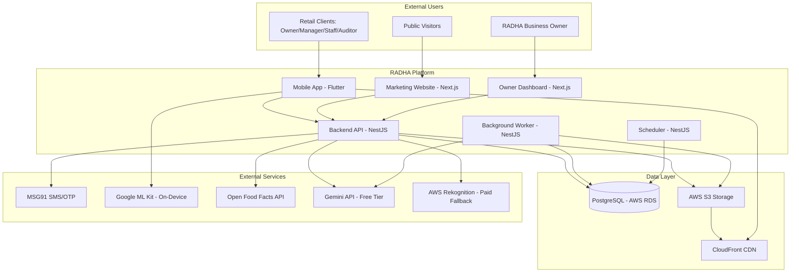
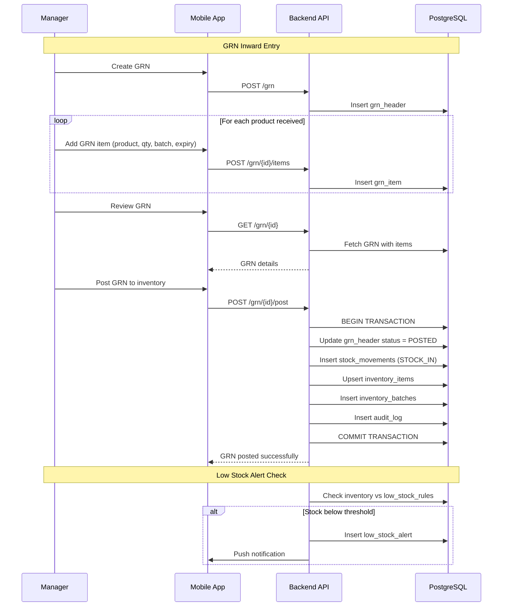
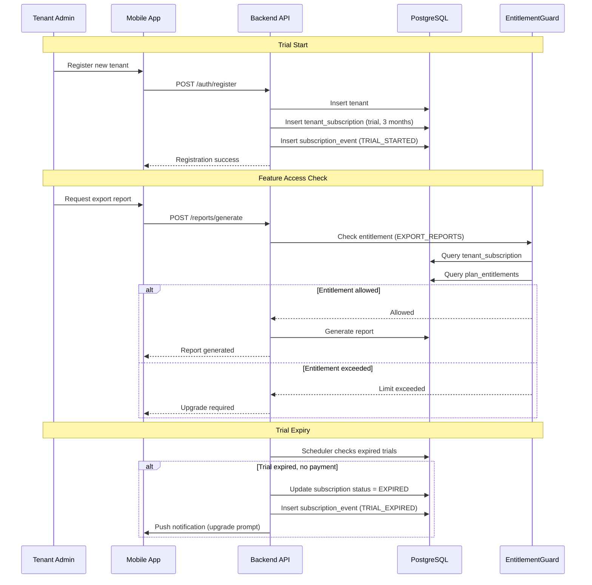

# Design Document: RADHA Platform - Comprehensive Technical Specification

> ⚠️ **VISUAL / DESIGN-SYSTEM NOTE (2026-06-03):** Any palette, typography, or theme guidance in this
> document (e.g. dark-mode-first, near-black `#0E0F12` canvas, saffron `#F08C2C`, **Inter** font) is
> **SUPERSEDED** for the live app. The single source of truth for all UI/visual work is
> **`.kiro/steering/visual-assets.md`** (warm cream `#FFFBF5` canvas, burnt-orange `#EA580C`, Plus
> Jakarta Sans + JetBrains Mono, **light-mode-first**) plus **`CHARACTER_STORYTELLING_BIBLE.md`**. The
> non-visual technical content below (architecture, data model, APIs) may still apply on its own merits.

## Overview

RADHA (Retail Assistant for Data, Health & Audits) is a production-grade retail audit and operations SaaS platform designed for Indian retail teams. The platform provides barcode scanning, product health analysis, expiry tracking, EAN verification, lightweight inventory management, GRN inward processing, task management, and subscription-based access control across mobile and web surfaces.

**Core Value Proposition**: Enable retail store owners, managers, staff, and auditors to conduct operational audits, track product expiry, verify approved display lists, manage lightweight inventory, and generate actionable reports without requiring a full ERP/POS/accounting system.

**Scale Target**: 10,000 users initially with database optimization as critical priority.

**Product Boundary**: RADHA is NOT a GST billing, POS, accounting, or full ERP system. It focuses on operations, audit, scanning, expiry control, display verification, lightweight GRN, and lightweight inventory.

## Architecture

### System Context Diagram



### High-Level Architecture Pattern

**Pattern**: NestJS Modular Monolith with Clean Module Boundaries

**Runtime Entry Points**:
- **API Process**: REST endpoints for mobile and web clients
- **Worker Process**: Imports, OCR, reports, AI summaries, notifications
- **Scheduler Process**: Reminders, metric rollups, cleanup jobs

**Architectural Principles**:
1. **Controllers are transport only** - No business logic in controllers
2. **Services own business logic and transactions** - All business rules in service layer
3. **Repositories own database queries** - Data access abstraction
4. **Integrations hide external providers** - Provider abstraction for SMS, AI, storage
5. **All writes add audit logs** - Complete audit trail for business state changes
6. **Tenant/Store scoping mandatory** - Multi-tenant data isolation enforced at query level
7. **Cursor pagination for all lists** - Scalability for 10,000 users
8. **Free-first AI strategy** - On-device/rules before paid cloud AI


## Main Algorithm/Workflow

### Core User Workflows

```mermaid
sequenceDiagram
    participant Staff as Staff User
    participant Mobile as Mobile App
    participant API as Backend API
    participant DB as PostgreSQL
    participant ML as ML Kit (On-Device)
    participant OFF as Open Food Facts
    
    Note over Staff,OFF: Workflow 1: Product Scan & Health Check
    Staff->>Mobile: Open Scanner
    Mobile->>ML: Scan Barcode
    ML-->>Mobile: EAN Code
    Mobile->>API: GET /products/lookup/{ean}
    API->>DB: Query products by EAN
    alt Product exists in DB
        DB-->>API: Product data
    else Product not found
        API->>OFF: Lookup EAN
        OFF-->>API: Product data
        API->>DB: Cache product
    end
    API->>DB: Calculate health score (rules)
    API-->>Mobile: Product + Health + Nutrition
    Mobile-->>Staff: Display product card with health badge
    
    Note over Staff,OFF: Workflow 2: Expiry Entry with OCR Assist
    Staff->>Mobile: Capture expiry label photo
    Mobile->>ML: OCR Text Recognition
    ML-->>Mobile: Extracted text
    Mobile->>Mobile: Parse dates locally
    Mobile-->>Staff: Suggest MFG/EXP dates
    Staff->>Mobile: Confirm/Edit dates
    Mobile->>API: POST /expiry-records
    API->>DB: Insert expiry_record
    API->>DB: Calculate expiry status (rules)
    API-->>Mobile: Expiry status (green/yellow/red)
    
    Note over Staff,OFF: Workflow 3: EAN Verification Audit
    Staff->>Mobile: Start bulk scan session
    Mobile->>API: POST /scan-sessions
    API->>DB: Create scan_session
    loop For each product
        Staff->>Mobile: Scan EAN
        Mobile->>ML: Scan Barcode
        ML-->>Mobile: EAN Code
        Mobile->>API: POST /scan-sessions/{id}/items
        API->>DB: Check EAN in approved list
        alt EAN approved
            API-->>Mobile: Status: PASS (green)
        else EAN not approved
            API-->>Mobile: Status: FAIL (red)
        end
    end
    Staff->>Mobile: End session
    Mobile->>API: PATCH /scan-sessions/{id}/complete
    API->>DB: Mark session complete
    API-->>Mobile: Session summary
```

### GRN and Inventory Workflow



### Subscription and Entitlement Workflow




## Components and Interfaces

### Product Surfaces

| Surface | User | Platform | Purpose | Key Features |
|---|---|---|---|---|
| RADHA Mobile App | Retail clients: owner, manager, staff, auditor | Flutter (Android/iOS) | Operational work and client in-app dashboard | Scanner, expiry entry, EAN audit, tasks, inventory, GRN, reports, dashboard |
| RADHA Marketing Website | Public visitors and prospects | Next.js | Product marketing, pricing, contact/demo | Landing pages, pricing, Play Store links, privacy/terms, lead capture |
| RADHA Owner Dashboard | RADHA business owner only | Private Next.js web app | SaaS analytics and business intelligence | Website analytics, leads, signups, trials, subscriptions, revenue, usage |
| Backend API + Worker | System | NestJS | Business APIs, imports, reports, subscriptions, analytics | REST API, background jobs, scheduled tasks, AI wrappers |

### Backend Module Architecture

```typescript
// Module Structure Pattern
interface ModuleStructure {
  module: string;           // NestJS module file
  controller: string;       // HTTP transport layer
  service: string;          // Business logic layer
  repository: string;       // Data access layer
  dto: string[];           // Data transfer objects
  entities: string[];      // Database entities
  interfaces: string[];    // Contracts and abstractions
}

// Example: Product Catalog Module
const productCatalogModule: ModuleStructure = {
  module: 'product-catalog.module.ts',
  controller: 'products.controller.ts',
  service: 'products.service.ts',
  repository: 'products.repository.ts',
  dto: [
    'product-lookup.dto.ts',
    'product-create.dto.ts',
    'product-update.dto.ts'
  ],
  entities: [
    'product.entity.ts',
    'product-nutrition.entity.ts',
    'product-health-assessment.entity.ts'
  ],
  interfaces: [
    'product-enrichment-provider.interface.ts'
  ]
};
```

### Core Backend Modules

#### 1. Authentication Module

**Purpose**: OTP login, admin login, session management, token refresh

**Interface**:
```typescript
interface AuthService {
  requestOtp(mobile: string): Promise<OtpRequestResult>;
  verifyOtp(mobile: string, otp: string, requestId: string): Promise<AuthResult>;
  adminLogin(email: string, password: string): Promise<AuthResult>;
  refreshToken(refreshToken: string): Promise<TokenPair>;
  revokeSession(sessionId: string): Promise<void>;
  getCurrentUser(userId: string): Promise<UserWithRoles>;
}

interface OtpRequestResult {
  requestId: string;
  expiresIn: number;
  rateLimitRemaining: number;
}

interface AuthResult {
  accessToken: string;
  refreshToken: string;
  user: UserProfile;
  roles: Role[];
  storeAccess: StoreAccess[];
}

interface TokenPair {
  accessToken: string;
  refreshToken: string;
}
```

**Responsibilities**:
- OTP generation and verification with rate limiting (3 per phone/hour, 10 per IP/hour)
- Admin password authentication with bcrypt
- JWT token generation and validation
- Refresh token rotation
- Session revocation
- User profile retrieval with roles and store access

**Security Considerations**:
- OTP stored as hashed value in database
- Rate limiting enforced at both database and Redis layers
- Refresh tokens rotated on each use
- Session revocation support for security incidents
- Admin passwords hashed with bcrypt (cost factor 12)

#### 2. Authorization Module

**Purpose**: Role-based access control, tenant/store scoping, permission guards

**Interface**:
```typescript
interface AuthorizationService {
  checkPermission(userId: string, permission: Permission, resourceId?: string): Promise<boolean>;
  getUserRoles(userId: string, storeId?: string): Promise<Role[]>;
  enforceStoreAccess(userId: string, storeId: string): Promise<void>;
  enforceTenantAccess(userId: string, tenantId: string): Promise<void>;
}

enum Role {
  SUPER_ADMIN = 'super_admin',
  TENANT_ADMIN = 'tenant_admin',
  MANAGER = 'manager',
  STAFF = 'staff',
  AUDITOR = 'auditor'
}

enum Permission {
  SCAN_PRODUCTS = 'scan_products',
  MANAGE_USERS = 'manage_users',
  IMPORT_EAN_LISTS = 'import_ean_lists',
  GENERATE_REPORTS = 'generate_reports',
  MANAGE_INVENTORY = 'manage_inventory',
  POST_GRN = 'post_grn',
  VIEW_ANALYTICS = 'view_analytics'
}

interface StoreAccess {
  storeId: string;
  storeName: string;
  role: Role;
  permissions: Permission[];
}
```

**Responsibilities**:
- Role-based permission checking
- Tenant/store scoping enforcement
- User-store access validation
- Permission guard decorators for controllers
- Hierarchical role inheritance

#### 3. Product Catalog Module

**Purpose**: Product lookup by EAN, Open Food Facts fallback, manual product creation

**Interface**:
```typescript
interface ProductsService {
  lookupByEan(ean: string, storeId: string): Promise<ProductLookupResult>;
  createProduct(dto: ProductCreateDto, userId: string): Promise<Product>;
  updateProduct(productId: string, dto: ProductUpdateDto, userId: string): Promise<Product>;
  enrichProduct(productId: string): Promise<Product>;
}

interface ProductLookupResult {
  product: Product | null;
  source: 'internal' | 'open_food_facts' | 'manual';
  found: boolean;
  healthAssessment?: HealthAssessment;
  nutrition?: ProductNutrition;
}

interface Product {
  id: string;
  ean: string;
  name: string;
  brand?: string;
  category?: string;
  imageUrl?: string;
  tenantId?: string;
  source: string;
  createdAt: Date;
  updatedAt: Date;
}

interface ProductNutrition {
  productId: string;
  energyKcal?: number;
  protein?: number;
  carbohydrates?: number;
  sugar?: number;
  fat?: number;
  saturatedFat?: number;
  sodium?: number;
  fiber?: number;
  ingredients?: string;
  allergens?: string[];
  nutritionData?: Record<string, any>;
}
```

**Responsibilities**:
- EAN lookup with internal database priority
- Open Food Facts API integration as fallback
- Product caching strategy
- Manual product creation for unlisted items
- Product enrichment workflow
- Tenant-specific product overrides

#### 4. Health Scoring Module

**Purpose**: Rule-based health indicators, child suitability, sugar/oil/processed flags

**Interface**:
```typescript
interface HealthScoreService {
  calculateHealthScore(productId: string): Promise<HealthAssessment>;
  assessChildSuitability(productId: string): Promise<ChildSuitabilityResult>;
  recomputeHealthScores(productIds: string[]): Promise<void>;
}

interface HealthAssessment {
  productId: string;
  overallScore: number; // 0-100
  healthLabel: 'healthy' | 'moderate' | 'unhealthy';
  highSugar: boolean;
  highSalt: boolean;
  highFat: boolean;
  processed: boolean;
  childSuitable: boolean;
  reasons: string[];
  computedAt: Date;
  ruleVersion: string;
}

interface ChildSuitabilityResult {
  suitable: boolean;
  reasons: string[];
  ageRecommendation?: string;
}

// Health scoring rules
interface HealthScoringRules {
  sugarThresholdPer100g: number;      // e.g., 15g
  sodiumThresholdPer100g: number;     // e.g., 500mg
  saturatedFatThresholdPer100g: number; // e.g., 5g
  processedIndicators: string[];      // e.g., ['preservatives', 'artificial colors']
  childUnsafeIngredients: string[];   // e.g., ['caffeine', 'alcohol']
}
```

**Responsibilities**:
- Transparent rule-based health scoring (no black-box AI)
- Child suitability assessment based on ingredients and nutrition
- High sugar/salt/fat flagging
- Processed food detection
- Configurable thresholds per category
- Health score versioning for rule changes


#### 5. EAN List Import and Validation Module

**Purpose**: Excel/CSV upload parsing, validation, approved EAN lookup

**Interface**:
```typescript
interface EanListsService {
  importEanList(file: Buffer, storeId: string, userId: string): Promise<EanImportResult>;
  validateEan(ean: string, storeId: string): Promise<EanValidationResult>;
  getActiveList(storeId: string): Promise<EanList | null>;
  deactivateList(listId: string, userId: string): Promise<void>;
}

interface EanImportResult {
  listId: string;
  totalRows: number;
  validRows: number;
  invalidRows: number;
  errors: EanImportError[];
  status: 'completed' | 'partial' | 'failed';
}

interface EanImportError {
  rowNumber: number;
  ean: string;
  reason: string;
}

interface EanValidationResult {
  ean: string;
  exists: boolean;
  status: 'approved' | 'not_approved';
  matchedItem?: EanListItem;
}

interface EanList {
  id: string;
  storeId: string;
  fileName: string;
  totalItems: number;
  active: boolean;
  version: number;
  uploadedBy: string;
  uploadedAt: Date;
}
```

**Responsibilities**:
- Excel/CSV file parsing with validation
- EAN format validation (EAN-8, EAN-13, UPC-A)
- Duplicate detection within upload
- Import error reporting with row numbers
- Active list versioning per store
- Fast EAN existence check with composite index

#### 6. Scan Sessions and Audit Module

**Purpose**: Bulk scan sessions, scan item writes, EAN pass/fail, audit metadata

**Interface**:
```typescript
interface ScanSessionsService {
  createSession(dto: CreateSessionDto, userId: string): Promise<ScanSession>;
  addScanItem(sessionId: string, dto: AddScanItemDto, userId: string): Promise<ScanItemResult>;
  completeSession(sessionId: string, userId: string): Promise<SessionSummary>;
  getSessionHistory(storeId: string, pagination: CursorPagination): Promise<PaginatedResult<ScanSession>>;
}

interface CreateSessionDto {
  type: 'bulk_scan' | 'expiry_audit' | 'ean_verification';
  storeId: string;
  taskId?: string;
  metadata?: Record<string, any>;
}

interface AddScanItemDto {
  ean: string;
  productId?: string;
  scannedAt: Date;
  location?: string;
  notes?: string;
}

interface ScanItemResult {
  scanItem: ScanItem;
  eanStatus: 'pass' | 'fail' | 'unknown';
  isDuplicate: boolean;
  product?: Product;
  expiryStatus?: ExpiryStatus;
}

interface SessionSummary {
  sessionId: string;
  totalScans: number;
  uniqueProducts: number;
  eanPassCount: number;
  eanFailCount: number;
  duplicateCount: number;
  duration: number; // seconds
  completedAt: Date;
}
```

**Responsibilities**:
- Scan session lifecycle management
- Real-time scan item recording
- Duplicate scan detection within session
- EAN validation against approved lists
- Session summary generation
- Audit trail for all scans

#### 7. Expiry Tracking Module

**Purpose**: MFG/EXP dates, status calculation, category thresholds, near-expiry queries

**Interface**:
```typescript
interface ExpiryService {
  createExpiryRecord(dto: CreateExpiryRecordDto, userId: string): Promise<ExpiryRecord>;
  calculateExpiryStatus(expiryDate: Date, category: string): ExpiryStatus;
  getNearExpiryItems(storeId: string, daysThreshold: number): Promise<ExpiryRecord[]>;
  getExpiredItems(storeId: string): Promise<ExpiryRecord[]>;
  updateCategoryThresholds(category: string, thresholds: ExpiryThresholds): Promise<void>;
}

interface CreateExpiryRecordDto {
  productId: string;
  storeId: string;
  scanItemId?: string;
  manufacturingDate?: Date;
  expiryDate: Date;
  batchNumber?: string;
  quantity?: number;
  location?: string;
  ocrConfidence?: number;
  confirmedByUser: boolean;
}

interface ExpiryRecord {
  id: string;
  productId: string;
  storeId: string;
  manufacturingDate?: Date;
  expiryDate: Date;
  batchNumber?: string;
  status: ExpiryStatus;
  daysUntilExpiry: number;
  createdBy: string;
  createdAt: Date;
}

enum ExpiryStatus {
  SAFE = 'safe',           // > threshold days
  NEAR_EXPIRY = 'near_expiry', // <= threshold days
  EXPIRED = 'expired'      // past expiry date
}

interface ExpiryThresholds {
  category: string;
  nearExpiryDays: number;  // e.g., 30 days for food, 90 days for pharmacy
  criticalDays: number;    // e.g., 7 days
}
```

**Responsibilities**:
- Expiry record creation with OCR confidence tracking
- Dynamic expiry status calculation based on category thresholds
- Near-expiry and expired item queries with efficient indexing
- Category-specific threshold management
- Batch-level expiry tracking
- User confirmation requirement for OCR-suggested dates

#### 8. Task Assignment Module

**Purpose**: Task CRUD, assignment, due dates, status transitions, completion rules

**Interface**:
```typescript
interface TasksService {
  createTask(dto: CreateTaskDto, createdBy: string): Promise<Task>;
  assignTask(taskId: string, assignedTo: string, assignedBy: string): Promise<Task>;
  updateTaskStatus(taskId: string, status: TaskStatus, userId: string): Promise<Task>;
  completeTask(taskId: string, dto: CompleteTaskDto, userId: string): Promise<Task>;
  getMyTasks(userId: string, filters: TaskFilters): Promise<PaginatedResult<Task>>;
}

interface CreateTaskDto {
  title: string;
  description: string;
  type: TaskType;
  storeId: string;
  assignedTo?: string;
  dueDate?: Date;
  priority: TaskPriority;
  requiresEvidence: boolean;
  metadata?: Record<string, any>;
}

interface CompleteTaskDto {
  notes?: string;
  evidenceUrls?: string[];
  scanSessionId?: string;
}

enum TaskType {
  EAN_AUDIT = 'ean_audit',
  EXPIRY_CHECK = 'expiry_check',
  INVENTORY_COUNT = 'inventory_count',
  DISPLAY_VERIFICATION = 'display_verification',
  CUSTOM = 'custom'
}

enum TaskStatus {
  PENDING = 'pending',
  IN_PROGRESS = 'in_progress',
  COMPLETED = 'completed',
  CANCELLED = 'cancelled',
  OVERDUE = 'overdue'
}

enum TaskPriority {
  LOW = 'low',
  MEDIUM = 'medium',
  HIGH = 'high',
  URGENT = 'urgent'
}

interface Task {
  id: string;
  title: string;
  description: string;
  type: TaskType;
  storeId: string;
  assignedTo?: string;
  createdBy: string;
  status: TaskStatus;
  priority: TaskPriority;
  dueDate?: Date;
  completedAt?: Date;
  requiresEvidence: boolean;
  evidenceUrls: string[];
  createdAt: Date;
  updatedAt: Date;
}
```

**Responsibilities**:
- Task lifecycle management (create, assign, update, complete, cancel)
- Status transition validation
- Due date tracking and overdue detection
- Evidence requirement enforcement
- Task-scan session linking
- Task event audit trail
- Manager and staff task views


#### 9. Inventory Management Module

**Purpose**: Lightweight stock in/out, counts, low-stock alerts, batch/expiry-aware

**Interface**:
```typescript
interface InventoryService {
  stockIn(dto: StockInDto, userId: string): Promise<StockMovementResult>;
  stockOut(dto: StockOutDto, userId: string): Promise<StockMovementResult>;
  getInventoryCounts(storeId: string, filters: InventoryFilters): Promise<PaginatedResult<InventoryItem>>;
  getLowStockAlerts(storeId: string): Promise<LowStockAlert[]>;
  upsertLowStockRule(dto: LowStockRuleDto, userId: string): Promise<LowStockRule>;
}

interface StockInDto {
  productId: string;
  storeId: string;
  quantity: number;
  batchNumber?: string;
  expiryDate?: Date;
  reason: StockInReason;
  grnId?: string;
  notes?: string;
}

interface StockOutDto {
  productId: string;
  storeId: string;
  quantity: number;
  batchNumber?: string;
  reason: StockOutReason;
  notes?: string;
}

enum StockInReason {
  GRN = 'grn',
  MANUAL_ADJUSTMENT = 'manual_adjustment',
  RETURN = 'return',
  CORRECTION = 'correction'
}

enum StockOutReason {
  EXPIRED = 'expired',
  DAMAGED = 'damaged',
  REMOVED = 'removed',
  CORRECTION = 'correction',
  MANUAL_ADJUSTMENT = 'manual_adjustment'
}

interface StockMovementResult {
  movement: StockMovement;
  inventoryItem: InventoryItem;
  lowStockTriggered: boolean;
}

interface InventoryItem {
  id: string;
  productId: string;
  storeId: string;
  currentStock: number;
  batches: InventoryBatch[];
  lowStockThreshold?: number;
  lastMovementAt: Date;
  createdAt: Date;
  updatedAt: Date;
}

interface InventoryBatch {
  id: string;
  inventoryItemId: string;
  batchNumber: string;
  quantity: number;
  expiryDate?: Date;
  receivedDate: Date;
}

interface LowStockAlert {
  id: string;
  inventoryItemId: string;
  productId: string;
  storeId: string;
  currentStock: number;
  threshold: number;
  status: 'active' | 'resolved';
  createdAt: Date;
}
```

**Responsibilities**:
- Stock in/out transaction recording
- Batch-level inventory tracking
- Expiry-aware batch management (FEFO - First Expiry First Out)
- Low-stock threshold monitoring
- Automatic low-stock alert generation
- Category-level stock visibility
- No sales ledger, GST, or POS integration (out of scope)

#### 10. GRN (Goods Receipt Note) Module

**Purpose**: Supplier entry, invoice, quantity, batch, expiry capture, stock posting

**Interface**:
```typescript
interface GrnService {
  createGrn(dto: CreateGrnDto, userId: string): Promise<Grn>;
  addGrnItems(grnId: string, items: GrnItemDto[], userId: string): Promise<GrnItem[]>;
  postGrn(grnId: string, userId: string): Promise<GrnPostResult>;
  getGrnList(storeId: string, filters: GrnFilters): Promise<PaginatedResult<Grn>>;
  getGrnDetails(grnId: string): Promise<GrnWithItems>;
}

interface CreateGrnDto {
  storeId: string;
  supplierId: string;
  invoiceNumber: string;
  invoiceDate: Date;
  expectedDeliveryDate?: Date;
  notes?: string;
}

interface GrnItemDto {
  productId: string;
  quantity: number;
  batchNumber?: string;
  manufacturingDate?: Date;
  expiryDate?: Date;
  unitPrice?: number;
  notes?: string;
}

interface Grn {
  id: string;
  storeId: string;
  supplierId: string;
  invoiceNumber: string;
  invoiceDate: Date;
  status: GrnStatus;
  totalItems: number;
  totalQuantity: number;
  createdBy: string;
  postedBy?: string;
  postedAt?: Date;
  createdAt: Date;
  updatedAt: Date;
}

enum GrnStatus {
  DRAFT = 'draft',
  PENDING_REVIEW = 'pending_review',
  POSTED = 'posted',
  CANCELLED = 'cancelled'
}

interface GrnPostResult {
  grn: Grn;
  stockMovements: StockMovement[];
  inventoryUpdates: InventoryItem[];
  lowStockAlertsResolved: number;
}

interface GrnWithItems {
  grn: Grn;
  items: GrnItem[];
  supplier: Supplier;
}
```

**Responsibilities**:
- GRN header and item entry
- Supplier and invoice tracking
- Batch and expiry capture at inward
- GRN review workflow (draft → pending → posted)
- Atomic GRN posting with stock movements
- Inventory update on GRN post
- Low-stock alert resolution on inward
- Vendor accountability for short-shelf-life stock

#### 11. Subscription and Entitlement Module

**Purpose**: 3-month free trial, ₹49/₹99/₹199 plans, feature limits, subscription state

**Interface**:
```typescript
interface SubscriptionService {
  getSubscriptionStatus(tenantId: string): Promise<SubscriptionStatus>;
  checkEntitlement(tenantId: string, feature: Feature): Promise<EntitlementCheckResult>;
  recordSubscriptionEvent(dto: SubscriptionEventDto): Promise<void>;
  getActivePlan(tenantId: string): Promise<SubscriptionPlan | null>;
}

interface SubscriptionStatus {
  tenantId: string;
  plan: PlanType;
  status: SubscriptionState;
  trialEndsAt?: Date;
  currentPeriodStart: Date;
  currentPeriodEnd: Date;
  entitlements: Entitlement[];
  limits: FeatureLimits;
}

enum PlanType {
  FREE_TRIAL = 'free_trial',
  BASIC = 'basic',        // ₹49/month
  STANDARD = 'standard',  // ₹99/month
  PREMIUM = 'premium'     // ₹199/month
}

enum SubscriptionState {
  TRIAL = 'trial',
  ACTIVE = 'active',
  EXPIRED = 'expired',
  CANCELLED = 'cancelled',
  SUSPENDED = 'suspended'
}

enum Feature {
  SCAN_PRODUCTS = 'scan_products',
  EXPIRY_TRACKING = 'expiry_tracking',
  EAN_VERIFICATION = 'ean_verification',
  TASK_MANAGEMENT = 'task_management',
  BASIC_REPORTS = 'basic_reports',
  ADVANCED_REPORTS = 'advanced_reports',
  INVENTORY_MANAGEMENT = 'inventory_management',
  GRN_INWARD = 'grn_inward',
  AI_REPORT_SUMMARY = 'ai_report_summary',
  MULTI_STORE = 'multi_store',
  UNLIMITED_USERS = 'unlimited_users'
}

interface EntitlementCheckResult {
  allowed: boolean;
  reason?: string;
  currentUsage?: number;
  limit?: number;
}

interface FeatureLimits {
  maxUsers: number;
  maxStores: number;
  maxScansPerMonth: number;
  maxReportsPerMonth: number;
  maxAiCallsPerMonth: number;
  advancedReportsEnabled: boolean;
  inventoryEnabled: boolean;
  grnEnabled: boolean;
}

// Plan definitions
const PLAN_DEFINITIONS: Record<PlanType, FeatureLimits> = {
  [PlanType.FREE_TRIAL]: {
    maxUsers: 5,
    maxStores: 1,
    maxScansPerMonth: 1000,
    maxReportsPerMonth: 10,
    maxAiCallsPerMonth: 50,
    advancedReportsEnabled: true,
    inventoryEnabled: true,
    grnEnabled: true
  },
  [PlanType.BASIC]: {
    maxUsers: 3,
    maxStores: 1,
    maxScansPerMonth: 500,
    maxReportsPerMonth: 5,
    maxAiCallsPerMonth: 20,
    advancedReportsEnabled: false,
    inventoryEnabled: false,
    grnEnabled: false
  },
  [PlanType.STANDARD]: {
    maxUsers: 10,
    maxStores: 3,
    maxScansPerMonth: 5000,
    maxReportsPerMonth: 20,
    maxAiCallsPerMonth: 100,
    advancedReportsEnabled: true,
    inventoryEnabled: true,
    grnEnabled: true
  },
  [PlanType.PREMIUM]: {
    maxUsers: -1, // unlimited
    maxStores: -1, // unlimited
    maxScansPerMonth: -1, // unlimited
    maxReportsPerMonth: -1, // unlimited
    maxAiCallsPerMonth: 500,
    advancedReportsEnabled: true,
    inventoryEnabled: true,
    grnEnabled: true
  }
};
```

**Responsibilities**:
- Subscription lifecycle management
- Trial period tracking (3 months)
- Plan-based entitlement enforcement
- Feature limit checking before operations
- Usage tracking for metered features
- Subscription event recording (trial start, upgrade, downgrade, cancel)
- Entitlement guard decorator for protected endpoints


#### 12. Reports and Export Module

**Purpose**: Report generation, Excel/PDF exports, report file storage, summary API

**Interface**:
```typescript
interface ReportsService {
  generateReport(dto: GenerateReportDto, userId: string): Promise<Report>;
  getReportDownloadUrl(reportId: string, format: 'xlsx' | 'pdf'): Promise<string>;
  getReportHistory(storeId: string, pagination: CursorPagination): Promise<PaginatedResult<Report>>;
  scheduleReport(dto: ScheduleReportDto, userId: string): Promise<ScheduledReport>;
}

interface GenerateReportDto {
  type: ReportType;
  storeId: string;
  dateRange: DateRange;
  filters?: ReportFilters;
  format: 'xlsx' | 'pdf';
  includeAiSummary: boolean;
}

enum ReportType {
  SCAN_AUDIT = 'scan_audit',
  EXPIRY_SUMMARY = 'expiry_summary',
  EAN_VERIFICATION = 'ean_verification',
  TASK_COMPLETION = 'task_completion',
  INVENTORY_SNAPSHOT = 'inventory_snapshot',
  GRN_SUMMARY = 'grn_summary',
  LOW_STOCK = 'low_stock',
  DASHBOARD_SUMMARY = 'dashboard_summary'
}

interface Report {
  id: string;
  type: ReportType;
  storeId: string;
  dateRange: DateRange;
  status: ReportStatus;
  format: 'xlsx' | 'pdf';
  fileUrl?: string;
  aiSummary?: string;
  generatedBy: string;
  generatedAt: Date;
  expiresAt: Date;
}

enum ReportStatus {
  PENDING = 'pending',
  GENERATING = 'generating',
  READY = 'ready',
  FAILED = 'failed',
  EXPIRED = 'expired'
}
```

**Responsibilities**:
- Async report generation via worker queue
- Excel and PDF export support
- Report file persistence in S3
- Presigned URL generation with TTL
- Report history with cursor pagination
- AI summary generation (optional, paid feature)
- Scheduled report support
- Report expiration and cleanup

#### 13. Owner Analytics Module

**Purpose**: Track website visitors, leads, signups, trials, subscriptions, revenue, usage

**Interface**:
```typescript
interface OwnerAnalyticsService {
  getDashboardSummary(dateRange: DateRange): Promise<OwnerDashboardSummary>;
  getWebsiteAnalytics(dateRange: DateRange): Promise<WebsiteAnalytics>;
  getLeads(filters: LeadFilters): Promise<PaginatedResult<Lead>>;
  getUserAnalytics(filters: UserFilters): Promise<UserAnalytics>;
  getSubscriptionAnalytics(dateRange: DateRange): Promise<SubscriptionAnalytics>;
  getUsageAnalytics(dateRange: DateRange): Promise<UsageAnalytics>;
  recordWebsiteEvent(dto: WebsiteEventDto): Promise<void>;
  recordAppUsageEvent(dto: AppUsageEventDto): Promise<void>;
}

interface OwnerDashboardSummary {
  websiteVisitors: number;
  totalLeads: number;
  appRegistrations: number;
  activeUsers: number;
  trialUsers: number;
  paidUsers: number;
  monthlyRecurringRevenue: number;
  planBreakdown: PlanBreakdown;
  topFeatureUsage: FeatureUsage[];
  recentActivity: ActivityEvent[];
}

interface WebsiteAnalytics {
  pageViews: number;
  uniqueVisitors: number;
  pricingPageViews: number;
  contactClicks: number;
  whatsappClicks: number;
  appDownloadClicks: number;
  topSources: TrafficSource[];
  conversionRate: number;
}

interface SubscriptionAnalytics {
  totalSubscriptions: number;
  activeSubscriptions: number;
  trialSubscriptions: number;
  expiredTrials: number;
  cancelledSubscriptions: number;
  planBreakdown: PlanBreakdown;
  monthlyRecurringRevenue: number;
  averageRevenuePerUser: number;
  churnRate: number;
}

interface UsageAnalytics {
  totalScans: number;
  totalExpiryRecords: number;
  totalEanValidations: number;
  totalInventoryEvents: number;
  totalGrns: number;
  totalReports: number;
  aiCallsCount: number;
  estimatedAiCost: number;
}

interface PlanBreakdown {
  basic: number;
  standard: number;
  premium: number;
}
```

**Responsibilities**:
- Website event tracking (page views, clicks, sources)
- Lead capture and management
- App registration and login tracking
- Trial and paid user analytics
- Subscription lifecycle analytics
- Feature usage tracking
- Revenue and MRR calculation
- AI usage and cost monitoring
- Churn rate calculation

#### 14. AI and OCR Module

**Purpose**: Free-first OCR, product enrichment, report summaries, abstracted AI providers

**Interface**:
```typescript
interface AiService {
  extractExpiryDates(imageUrl: string): Promise<ExpiryExtractionResult>;
  extractNutritionLabel(imageUrl: string): Promise<NutritionExtractionResult>;
  generateReportSummary(reportId: string): Promise<string>;
  enrichProductData(productId: string): Promise<ProductEnrichmentResult>;
}

interface ExpiryExtractionResult {
  manufacturingDate?: Date;
  expiryDate?: Date;
  batchNumber?: string;
  confidence: number;
  rawText: string;
  requiresConfirmation: boolean;
}

interface NutritionExtractionResult {
  nutrition: Partial<ProductNutrition>;
  ingredients?: string;
  allergens?: string[];
  confidence: number;
  requiresReview: boolean;
}

// AI Provider Abstraction
interface AiProvider {
  name: string;
  extractText(imageUrl: string): Promise<string>;
  structureData(text: string, schema: any): Promise<any>;
  generateSummary(text: string, context: string): Promise<string>;
  estimateCost(operation: string, tokens: number): number;
}

// Provider implementations
class GeminiProvider implements AiProvider {
  // Gemini API free tier implementation
}

class RuleEngineProvider implements AiProvider {
  // Deterministic rule-based "AI" for free operations
}

class GemmaLocalProvider implements AiProvider {
  // Future: On-device Gemma 4 integration
}
```

**Responsibilities**:
- On-device OCR via ML Kit (mobile)
- Server-side OCR for complex cases
- LLM-based text structuring (Gemini free tier)
- Report summary generation
- Product data enrichment
- AI provider abstraction for easy switching
- Cost tracking and optimization
- Confidence scoring for all AI outputs
- Human confirmation requirement for critical data


## Data Models

### Core Database Schema

#### Identity and Access Tables

```sql
-- users: Core user identity
CREATE TABLE users (
  id UUID PRIMARY KEY DEFAULT gen_random_uuid(),
  tenant_id UUID REFERENCES tenants(id),
  mobile VARCHAR(15) UNIQUE NOT NULL,
  email VARCHAR(255),
  full_name VARCHAR(255),
  role VARCHAR(50) NOT NULL, -- super_admin, tenant_admin, manager, staff, auditor
  password_hash VARCHAR(255), -- for admin users only
  is_active BOOLEAN DEFAULT true,
  last_login_at TIMESTAMPTZ,
  created_at TIMESTAMPTZ DEFAULT NOW(),
  updated_at TIMESTAMPTZ DEFAULT NOW(),
  deleted_at TIMESTAMPTZ
);

CREATE INDEX idx_users_tenant_role ON users(tenant_id, role) WHERE deleted_at IS NULL;
CREATE UNIQUE INDEX uniq_users_mobile ON users(mobile) WHERE deleted_at IS NULL;

-- user_sessions: JWT refresh tokens
CREATE TABLE user_sessions (
  id UUID PRIMARY KEY DEFAULT gen_random_uuid(),
  user_id UUID NOT NULL REFERENCES users(id),
  refresh_token_hash VARCHAR(255) NOT NULL,
  device_info JSONB,
  ip_address INET,
  expires_at TIMESTAMPTZ NOT NULL,
  revoked_at TIMESTAMPTZ,
  created_at TIMESTAMPTZ DEFAULT NOW()
);

CREATE INDEX idx_sessions_user_active ON user_sessions(user_id, expires_at) 
  WHERE revoked_at IS NULL;

-- otp_attempts: OTP verification with rate limiting
CREATE TABLE otp_attempts (
  id UUID PRIMARY KEY DEFAULT gen_random_uuid(),
  mobile VARCHAR(15) NOT NULL,
  otp_hash VARCHAR(255) NOT NULL,
  request_id UUID NOT NULL,
  verified BOOLEAN DEFAULT false,
  attempts INT DEFAULT 0,
  expires_at TIMESTAMPTZ NOT NULL,
  created_at TIMESTAMPTZ DEFAULT NOW()
);

CREATE INDEX idx_otp_mobile_created ON otp_attempts(mobile, created_at DESC);
CREATE INDEX idx_otp_request_id ON otp_attempts(request_id);
```

#### Tenant and Store Tables

```sql
-- tenants: Multi-tenant isolation
CREATE TABLE tenants (
  id UUID PRIMARY KEY DEFAULT gen_random_uuid(),
  name VARCHAR(255) NOT NULL,
  status VARCHAR(50) DEFAULT 'active', -- active, suspended, cancelled
  settings JSONB DEFAULT '{}',
  created_at TIMESTAMPTZ DEFAULT NOW(),
  updated_at TIMESTAMPTZ DEFAULT NOW()
);

CREATE INDEX idx_tenants_status ON tenants(status);

-- stores: Physical retail locations
CREATE TABLE stores (
  id UUID PRIMARY KEY DEFAULT gen_random_uuid(),
  tenant_id UUID NOT NULL REFERENCES tenants(id),
  name VARCHAR(255) NOT NULL,
  code VARCHAR(50),
  address TEXT,
  city VARCHAR(100),
  state VARCHAR(100),
  pincode VARCHAR(10),
  contact_mobile VARCHAR(15),
  is_active BOOLEAN DEFAULT true,
  created_at TIMESTAMPTZ DEFAULT NOW(),
  updated_at TIMESTAMPTZ DEFAULT NOW()
);

CREATE INDEX idx_stores_tenant_city ON stores(tenant_id, city) WHERE is_active = true;

-- user_store_access: User-store role mapping
CREATE TABLE user_store_access (
  id UUID PRIMARY KEY DEFAULT gen_random_uuid(),
  user_id UUID NOT NULL REFERENCES users(id),
  store_id UUID NOT NULL REFERENCES stores(id),
  role VARCHAR(50) NOT NULL,
  granted_by UUID REFERENCES users(id),
  granted_at TIMESTAMPTZ DEFAULT NOW(),
  UNIQUE(user_id, store_id)
);

CREATE INDEX idx_user_store_access_user ON user_store_access(user_id);
CREATE INDEX idx_user_store_access_store ON user_store_access(store_id);
```

#### Product Catalog Tables

```sql
-- products: Product master data
CREATE TABLE products (
  id UUID PRIMARY KEY DEFAULT gen_random_uuid(),
  ean VARCHAR(20) NOT NULL,
  name VARCHAR(500) NOT NULL,
  brand VARCHAR(255),
  category VARCHAR(100),
  subcategory VARCHAR(100),
  image_url TEXT,
  tenant_id UUID REFERENCES tenants(id), -- NULL for global products
  source VARCHAR(50) NOT NULL, -- internal, open_food_facts, manual
  source_metadata JSONB,
  is_active BOOLEAN DEFAULT true,
  created_at TIMESTAMPTZ DEFAULT NOW(),
  updated_at TIMESTAMPTZ DEFAULT NOW()
);

CREATE UNIQUE INDEX uniq_products_ean ON products(ean) WHERE tenant_id IS NULL;
CREATE UNIQUE INDEX uniq_products_tenant_ean ON products(tenant_id, ean) 
  WHERE tenant_id IS NOT NULL;
CREATE INDEX idx_products_brand_category ON products(brand, category) 
  WHERE is_active = true;

-- product_nutrition: Nutrition facts
CREATE TABLE product_nutrition (
  id UUID PRIMARY KEY DEFAULT gen_random_uuid(),
  product_id UUID NOT NULL REFERENCES products(id),
  energy_kcal DECIMAL(10,2),
  protein DECIMAL(10,2),
  carbohydrates DECIMAL(10,2),
  sugar DECIMAL(10,2),
  fat DECIMAL(10,2),
  saturated_fat DECIMAL(10,2),
  sodium DECIMAL(10,2),
  fiber DECIMAL(10,2),
  ingredients TEXT,
  allergens TEXT[],
  nutrition_data JSONB, -- flexible storage for additional fields
  source VARCHAR(50),
  confidence DECIMAL(3,2),
  created_at TIMESTAMPTZ DEFAULT NOW(),
  updated_at TIMESTAMPTZ DEFAULT NOW()
);

CREATE INDEX idx_nutrition_product ON product_nutrition(product_id);

-- product_health_assessments: Health scoring results
CREATE TABLE product_health_assessments (
  id UUID PRIMARY KEY DEFAULT gen_random_uuid(),
  product_id UUID NOT NULL REFERENCES products(id),
  overall_score INT CHECK (overall_score BETWEEN 0 AND 100),
  health_label VARCHAR(50), -- healthy, moderate, unhealthy
  high_sugar BOOLEAN DEFAULT false,
  high_salt BOOLEAN DEFAULT false,
  high_fat BOOLEAN DEFAULT false,
  processed BOOLEAN DEFAULT false,
  child_suitable BOOLEAN DEFAULT true,
  reasons TEXT[],
  rule_version VARCHAR(20),
  computed_at TIMESTAMPTZ DEFAULT NOW(),
  UNIQUE(product_id)
);

CREATE INDEX idx_health_product ON product_health_assessments(product_id);
CREATE INDEX idx_health_label ON product_health_assessments(health_label);
```

#### EAN Verification Tables

```sql
-- ean_lists: Approved EAN list uploads
CREATE TABLE ean_lists (
  id UUID PRIMARY KEY DEFAULT gen_random_uuid(),
  store_id UUID NOT NULL REFERENCES stores(id),
  file_name VARCHAR(255) NOT NULL,
  total_items INT NOT NULL,
  active BOOLEAN DEFAULT true,
  version INT DEFAULT 1,
  uploaded_by UUID NOT NULL REFERENCES users(id),
  uploaded_at TIMESTAMPTZ DEFAULT NOW()
);

CREATE INDEX idx_ean_lists_store_active ON ean_lists(store_id, active);

-- ean_list_items: Individual EAN entries
CREATE TABLE ean_list_items (
  id UUID PRIMARY KEY DEFAULT gen_random_uuid(),
  list_id UUID NOT NULL REFERENCES ean_lists(id) ON DELETE CASCADE,
  ean VARCHAR(20) NOT NULL,
  product_name VARCHAR(500),
  notes TEXT,
  created_at TIMESTAMPTZ DEFAULT NOW(),
  UNIQUE(list_id, ean)
);

CREATE INDEX idx_ean_items_list_ean ON ean_list_items(list_id, ean);

-- ean_import_errors: Import validation errors
CREATE TABLE ean_import_errors (
  id UUID PRIMARY KEY DEFAULT gen_random_uuid(),
  list_id UUID NOT NULL REFERENCES ean_lists(id) ON DELETE CASCADE,
  row_number INT NOT NULL,
  ean VARCHAR(20),
  reason TEXT NOT NULL,
  created_at TIMESTAMPTZ DEFAULT NOW()
);

CREATE INDEX idx_import_errors_list ON ean_import_errors(list_id);
```

#### Scan and Audit Tables

```sql
-- scan_sessions: Bulk scan audit sessions
CREATE TABLE scan_sessions (
  id UUID PRIMARY KEY DEFAULT gen_random_uuid(),
  type VARCHAR(50) NOT NULL, -- bulk_scan, expiry_audit, ean_verification
  store_id UUID NOT NULL REFERENCES stores(id),
  task_id UUID REFERENCES tasks(id),
  started_by UUID NOT NULL REFERENCES users(id),
  status VARCHAR(50) DEFAULT 'in_progress', -- in_progress, completed, cancelled
  total_scans INT DEFAULT 0,
  unique_products INT DEFAULT 0,
  started_at TIMESTAMPTZ DEFAULT NOW(),
  completed_at TIMESTAMPTZ,
  metadata JSONB
);

CREATE INDEX idx_scan_sessions_store_created ON scan_sessions(store_id, started_at DESC);
CREATE INDEX idx_scan_sessions_task ON scan_sessions(task_id);

-- scan_items: Individual scan records
CREATE TABLE scan_items (
  id UUID PRIMARY KEY DEFAULT gen_random_uuid(),
  session_id UUID NOT NULL REFERENCES scan_sessions(id),
  product_id UUID REFERENCES products(id),
  ean VARCHAR(20) NOT NULL,
  ean_status VARCHAR(50), -- pass, fail, unknown
  is_duplicate BOOLEAN DEFAULT false,
  location VARCHAR(255),
  notes TEXT,
  scanned_by UUID NOT NULL REFERENCES users(id),
  scanned_at TIMESTAMPTZ DEFAULT NOW()
);

CREATE INDEX idx_scan_items_session ON scan_items(session_id, scanned_at);
CREATE INDEX idx_scan_items_store_created ON scan_items(
  (SELECT store_id FROM scan_sessions WHERE id = session_id),
  scanned_at DESC
);
```

#### Expiry Tracking Tables

```sql
-- expiry_records: Product expiry tracking
CREATE TABLE expiry_records (
  id UUID PRIMARY KEY DEFAULT gen_random_uuid(),
  product_id UUID NOT NULL REFERENCES products(id),
  store_id UUID NOT NULL REFERENCES stores(id),
  scan_item_id UUID REFERENCES scan_items(id),
  manufacturing_date DATE,
  expiry_date DATE NOT NULL,
  batch_number VARCHAR(100),
  quantity INT,
  location VARCHAR(255),
  status VARCHAR(50) NOT NULL, -- safe, near_expiry, expired
  days_until_expiry INT,
  ocr_confidence DECIMAL(3,2),
  confirmed_by_user BOOLEAN DEFAULT false,
  created_by UUID NOT NULL REFERENCES users(id),
  created_at TIMESTAMPTZ DEFAULT NOW(),
  updated_at TIMESTAMPTZ DEFAULT NOW()
);

CREATE INDEX idx_expiry_store_status_date ON expiry_records(
  store_id, status, expiry_date
) WHERE status IN ('near_expiry', 'expired');
CREATE INDEX idx_expiry_product ON expiry_records(product_id, expiry_date DESC);

-- expiry_thresholds: Category-specific thresholds
CREATE TABLE expiry_thresholds (
  id UUID PRIMARY KEY DEFAULT gen_random_uuid(),
  category VARCHAR(100) NOT NULL,
  near_expiry_days INT NOT NULL,
  critical_days INT NOT NULL,
  created_at TIMESTAMPTZ DEFAULT NOW(),
  updated_at TIMESTAMPTZ DEFAULT NOW(),
  UNIQUE(category)
);
```


#### Inventory and GRN Tables

```sql
-- suppliers: Supplier master
CREATE TABLE suppliers (
  id UUID PRIMARY KEY DEFAULT gen_random_uuid(),
  tenant_id UUID NOT NULL REFERENCES tenants(id),
  name VARCHAR(255) NOT NULL,
  code VARCHAR(50),
  contact_person VARCHAR(255),
  mobile VARCHAR(15),
  email VARCHAR(255),
  address TEXT,
  is_active BOOLEAN DEFAULT true,
  created_at TIMESTAMPTZ DEFAULT NOW(),
  updated_at TIMESTAMPTZ DEFAULT NOW()
);

CREATE INDEX idx_suppliers_tenant ON suppliers(tenant_id) WHERE is_active = true;

-- grn_headers: Goods Receipt Note headers
CREATE TABLE grn_headers (
  id UUID PRIMARY KEY DEFAULT gen_random_uuid(),
  store_id UUID NOT NULL REFERENCES stores(id),
  supplier_id UUID NOT NULL REFERENCES suppliers(id),
  invoice_number VARCHAR(100) NOT NULL,
  invoice_date DATE NOT NULL,
  status VARCHAR(50) DEFAULT 'draft', -- draft, pending_review, posted, cancelled
  total_items INT DEFAULT 0,
  total_quantity INT DEFAULT 0,
  created_by UUID NOT NULL REFERENCES users(id),
  posted_by UUID REFERENCES users(id),
  posted_at TIMESTAMPTZ,
  created_at TIMESTAMPTZ DEFAULT NOW(),
  updated_at TIMESTAMPTZ DEFAULT NOW()
);

CREATE INDEX idx_grn_store_status ON grn_headers(store_id, status, created_at DESC);
CREATE INDEX idx_grn_supplier ON grn_headers(supplier_id, created_at DESC);

-- grn_items: GRN line items
CREATE TABLE grn_items (
  id UUID PRIMARY KEY DEFAULT gen_random_uuid(),
  grn_id UUID NOT NULL REFERENCES grn_headers(id) ON DELETE CASCADE,
  product_id UUID NOT NULL REFERENCES products(id),
  quantity INT NOT NULL CHECK (quantity > 0),
  batch_number VARCHAR(100),
  manufacturing_date DATE,
  expiry_date DATE,
  unit_price DECIMAL(10,2),
  notes TEXT,
  created_at TIMESTAMPTZ DEFAULT NOW()
);

CREATE INDEX idx_grn_items_grn ON grn_items(grn_id);
CREATE INDEX idx_grn_items_product ON grn_items(product_id);

-- inventory_items: Current stock levels
CREATE TABLE inventory_items (
  id UUID PRIMARY KEY DEFAULT gen_random_uuid(),
  product_id UUID NOT NULL REFERENCES products(id),
  store_id UUID NOT NULL REFERENCES stores(id),
  current_stock INT DEFAULT 0 CHECK (current_stock >= 0),
  low_stock_threshold INT,
  last_movement_at TIMESTAMPTZ,
  created_at TIMESTAMPTZ DEFAULT NOW(),
  updated_at TIMESTAMPTZ DEFAULT NOW(),
  UNIQUE(product_id, store_id)
);

CREATE INDEX idx_inventory_store_product ON inventory_items(store_id, product_id);
CREATE INDEX idx_inventory_low_stock ON inventory_items(store_id) 
  WHERE current_stock <= low_stock_threshold;

-- inventory_batches: Batch-level tracking
CREATE TABLE inventory_batches (
  id UUID PRIMARY KEY DEFAULT gen_random_uuid(),
  inventory_item_id UUID NOT NULL REFERENCES inventory_items(id),
  batch_number VARCHAR(100) NOT NULL,
  quantity INT NOT NULL CHECK (quantity >= 0),
  expiry_date DATE,
  received_date DATE NOT NULL,
  created_at TIMESTAMPTZ DEFAULT NOW(),
  updated_at TIMESTAMPTZ DEFAULT NOW()
);

CREATE INDEX idx_batches_inventory_expiry ON inventory_batches(
  inventory_item_id, expiry_date
) WHERE quantity > 0;

-- stock_movements: Audit trail for inventory changes
CREATE TABLE stock_movements (
  id UUID PRIMARY KEY DEFAULT gen_random_uuid(),
  inventory_item_id UUID NOT NULL REFERENCES inventory_items(id),
  movement_type VARCHAR(50) NOT NULL, -- stock_in, stock_out
  reason VARCHAR(50) NOT NULL, -- grn, expired, damaged, correction, etc.
  quantity INT NOT NULL,
  batch_number VARCHAR(100),
  reference_id UUID, -- grn_id or other reference
  reference_type VARCHAR(50), -- grn, manual, expiry, etc.
  notes TEXT,
  created_by UUID NOT NULL REFERENCES users(id),
  created_at TIMESTAMPTZ DEFAULT NOW()
);

CREATE INDEX idx_movements_inventory_created ON stock_movements(
  inventory_item_id, created_at DESC
);
CREATE INDEX idx_movements_reference ON stock_movements(reference_type, reference_id);

-- low_stock_alerts: Automated alerts
CREATE TABLE low_stock_alerts (
  id UUID PRIMARY KEY DEFAULT gen_random_uuid(),
  inventory_item_id UUID NOT NULL REFERENCES inventory_items(id),
  product_id UUID NOT NULL REFERENCES products(id),
  store_id UUID NOT NULL REFERENCES stores(id),
  current_stock INT NOT NULL,
  threshold INT NOT NULL,
  status VARCHAR(50) DEFAULT 'active', -- active, resolved
  resolved_at TIMESTAMPTZ,
  created_at TIMESTAMPTZ DEFAULT NOW()
);

CREATE INDEX idx_low_stock_store_status ON low_stock_alerts(
  store_id, status, created_at DESC
);

-- low_stock_rules: Configurable thresholds
CREATE TABLE low_stock_rules (
  id UUID PRIMARY KEY DEFAULT gen_random_uuid(),
  store_id UUID NOT NULL REFERENCES stores(id),
  product_id UUID REFERENCES products(id),
  category VARCHAR(100),
  threshold INT NOT NULL,
  created_by UUID NOT NULL REFERENCES users(id),
  created_at TIMESTAMPTZ DEFAULT NOW(),
  updated_at TIMESTAMPTZ DEFAULT NOW(),
  UNIQUE(store_id, product_id),
  UNIQUE(store_id, category)
);
```

#### Task Management Tables

```sql
-- tasks: Task assignments
CREATE TABLE tasks (
  id UUID PRIMARY KEY DEFAULT gen_random_uuid(),
  title VARCHAR(500) NOT NULL,
  description TEXT,
  type VARCHAR(50) NOT NULL, -- ean_audit, expiry_check, inventory_count, etc.
  store_id UUID NOT NULL REFERENCES stores(id),
  assigned_to UUID REFERENCES users(id),
  created_by UUID NOT NULL REFERENCES users(id),
  status VARCHAR(50) DEFAULT 'pending', -- pending, in_progress, completed, cancelled, overdue
  priority VARCHAR(50) DEFAULT 'medium', -- low, medium, high, urgent
  due_date TIMESTAMPTZ,
  completed_at TIMESTAMPTZ,
  requires_evidence BOOLEAN DEFAULT false,
  evidence_urls TEXT[],
  metadata JSONB,
  created_at TIMESTAMPTZ DEFAULT NOW(),
  updated_at TIMESTAMPTZ DEFAULT NOW()
);

CREATE INDEX idx_tasks_store_status_due ON tasks(
  store_id, status, due_date
) WHERE status != 'completed';
CREATE INDEX idx_tasks_assigned ON tasks(assigned_to, status, due_date);

-- task_events: Task audit trail
CREATE TABLE task_events (
  id UUID PRIMARY KEY DEFAULT gen_random_uuid(),
  task_id UUID NOT NULL REFERENCES tasks(id),
  event_type VARCHAR(50) NOT NULL, -- created, assigned, status_changed, completed, etc.
  old_value JSONB,
  new_value JSONB,
  notes TEXT,
  created_by UUID NOT NULL REFERENCES users(id),
  created_at TIMESTAMPTZ DEFAULT NOW()
);

CREATE INDEX idx_task_events_task_created ON task_events(task_id, created_at DESC);
```

#### Subscription Tables

```sql
-- subscription_plans: Plan definitions
CREATE TABLE subscription_plans (
  id UUID PRIMARY KEY DEFAULT gen_random_uuid(),
  name VARCHAR(100) NOT NULL,
  code VARCHAR(50) UNIQUE NOT NULL, -- free_trial, basic, standard, premium
  price_inr INT NOT NULL,
  billing_period VARCHAR(50) NOT NULL, -- monthly, yearly
  features JSONB NOT NULL,
  limits JSONB NOT NULL,
  is_active BOOLEAN DEFAULT true,
  created_at TIMESTAMPTZ DEFAULT NOW(),
  updated_at TIMESTAMPTZ DEFAULT NOW()
);

-- tenant_subscriptions: Active subscriptions
CREATE TABLE tenant_subscriptions (
  id UUID PRIMARY KEY DEFAULT gen_random_uuid(),
  tenant_id UUID NOT NULL REFERENCES tenants(id),
  plan_id UUID NOT NULL REFERENCES subscription_plans(id),
  status VARCHAR(50) NOT NULL, -- trial, active, expired, cancelled, suspended
  trial_ends_at TIMESTAMPTZ,
  current_period_start TIMESTAMPTZ NOT NULL,
  current_period_end TIMESTAMPTZ NOT NULL,
  cancelled_at TIMESTAMPTZ,
  created_at TIMESTAMPTZ DEFAULT NOW(),
  updated_at TIMESTAMPTZ DEFAULT NOW()
);

CREATE INDEX idx_subscriptions_tenant ON tenant_subscriptions(tenant_id, status);
CREATE INDEX idx_subscriptions_status ON tenant_subscriptions(status, current_period_end);

-- subscription_events: Subscription lifecycle events
CREATE TABLE subscription_events (
  id UUID PRIMARY KEY DEFAULT gen_random_uuid(),
  subscription_id UUID NOT NULL REFERENCES tenant_subscriptions(id),
  event_type VARCHAR(50) NOT NULL, -- trial_started, upgraded, downgraded, cancelled, etc.
  old_plan_id UUID REFERENCES subscription_plans(id),
  new_plan_id UUID REFERENCES subscription_plans(id),
  metadata JSONB,
  created_at TIMESTAMPTZ DEFAULT NOW()
);

CREATE INDEX idx_subscription_events_subscription ON subscription_events(
  subscription_id, created_at DESC
);

-- plan_entitlements: Feature entitlements per plan
CREATE TABLE plan_entitlements (
  id UUID PRIMARY KEY DEFAULT gen_random_uuid(),
  plan_id UUID NOT NULL REFERENCES subscription_plans(id),
  feature VARCHAR(100) NOT NULL,
  enabled BOOLEAN DEFAULT true,
  limit_value INT, -- NULL for unlimited
  created_at TIMESTAMPTZ DEFAULT NOW(),
  UNIQUE(plan_id, feature)
);
```

#### Analytics Tables

```sql
-- website_events: Marketing website tracking
CREATE TABLE website_events (
  id UUID PRIMARY KEY DEFAULT gen_random_uuid(),
  event_type VARCHAR(50) NOT NULL, -- page_view, pricing_view, contact_click, etc.
  page_url TEXT,
  referrer TEXT,
  utm_source VARCHAR(100),
  utm_medium VARCHAR(100),
  utm_campaign VARCHAR(100),
  ip_address INET,
  user_agent TEXT,
  session_id VARCHAR(100),
  created_at TIMESTAMPTZ DEFAULT NOW()
);

CREATE INDEX idx_website_events_type_created ON website_events(
  event_type, created_at DESC
);
CREATE INDEX idx_website_events_session ON website_events(session_id, created_at);

-- marketing_leads: Lead capture
CREATE TABLE marketing_leads (
  id UUID PRIMARY KEY DEFAULT gen_random_uuid(),
  name VARCHAR(255) NOT NULL,
  mobile VARCHAR(15),
  email VARCHAR(255),
  company VARCHAR(255),
  message TEXT,
  source VARCHAR(50), -- website_form, whatsapp, phone
  status VARCHAR(50) DEFAULT 'new', -- new, contacted, qualified, converted, lost
  converted_tenant_id UUID REFERENCES tenants(id),
  created_at TIMESTAMPTZ DEFAULT NOW(),
  updated_at TIMESTAMPTZ DEFAULT NOW()
);

CREATE INDEX idx_leads_status_created ON marketing_leads(status, created_at DESC);

-- app_usage_events: Feature usage tracking
CREATE TABLE app_usage_events (
  id UUID PRIMARY KEY DEFAULT gen_random_uuid(),
  tenant_id UUID NOT NULL REFERENCES tenants(id),
  user_id UUID NOT NULL REFERENCES users(id),
  event_type VARCHAR(50) NOT NULL, -- scan, expiry_entry, report_generated, etc.
  feature VARCHAR(50) NOT NULL,
  metadata JSONB,
  created_at TIMESTAMPTZ DEFAULT NOW()
);

CREATE INDEX idx_usage_events_tenant_created ON app_usage_events(
  tenant_id, created_at DESC
);
CREATE INDEX idx_usage_events_feature ON app_usage_events(feature, created_at DESC);

-- owner_daily_metrics: Aggregated daily metrics
CREATE TABLE owner_daily_metrics (
  id UUID PRIMARY KEY DEFAULT gen_random_uuid(),
  metric_date DATE NOT NULL,
  website_visitors INT DEFAULT 0,
  new_leads INT DEFAULT 0,
  new_registrations INT DEFAULT 0,
  active_users INT DEFAULT 0,
  trial_users INT DEFAULT 0,
  paid_users INT DEFAULT 0,
  total_scans INT DEFAULT 0,
  total_reports INT DEFAULT 0,
  ai_calls INT DEFAULT 0,
  estimated_revenue_inr INT DEFAULT 0,
  created_at TIMESTAMPTZ DEFAULT NOW(),
  UNIQUE(metric_date)
);

CREATE INDEX idx_owner_metrics_date ON owner_daily_metrics(metric_date DESC);
```


#### AI and Media Tables

```sql
-- media_assets: Uploaded images/files
CREATE TABLE media_assets (
  id UUID PRIMARY KEY DEFAULT gen_random_uuid(),
  owner_id UUID NOT NULL REFERENCES users(id),
  owner_type VARCHAR(50) NOT NULL, -- user, product, task, report
  asset_type VARCHAR(50) NOT NULL, -- image, document, audio
  file_key VARCHAR(500) NOT NULL,
  file_url TEXT,
  mime_type VARCHAR(100),
  file_size_bytes BIGINT,
  status VARCHAR(50) DEFAULT 'pending', -- pending, scanned, approved, rejected
  moderation_result JSONB,
  created_at TIMESTAMPTZ DEFAULT NOW()
);

CREATE INDEX idx_media_owner ON media_assets(owner_id, owner_type, created_at DESC);
CREATE INDEX idx_media_status ON media_assets(status);

-- ai_extractions: AI/OCR extraction results
CREATE TABLE ai_extractions (
  id UUID PRIMARY KEY DEFAULT gen_random_uuid(),
  source_type VARCHAR(50) NOT NULL, -- expiry_image, nutrition_label, report
  source_id UUID NOT NULL,
  extraction_type VARCHAR(50) NOT NULL, -- ocr, nutrition, summary
  provider VARCHAR(50) NOT NULL, -- ml_kit, gemini, rule_engine
  input_data JSONB,
  output_data JSONB NOT NULL,
  confidence DECIMAL(3,2),
  status VARCHAR(50) DEFAULT 'pending', -- pending, confirmed, rejected
  confirmed_by UUID REFERENCES users(id),
  confirmed_at TIMESTAMPTZ,
  created_at TIMESTAMPTZ DEFAULT NOW()
);

CREATE INDEX idx_ai_source ON ai_extractions(source_type, source_id, created_at DESC);
CREATE INDEX idx_ai_status ON ai_extractions(status, created_at DESC);

-- ai_provider_usage_logs: Cost tracking
CREATE TABLE ai_provider_usage_logs (
  id UUID PRIMARY KEY DEFAULT gen_random_uuid(),
  provider VARCHAR(50) NOT NULL,
  model VARCHAR(100),
  feature VARCHAR(50) NOT NULL,
  tenant_id UUID REFERENCES tenants(id),
  user_id UUID REFERENCES users(id),
  tokens_in INT,
  tokens_out INT,
  estimated_cost_usd DECIMAL(10,4),
  created_at TIMESTAMPTZ DEFAULT NOW()
);

CREATE INDEX idx_ai_usage_provider_created ON ai_provider_usage_logs(
  provider, created_at DESC
);
CREATE INDEX idx_ai_usage_tenant ON ai_provider_usage_logs(tenant_id, created_at DESC);
```

#### Reports and Audit Tables

```sql
-- reports: Generated reports
CREATE TABLE reports (
  id UUID PRIMARY KEY DEFAULT gen_random_uuid(),
  type VARCHAR(50) NOT NULL,
  store_id UUID NOT NULL REFERENCES stores(id),
  date_range_start DATE NOT NULL,
  date_range_end DATE NOT NULL,
  filters JSONB,
  status VARCHAR(50) DEFAULT 'pending', -- pending, generating, ready, failed, expired
  format VARCHAR(10) NOT NULL, -- xlsx, pdf
  file_key VARCHAR(500),
  file_url TEXT,
  ai_summary TEXT,
  generated_by UUID NOT NULL REFERENCES users(id),
  generated_at TIMESTAMPTZ,
  expires_at TIMESTAMPTZ,
  created_at TIMESTAMPTZ DEFAULT NOW()
);

CREATE INDEX idx_reports_store_created ON reports(store_id, created_at DESC);
CREATE INDEX idx_reports_status ON reports(status, created_at);

-- audit_logs: System-wide audit trail
CREATE TABLE audit_logs (
  id UUID PRIMARY KEY DEFAULT gen_random_uuid(),
  actor_id UUID REFERENCES users(id),
  actor_type VARCHAR(50), -- user, system, worker
  action VARCHAR(100) NOT NULL,
  resource_type VARCHAR(50) NOT NULL,
  resource_id UUID,
  old_value JSONB,
  new_value JSONB,
  ip_address INET,
  user_agent TEXT,
  request_id VARCHAR(100),
  created_at TIMESTAMPTZ DEFAULT NOW()
);

CREATE INDEX idx_audit_actor_created ON audit_logs(actor_id, created_at DESC);
CREATE INDEX idx_audit_resource ON audit_logs(resource_type, resource_id, created_at DESC);
CREATE INDEX idx_audit_action_created ON audit_logs(action, created_at DESC);
```

### Database Validation Rules

**Preconditions for all write operations**:
- User must be authenticated (valid JWT token)
- User must have appropriate role for the operation
- Tenant/store scoping must be enforced (WHERE tenant_id = ? AND store_id = ?)
- Input data must pass DTO validation
- Foreign key references must exist
- Business rules must be satisfied (e.g., stock cannot go negative)

**Postconditions for all write operations**:
- Database constraints are satisfied
- Audit log entry is created
- Related aggregates are updated (e.g., inventory counts, session totals)
- Indexes are maintained
- Triggers execute successfully

**Loop Invariants for batch operations**:
- Transaction isolation level maintained (READ COMMITTED)
- All processed items maintain data integrity
- Partial failures trigger rollback
- Batch size limits enforced (e.g., max 1000 EAN items per import)


## Algorithmic Pseudocode

### Main Processing Algorithms

#### Algorithm 1: Product Lookup with Fallback Chain

```pascal
ALGORITHM lookupProductByEan(ean, storeId, userId)
INPUT: ean (string), storeId (UUID), userId (UUID)
OUTPUT: ProductLookupResult

PRECONDITIONS:
  - ean is valid EAN-8, EAN-13, or UPC-A format
  - storeId exists and user has access to store
  - userId is authenticated

BEGIN
  ASSERT isValidEan(ean) = true
  ASSERT userHasStoreAccess(userId, storeId) = true
  
  // Step 1: Check tenant-specific products first
  tenantId ← getTenantIdByStore(storeId)
  product ← queryDatabase(
    "SELECT * FROM products WHERE ean = ? AND tenant_id = ?",
    [ean, tenantId]
  )
  
  IF product IS NOT NULL THEN
    healthAssessment ← getHealthAssessment(product.id)
    nutrition ← getProductNutrition(product.id)
    RETURN ProductLookupResult{
      product: product,
      source: 'internal',
      found: true,
      healthAssessment: healthAssessment,
      nutrition: nutrition
    }
  END IF
  
  // Step 2: Check global products
  product ← queryDatabase(
    "SELECT * FROM products WHERE ean = ? AND tenant_id IS NULL",
    [ean]
  )
  
  IF product IS NOT NULL THEN
    healthAssessment ← getHealthAssessment(product.id)
    nutrition ← getProductNutrition(product.id)
    RETURN ProductLookupResult{
      product: product,
      source: 'internal',
      found: true,
      healthAssessment: healthAssessment,
      nutrition: nutrition
    }
  END IF
  
  // Step 3: Fallback to Open Food Facts API
  TRY
    offData ← callOpenFoodFactsApi(ean)
    
    IF offData IS NOT NULL THEN
      // Cache product in database
      product ← createProduct({
        ean: ean,
        name: offData.product_name,
        brand: offData.brands,
        category: offData.categories,
        imageUrl: offData.image_url,
        source: 'open_food_facts',
        tenantId: NULL
      })
      
      // Cache nutrition data
      IF offData.nutriments IS NOT NULL THEN
        createProductNutrition(product.id, offData.nutriments)
      END IF
      
      // Calculate health score
      healthAssessment ← calculateHealthScore(product.id)
      
      RETURN ProductLookupResult{
        product: product,
        source: 'open_food_facts',
        found: true,
        healthAssessment: healthAssessment,
        nutrition: getProductNutrition(product.id)
      }
    END IF
  CATCH error
    logError("Open Food Facts API failed", error)
  END TRY
  
  // Step 4: Product not found
  RETURN ProductLookupResult{
    product: NULL,
    source: 'manual',
    found: false,
    healthAssessment: NULL,
    nutrition: NULL
  }
END

POSTCONDITIONS:
  - Result always returned (never NULL)
  - If found, product is cached in database
  - Health assessment calculated for found products
  - API failures logged but don't block response
```

#### Algorithm 2: Health Score Calculation

```pascal
ALGORITHM calculateHealthScore(productId)
INPUT: productId (UUID)
OUTPUT: HealthAssessment

PRECONDITIONS:
  - productId exists in products table
  - Product has nutrition data (or defaults used)

BEGIN
  ASSERT productExists(productId) = true
  
  product ← getProduct(productId)
  nutrition ← getProductNutrition(productId)
  
  // Initialize scoring variables
  score ← 100
  reasons ← []
  highSugar ← false
  highSalt ← false
  highFat ← false
  processed ← false
  childSuitable ← true
  
  // Load configurable thresholds
  rules ← getHealthScoringRules(product.category)
  
  // Check sugar content (per 100g)
  IF nutrition.sugar IS NOT NULL AND nutrition.sugar > rules.sugarThresholdPer100g THEN
    highSugar ← true
    score ← score - 20
    reasons.append("High sugar content: " + nutrition.sugar + "g per 100g")
    
    IF nutrition.sugar > rules.sugarThresholdPer100g * 2 THEN
      childSuitable ← false
      reasons.append("Excessive sugar - not suitable for children")
    END IF
  END IF
  
  // Check sodium content (per 100g)
  IF nutrition.sodium IS NOT NULL AND nutrition.sodium > rules.sodiumThresholdPer100g THEN
    highSalt ← true
    score ← score - 15
    reasons.append("High sodium content: " + nutrition.sodium + "mg per 100g")
  END IF
  
  // Check saturated fat content (per 100g)
  IF nutrition.saturatedFat IS NOT NULL AND 
     nutrition.saturatedFat > rules.saturatedFatThresholdPer100g THEN
    highFat ← true
    score ← score - 15
    reasons.append("High saturated fat: " + nutrition.saturatedFat + "g per 100g")
  END IF
  
  // Check for processed food indicators
  IF nutrition.ingredients IS NOT NULL THEN
    FOR EACH indicator IN rules.processedIndicators DO
      IF contains(nutrition.ingredients, indicator) THEN
        processed ← true
        score ← score - 10
        reasons.append("Contains " + indicator)
      END IF
    END FOR
  END IF
  
  // Check for child-unsafe ingredients
  IF nutrition.ingredients IS NOT NULL THEN
    FOR EACH unsafe IN rules.childUnsafeIngredients DO
      IF contains(nutrition.ingredients, unsafe) THEN
        childSuitable ← false
        reasons.append("Contains " + unsafe + " - not suitable for children")
      END IF
    END FOR
  END IF
  
  // Ensure score stays in valid range
  IF score < 0 THEN
    score ← 0
  END IF
  
  // Determine health label
  healthLabel ← CASE
    WHEN score >= 70 THEN 'healthy'
    WHEN score >= 40 THEN 'moderate'
    ELSE 'unhealthy'
  END CASE
  
  // Save assessment to database
  assessment ← upsertHealthAssessment({
    productId: productId,
    overallScore: score,
    healthLabel: healthLabel,
    highSugar: highSugar,
    highSalt: highSalt,
    highFat: highFat,
    processed: processed,
    childSuitable: childSuitable,
    reasons: reasons,
    ruleVersion: rules.version,
    computedAt: NOW()
  })
  
  RETURN assessment
END

POSTCONDITIONS:
  - Health assessment saved to database
  - Score is between 0 and 100
  - Health label matches score range
  - All flags are boolean
  - Reasons array explains score deductions
```

#### Algorithm 3: EAN List Import with Validation

```pascal
ALGORITHM importEanList(fileBuffer, storeId, userId)
INPUT: fileBuffer (Buffer), storeId (UUID), userId (UUID)
OUTPUT: EanImportResult

PRECONDITIONS:
  - fileBuffer is valid Excel or CSV file
  - storeId exists and user has manager/admin role
  - User has permission to import EAN lists

BEGIN
  ASSERT userHasPermission(userId, 'import_ean_lists') = true
  ASSERT userHasStoreAccess(userId, storeId) = true
  
  validRows ← []
  invalidRows ← []
  errors ← []
  seenEans ← SET()
  
  // Step 1: Parse file
  TRY
    rows ← parseExcelOrCsv(fileBuffer)
  CATCH parseError
    RETURN EanImportResult{
      status: 'failed',
      totalRows: 0,
      validRows: 0,
      invalidRows: 0,
      errors: [{rowNumber: 0, ean: '', reason: 'File parsing failed'}]
    }
  END TRY
  
  // Step 2: Validate each row
  FOR rowNumber FROM 1 TO rows.length DO
    row ← rows[rowNumber]
    ean ← trim(row.ean)
    productName ← trim(row.productName)
    
    // Validation checks
    IF ean IS NULL OR ean = '' THEN
      invalidRows.append(row)
      errors.append({
        rowNumber: rowNumber,
        ean: ean,
        reason: 'EAN is required'
      })
      CONTINUE
    END IF
    
    IF NOT isValidEan(ean) THEN
      invalidRows.append(row)
      errors.append({
        rowNumber: rowNumber,
        ean: ean,
        reason: 'Invalid EAN format (must be EAN-8, EAN-13, or UPC-A)'
      })
      CONTINUE
    END IF
    
    IF ean IN seenEans THEN
      invalidRows.append(row)
      errors.append({
        rowNumber: rowNumber,
        ean: ean,
        reason: 'Duplicate EAN in file'
      })
      CONTINUE
    END IF
    
    // Valid row
    validRows.append({ean: ean, productName: productName})
    seenEans.add(ean)
  END FOR
  
  // Step 3: Database transaction
  BEGIN TRANSACTION
    
    // Deactivate previous active list
    executeQuery(
      "UPDATE ean_lists SET active = false WHERE store_id = ? AND active = true",
      [storeId]
    )
    
    // Create new list
    listId ← generateUuid()
    version ← getNextVersion(storeId)
    
    executeQuery(
      "INSERT INTO ean_lists (id, store_id, file_name, total_items, active, version, uploaded_by) 
       VALUES (?, ?, ?, ?, true, ?, ?)",
      [listId, storeId, 'import.xlsx', validRows.length, version, userId]
    )
    
    // Batch insert valid items
    FOR EACH validRow IN validRows DO
      executeQuery(
        "INSERT INTO ean_list_items (list_id, ean, product_name) VALUES (?, ?, ?)",
        [listId, validRow.ean, validRow.productName]
      )
    END FOR
    
    // Insert error records
    FOR EACH error IN errors DO
      executeQuery(
        "INSERT INTO ean_import_errors (list_id, row_number, ean, reason) VALUES (?, ?, ?, ?)",
        [listId, error.rowNumber, error.ean, error.reason]
      )
    END FOR
    
    // Audit log
    createAuditLog({
      actorId: userId,
      action: 'ean_list_imported',
      resourceType: 'ean_list',
      resourceId: listId,
      newValue: {validRows: validRows.length, invalidRows: invalidRows.length}
    })
    
  COMMIT TRANSACTION
  
  // Determine status
  status ← CASE
    WHEN validRows.length = 0 THEN 'failed'
    WHEN invalidRows.length > 0 THEN 'partial'
    ELSE 'completed'
  END CASE
  
  RETURN EanImportResult{
    listId: listId,
    totalRows: rows.length,
    validRows: validRows.length,
    invalidRows: invalidRows.length,
    errors: errors,
    status: status
  }
END

POSTCONDITIONS:
  - Previous active list deactivated
  - New list created with valid items
  - All errors recorded with row numbers
  - Audit log entry created
  - Transaction committed or rolled back atomically
```


#### Algorithm 4: GRN Posting with Inventory Update

```pascal
ALGORITHM postGrn(grnId, userId)
INPUT: grnId (UUID), userId (UUID)
OUTPUT: GrnPostResult

PRECONDITIONS:
  - grnId exists and status is 'pending_review'
  - userId has manager/admin role
  - GRN has at least one item
  - All GRN items have valid product references

BEGIN
  ASSERT grnExists(grnId) = true
  ASSERT getGrnStatus(grnId) = 'pending_review'
  ASSERT userHasPermission(userId, 'post_grn') = true
  
  grn ← getGrn(grnId)
  grnItems ← getGrnItems(grnId)
  
  ASSERT grnItems.length > 0
  
  stockMovements ← []
  inventoryUpdates ← []
  lowStockAlertsResolved ← 0
  
  BEGIN TRANSACTION
    
    // Step 1: Update GRN status
    executeQuery(
      "UPDATE grn_headers SET status = 'posted', posted_by = ?, posted_at = NOW() 
       WHERE id = ?",
      [userId, grnId]
    )
    
    // Step 2: Process each GRN item
    FOR EACH item IN grnItems DO
      
      // Create stock movement record
      movementId ← generateUuid()
      executeQuery(
        "INSERT INTO stock_movements 
         (id, inventory_item_id, movement_type, reason, quantity, batch_number, 
          reference_id, reference_type, created_by)
         VALUES (?, 
                 (SELECT id FROM inventory_items WHERE product_id = ? AND store_id = ?),
                 'stock_in', 'grn', ?, ?, ?, 'grn', ?)",
        [movementId, item.productId, grn.storeId, item.quantity, 
         item.batchNumber, grnId, userId]
      )
      
      stockMovements.append({
        id: movementId,
        productId: item.productId,
        quantity: item.quantity,
        batchNumber: item.batchNumber
      })
      
      // Upsert inventory item
      inventoryItem ← executeQuery(
        "INSERT INTO inventory_items (product_id, store_id, current_stock, last_movement_at)
         VALUES (?, ?, ?, NOW())
         ON CONFLICT (product_id, store_id) 
         DO UPDATE SET 
           current_stock = inventory_items.current_stock + ?,
           last_movement_at = NOW()
         RETURNING *",
        [item.productId, grn.storeId, item.quantity, item.quantity]
      )
      
      inventoryUpdates.append(inventoryItem)
      
      // Insert inventory batch if expiry date provided
      IF item.expiryDate IS NOT NULL THEN
        executeQuery(
          "INSERT INTO inventory_batches 
           (inventory_item_id, batch_number, quantity, expiry_date, received_date)
           VALUES (?, ?, ?, ?, ?)",
          [inventoryItem.id, item.batchNumber, item.quantity, 
           item.expiryDate, grn.invoiceDate]
        )
      END IF
      
      // Check and resolve low stock alerts
      lowStockRule ← getLowStockRule(grn.storeId, item.productId)
      
      IF lowStockRule IS NOT NULL AND 
         inventoryItem.currentStock >= lowStockRule.threshold THEN
        
        resolved ← executeQuery(
          "UPDATE low_stock_alerts 
           SET status = 'resolved', resolved_at = NOW()
           WHERE inventory_item_id = ? AND status = 'active'
           RETURNING id",
          [inventoryItem.id]
        )
        
        lowStockAlertsResolved ← lowStockAlertsResolved + resolved.length
      END IF
      
    END FOR
    
    // Step 3: Create audit log
    createAuditLog({
      actorId: userId,
      action: 'grn_posted',
      resourceType: 'grn',
      resourceId: grnId,
      newValue: {
        totalItems: grnItems.length,
        totalQuantity: sum(grnItems.map(i => i.quantity)),
        stockMovements: stockMovements.length
      }
    })
    
  COMMIT TRANSACTION
  
  RETURN GrnPostResult{
    grn: getGrn(grnId),
    stockMovements: stockMovements,
    inventoryUpdates: inventoryUpdates,
    lowStockAlertsResolved: lowStockAlertsResolved
  }
END

POSTCONDITIONS:
  - GRN status updated to 'posted'
  - Stock movements created for all items
  - Inventory items updated with new stock levels
  - Inventory batches created for items with expiry dates
  - Low stock alerts resolved where applicable
  - All operations committed atomically
  - Audit log entry created
```

#### Algorithm 5: Entitlement Check with Usage Tracking

```pascal
ALGORITHM checkEntitlement(tenantId, feature)
INPUT: tenantId (UUID), feature (Feature enum)
OUTPUT: EntitlementCheckResult

PRECONDITIONS:
  - tenantId exists
  - feature is valid Feature enum value

BEGIN
  ASSERT tenantExists(tenantId) = true
  ASSERT isValidFeature(feature) = true
  
  // Step 1: Get active subscription
  subscription ← executeQuery(
    "SELECT * FROM tenant_subscriptions 
     WHERE tenant_id = ? AND status IN ('trial', 'active')
     ORDER BY current_period_end DESC LIMIT 1",
    [tenantId]
  )
  
  IF subscription IS NULL THEN
    RETURN EntitlementCheckResult{
      allowed: false,
      reason: 'No active subscription'
    }
  END IF
  
  // Step 2: Check if trial expired
  IF subscription.status = 'trial' AND subscription.trialEndsAt < NOW() THEN
    RETURN EntitlementCheckResult{
      allowed: false,
      reason: 'Trial period expired'
    }
  END IF
  
  // Step 3: Get plan entitlements
  plan ← getPlan(subscription.planId)
  entitlement ← executeQuery(
    "SELECT * FROM plan_entitlements 
     WHERE plan_id = ? AND feature = ?",
    [subscription.planId, feature]
  )
  
  IF entitlement IS NULL OR entitlement.enabled = false THEN
    RETURN EntitlementCheckResult{
      allowed: false,
      reason: 'Feature not included in ' + plan.name + ' plan'
    }
  END IF
  
  // Step 4: Check usage limits (if applicable)
  IF entitlement.limitValue IS NOT NULL AND entitlement.limitValue >= 0 THEN
    
    // Get current period usage
    currentUsage ← CASE feature
      WHEN 'scan_products' THEN
        countScansThisPeriod(tenantId, subscription.currentPeriodStart)
      WHEN 'generate_reports' THEN
        countReportsThisPeriod(tenantId, subscription.currentPeriodStart)
      WHEN 'ai_report_summary' THEN
        countAiCallsThisPeriod(tenantId, subscription.currentPeriodStart)
      ELSE 0
    END CASE
    
    IF currentUsage >= entitlement.limitValue THEN
      RETURN EntitlementCheckResult{
        allowed: false,
        reason: 'Monthly limit exceeded',
        currentUsage: currentUsage,
        limit: entitlement.limitValue
      }
    END IF
    
    RETURN EntitlementCheckResult{
      allowed: true,
      currentUsage: currentUsage,
      limit: entitlement.limitValue
    }
  END IF
  
  // Step 5: Feature allowed with no limits
  RETURN EntitlementCheckResult{
    allowed: true
  }
END

POSTCONDITIONS:
  - Entitlement decision is deterministic
  - Usage counts are accurate for current billing period
  - Expired trials are rejected
  - Limit checks are enforced before allowing operations
```

#### Algorithm 6: Expiry Status Calculation with Category Thresholds

```pascal
ALGORITHM calculateExpiryStatus(expiryDate, category)
INPUT: expiryDate (Date), category (string)
OUTPUT: ExpiryStatus

PRECONDITIONS:
  - expiryDate is valid date
  - category is not null

BEGIN
  ASSERT expiryDate IS NOT NULL
  ASSERT category IS NOT NULL
  
  // Get category-specific thresholds
  threshold ← executeQuery(
    "SELECT * FROM expiry_thresholds WHERE category = ?",
    [category]
  )
  
  // Use default thresholds if category not configured
  IF threshold IS NULL THEN
    threshold ← {
      nearExpiryDays: 30,
      criticalDays: 7
    }
  END IF
  
  // Calculate days until expiry
  today ← getCurrentDate()
  daysUntilExpiry ← daysBetween(today, expiryDate)
  
  // Determine status
  status ← CASE
    WHEN daysUntilExpiry < 0 THEN 'expired'
    WHEN daysUntilExpiry <= threshold.criticalDays THEN 'near_expiry'
    WHEN daysUntilExpiry <= threshold.nearExpiryDays THEN 'near_expiry'
    ELSE 'safe'
  END CASE
  
  RETURN status
END

POSTCONDITIONS:
  - Status is one of: 'safe', 'near_expiry', 'expired'
  - Category thresholds are applied correctly
  - Default thresholds used when category not configured
```


## Key Functions with Formal Specifications

### Function 1: authenticateWithOtp()

```typescript
async function authenticateWithOtp(
  mobile: string, 
  otp: string, 
  requestId: string
): Promise<AuthResult>
```

**Preconditions:**
- `mobile` is valid Indian mobile number (10 digits)
- `otp` is 6-digit numeric string
- `requestId` corresponds to a valid, non-expired OTP request
- OTP attempt count for this request is less than 3

**Postconditions:**
- Returns valid JWT tokens if OTP matches
- User session created in database
- OTP marked as verified
- If OTP invalid, attempt count incremented
- If max attempts exceeded, OTP request invalidated
- Audit log entry created

**Loop Invariants:** N/A (no loops)

### Function 2: enforceTenantScoping()

```typescript
async function enforceTenantScoping(
  userId: string,
  tenantId: string
): Promise<void>
```

**Preconditions:**
- `userId` is authenticated user
- `tenantId` is valid tenant UUID

**Postconditions:**
- Throws ForbiddenException if user does not belong to tenant
- Returns void if user has access
- No database mutations

**Loop Invariants:** N/A

### Function 3: addScanItem()

```typescript
async function addScanItem(
  sessionId: string,
  dto: AddScanItemDto,
  userId: string
): Promise<ScanItemResult>
```

**Preconditions:**
- `sessionId` exists and status is 'in_progress'
- `dto.ean` is valid EAN format
- `userId` has access to session's store
- Session is not completed or cancelled

**Postconditions:**
- Scan item record created in database
- Session total_scans incremented
- If EAN in approved list, eanStatus = 'pass'
- If EAN not in approved list, eanStatus = 'fail'
- Duplicate detection performed within session
- Product lookup performed if productId not provided
- Returns ScanItemResult with all computed fields

**Loop Invariants:** 
- For duplicate detection loop: All previously checked items remain valid
- Session integrity maintained throughout operation

### Function 4: postGrnToInventory()

```typescript
async function postGrnToInventory(
  grnId: string,
  userId: string
): Promise<GrnPostResult>
```

**Preconditions:**
- `grnId` exists and status is 'pending_review'
- GRN has at least one item
- All GRN items reference valid products
- `userId` has 'post_grn' permission
- User has access to GRN's store

**Postconditions:**
- GRN status updated to 'posted'
- Stock movements created for all items (atomic)
- Inventory items updated with new quantities
- Inventory batches created for items with expiry dates
- Low stock alerts resolved where applicable
- Transaction committed or fully rolled back
- Audit log entry created
- Returns complete result with all updates

**Loop Invariants:**
- For each GRN item processed: All previous items have valid stock movements
- Inventory totals remain consistent
- Database constraints satisfied at each iteration

### Function 5: generateReport()

```typescript
async function generateReport(
  dto: GenerateReportDto,
  userId: string
): Promise<Report>
```

**Preconditions:**
- `dto.storeId` exists and user has access
- `dto.dateRange` is valid (start <= end)
- `dto.type` is valid ReportType
- User has 'generate_reports' permission
- Entitlement check passes for report generation

**Postconditions:**
- Report record created with status 'pending'
- Worker job queued for async generation
- Returns report object immediately (async processing)
- Entitlement usage incremented
- Audit log entry created

**Loop Invariants:** N/A (async processing)

### Function 6: checkLowStockAndAlert()

```typescript
async function checkLowStockAndAlert(
  inventoryItemId: string
): Promise<LowStockAlert | null>
```

**Preconditions:**
- `inventoryItemId` exists
- Inventory item has current_stock value

**Postconditions:**
- If stock <= threshold, low stock alert created (if not already active)
- If stock > threshold, existing active alerts resolved
- Returns alert object if created, null otherwise
- No mutations if stock level unchanged relative to threshold

**Loop Invariants:** N/A


## Example Usage

### Example 1: Complete Scan Workflow

```typescript
// Mobile app: Staff scans product
const scanner = await BarcodeScanner.start();
const ean = await scanner.scan(); // "8901234567890"

// Lookup product
const response = await apiClient.get(`/api/v1/products/lookup/${ean}`);
const { product, healthAssessment, nutrition } = response.data;

// Display product card with health badge
<ProductCard
  product={product}
  healthBadge={healthAssessment.healthLabel} // "healthy", "moderate", "unhealthy"
  childSuitable={healthAssessment.childSuitable}
/>

// User decides to add expiry entry
const expiryPhoto = await camera.capture();
const ocrResult = await MLKit.extractText(expiryPhoto);
const suggestedDates = parseDates(ocrResult.text);

// Show confirmation dialog
<ExpiryEntryForm
  suggestedMfgDate={suggestedDates.mfg}
  suggestedExpDate={suggestedDates.exp}
  onConfirm={async (confirmed) => {
    await apiClient.post('/api/v1/expiry-records', {
      productId: product.id,
      storeId: currentStore.id,
      manufacturingDate: confirmed.mfgDate,
      expiryDate: confirmed.expDate,
      ocrConfidence: ocrResult.confidence,
      confirmedByUser: true
    });
  }}
/>
```

### Example 2: EAN Verification Audit

```typescript
// Manager uploads approved EAN list
const file = await filePicker.pick();
const formData = new FormData();
formData.append('file', file);

const importResult = await apiClient.post(
  '/api/v1/ean-lists/import',
  formData,
  { headers: { 'Content-Type': 'multipart/form-data' } }
);

console.log(`Imported ${importResult.validRows} EANs`);
console.log(`${importResult.invalidRows} errors`);

// Staff starts bulk scan session
const session = await apiClient.post('/api/v1/scan-sessions', {
  type: 'ean_verification',
  storeId: currentStore.id
});

// Continuous scanning
while (scanning) {
  const ean = await scanner.scan();
  
  const result = await apiClient.post(
    `/api/v1/scan-sessions/${session.id}/items`,
    { ean, scannedAt: new Date() }
  );
  
  if (result.eanStatus === 'pass') {
    showGreenIndicator();
    playSuccessSound();
  } else {
    showRedIndicator();
    playErrorSound();
    showAlert(`EAN ${ean} not in approved list`);
  }
}

// Complete session
const summary = await apiClient.patch(
  `/api/v1/scan-sessions/${session.id}/complete`
);

console.log(`Total scans: ${summary.totalScans}`);
console.log(`Pass: ${summary.eanPassCount}, Fail: ${summary.eanFailCount}`);
```

### Example 3: GRN Inward with Inventory Update

```typescript
// Manager creates GRN
const grn = await apiClient.post('/api/v1/grn', {
  storeId: currentStore.id,
  supplierId: selectedSupplier.id,
  invoiceNumber: 'INV-2024-001',
  invoiceDate: '2024-01-15'
});

// Add items to GRN
const items = [
  {
    productId: 'product-uuid-1',
    quantity: 100,
    batchNumber: 'BATCH-001',
    expiryDate: '2025-12-31'
  },
  {
    productId: 'product-uuid-2',
    quantity: 50,
    batchNumber: 'BATCH-002',
    expiryDate: '2025-06-30'
  }
];

await apiClient.post(`/api/v1/grn/${grn.id}/items`, items);

// Review GRN
const grnDetails = await apiClient.get(`/api/v1/grn/${grn.id}`);
console.log(`Total items: ${grnDetails.totalItems}`);
console.log(`Total quantity: ${grnDetails.totalQuantity}`);

// Post GRN to inventory
const postResult = await apiClient.post(`/api/v1/grn/${grn.id}/post`, {
  confirm: true
});

console.log(`Stock movements created: ${postResult.stockMovements.length}`);
console.log(`Low stock alerts resolved: ${postResult.lowStockAlertsResolved}`);

// Check updated inventory
const inventory = await apiClient.get('/api/v1/inventory/counts', {
  params: { storeId: currentStore.id }
});
```

### Example 4: Subscription Entitlement Check

```typescript
// Before generating report, check entitlement
const entitlementCheck = await apiClient.get('/api/v1/subscriptions/status');

if (!entitlementCheck.entitlements.includes('advanced_reports')) {
  showUpgradePrompt('Advanced reports require Standard or Premium plan');
  return;
}

if (entitlementCheck.limits.maxReportsPerMonth !== -1) {
  const currentUsage = entitlementCheck.currentUsage.reportsThisMonth;
  const limit = entitlementCheck.limits.maxReportsPerMonth;
  
  if (currentUsage >= limit) {
    showUpgradePrompt(`Monthly report limit (${limit}) reached`);
    return;
  }
  
  console.log(`Reports remaining: ${limit - currentUsage}`);
}

// Generate report
const report = await apiClient.post('/api/v1/reports/generate', {
  type: 'scan_audit',
  storeId: currentStore.id,
  dateRange: { start: '2024-01-01', end: '2024-01-31' },
  format: 'xlsx',
  includeAiSummary: true
});

// Poll for completion
while (report.status === 'generating') {
  await sleep(2000);
  report = await apiClient.get(`/api/v1/reports/${report.id}`);
}

if (report.status === 'ready') {
  const downloadUrl = await apiClient.get(
    `/api/v1/reports/${report.id}/download?format=xlsx`
  );
  window.open(downloadUrl);
}
```

### Example 5: Owner Dashboard Analytics

```typescript
// Owner views dashboard summary
const summary = await apiClient.get('/api/v1/owner/dashboard/summary', {
  params: { range: 'last_30_days' }
});

console.log('Website Analytics:');
console.log(`  Visitors: ${summary.websiteVisitors}`);
console.log(`  Leads: ${summary.totalLeads}`);
console.log(`  Conversion rate: ${summary.conversionRate}%`);

console.log('\nApp Analytics:');
console.log(`  Registrations: ${summary.appRegistrations}`);
console.log(`  Active users: ${summary.activeUsers}`);
console.log(`  Trial users: ${summary.trialUsers}`);
console.log(`  Paid users: ${summary.paidUsers}`);

console.log('\nRevenue:');
console.log(`  MRR: ₹${summary.monthlyRecurringRevenue}`);
console.log(`  Plan breakdown:`);
console.log(`    Basic (₹49): ${summary.planBreakdown.basic} users`);
console.log(`    Standard (₹99): ${summary.planBreakdown.standard} users`);
console.log(`    Premium (₹199): ${summary.planBreakdown.premium} users`);

console.log('\nTop Features:');
summary.topFeatureUsage.forEach(feature => {
  console.log(`  ${feature.name}: ${feature.count} uses`);
});

// View detailed subscription analytics
const subscriptions = await apiClient.get('/api/v1/owner/subscriptions', {
  params: { status: 'active', cursor: null }
});

console.log(`Active subscriptions: ${subscriptions.data.length}`);
```


## Correctness Properties

### Universal Quantification Statements

#### Property 1: Tenant Data Isolation
```
∀ query Q, tenant T1, tenant T2:
  (T1 ≠ T2) ⟹ 
  (results(Q, T1) ∩ results(Q, T2) = ∅)
```
**Meaning**: No query can return data from multiple tenants. All multi-tenant tables must enforce tenant_id scoping.

#### Property 2: Authentication Token Validity
```
∀ request R with token T:
  (isValid(T) ∧ ¬isExpired(T) ∧ ¬isRevoked(T)) ⟹ 
  (authenticated(R) = true)
```
**Meaning**: A request is authenticated if and only if its token is valid, not expired, and not revoked.

#### Property 3: Role-Based Access Control
```
∀ user U, operation O, resource R:
  (hasPermission(U, O) ∧ hasAccess(U, R)) ⟹ 
  (canPerform(U, O, R) = true)
```
**Meaning**: A user can perform an operation on a resource only if they have both the permission and access to that resource.

#### Property 4: Inventory Consistency
```
∀ inventory_item I:
  I.current_stock = 
  Σ(stock_movements where type='stock_in' and inventory_item_id=I.id).quantity -
  Σ(stock_movements where type='stock_out' and inventory_item_id=I.id).quantity
```
**Meaning**: Current stock must always equal the sum of stock-in movements minus stock-out movements.

#### Property 5: GRN Atomicity
```
∀ grn G:
  (G.status = 'posted') ⟹ 
  (∃ stock_movements M: M.reference_id = G.id ∧ M.reference_type = 'grn' ∧
   count(M) = count(grn_items where grn_id = G.id))
```
**Meaning**: A posted GRN must have exactly one stock movement for each GRN item.

#### Property 6: Expiry Status Correctness
```
∀ expiry_record E:
  (E.expiry_date < today) ⟹ (E.status = 'expired') ∧
  (E.expiry_date ≥ today ∧ daysUntil(E.expiry_date) ≤ threshold(E.category)) ⟹ 
    (E.status = 'near_expiry') ∧
  (daysUntil(E.expiry_date) > threshold(E.category)) ⟹ (E.status = 'safe')
```
**Meaning**: Expiry status must correctly reflect the relationship between expiry date and category thresholds.

#### Property 7: Subscription Entitlement Enforcement
```
∀ tenant T, feature F, operation O:
  (¬hasEntitlement(T, F) ∨ exceededLimit(T, F)) ⟹ 
  (canExecute(T, O, F) = false)
```
**Meaning**: Operations requiring a feature cannot execute if the tenant lacks entitlement or has exceeded usage limits.

#### Property 8: Audit Trail Completeness
```
∀ write_operation W on business_entity E:
  ∃ audit_log A: 
    (A.resource_type = type(E) ∧ 
     A.resource_id = E.id ∧ 
     A.action = operation_type(W) ∧
     A.created_at ≥ W.timestamp)
```
**Meaning**: Every write operation on a business entity must have a corresponding audit log entry.

#### Property 9: EAN Validation Consistency
```
∀ scan_item S, ean_list L:
  (L.store_id = S.store_id ∧ L.active = true) ⟹
  ((∃ item I ∈ L: I.ean = S.ean) ⟺ (S.ean_status = 'pass'))
```
**Meaning**: A scan item's EAN status is 'pass' if and only if the EAN exists in the active approved list for that store.

#### Property 10: Health Score Determinism
```
∀ product P, nutrition N:
  (calculateHealthScore(P, N, rules_v1) = calculateHealthScore(P, N, rules_v1))
```
**Meaning**: Health score calculation is deterministic - same inputs always produce same output for a given rule version.

#### Property 11: Low Stock Alert Accuracy
```
∀ inventory_item I, low_stock_rule R:
  (I.product_id = R.product_id ∧ I.store_id = R.store_id) ⟹
  ((I.current_stock ≤ R.threshold) ⟺ 
   (∃ alert A: A.inventory_item_id = I.id ∧ A.status = 'active'))
```
**Meaning**: An active low stock alert exists if and only if current stock is at or below the threshold.

#### Property 12: Session Scan Count Integrity
```
∀ scan_session S:
  S.total_scans = count(scan_items where session_id = S.id)
```
**Meaning**: A session's total_scans field must always match the actual count of scan items.

#### Property 13: Report Expiration
```
∀ report R:
  (R.status = 'ready' ∧ R.expires_at < now()) ⟹ 
  (R.status should_be 'expired' ∧ R.file_url should_be NULL)
```
**Meaning**: Ready reports past their expiration date should be marked expired and have their file URLs removed.

#### Property 14: OTP Rate Limiting
```
∀ mobile M, time_window W:
  count(otp_attempts where mobile = M ∧ created_at ∈ W) ≤ 3
```
**Meaning**: No more than 3 OTP requests allowed per mobile number per hour.

#### Property 15: Batch Quantity Consistency
```
∀ inventory_item I:
  I.current_stock = Σ(inventory_batches where inventory_item_id = I.id).quantity
```
**Meaning**: Total current stock must equal the sum of all batch quantities for that inventory item.


## Error Handling

### Error Scenario 1: Invalid EAN Format

**Condition**: User scans or enters an invalid EAN code
**Response**: 
- Validate EAN format (EAN-8, EAN-13, UPC-A) before database lookup
- Return 400 Bad Request with clear error message
- Mobile app shows user-friendly error: "Invalid barcode format. Please try again."
**Recovery**: User can retry scan or manually enter correct EAN

### Error Scenario 2: OTP Rate Limit Exceeded

**Condition**: User requests more than 3 OTPs within 1 hour
**Response**:
- Check rate limit before generating OTP
- Return 429 Too Many Requests
- Include retry-after header with seconds until next allowed attempt
**Recovery**: User must wait until rate limit window expires

### Error Scenario 3: Subscription Entitlement Exceeded

**Condition**: User attempts operation that exceeds plan limits
**Response**:
- Check entitlement before executing operation
- Return 403 Forbidden with entitlement details
- Include current usage and limit in response
**Recovery**: 
- Show upgrade prompt in mobile app
- Allow user to upgrade plan or wait for next billing period

### Error Scenario 4: GRN Posting Failure

**Condition**: Database error during GRN posting transaction
**Response**:
- Wrap entire GRN posting in database transaction
- On any error, rollback all changes
- Log error with full context
- Return 500 Internal Server Error
**Recovery**:
- GRN remains in 'pending_review' status
- User can retry posting after issue resolved
- No partial inventory updates

### Error Scenario 5: Product Not Found

**Condition**: EAN lookup fails in both internal DB and Open Food Facts
**Response**:
- Return 200 OK with found=false
- Provide option to manually create product
- Log missing EAN for future enrichment
**Recovery**:
- User can create product manually with EAN
- Product added to tenant-specific catalog

### Error Scenario 6: File Upload Failure

**Condition**: EAN list Excel/CSV file is corrupted or invalid format
**Response**:
- Validate file format before parsing
- Return 400 Bad Request with specific error
- Do not create ean_list record
**Recovery**: User must upload valid Excel/CSV file

### Error Scenario 7: Expired Session Token

**Condition**: User makes request with expired access token
**Response**:
- Return 401 Unauthorized
- Include error code 'TOKEN_EXPIRED'
- Mobile app automatically attempts refresh token flow
**Recovery**:
- App uses refresh token to get new access token
- If refresh token also expired, redirect to login

### Error Scenario 8: Concurrent Inventory Update

**Condition**: Two users attempt to update same inventory item simultaneously
**Response**:
- Use database row-level locking (SELECT FOR UPDATE)
- Second transaction waits for first to complete
- Both updates applied sequentially
**Recovery**: No user action needed, handled automatically

### Error Scenario 9: Low Disk Space for Report Generation

**Condition**: Worker cannot generate report due to disk space
**Response**:
- Worker catches error and updates report status to 'failed'
- Log error with disk space details
- Alert system administrators
**Recovery**:
- Admin clears disk space
- User can retry report generation

### Error Scenario 10: AI Provider API Failure

**Condition**: Gemini API is unavailable or rate limited
**Response**:
- Catch API error in AI provider wrapper
- Log error with provider details
- Return graceful fallback (e.g., skip AI summary)
- Do not block core operation
**Recovery**:
- Core operation completes without AI enhancement
- User can retry AI feature later

### Error Scenario 11: Invalid Date Format in Expiry Entry

**Condition**: User enters invalid date or OCR extracts garbage
**Response**:
- Validate date format and logical constraints (MFG < EXP)
- Return 400 Bad Request with validation errors
- Highlight invalid fields in mobile UI
**Recovery**: User corrects dates and resubmits

### Error Scenario 12: Store Access Denied

**Condition**: User attempts operation on store they don't have access to
**Response**:
- Check user_store_access before operation
- Return 403 Forbidden
- Log unauthorized access attempt
**Recovery**: User must request access from tenant admin


## Testing Strategy

### Unit Testing Approach

**Scope**: Individual functions, services, and utilities

**Key Test Cases**:
1. **Health Score Calculation**
   - Test with various nutrition profiles
   - Verify score ranges (0-100)
   - Test threshold edge cases
   - Verify child suitability logic
   - Test with missing nutrition data

2. **EAN Validation**
   - Valid EAN-8, EAN-13, UPC-A formats
   - Invalid formats and checksums
   - Empty and null inputs
   - Special characters and whitespace

3. **Expiry Status Calculation**
   - Expired dates (past today)
   - Near-expiry dates (within threshold)
   - Safe dates (beyond threshold)
   - Category-specific thresholds
   - Edge case: expiry date = today

4. **Entitlement Checking**
   - Trial period active
   - Trial period expired
   - Feature enabled/disabled
   - Usage limits (at limit, below limit, exceeded)
   - Unlimited features (-1 limit)

5. **Date Parsing from OCR**
   - Various date formats (DD/MM/YYYY, MM/YYYY, etc.)
   - Partial dates (month/year only)
   - Invalid dates
   - Ambiguous dates
   - Multiple dates in text

**Coverage Goal**: 80% code coverage for business logic

**Tools**: Jest, ts-jest, @nestjs/testing

### Property-Based Testing Approach

**Property Test Library**: fast-check (TypeScript/JavaScript)

**Properties to Test**:

1. **Health Score Determinism**
   ```typescript
   fc.assert(
     fc.property(
       fc.record({
         sugar: fc.float({ min: 0, max: 100 }),
         sodium: fc.float({ min: 0, max: 5000 }),
         saturatedFat: fc.float({ min: 0, max: 50 })
       }),
       (nutrition) => {
         const score1 = calculateHealthScore(nutrition);
         const score2 = calculateHealthScore(nutrition);
         return score1 === score2; // Deterministic
       }
     )
   );
   ```

2. **Inventory Consistency**
   ```typescript
   fc.assert(
     fc.property(
       fc.array(fc.record({
         type: fc.constantFrom('stock_in', 'stock_out'),
         quantity: fc.integer({ min: 1, max: 100 })
       })),
       (movements) => {
         const stockIn = movements
           .filter(m => m.type === 'stock_in')
           .reduce((sum, m) => sum + m.quantity, 0);
         const stockOut = movements
           .filter(m => m.type === 'stock_out')
           .reduce((sum, m) => sum + m.quantity, 0);
         const currentStock = stockIn - stockOut;
         
         return currentStock >= 0; // Stock never negative
       }
     )
   );
   ```

3. **EAN Validation Idempotence**
   ```typescript
   fc.assert(
     fc.property(
       fc.string(),
       (ean) => {
         const result1 = validateEan(ean);
         const result2 = validateEan(ean);
         return result1 === result2; // Idempotent
       }
     )
   );
   ```

4. **Cursor Pagination Completeness**
   ```typescript
   fc.assert(
     fc.property(
       fc.array(fc.record({ id: fc.uuid(), createdAt: fc.date() })),
       async (items) => {
         const allItems = [];
         let cursor = null;
         
         do {
           const page = await paginateItems(cursor, 10);
           allItems.push(...page.items);
           cursor = page.nextCursor;
         } while (cursor !== null);
         
         return allItems.length === items.length; // All items retrieved
       }
     )
   );
   ```

### Integration Testing Approach

**Scope**: API endpoints with real database (test database)

**Key Integration Tests**:

1. **Authentication Flow**
   - Request OTP → Verify OTP → Get tokens → Refresh token → Revoke session
   - Test rate limiting
   - Test invalid OTP attempts

2. **Product Lookup Chain**
   - Lookup non-existent EAN → Falls back to Open Food Facts → Caches product
   - Lookup cached product → Returns from DB
   - Lookup tenant-specific product → Returns tenant version

3. **Scan Session Workflow**
   - Create session → Add multiple scan items → Check duplicates → Complete session
   - Verify EAN validation against approved list
   - Verify session summary calculations

4. **GRN to Inventory Flow**
   - Create GRN → Add items → Post GRN → Verify stock movements → Check inventory updates
   - Verify batch creation
   - Verify low stock alert resolution

5. **Entitlement Enforcement**
   - Attempt operation with trial subscription → Success
   - Expire trial → Attempt operation → Failure
   - Upgrade plan → Attempt operation → Success

**Tools**: Supertest, @nestjs/testing, testcontainers (PostgreSQL)

### End-to-End Testing

**Scope**: Complete user workflows across mobile app and backend

**Key E2E Tests**:

1. **Staff Scan and Expiry Entry**
   - Login → Navigate to scanner → Scan product → View health info → Capture expiry photo → Confirm dates → Save

2. **Manager EAN Audit Setup**
   - Login → Upload EAN list → Review import errors → Assign audit task to staff

3. **Staff EAN Verification Audit**
   - Login → Start audit session → Scan multiple products → See pass/fail indicators → Complete session → View summary

4. **Manager GRN Entry**
   - Login → Create GRN → Select supplier → Add items with batches → Review → Post to inventory → Verify stock update

5. **Owner Dashboard View**
   - Login as owner → View website analytics → View subscription breakdown → View usage metrics

**Tools**: Detox (React Native/Flutter), Appium, Playwright (web)

### Performance Testing

**Load Testing Scenarios**:
1. 100 concurrent users scanning products
2. 50 concurrent GRN postings
3. 1000 scan items per session
4. 10,000 EAN list import
5. 100 concurrent report generations

**Performance Targets**:
- API response time: p95 < 500ms, p99 < 1000ms
- Product lookup: < 200ms
- EAN validation: < 50ms
- GRN posting: < 2s for 100 items
- Report generation: < 30s for 10,000 records

**Tools**: k6, Artillery, Apache JMeter

### Security Testing

**Security Test Cases**:
1. SQL injection attempts in all input fields
2. JWT token tampering
3. Tenant data isolation (attempt cross-tenant access)
4. Rate limit bypass attempts
5. File upload malicious payloads
6. XSS in product names and descriptions
7. CSRF protection verification

**Tools**: OWASP ZAP, Burp Suite, npm audit, Snyk


## Performance Considerations

### Database Optimization Strategy

**Critical Priority**: Database optimization is the most important performance consideration for 10,000 users.

#### Indexing Strategy

**Composite Indexes for Hot Queries**:
```sql
-- Tenant/store scoped queries
CREATE INDEX idx_scan_items_store_created ON scan_items(
  (SELECT store_id FROM scan_sessions WHERE id = session_id),
  scanned_at DESC
);

-- Multi-column filtering
CREATE INDEX idx_tasks_store_status_due ON tasks(
  store_id, status, due_date
) WHERE status != 'completed';

-- Partial indexes for active records
CREATE INDEX idx_stores_tenant_city ON stores(tenant_id, city) 
  WHERE is_active = true;

-- Unique constraints with soft delete
CREATE UNIQUE INDEX uniq_users_mobile ON users(mobile) 
  WHERE deleted_at IS NULL;
```

**Index Maintenance**:
- Monitor index usage with `pg_stat_user_indexes`
- Remove unused indexes
- Rebuild fragmented indexes monthly
- Use `EXPLAIN ANALYZE` for all hot path queries

#### Query Optimization

**Cursor Pagination Pattern**:
```typescript
// Avoid OFFSET pagination (slow for large datasets)
// Use cursor-based pagination instead

interface CursorPagination {
  cursor?: string; // Base64 encoded (created_at, id)
  limit: number;
}

async function paginateItems(
  storeId: string,
  pagination: CursorPagination
): Promise<PaginatedResult<Item>> {
  const limit = Math.min(pagination.limit, 100); // Max 100 per page
  
  let query = `
    SELECT * FROM items
    WHERE store_id = $1
  `;
  
  const params = [storeId];
  
  if (pagination.cursor) {
    const { createdAt, id } = decodeCursor(pagination.cursor);
    query += ` AND (created_at, id) < ($2, $3)`;
    params.push(createdAt, id);
  }
  
  query += ` ORDER BY created_at DESC, id DESC LIMIT $${params.length + 1}`;
  params.push(limit + 1); // Fetch one extra to check if more pages exist
  
  const items = await db.query(query, params);
  const hasMore = items.length > limit;
  
  if (hasMore) {
    items.pop(); // Remove extra item
  }
  
  const nextCursor = hasMore 
    ? encodeCursor(items[items.length - 1].createdAt, items[items.length - 1].id)
    : null;
  
  return { items, nextCursor, hasMore };
}
```

**Query Batching**:
```typescript
// Batch product lookups to avoid N+1 queries
async function enrichScanItems(scanItems: ScanItem[]): Promise<EnrichedScanItem[]> {
  const productIds = scanItems.map(item => item.productId);
  
  // Single query for all products
  const products = await db.query(
    `SELECT * FROM products WHERE id = ANY($1)`,
    [productIds]
  );
  
  const productMap = new Map(products.map(p => [p.id, p]));
  
  return scanItems.map(item => ({
    ...item,
    product: productMap.get(item.productId)
  }));
}
```

**Connection Pooling**:
```typescript
// PostgreSQL connection pool configuration
const pool = new Pool({
  host: process.env.DB_HOST,
  port: 5432,
  database: process.env.DB_NAME,
  user: process.env.DB_USER,
  password: process.env.DB_PASSWORD,
  max: 20, // Maximum pool size
  idleTimeoutMillis: 30000,
  connectionTimeoutMillis: 2000,
});
```

#### Caching Strategy

**Redis Caching Layers**:

1. **Session Cache** (TTL: 15 minutes)
   - User session data
   - JWT token blacklist
   - OTP rate limiting counters

2. **Product Cache** (TTL: 1 hour)
   - Frequently accessed products
   - Health assessments
   - Nutrition data

3. **Subscription Cache** (TTL: 5 minutes)
   - Active subscription status
   - Entitlement checks
   - Usage counters

```typescript
class CacheService {
  async getOrSet<T>(
    key: string,
    ttlSeconds: number,
    factory: () => Promise<T>
  ): Promise<T> {
    // Try cache first
    const cached = await redis.get(key);
    if (cached) {
      return JSON.parse(cached);
    }
    
    // Cache miss - fetch from source
    const value = await factory();
    
    // Store in cache
    await redis.setex(key, ttlSeconds, JSON.stringify(value));
    
    return value;
  }
  
  async invalidate(pattern: string): Promise<void> {
    const keys = await redis.keys(pattern);
    if (keys.length > 0) {
      await redis.del(...keys);
    }
  }
}

// Usage
const product = await cacheService.getOrSet(
  `product:${ean}`,
  3600, // 1 hour
  () => productRepository.findByEan(ean)
);
```

### API Performance

**Rate Limiting**:
```typescript
// Per-endpoint rate limits
const rateLimits = {
  'POST /api/v1/auth/otp/request': { points: 3, duration: 3600 }, // 3 per hour
  'GET /api/v1/products/lookup/:ean': { points: 120, duration: 60 }, // 120 per minute
  'POST /api/v1/scan-sessions/:id/items': { points: 300, duration: 60 }, // 300 per minute
  'POST /api/v1/reports/generate': { points: 20, duration: 86400 }, // 20 per day
};
```

**Response Compression**:
```typescript
// Enable gzip compression for API responses
app.use(compression({
  threshold: 1024, // Only compress responses > 1KB
  level: 6 // Compression level (0-9)
}));
```

**Async Processing**:
```typescript
// Offload heavy operations to worker queue
@Injectable()
export class ReportsService {
  async generateReport(dto: GenerateReportDto): Promise<Report> {
    // Create pending report immediately
    const report = await this.reportRepository.create({
      ...dto,
      status: 'pending'
    });
    
    // Queue worker job (non-blocking)
    await this.queueService.add('generate-report', {
      reportId: report.id
    });
    
    // Return immediately
    return report;
  }
}
```

### Mobile App Performance

**Offline-First Architecture**:
```typescript
// Local SQLite database for offline operations
class OfflineStorage {
  async saveScanItem(item: ScanItem): Promise<void> {
    await db.insert('pending_scans', {
      ...item,
      syncStatus: 'pending',
      createdAt: Date.now()
    });
  }
  
  async syncPendingScans(): Promise<void> {
    const pending = await db.query(
      'SELECT * FROM pending_scans WHERE syncStatus = "pending"'
    );
    
    for (const item of pending) {
      try {
        await apiClient.post('/scan-sessions/:id/items', item);
        await db.update('pending_scans', item.id, { syncStatus: 'synced' });
      } catch (error) {
        // Retry later
      }
    }
  }
}
```

**Image Optimization**:
```typescript
// Compress images before upload
async function compressImage(imageUri: string): Promise<Blob> {
  const compressed = await ImageManipulator.manipulateAsync(
    imageUri,
    [{ resize: { width: 1024 } }], // Max width 1024px
    { compress: 0.7, format: SaveFormat.JPEG }
  );
  return compressed;
}
```

**Lazy Loading**:
```typescript
// Load data on demand, not upfront
const ProductList = () => {
  const [products, setProducts] = useState([]);
  const [cursor, setCursor] = useState(null);
  
  const loadMore = async () => {
    const result = await apiClient.get('/products', {
      params: { cursor, limit: 20 }
    });
    setProducts([...products, ...result.items]);
    setCursor(result.nextCursor);
  };
  
  return (
    <FlatList
      data={products}
      onEndReached={loadMore}
      onEndReachedThreshold={0.5}
    />
  );
};
```

### AWS Infrastructure Optimization

**S3 Direct Upload**:
```typescript
// Avoid proxying files through backend
async function getPresignedUploadUrl(
  assetType: string,
  mimeType: string
): Promise<PresignedUploadResult> {
  const key = `${assetType}/${uuid()}.${getExtension(mimeType)}`;
  
  const uploadUrl = await s3.getSignedUrlPromise('putObject', {
    Bucket: process.env.S3_BUCKET,
    Key: key,
    ContentType: mimeType,
    Expires: 300 // 5 minutes
  });
  
  return {
    mediaId: uuid(),
    uploadUrl,
    key
  };
}

// Mobile app uploads directly to S3
const { uploadUrl, mediaId } = await apiClient.post('/media/presign', {
  assetType: 'expiry_image',
  mimeType: 'image/jpeg'
});

await fetch(uploadUrl, {
  method: 'PUT',
  body: imageBlob,
  headers: { 'Content-Type': 'image/jpeg' }
});
```

**CloudFront CDN**:
- Serve static assets (product images, reports) via CloudFront
- Enable caching with appropriate TTLs
- Use signed URLs for private content

**RDS Optimization**:
- Use db.t3.medium or larger for production
- Enable automated backups
- Configure read replicas for reporting queries
- Monitor slow query log

### Monitoring and Alerting

**Key Metrics to Track**:
1. API response times (p50, p95, p99)
2. Database query times
3. Error rates by endpoint
4. Cache hit rates
5. Queue processing times
6. Active user count
7. Database connection pool usage
8. Memory and CPU usage

**Alerting Thresholds**:
- API p99 > 2 seconds
- Error rate > 1%
- Database connection pool > 80% utilized
- Queue backlog > 1000 jobs
- Disk usage > 80%

**Tools**: CloudWatch, Datadog, New Relic, Sentry


## Security Considerations

### Authentication and Authorization

**JWT Token Security**:
```typescript
// Token configuration
const jwtConfig = {
  accessToken: {
    secret: process.env.JWT_ACCESS_SECRET,
    expiresIn: '15m', // Short-lived
    algorithm: 'HS256'
  },
  refreshToken: {
    secret: process.env.JWT_REFRESH_SECRET,
    expiresIn: '7d', // Longer-lived
    algorithm: 'HS256'
  }
};

// Token rotation on refresh
async function refreshAccessToken(refreshToken: string): Promise<TokenPair> {
  const decoded = jwt.verify(refreshToken, jwtConfig.refreshToken.secret);
  
  // Revoke old refresh token
  await sessionRepository.revokeByToken(refreshToken);
  
  // Issue new token pair
  const newAccessToken = generateAccessToken(decoded.userId);
  const newRefreshToken = generateRefreshToken(decoded.userId);
  
  // Store new refresh token
  await sessionRepository.create({
    userId: decoded.userId,
    refreshTokenHash: hash(newRefreshToken),
    expiresAt: addDays(new Date(), 7)
  });
  
  return { accessToken: newAccessToken, refreshToken: newRefreshToken };
}
```

**Password Security**:
```typescript
// Admin password hashing
import * as bcrypt from 'bcrypt';

const SALT_ROUNDS = 12;

async function hashPassword(password: string): Promise<string> {
  return bcrypt.hash(password, SALT_ROUNDS);
}

async function verifyPassword(password: string, hash: string): Promise<boolean> {
  return bcrypt.compare(password, hash);
}
```

**OTP Security**:
```typescript
// OTP hashing (never store plain OTP)
async function generateOtp(): Promise<{ otp: string; hash: string }> {
  const otp = Math.floor(100000 + Math.random() * 900000).toString();
  const hash = await bcrypt.hash(otp, 10);
  return { otp, hash };
}

async function verifyOtp(otp: string, hash: string): Promise<boolean> {
  return bcrypt.compare(otp, hash);
}
```

### Data Privacy and Protection

**PII Handling**:
```typescript
// Redact PII from logs
class Logger {
  private redactPii(data: any): any {
    const piiFields = ['mobile', 'email', 'password', 'otp', 'token'];
    
    if (typeof data === 'object') {
      const redacted = { ...data };
      for (const field of piiFields) {
        if (field in redacted) {
          redacted[field] = '[REDACTED]';
        }
      }
      return redacted;
    }
    
    return data;
  }
  
  log(message: string, data?: any) {
    console.log(message, this.redactPii(data));
  }
}
```

**Database Encryption**:
- Enable encryption at rest for RDS (AWS KMS)
- Use SSL/TLS for database connections
- Encrypt sensitive fields (if needed) using application-level encryption

**API Security**:
```typescript
// Helmet middleware for security headers
app.use(helmet({
  contentSecurityPolicy: {
    directives: {
      defaultSrc: ["'self'"],
      styleSrc: ["'self'", "'unsafe-inline'"],
      scriptSrc: ["'self'"],
      imgSrc: ["'self'", 'data:', 'https:'],
    },
  },
  hsts: {
    maxAge: 31536000,
    includeSubDomains: true,
    preload: true
  }
}));

// CORS configuration
app.enableCors({
  origin: [
    'https://radha.app',
    'https://owner.radha.app',
    process.env.NODE_ENV === 'development' ? 'http://localhost:3000' : ''
  ].filter(Boolean),
  credentials: true,
  methods: ['GET', 'POST', 'PUT', 'PATCH', 'DELETE'],
  allowedHeaders: ['Content-Type', 'Authorization']
});
```

### Input Validation and Sanitization

**DTO Validation**:
```typescript
import { IsString, IsUUID, IsInt, Min, Max, IsDateString, Matches } from 'class-validator';

class CreateExpiryRecordDto {
  @IsUUID()
  productId: string;
  
  @IsUUID()
  storeId: string;
  
  @IsDateString()
  expiryDate: string;
  
  @IsDateString()
  @IsOptional()
  manufacturingDate?: string;
  
  @IsString()
  @MaxLength(100)
  @IsOptional()
  batchNumber?: string;
  
  @IsInt()
  @Min(1)
  @Max(1000000)
  @IsOptional()
  quantity?: number;
}
```

**SQL Injection Prevention**:
```typescript
// Always use parameterized queries
// NEVER concatenate user input into SQL

// BAD - SQL injection vulnerable
const query = `SELECT * FROM products WHERE ean = '${userInput}'`;

// GOOD - parameterized query
const query = 'SELECT * FROM products WHERE ean = $1';
const result = await db.query(query, [userInput]);
```

**XSS Prevention**:
```typescript
// Sanitize HTML in user-generated content
import * as sanitizeHtml from 'sanitize-html';

function sanitizeUserInput(input: string): string {
  return sanitizeHtml(input, {
    allowedTags: [], // No HTML tags allowed
    allowedAttributes: {}
  });
}
```

### File Upload Security

**File Validation**:
```typescript
async function validateUpload(file: Express.Multer.File): Promise<void> {
  // Check file size (max 10MB)
  if (file.size > 10 * 1024 * 1024) {
    throw new BadRequestException('File too large (max 10MB)');
  }
  
  // Check MIME type
  const allowedMimeTypes = [
    'image/jpeg',
    'image/png',
    'application/vnd.ms-excel',
    'application/vnd.openxmlformats-officedocument.spreadsheetml.sheet',
    'text/csv'
  ];
  
  if (!allowedMimeTypes.includes(file.mimetype)) {
    throw new BadRequestException('Invalid file type');
  }
  
  // Verify file signature (magic bytes)
  const fileSignature = await getFileSignature(file.buffer);
  if (!isValidSignature(fileSignature, file.mimetype)) {
    throw new BadRequestException('File signature mismatch');
  }
}
```

**Malware Scanning**:
```typescript
// Scan uploaded files with AWS Rekognition or ClamAV
async function scanFile(fileKey: string): Promise<ScanResult> {
  // Mark file as pending until scanned
  await mediaAssetRepository.update(fileKey, { status: 'pending' });
  
  // Scan with AWS Rekognition (for images)
  const result = await rekognition.detectModerationLabels({
    Image: {
      S3Object: {
        Bucket: process.env.S3_BUCKET,
        Name: fileKey
      }
    }
  }).promise();
  
  const isUnsafe = result.ModerationLabels.some(
    label => label.Confidence > 80
  );
  
  // Update status
  await mediaAssetRepository.update(fileKey, {
    status: isUnsafe ? 'rejected' : 'approved',
    moderationResult: result
  });
  
  return { safe: !isUnsafe };
}
```

### API Rate Limiting

**Implementation**:
```typescript
import { RateLimiterRedis } from 'rate-limiter-flexible';

const rateLimiter = new RateLimiterRedis({
  storeClient: redisClient,
  keyPrefix: 'rate_limit',
  points: 100, // Number of requests
  duration: 60, // Per 60 seconds
  blockDuration: 60 // Block for 60 seconds if exceeded
});

@Injectable()
export class RateLimitGuard implements CanActivate {
  async canActivate(context: ExecutionContext): Promise<boolean> {
    const request = context.switchToHttp().getRequest();
    const key = request.user?.id || request.ip;
    
    try {
      await rateLimiter.consume(key);
      return true;
    } catch (error) {
      throw new TooManyRequestsException('Rate limit exceeded');
    }
  }
}
```

### Audit Logging

**Comprehensive Audit Trail**:
```typescript
async function createAuditLog(params: {
  actorId?: string;
  actorType: 'user' | 'system' | 'worker';
  action: string;
  resourceType: string;
  resourceId?: string;
  oldValue?: any;
  newValue?: any;
  ipAddress?: string;
  userAgent?: string;
  requestId?: string;
}): Promise<void> {
  await db.insert('audit_logs', {
    ...params,
    createdAt: new Date()
  });
}

// Usage in service
async function updateProduct(id: string, dto: UpdateProductDto, userId: string) {
  const oldProduct = await productRepository.findById(id);
  const updatedProduct = await productRepository.update(id, dto);
  
  await createAuditLog({
    actorId: userId,
    actorType: 'user',
    action: 'product_updated',
    resourceType: 'product',
    resourceId: id,
    oldValue: oldProduct,
    newValue: updatedProduct
  });
  
  return updatedProduct;
}
```

### Secrets Management

**Environment Variables**:
```typescript
// Never commit secrets to git
// Use AWS Secrets Manager or similar

import { SecretsManager } from 'aws-sdk';

const secretsManager = new SecretsManager({ region: 'ap-south-1' });

async function getSecret(secretName: string): Promise<string> {
  const result = await secretsManager.getSecretValue({
    SecretId: secretName
  }).promise();
  
  return result.SecretString;
}

// Load secrets at startup
async function loadSecrets() {
  process.env.DB_PASSWORD = await getSecret('radha/db/password');
  process.env.JWT_ACCESS_SECRET = await getSecret('radha/jwt/access');
  process.env.JWT_REFRESH_SECRET = await getSecret('radha/jwt/refresh');
}
```

### Security Headers

**HTTP Security Headers**:
```typescript
app.use((req, res, next) => {
  // Prevent clickjacking
  res.setHeader('X-Frame-Options', 'DENY');
  
  // Prevent MIME sniffing
  res.setHeader('X-Content-Type-Options', 'nosniff');
  
  // Enable XSS protection
  res.setHeader('X-XSS-Protection', '1; mode=block');
  
  // Referrer policy
  res.setHeader('Referrer-Policy', 'strict-origin-when-cross-origin');
  
  // Permissions policy
  res.setHeader('Permissions-Policy', 'geolocation=(), microphone=(), camera=()');
  
  next();
});
```


## Dependencies

### Backend Dependencies

#### Core Framework
- **NestJS** (^10.0.0) - Modular backend framework
- **TypeScript** (^5.0.0) - Type-safe development
- **Node.js** (^20.0.0) - Runtime environment

#### Database and ORM
- **pg** (^8.11.0) - PostgreSQL client
- **Drizzle ORM** (^0.29.0) or **Knex.js** (^3.0.0) - Query builder
- **node-postgres-migrations** - Migration management

#### Authentication and Security
- **@nestjs/jwt** (^10.0.0) - JWT token handling
- **@nestjs/passport** (^10.0.0) - Authentication strategies
- **bcrypt** (^5.1.0) - Password hashing
- **helmet** (^7.0.0) - Security headers
- **rate-limiter-flexible** (^3.0.0) - Rate limiting

#### Validation
- **class-validator** (^0.14.0) - DTO validation
- **class-transformer** (^0.5.0) - Object transformation

#### External Integrations
- **axios** (^1.6.0) - HTTP client for external APIs
- **aws-sdk** (^2.1500.0) - AWS services (S3, Rekognition, Secrets Manager)
- **ioredis** (^5.3.0) - Redis client for caching

#### File Processing
- **xlsx** (^0.18.0) - Excel file parsing
- **csv-parser** (^3.0.0) - CSV file parsing
- **exceljs** (^4.3.0) - Excel file generation
- **pdfkit** (^0.13.0) - PDF generation

#### Background Jobs
- **bull** (^4.11.0) - Queue management
- **@nestjs/bull** (^10.0.0) - NestJS Bull integration

#### Logging and Monitoring
- **winston** (^3.11.0) - Logging
- **@sentry/node** (^7.80.0) - Error tracking

#### Testing
- **jest** (^29.7.0) - Test framework
- **@nestjs/testing** (^10.0.0) - NestJS testing utilities
- **supertest** (^6.3.0) - API testing
- **fast-check** (^3.15.0) - Property-based testing
- **testcontainers** (^10.0.0) - Database testing

### Mobile App Dependencies (Flutter)

#### Core Framework
- **flutter** (^3.16.0) - Mobile framework
- **dart** (^3.2.0) - Programming language

#### State Management
- **riverpod** (^2.4.0) - State management
- **flutter_riverpod** (^2.4.0) - Flutter integration

#### Networking
- **dio** (^5.4.0) - HTTP client
- **retrofit** (^4.0.0) - Type-safe API client
- **json_serializable** (^6.7.0) - JSON serialization

#### Local Storage
- **sqflite** (^2.3.0) - SQLite database
- **shared_preferences** (^2.2.0) - Key-value storage
- **hive** (^2.2.0) - NoSQL database for offline data

#### Barcode Scanning
- **mobile_scanner** (^3.5.0) - Barcode scanning
- **google_mlkit_barcode_scanning** (^0.10.0) - ML Kit barcode

#### OCR
- **google_mlkit_text_recognition** (^0.11.0) - ML Kit OCR

#### Camera and Media
- **camera** (^0.10.5) - Camera access
- **image_picker** (^1.0.0) - Image selection
- **image** (^4.1.0) - Image manipulation

#### UI Components
- **flutter_svg** (^2.0.0) - SVG rendering
- **cached_network_image** (^3.3.0) - Image caching
- **shimmer** (^3.0.0) - Loading placeholders
- **flutter_spinkit** (^5.2.0) - Loading indicators

#### Authentication
- **flutter_secure_storage** (^9.0.0) - Secure token storage

#### Utilities
- **intl** (^0.18.0) - Internationalization
- **url_launcher** (^6.2.0) - Open URLs
- **share_plus** (^7.2.0) - Share functionality
- **permission_handler** (^11.0.0) - Permission management

#### Testing
- **flutter_test** - Widget testing
- **mockito** (^5.4.0) - Mocking
- **integration_test** - E2E testing

### Web App Dependencies (Next.js)

#### Core Framework
- **next** (^14.0.0) - React framework
- **react** (^18.2.0) - UI library
- **react-dom** (^18.2.0) - React DOM

#### State Management
- **@tanstack/react-query** (^5.0.0) - Server state management
- **zustand** (^4.4.0) - Client state management

#### UI Components
- **@radix-ui/react-*** (^1.0.0) - Headless UI components
- **tailwindcss** (^3.4.0) - Utility-first CSS
- **lucide-react** (^0.300.0) - Icons

#### Forms
- **react-hook-form** (^7.48.0) - Form management
- **zod** (^3.22.0) - Schema validation

#### Data Visualization
- **recharts** (^2.10.0) - Charts
- **date-fns** (^2.30.0) - Date utilities

#### Networking
- **axios** (^1.6.0) - HTTP client

#### Testing
- **@testing-library/react** (^14.1.0) - React testing
- **@playwright/test** (^1.40.0) - E2E testing

### Infrastructure Dependencies

#### AWS Services
- **Amazon RDS** (PostgreSQL 15) - Database
- **Amazon S3** - Object storage
- **Amazon CloudFront** - CDN
- **AWS Secrets Manager** - Secrets management
- **Amazon Rekognition** - Image moderation (optional)
- **AWS CloudWatch** - Monitoring and logging

#### External Services
- **MSG91** - SMS/OTP service
- **Open Food Facts API** - Product data
- **Google ML Kit** - On-device AI (mobile)
- **Gemini API** - LLM (free tier)

#### DevOps Tools
- **Docker** - Containerization
- **GitHub Actions** - CI/CD
- **Terraform** or **AWS CDK** - Infrastructure as code

### Development Tools

- **ESLint** - Code linting
- **Prettier** - Code formatting
- **Husky** - Git hooks
- **commitlint** - Commit message linting
- **TypeScript ESLint** - TypeScript linting

### Version Control and Compatibility

**Node.js Version**: 20.x LTS
**Flutter Version**: 3.16.x stable
**PostgreSQL Version**: 15.x
**Redis Version**: 7.x

**Browser Support** (Web):
- Chrome/Edge: Last 2 versions
- Firefox: Last 2 versions
- Safari: Last 2 versions

**Mobile Support**:
- Android: API 24+ (Android 7.0+)
- iOS: 13.0+


## Implementation Roadmap

### Phase 1: Foundation (Weeks 1-2)

**Database**:
- Set up PostgreSQL on AWS RDS
- Create migration system
- Implement core tables (users, tenants, stores, sessions, audit_logs)
- Set up indexes and constraints

**Backend**:
- Initialize NestJS project structure
- Configure environment validation
- Set up global middleware (logging, error handling, CORS, Helmet)
- Implement database connection and repository foundation
- Set up Redis for caching

**Infrastructure**:
- Set up AWS S3 bucket
- Configure CloudFront CDN
- Set up Secrets Manager
- Configure CI/CD pipeline

### Phase 2: Authentication and Authorization (Weeks 3-4)

**Database**:
- Complete auth tables (otp_attempts, user_sessions, user_store_access)

**Backend**:
- Implement OTP authentication flow
- Implement admin login
- Implement JWT token generation and validation
- Implement refresh token rotation
- Implement role-based guards
- Implement tenant/store scoping middleware
- Integrate MSG91 for SMS

**Mobile**:
- Set up Flutter project
- Implement login screens
- Implement OTP verification
- Implement secure token storage
- Implement role-based navigation

### Phase 3: Product Catalog and Health Scoring (Weeks 5-6)

**Database**:
- Create product tables (products, product_nutrition, product_health_assessments)

**Backend**:
- Implement product lookup by EAN
- Integrate Open Food Facts API
- Implement health score calculation (rule-based)
- Implement child suitability assessment
- Implement product CRUD operations

**Mobile**:
- Implement barcode scanner (ML Kit)
- Implement product detail screen
- Implement health badge UI
- Implement manual product creation

### Phase 4: EAN Verification (Weeks 7-8)

**Database**:
- Create EAN tables (ean_lists, ean_list_items, ean_import_errors)

**Backend**:
- Implement Excel/CSV parsing
- Implement EAN list import with validation
- Implement EAN validation API
- Implement list versioning

**Mobile**:
- Implement EAN list upload (manager)
- Implement bulk scan mode
- Implement pass/fail indicators
- Implement scan session summary

**Web Admin**:
- Implement EAN list management UI
- Implement import error review

### Phase 5: Scan Sessions and Expiry Tracking (Weeks 9-10)

**Database**:
- Create scan tables (scan_sessions, scan_items)
- Create expiry tables (expiry_records, expiry_thresholds)

**Backend**:
- Implement scan session lifecycle
- Implement scan item recording
- Implement duplicate detection
- Implement expiry record creation
- Implement expiry status calculation
- Implement near-expiry queries

**Mobile**:
- Implement scan session workflow
- Implement expiry entry form
- Implement OCR date extraction (ML Kit)
- Implement expiry dashboard
- Implement near-expiry alerts

### Phase 6: Inventory and GRN (Weeks 11-13)

**Database**:
- Create inventory tables (inventory_items, inventory_batches, stock_movements)
- Create GRN tables (suppliers, grn_headers, grn_items)
- Create alert tables (low_stock_alerts, low_stock_rules)

**Backend**:
- Implement supplier management
- Implement GRN creation and item entry
- Implement GRN posting with inventory update
- Implement stock in/out operations
- Implement low stock alert generation
- Implement batch-level tracking

**Mobile**:
- Implement GRN entry screens
- Implement inventory dashboard
- Implement stock in/out forms
- Implement low stock alerts
- Implement supplier selection

### Phase 7: Task Management (Weeks 14-15)

**Database**:
- Create task tables (tasks, task_events)

**Backend**:
- Implement task CRUD operations
- Implement task assignment
- Implement status transitions
- Implement task completion with evidence
- Implement task event audit trail

**Mobile**:
- Implement task list (manager and staff views)
- Implement task creation (manager)
- Implement task completion (staff)
- Implement evidence upload
- Implement task notifications

### Phase 8: Reports and Export (Weeks 16-17)

**Database**:
- Create report tables (reports, report_files)

**Backend**:
- Implement report generation (async worker)
- Implement Excel export
- Implement PDF export
- Implement report file storage in S3
- Implement presigned URL generation
- Implement report history

**Mobile**:
- Implement report filters
- Implement report generation UI
- Implement report download
- Implement report sharing

**Web Admin**:
- Implement report management UI
- Implement report preview

### Phase 9: Subscription and Entitlements (Weeks 18-19)

**Database**:
- Create subscription tables (subscription_plans, tenant_subscriptions, subscription_events, plan_entitlements)

**Backend**:
- Implement subscription status API
- Implement entitlement checking
- Implement usage tracking
- Implement subscription event recording
- Implement entitlement guards

**Mobile**:
- Implement subscription status screen
- Implement upgrade prompts
- Implement feature limit indicators

**Web Admin**:
- Implement subscription management

### Phase 10: Owner Analytics (Weeks 20-21)

**Database**:
- Create analytics tables (website_events, marketing_leads, app_usage_events, owner_daily_metrics)

**Backend**:
- Implement website event tracking
- Implement lead capture
- Implement app usage tracking
- Implement owner dashboard APIs
- Implement metric aggregation (scheduler)

**Owner Dashboard (Next.js)**:
- Implement dashboard summary
- Implement website analytics
- Implement lead management
- Implement user analytics
- Implement subscription analytics
- Implement usage analytics

### Phase 11: AI and OCR (Weeks 22-23)

**Database**:
- Create AI tables (media_assets, ai_extractions, ai_provider_usage_logs)

**Backend**:
- Implement AI provider abstraction
- Implement Gemini provider
- Implement rule engine provider
- Implement expiry OCR extraction
- Implement nutrition label extraction
- Implement report summary generation
- Implement AI usage tracking

**Mobile**:
- Implement OCR-assisted expiry entry
- Implement AI summary display

### Phase 12: Marketing Website (Week 24)

**Marketing Website (Next.js)**:
- Implement landing page
- Implement features page
- Implement pricing page
- Implement contact form
- Implement privacy and terms pages
- Implement website event tracking

### Phase 13: Testing and Optimization (Weeks 25-26)

- Complete unit test coverage (80%+)
- Complete integration tests
- Complete E2E tests
- Property-based testing for critical algorithms
- Performance testing and optimization
- Security testing and hardening
- Database query optimization
- Load testing (10,000 users)

### Phase 14: Production Launch (Week 27)

- Final security audit
- Production infrastructure setup
- Database migration to production
- Monitoring and alerting setup
- Documentation completion
- Beta user onboarding
- Production deployment
- Post-launch monitoring

## Success Metrics

### Technical Metrics
- API response time: p95 < 500ms, p99 < 1000ms
- Database query time: p95 < 100ms
- Error rate: < 0.5%
- Uptime: > 99.5%
- Test coverage: > 80%

### Business Metrics
- User registrations: Track daily signups
- Trial conversions: % of trials converting to paid
- Active users: Daily and monthly active users
- Feature adoption: Usage of key features (scans, expiry, GRN, reports)
- Churn rate: < 5% monthly
- Customer satisfaction: NPS > 50

### Performance Metrics
- Mobile app crash rate: < 1%
- Mobile app load time: < 3 seconds
- Report generation time: < 30 seconds for 10,000 records
- Scan throughput: > 10 scans per minute per user
- Concurrent users supported: 1,000+

## Conclusion

This comprehensive technical design specification provides a complete blueprint for building the RADHA platform. The design emphasizes:

1. **Production-grade architecture** with clean separation of concerns
2. **Database optimization** as the critical priority for 10,000 users
3. **Security-first approach** with authentication, authorization, and audit trails
4. **Scalability** through cursor pagination, caching, and async processing
5. **Free-first AI strategy** using on-device ML Kit and rule-based logic
6. **Multi-tenant isolation** enforced at every layer
7. **Subscription-based access control** with entitlement enforcement
8. **Comprehensive testing** including property-based tests
9. **Clear product boundaries** (not a POS/ERP/accounting system)
10. **Phased implementation** with 27-week roadmap

The design is ready for implementation by development teams with clear interfaces, algorithms, data models, and correctness properties defined.

