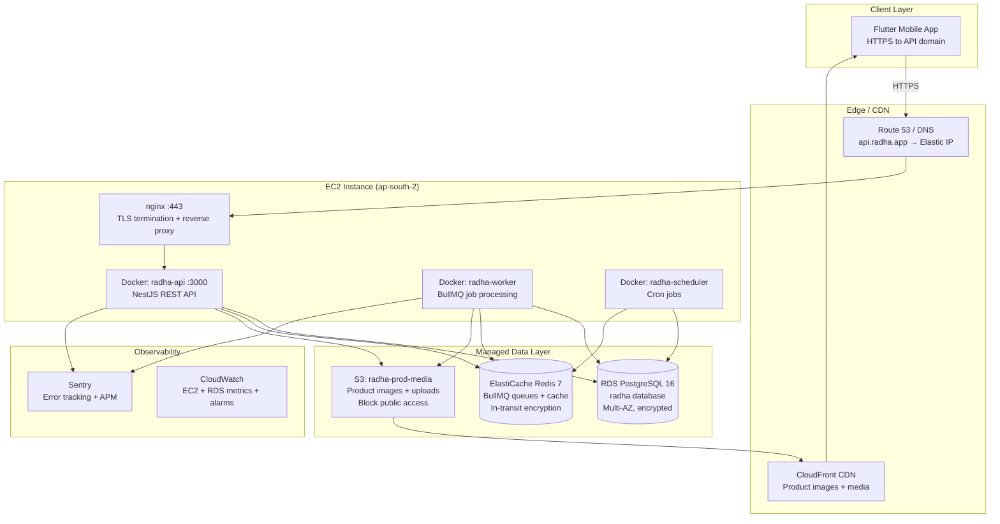
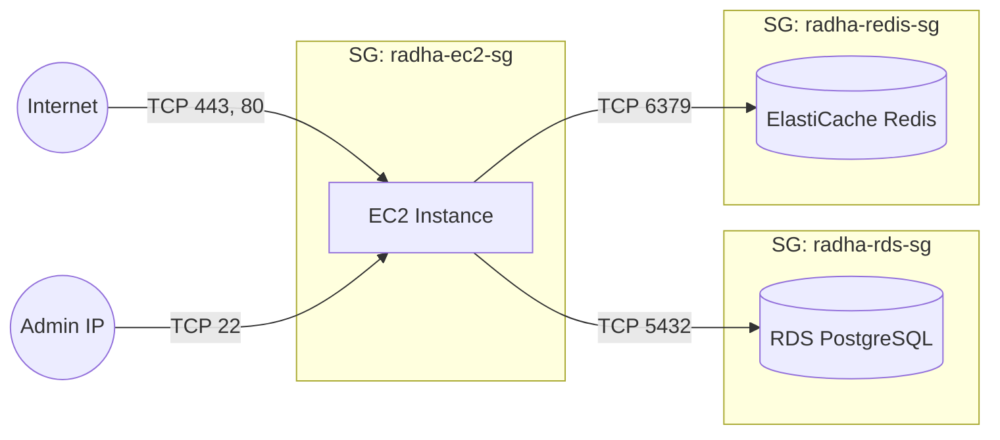
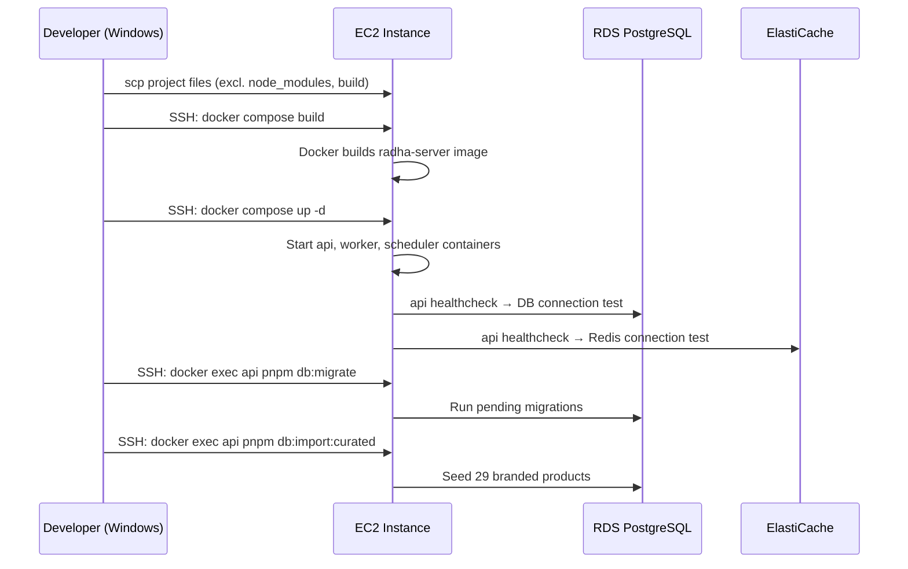
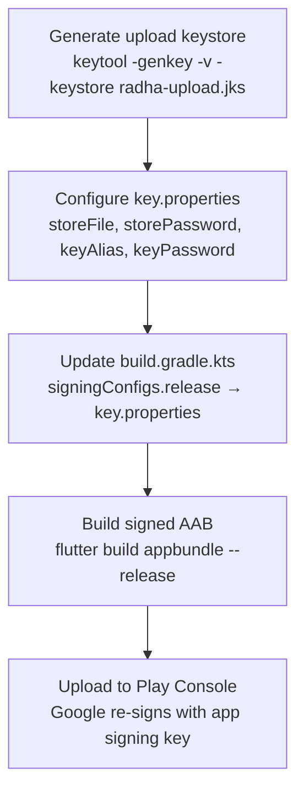
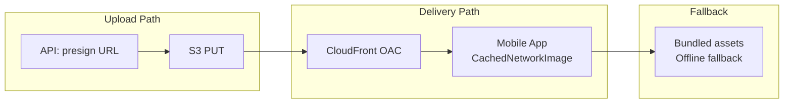
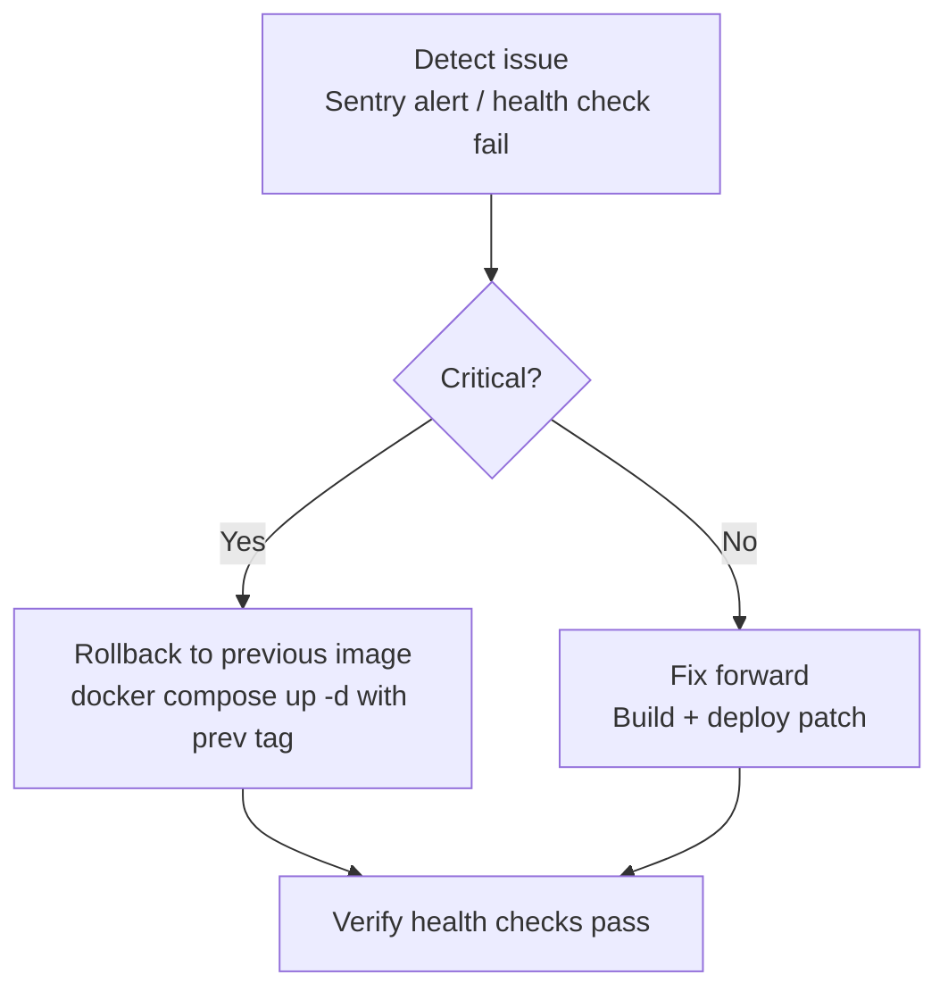

# Design Document: RADHA Production Launch

## Overview

This document covers taking the RADHA platform from "feature-complete, all tests green" to "fully production-ready, deployed on AWS, and listed on Google Play Store." The platform consists of a NestJS backend (API + Worker + Scheduler) and a Flutter mobile app. The backend is containerized but has never been deployed to production. The mobile app builds a release APK with debug signing keys. No production AWS infrastructure is currently provisioned.

The launch is phased into three tiers: **P0** (production blockers — must ship before any real user touches the system), **P1** (performance and polish — the app must feel Zepto-smooth), and **P2** (store listing and operational maturity — backups, monitoring, legal compliance). Each phase gates the next: P0 unblocks internal smoke testing, P1 unblocks beta testers, P2 unblocks public Play Store listing.

The target region is AWS **ap-south-2** (Hyderabad) for low latency to the Gujarat/India user base. The EC2 instance (`ec2-18-60-109-5.ap-south-2`) already exists with SSH access via `Radha.pem`.

## Architecture

### AWS Production Topology



### Security Group Configuration



**Rules:**
- EC2 SG: Inbound 22 (admin IP only), 80+443 (0.0.0.0/0). Port 3000 NOT exposed.
- RDS SG: Inbound 5432 from EC2 SG only.
- ElastiCache SG: Inbound 6379 from EC2 SG only.

## Components and Interfaces

### Component 1: AWS Infrastructure Layer

**Purpose**: Provide managed, resilient data services and networking for the RADHA backend.

**Sub-components:**

| Service | Spec | Key Config |
|---------|------|------------|
| RDS PostgreSQL | v16, db.t3.medium, Multi-AZ, 20GB gp3, encrypted | DB name `radha`, user `radha_app`, TLS enforced, automated backups 7-30d |
| ElastiCache Redis | v7, cache.t3.micro, single-node (V1) | In-transit encryption, AUTH token, cluster mode off |
| S3 Bucket | `radha-prod-media` | Block public access ON, versioning on, lifecycle: IA after 90d |
| CloudFront | OAC origin to S3, TLS 1.2+, gzip/brotli | Cache-Control: public, max-age=86400 for product images |
| Elastic IP | Associated with EC2 | DNS A record `api.radha.app` → this IP |
| IAM Role | EC2 instance role `radha-ec2-role` | S3 read/write to `radha-prod-media/*`, CloudWatch put metrics/logs |

### Component 2: Docker Deployment Pipeline

**Purpose**: Build, deploy, and orchestrate the three NestJS processes on EC2.

**Interface** (deployment flow):
```
Local/CI: docker build -t radha-server .
          scp/push to EC2
EC2:      docker compose -f docker-compose.prod.yml --env-file server/.env.production up -d --build
```

**Deployment Sequence:**



**Health Check Contract:**
- `GET /api/v1/health` → `{"status":"ok","uptime":...}` (shallow, for nginx/LB)
- `GET /api/v1/health/ready` → `{"status":"ok","db":"connected","redis":"connected"}` (deep, for deploy validation)

### Component 3: Production Configuration Management

**Purpose**: Securely manage secrets and environment-specific configuration.

**Secret Categories:**

| Category | Examples | Rotation Policy |
|----------|----------|-----------------|
| Database credentials | `DB_PASSWORD` | 90-day rotation via RDS |
| JWT signing keys | `JWT_ACCESS_SECRET`, `JWT_REFRESH_SECRET` | 180-day, ≥64 hex chars |
| Payment gateway | `RAZORPAY_KEY_ID`, `RAZORPAY_KEY_SECRET`, `RAZORPAY_WEBHOOK_SECRET` | On compromise only |
| SMS provider | `TWO_FACTOR_API_KEY` | On compromise only |
| AI services | `GEMINI_API_KEY` | Annual or on compromise |
| Redis AUTH | `REDIS_PASSWORD` | On ElastiCache rotation schedule |

**Configuration Rules:**
- `.env.production` is NEVER committed to git (already in `.gitignore`)
- Zod schema (`src/config/env.schema.ts`) enforces: `DB_SSL=true`, JWT ≥64 chars, no CORS `*`
- Secrets generated via `openssl rand -hex 48` on a secure machine
- `.env.production` lives on EC2 at `/home/ubuntu/radha/.env.production` with mode `600`

### Component 4: TLS Termination and Reverse Proxy (nginx)

**Purpose**: Terminate TLS, redirect HTTP→HTTPS, proxy to the API container, enforce security headers.

**Interface:**
```
Internet → :443 (TLS via Let's Encrypt) → nginx → 127.0.0.1:3000 (api container)
Internet → :80 → 301 redirect to :443
```

**Security Headers (nginx layer):**
- `Strict-Transport-Security: max-age=63072000; includeSubDomains`
- `X-Content-Type-Options: nosniff`
- Upload limit: `client_max_body_size 15m`

**Certificate Renewal:** certbot systemd timer auto-renews; nginx reloads on renewal hook.

### Component 5: Release Signing and App Distribution

**Purpose**: Sign the Flutter app for Play Store distribution.

**Signing Strategy:**



**Key Management:**
- Upload keystore (`radha-upload.jks`) stored securely outside the repo
- `key.properties` referenced from `build.gradle.kts`, listed in `.gitignore`
- Google Play App Signing enabled — Google holds the app signing key, we hold the upload key
- Backup of upload keystore + passwords in a secure vault (password manager / encrypted drive)

### Component 6: CDN and Asset Delivery

**Purpose**: Serve product images and user-uploaded media with low latency via CloudFront.

**Architecture:**



**Image Strategy:**
- 29 curated product images uploaded to S3 via `pnpm db:host:images`
- `products.image_url` points to `https://<dist>.cloudfront.net/products/<ean>.webp`
- Mobile app uses `CachedNetworkImage` with bundled assets as `errorWidget` fallback
- Cache headers: `Cache-Control: public, max-age=86400, s-maxage=604800`
- Image format: WebP, max 400×400 for product thumbnails, max 1200×1200 for detail

### Component 7: Monitoring and Observability

**Purpose**: Detect, alert, and diagnose production issues before users report them.

**Stack:**

| Layer | Tool | What it watches |
|-------|------|-----------------|
| Application errors | Sentry | Unhandled exceptions, slow transactions (>2s), release tracking |
| Infrastructure | CloudWatch | EC2 CPU/memory/disk, RDS connections/IOPS/freeable memory, ElastiCache evictions |
| Uptime | CloudWatch Synthetics or UptimeRobot | `GET /api/v1/health` every 60s |
| Logs | Docker logs + CloudWatch Logs agent (optional) | Container stdout/stderr |
| Alerting | CloudWatch Alarms → SNS → Email/SMS | CPU >80% 5min, RDS free storage <2GB, health check fail |

**Sentry Configuration:**
- DSN set in `.env.production`
- Traces sample rate: 0.1 (10% of transactions)
- Release tagging: `RADHA-server@<version>` from `package.json`
- PII scrubbing enabled (strip mobile numbers, OTPs from breadcrumbs)

### Component 8: Database Operations

**Purpose**: Ensure data durability, enable disaster recovery, and manage schema evolution.

**Backup Strategy:**
- RDS automated backups: 7-day retention (minimum), extend to 30 days before public launch
- Point-in-time recovery (PITR) enabled — granularity: 5 minutes
- Manual snapshot before each migration
- Monthly restore drill: restore to a temporary instance, validate row counts

**Migration Flow:**
```
Developer adds migration → pnpm db:generate → NNN_purpose.sql
Deploy: docker exec api pnpm db:migrate (runs pending migrations sequentially)
Rollback: manual — reverse SQL script or restore from snapshot
```

**Seed Data (P0):**
- `pnpm db:import:curated` — 29 branded products with real OFF nutrition data
- Idempotent (safe to re-run)
- Requires outbound internet from EC2 (OFF API calls)

## Data Models

### Production Environment Configuration Schema

```typescript
// Enforced by server/src/config/env.schema.ts (Zod)
interface ProductionEnv {
  NODE_ENV: 'production';
  PORT: 3000;
  
  // Database — RDS
  DB_HOST: string;        // RDS writer endpoint
  DB_PORT: 5432;
  DB_NAME: 'radha';
  DB_USER: 'radha_app';
  DB_PASSWORD: string;    // ≥16 chars
  DB_SSL: true;           // ENFORCED in production
  DB_MAX_CONNECTIONS: number; // 40 for t3.medium
  
  // Redis — ElastiCache
  REDIS_HOST: string;     // Primary endpoint
  REDIS_PORT: 6379;
  REDIS_TLS: true;        // ENFORCED in production
  REDIS_PASSWORD?: string; // AUTH token if configured
  
  // JWT — ≥64 chars ENFORCED
  JWT_ACCESS_SECRET: string;
  JWT_REFRESH_SECRET: string;
  
  // AWS
  AWS_REGION: 'ap-south-2';
  AWS_S3_BUCKET: 'radha-prod-media';
  AWS_CLOUDFRONT_DOMAIN: string;
  
  // Payments
  RAZORPAY_KEY_ID: string;    // Live key (rzp_live_*)
  RAZORPAY_KEY_SECRET: string;
  RAZORPAY_WEBHOOK_SECRET: string;
  
  // SMS
  TWO_FACTOR_API_KEY: string;
  
  // Observability
  SENTRY_DSN: string;
  
  // CORS — no wildcard in production
  CORS_ORIGINS: string;   // comma-separated origins
}
```

### Android Signing Configuration

```kotlin
// android/app/build.gradle.kts — release signing
signingConfigs {
    create("release") {
        val props = Properties().apply {
            load(rootProject.file("key.properties").inputStream())
        }
        storeFile = file(props["storeFile"] as String)
        storePassword = props["storePassword"] as String
        keyAlias = props["keyAlias"] as String
        keyPassword = props["keyPassword"] as String
    }
}

buildTypes {
    release {
        signingConfig = signingConfigs.getByName("release")
        isMinifyEnabled = true
        isShrinkResources = true
    }
}
```

### Play Store Listing Data

```typescript
interface PlayStoreListing {
  packageName: 'com.radha.radha_mobile';
  defaultLanguage: 'en-IN';
  title: string;            // ≤30 chars
  shortDescription: string; // ≤80 chars
  fullDescription: string;  // ≤4000 chars
  category: 'BUSINESS';
  contentRating: 'Everyone';
  screenshots: {
    phone: string[];        // 2-8 screenshots, 16:9 or 9:16
  };
  privacyPolicyUrl: string; // Required — hosted page
  appIcon: string;          // 512×512 PNG
  featureGraphic: string;   // 1024×500 PNG
}
```

## Error Handling

### Error Scenario 1: Database Connection Failure on Deploy

**Condition**: API container starts but cannot reach RDS (wrong endpoint, SG misconfiguration, credentials invalid).
**Response**: Health check (`/api/v1/health/ready`) returns `{"status":"error","db":"disconnected"}`. Docker healthcheck fails after 5 retries. Container enters "unhealthy" state.
**Recovery**: Check security group rules (EC2 SG → RDS SG), verify `.env.production` `DB_HOST`, test connectivity with `nc -zv <RDS_ENDPOINT> 5432` from within the container.

### Error Scenario 2: Path Alias Resolution Failure (`@/` in dist)

**Condition**: Container crashes immediately with `Error: Cannot find module '@/...'` because `tsc` doesn't rewrite path aliases in emitted JS.
**Response**: Container exits with code 1, Docker restarts it (up to restart policy limit).
**Recovery**: Two options documented in DEPLOY_AWS.md §11:
1. (Quick) Ensure `tsconfig-paths/register` is in the node command AND `TS_NODE_PROJECT` points to `tsconfig.runtime.json` with `baseUrl: "dist"`.
2. (Permanent) Add `tsc-alias` to the build: `nest build && tsc-alias -p tsconfig.build.json`, then remove `-r tsconfig-paths/register` from compose commands.

### Error Scenario 3: TLS Certificate Expiry

**Condition**: Let's Encrypt certificate expires (certbot timer failed).
**Response**: Browsers/apps reject the connection. HTTPS health checks fail.
**Recovery**: `sudo certbot renew --force-renewal && sudo systemctl reload nginx`. Add CloudWatch alarm on certificate expiry date (or use UptimeRobot TLS monitoring).

### Error Scenario 4: OTP SMS Delivery Failure

**Condition**: 2Factor.in API returns error or times out; user cannot log in.
**Response**: API returns 502/503 to the client; mobile app shows "SMS delivery failed, please retry."
**Recovery**: Check 2Factor dashboard for DLT issues, credits, or outage. Verify `TWO_FACTOR_API_KEY` is valid. Rate limit (3 OTP/hour/number) prevents abuse during retry storms.

### Error Scenario 5: S3/CloudFront Image Unavailable

**Condition**: Product image URL returns 403/404 from CloudFront (OAC misconfigured, bucket policy wrong, image not uploaded).
**Response**: Mobile app's `CachedNetworkImage` falls back to bundled asset. User sees product data with local placeholder image.
**Recovery**: Verify OAC policy on CloudFront distribution, check S3 object exists at the expected key, re-run `pnpm db:host:images` if images are missing.

## Testing Strategy

### Deployment Verification Tests (Smoke)

After each deploy, run this sequence to confirm the system is operational:

1. `curl https://api.radha.app/api/v1/health` → 200, `{"status":"ok"}`
2. `curl https://api.radha.app/api/v1/health/ready` → 200, `db: connected, redis: connected`
3. Request OTP via the mobile app → SMS arrives within 30s
4. Verify OTP → JWT tokens returned, session created in DB
5. Browse a category → products with real nutrition data load
6. Open a seeded product → health assessment, image from CDN display correctly

### Infrastructure Validation

| Check | Method | Pass Criteria |
|-------|--------|---------------|
| RDS connectivity | `nc -zv <endpoint> 5432` from container | Connection succeeds with TLS |
| Redis connectivity | `redis-cli -h <endpoint> -p 6379 --tls ping` | `PONG` |
| S3 upload | Presign + PUT a test file | 200, file accessible via CloudFront |
| nginx TLS | `curl -I https://api.radha.app` | 200, `strict-transport-security` header present |
| Docker health | `docker compose ps` | All 3 services "healthy" or "running" |
| Migration state | Check `drizzle_migrations` table | All migrations applied, no pending |

### On-Device Smoke Test (P0 Gate)

Performed on a physical Android device with the signed release build:
1. Install APK/AAB
2. OTP login flow (real SMS via 2Factor)
3. Navigate Home → browse category → open product detail (CDN image loads)
4. Scan a barcode → product lookup succeeds
5. Razorpay test payment (test mode keys initially, then live)
6. Verify offline queue: kill network → create expiry record → restore network → record syncs

## Performance Considerations

### Performance Budget (P1)

| Metric | Target | Measurement |
|--------|--------|-------------|
| Cold start | <1.5s to interactive | `flutter run --profile`, DevTools timeline |
| List scroll | 60fps, no jank frames | DevTools frame chart, raster/UI thread |
| API p95 latency | <200ms for read endpoints | Sentry transaction monitoring |
| Image load (CDN) | <500ms first paint | `CachedNetworkImage` + CloudFront edge cache |
| APK size | <50MB per ABI (arm64) | `flutter build apk --split-per-abi` |
| AAB download | <30MB (Play Store optimized) | Play Console size report |

### Optimization Strategy

1. **Image prefetch**: `precacheImage` for first visible row on Home and Browse screens
2. **CDN edge caching**: Product images served from CloudFront edge in Mumbai/Hyderabad
3. **Bundled fallback**: Critical assets bundled in APK for instant offline display
4. **R8/ProGuard**: Already enabled — verify no over-shrinking of reflection-heavy Razorpay SDK
5. **Tree shaking**: Ensure unused dart code is eliminated in release builds
6. **Lazy loading**: Deep screens (Reports, GRN) loaded on-demand, not at app start

## Security Considerations

### Transport Security
- All client→server traffic over TLS 1.2+ (nginx enforces, HSTS header set)
- RDS connections require SSL (`DB_SSL=true`, `sslmode=require` in connection string)
- ElastiCache in-transit encryption enabled (`REDIS_TLS=true`)
- S3 bucket policy denies non-HTTPS access

### Application Security
- Helmet middleware (existing) sets security headers at app level
- Rate limiting on auth/OTP endpoints (3 attempts/hour/number)
- JWT tokens: short-lived access (30min), long-lived refresh (30d), rotation on use
- CORS: explicit origin whitelist, no wildcards in production
- Input validation: class-validator on all DTOs, Zod on env schema
- PII redaction in logs (`LOG_REDACT_KEYS`)
- Multi-tenant isolation: `tenant_id` enforced on all queries

### Android Security
- Release APK signed with upload keystore (not debug)
- Google Play App Signing: Google holds the distribution key
- `flutter_secure_storage` for tokens (Android Keystore backed)
- No secrets in client code — API keys live server-side only
- Certificate pinning: recommended for P2 (not P0)

### Operational Security
- SSH key-based auth only (password auth disabled on EC2)
- `.env.production` file mode 600, owned by deploy user
- Docker containers run as non-root (`USER node` in Dockerfile)
- No sensitive data in Docker image layers (env injected at runtime)
- Security group least-privilege (only required ports open)

## Rollback and Disaster Recovery

### Application Rollback



**Procedure:**
1. Keep previous Docker image tagged (e.g., `radha-server:prev`)
2. Rollback: `docker tag radha-server:latest radha-server:broken && docker tag radha-server:prev radha-server:latest && docker compose up -d`
3. If migration was applied: restore from RDS snapshot (PITR) — this is destructive, prefer backward-compatible migrations

### Database Disaster Recovery

| Scenario | RTO | RPO | Procedure |
|----------|-----|-----|-----------|
| Corruption/accidental delete | <1h | 5 min | PITR restore to new instance, swap endpoint |
| AZ failure | Automatic | 0 | Multi-AZ failover (RDS handles) |
| Region failure | 4-8h | 1h | Cross-region read replica promotion (P2+) |
| Migration failure | 30min | 0 | Restore from pre-migration snapshot |

### Monthly Restore Drill
1. Create manual RDS snapshot
2. Restore to a temporary `radha-drill-<date>` instance
3. Connect from EC2, verify row counts match production
4. Delete temporary instance
5. Document result in ops log

## Dependencies

| Dependency | Purpose | Version/Spec |
|------------|---------|--------------|
| AWS RDS PostgreSQL | Primary database | v16, ap-south-2 |
| AWS ElastiCache Redis | Job queues + caching | v7, ap-south-2 |
| AWS S3 | Media storage | Standard, ap-south-2 |
| AWS CloudFront | CDN for images | Global edge network |
| AWS EC2 | Compute host | t3.medium (existing), Ubuntu |
| Docker + Docker Compose | Container orchestration | Docker Engine 24+, Compose v2 |
| nginx | TLS termination + reverse proxy | Latest stable (apt) |
| Let's Encrypt / certbot | TLS certificates | Auto-renewing |
| 2Factor.in | OTP SMS delivery | REST API |
| Razorpay | Payment processing | Standard Checkout, webhooks |
| Sentry | Error monitoring | SaaS, Node SDK |
| Google Play Console | App distribution | AAB upload |
| Gemini API | AI label analysis | REST API |
| keytool (JDK) | Generate upload keystore | JDK 17 (already in Flutter SDK) |

## Correctness Properties

*A property is a characteristic or behavior that should hold true across all valid executions of a system — essentially, a formal statement about what the system should do. Properties serve as the bridge between human-readable specifications and machine-verifiable correctness guarantees.*

### Property 1: Environment validation rejects insecure production configuration

*For any* environment configuration object where `NODE_ENV=production` and any of the following hold: `DB_SSL` is not `true`, or `JWT_ACCESS_SECRET` is fewer than 64 characters, or `JWT_REFRESH_SECRET` is fewer than 64 characters, or `CORS_ORIGINS` contains the wildcard `*`, the Zod Env_Schema SHALL reject the configuration with a descriptive validation error and the application SHALL fail to start.

**Validates: Requirements 2.1, 2.2, 2.3, 2.4, 20.5**

### Property 2: Curated product import idempotency

*For any* number of consecutive executions of `pnpm db:import:curated` (1, 2, or N times), the resulting product count in the database SHALL always be exactly 29, with no duplicate records created.

**Validates: Requirements 4.2**

### Property 3: CDN image fallback resilience

*For any* product in the catalog whose CDN image URL returns a non-200 HTTP response (403, 404, 500, timeout), the mobile app's product image widget SHALL render the bundled fallback asset without crashing, showing a broken-image icon, or throwing an unhandled exception.

**Validates: Requirements 10.3**

### Property 4: ARB locale key completeness

*For any* string key present in the English ARB file (`app_en.arb`), that same key SHALL exist in all 5 other locale ARB files (`app_hi.arb`, `app_ta.arb`, `app_te.arb`, `app_bn.arb`, `app_mr.arb`) with a non-empty translated value.

**Validates: Requirements 12.1**

### Property 5: Offline state graceful degradation

*For any* data-loading screen in the app, when the network is unavailable, the screen SHALL render a designed offline state widget (not a raw exception, blank screen, or unhandled error).

**Validates: Requirements 13.1**

### Property 6: Empty state presentation

*For any* data-loading screen in the app, when the API returns an empty collection (zero items), the screen SHALL render a designed empty state widget with an illustration and action CTA (not a blank list or invisible content area).

**Validates: Requirements 13.2**

### Property 7: Error state with retry action

*For any* data-loading screen in the app, when the API request fails with an error response, the screen SHALL render a designed error state widget that includes a retry action button (not a raw stack trace or unhandled exception).

**Validates: Requirements 13.3**

### Property 8: Rate limiting enforcement

*For any* burst of requests to the auth/OTP endpoints exceeding `RATE_LIMIT_MAX` within the configured `RATE_LIMIT_WINDOW_MS`, all requests beyond the limit SHALL receive HTTP 429 (Too Many Requests) with a `Retry-After` header.

**Validates: Requirements 14.6**

### Property 9: Razorpay webhook signature verification

*For any* incoming request to the `/api/v1/payments/webhook` endpoint where the `X-Razorpay-Signature` header is missing, empty, or does not match the HMAC-SHA256 of the request body with the configured webhook secret, the endpoint SHALL respond with HTTP 401 and SHALL NOT process the payment event or modify any database state.

**Validates: Requirements 16.2, 16.3**
